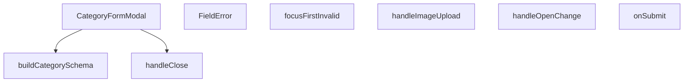

## Genel Bakış
Bu modül, kategori ekleme ve düzenleme işlemlerini gerçekleştiren bir form modal bileşeni sunar. Form doğrulama, resim yükleme ve modal yaşam döngüsü yönetimini içerir. Kullanıcı etkileşimleriyle tetiklenen form gönderimi ve hata odaklama gibi davranışları koordine eder.

## Fonksiyon Grupları

### Form Doğrulama ve Hata Yönetimi
Form alanlarının geçerliliğini kontrol eden şema üretimi, hata mesajlarının kullanıcıya gösterilmesi ve form hataları oluştuğunda ilk geçersiz alana otomatik odaklanma işlemlerini yürütür.
- buildCategorySchema, FieldError, focusFirstInvalid

### Form Gönderimi ve Dosya Yükleme
Form değerlerinin gönderilmesi ve kullanıcı tarafından seçilen görselin yüklenmesi işlemlerini yönetir. Her iki işlem de asenkron olarak çalışır.
- onSubmit, handleImageUpload

### Modal Yaşam Döngüsü
Modal bileşeninin açılması, kapatılması ve açık/kapalı durum değişikliklerinin yönetimini üstlenir. Ana bileşen `CategoryFormModal` bu grubun merkezinde yer alır ve diğer tüm fonksiyonları koordine eder.
- CategoryFormModal, handleClose, handleOpenChange

---

## AXIOMS – Mimari Varsayımlar

Bu modül için özel aksiyom tanımlanmamıştır.

---

## FONKSİYON DETAYLARI

### buildCategorySchema
**Ne yapar**: Form doğrulama şemasını oluşturur. `t` fonksiyonunu kullanarak hata mesajlarını yerelleştirir.
**Nasıl yapar**: Parametre olarak aldığı `t` fonksiyonunu (muhtemelen bir çeviri fonksiyonu) kullanarak form alanlarının doğrulama kurallarını tanımlayan bir şema döndürür. Gövdede `() => buildCategorySchema(t)` ifadesi, fonksiyonun kendisinin bir fonksiyon döndürdüğünü gösterir.
**Parametreler**:
- t: (key: string) => string — Çeviri/yerelleştirme fonksiyonu. Anahtar olarak bir string alır ve çevrilmiş hata mesajını string olarak döndürür.
**Dönüş**: Bilinmiyor (return tipi belirtilmemiş).

### FieldError
**Ne yapar**: Form alanının hemen altında görüntülenen hata satırı bileşenidir. Hata yoksa DOM'a hiçbir şey basmaz.
**Nasıl yapar**: `id` ve `message` prop'larını alır. Eğer `message` prop'u tanımlı ve boş değilse, bir hata mesajı elementi render eder. Aksi takdirde hiçbir şey render etmez (koşullu render).
**Parametreler**:
- id: string — Hata mesajının ilişkilendirildiği form alanının HTML `id`'si. Erişilebilirlik (accessibility) için kullanılır.
- message?: string — Görüntülenecek hata mesajı. Opsiyoneldir; tanımlı değilse bileşen hiçbir şey render etmez.
**Dönüş**: React.FC<{ id: string; message?: string }> — Belirtilen prop tiplerini alan bir React fonksiyonel bileşeni döndürür.

### focusFirstInvalid
**Ne yapar**: Formda doğrulama hatası olan ilk alana odaklanır. Kullanıcının 14 alanlı formda hata bulmak için scroll yapmasını önler.
**Nasıl yapar**: `FIELD_FOCUS_ORDER` sabit dizisindeki alanları sırayla kontrol eder. `errs` nesnesinde (RHF'nin hata nesnesi) o alana ait bir hata varsa, o alanın `id`'si ile DOM'da elementi bulur ve `.focus()` metoduyla odaklar. `shouldFocusError:false` ile RHF'nin kendi otomatik odaklama davranışı devre dışı bırakıldığı için bu fonksiyon deterministik bir odak sırası sağlar.
**Parametreler**:
- errs: FieldErrors<CategoryFormValues> — React Hook Form (RHF) tarafından sağlanan, form alanlarındaki hataları içeren nesne.
**Dönüş**: void — Herhangi bir değer döndürmez.

### CategoryFormModal
**Ne yapar**: Kategori ekleme/düzenleme işlemini gerçekleştiren ana modal bileşenidir.
**Nasıl yapar**: `open`, `onOpenChange`, `category` ve `onSuccess` prop'larını alarak bir modal yapılandırır. Form şemasını oluşturmak için `buildCategorySchema` kullanır, form yönetimini React Hook Form ile yapar, resim yükleme, form gönderme ve modal kapatma gibi işlemleri yönetir. `handleOpenChange` fonksiyonu ile modalın açık/kapalı durumunu kontrol eder.
**Parametreler**:
- open: boolean — Modalın açık olup olmadığını belirten durum.
- onOpenChange: (open: boolean) => void — Modalın açık/kapalı durumu değiştiğinde çağrılan geri çağırma fonksiyonu.
- category: Bilinmiyor (tipi belirtilmemiş) — Düzenlenecek kategori verisi (null veya undefined ise yeni kategori modu).
- onSuccess: Bilinmiyor (tipi belirtilmemiş) — Form başarıyla gönderildiğinde çağrılan geri çağırma fonksiyonu.
**Dönüş**: React.FC<CategoryFormModalProps> — Belirtilen prop tiplerini alan bir React fonksiyonel bileşeni döndürür.

### handleImageUpload
**Ne yapar**: Dosya input'undan seçilen resmi yükler ve form state'ine kaydeder.
**Nasıl yapar**: Asenkron bir fonksiyondur. `React.ChangeEvent<HTMLInputElement>` olayını alır. Seçilen dosyayı işler (muhtemelen bir önizleme URL'i oluşturur veya bir depolama servisine yükler) ve formun resim alanını günceller.
**Parametreler**:
- e: React.ChangeEvent<HTMLInputElement> — Dosya input elementindeki değişiklik olayı nesnesi. `e.target.files` ile seçilen dosyalara erişilir.
**Dönüş**: Bilinmiyor (return tipi belirtilmemiş, muhtemelen Promise<void>).

### onSubmit
**Ne yapar**: Form gönderildiğinde çağrılan ana gönderim işleyicisidir. Form verilerini işler ve sunucuya gönderir.
**Nasıl yapar**: Asenkron bir fonksiyondur. `CategoryFormValues` tipindeki form değerlerini alır. Bu değerleri kullanarak bir API çağrısı yapar (yeni kategori oluşturma veya mevcut kategoriyi güncelleme). Başarılı olursa `onSuccess` geri çağırma fonksiyonunu çağırır ve modalı kapatır.
**Parametreler**:
- values: CategoryFormValues — Form alanlarından gelen, doğrulanmış form değerlerini içeren nesne.
**Dönüş**: Bilinmiyor (return tipi belirtilmemiş, muhtemelen Promise<void>).

### handleClose
**Ne yapar**: Modalı kapatma isteği geldiğinde, formda kaydedilmemiş değişiklik varsa kullanıcıdan onay ister.
**Nasıl yapar**: Kirli-form (dirty form) guard'ı olarak çalışır. Eski `window.confirm` yerine `ConfirmDialog` kullanır (cetvel §4.7 referansı). Kapatma akışı değişmiştir: kapatma isteği önce yakalanır, kullanıcıdan onay beklenir ve ancak onaylanırsa modal gerçekten kapatılır. Değişiklikleri atmanın geri alınamaz bir işlem olduğu belirtilir (`tone:'danger'`).
**Parametreler**: Parametre almaz.
**Dönüş**: Bilinmiyor (return tipi belirtilmemiş).

### handleOpenChange
**Ne yapar**: Modalın açık/kapalı durumu değiştiğinde çağrılan olay işleyicisidir.
**Nasıl yapar**: `openVal` boolean parametresini alır. Eğer `openVal` `false` ise (yani modal kapatılmak isteniyorsa) `handleClose()` fonksiyonunu çağırarak kirli-form kontrolü yapar. Eğer `openVal` `true` ise (modal açılmak isteniyorsa) doğrudan `onOpenChange(true)` çağrısını yaparak modalı açar.
**Parametreler**:
- openVal: boolean — Modalın yeni istenen durumu. `true` ise açma, `false` ise kapama isteği.
**Dönüş**: Bilinmiyor (return tipi belirtilmemiş).

---

## İTHALATLAR (IMPORTS)
- import: ../../../lib/type-converters::toSupabaseJson
- import: ../../../types/database.types::type { Database }
- import: ../../../types/db-rows::type { CategoryMetadata,DbCategory }
- import: ../../../utils/adminUi::adminButtonPrimaryClass
- import: ../../../utils/imageUtils::compressImage
- import: ../../ui/VentImage::VentImage
- import: ../overlay/ConfirmProvider::useConfirm
- import: @/i18n/I18nProvider::useI18n
- import: @/lib/supabase/client::supabaseBrowserClient
- import: @hookform/resolvers/zod::zodResolver
- import: @radix-ui/react-dialog
- import: @radix-ui/react-tabs
- import: lucide-react::Loader2
- import: lucide-react::Save
- import: lucide-react::Trash2
- import: lucide-react::Upload
- import: lucide-react::X
- import: react-hook-form::type { FieldErrors }
- import: react-hook-form::useForm
- import: react::React
- import: react::useEffect
- import: react::useState
- import: sonner::toast
- import: zod::z

---

## INTERFACES

### CategoryFormModalProps
- `open: boolean`
- `onOpenChange: (open: boolean) => void`
- `category?: DbCategory | null`
- `onSuccess: () => void`

---

## TYPE ALIASES

### CategoryUpdate
```typescript
type CategoryUpdate = Database['public']['Tables']['categories']['Update']
```

### CategoryInsert
```typescript
type CategoryInsert = Database['public']['Tables']['categories']['Insert']
```

### CategoryFormValues
```typescript
type CategoryFormValues = z.infer<ReturnType<typeof buildCategorySchema>>
```

---

## SABİTLER
- **FIELD_FOCUS_ORDER** (array) — `[
    { name: 'name', id: 'category-name' },
    { name: 'slug', id: 'categ...`

---

## AST POINTERS

### [N1_NASIL] AST Pointer: CategoryFormModal.tsx::buildCategorySchema
- **params**: `t` — çeviri fonksiyonu, `(key: string) => string` tipinde, validasyon mesajlarını çevirmek için kullanılır
- **ic_degiskenler**: yok (doğrudan return ifadesi)
- **Dönüş**: z.object — Zod validasyon şeması, name, slug, parent_id, description, seo_title, seo_desc, is_featured, sort_order, image_url, metric1_value, metric1_label, metric2_value, metric2_label alanlarını içerir

### [N2_NASIL] AST Pointer: CategoryFormModal.tsx::FieldError
- **params**: `id` — hata mesajı element'inin HTML id'si, `message` — hata mesajı metni (opsiyonel)
- **ic_degiskenler**: yok
- **Dönüş**: JSX element (`<p>`) veya null — message varsa hata mesajını render eder, yoksa null döner

### [N3_NASIL] AST Pointer: CategoryFormModal.tsx::focusFirstInvalid
- **params**: `errs` — FieldErrors<CategoryFormValues> tipinde form hataları nesnesi
- **ic_degiskenler**: `first` — FIELD_FOCUS_ORDER dizisinde errs içinde bulunan ilk hata objesi (name ve id içerir)
- **Dönüş**: void — yan etki olarak ilk geçersiz input'a odaklanır

### [N4_NASIL] AST Pointer: CategoryFormModal.tsx::CategoryFormModal
- **params**: `open` — modal açık/kapalı durumu (boolean), `onOpenChange` — modal durumu değişiklik callback'i, `category` — düzenlenen kategori verisi (opsiyonel, Category tipinde), `onSuccess` — başarılı kayıt sonrası çağrılacak callback
- **ic_degiskenler**: (gövde tam verilmemiş, içindeki useEffect'ler ve handler'lar ayrı fonksiyonlar olarak verilmiş)
- **Dönüş**: JSX — modal bileşeni

### [N5_NASIL] AST Pointer: CategoryFormModal.tsx::handleImageUpload
- **params**: `e` — React.ChangeEvent<HTMLInputElement> tipinde dosya input değişiklik event'i
- **ic_degiskenler**:
  - `file` — e.target.files?.[0] ile alınan ilk dosya
  - `compressedFile` — compressImage fonksiyonu ile sıkıştırılmış dosya
  - `fileExt` — dosya uzantısı (file.name.split('.').pop())
  - `fileName` — benzersiz dosya adı (crypto.randomUUID() ile oluşturulmuş)
  - `filePath` — Supabase storage'daki dosya yolu (`category-images/${fileName}`)
  - `uploadError` — Supabase storage upload hatası
  - `publicUrl` — yüklenen dosyanın public URL'i
  - `error` — yakalanan hata (unknown tipinde)
- **Dönüş**: yok (async) — yan etki olarak görsel yükler, form.setValue ve setPreviewImage çağırır, toast gösterir

### [N6_NASIL] AST Pointer: CategoryFormModal.tsx::onSubmit
- **params**: `values` — CategoryFormValues tipinde form değerleri
- **ic_degiskenler**:
  - `metadata` — CategoryMetadata tipinde, metric1 ve metric2 label/value çiftlerini içerir
  - `updateData` — CategoryUpdate tipinde, güncelleme verisi (category varsa kullanılır)
  - `insertData` — CategoryInsert tipinde, ekleme verisi (category yoksa kullanılır, authority_content ek olarak içerir)
  - `error` — Supabase sorgu hatası
- **Dönüş**: yok (async) — yan etki olarak kategori ekler/günceller, onSuccess ve onOpenChange çağırır, toast gösterir

### [N7_NASIL] AST Pointer: CategoryFormModal.tsx::handleClose
- **params**: yok
- **ic_degiskenler**: `ok` — confirm fonksiyonunun dönüş değeri (kullanıcı onay verdiyse true)
- **Dönüş**: yok (async) — yan etki olarak form dirty ise onay sorar, onaylanırsa modal'ı kapatır

### [N8_NASIL] AST Pointer: CategoryFormModal.tsx::handleOpenChange
- **params**: `openVal` — boolean, modal'ın yeni açık/kapalı durumu
- **ic_degiskenler**: yok
- **Dönüş**: yok — yan etki olarak openVal false ise handleClose çağırır, true ise onOpenChange(true) çağırır

---


## MERMAID CALL GRAPH


## NODE ID STANDARD

  file: src\components\admin\categories\CategoryFormModal.tsx
  function: src\components\admin\categories\CategoryFormModal.tsx::buildCategorySchema
  function: src\components\admin\categories\CategoryFormModal.tsx::FieldError
  function: src\components\admin\categories\CategoryFormModal.tsx::focusFirstInvalid
  function: src\components\admin\categories\CategoryFormModal.tsx::CategoryFormModal
  function: src\components\admin\categories\CategoryFormModal.tsx::handleImageUpload
  function: src\components\admin\categories\CategoryFormModal.tsx::onSubmit
  function: src\components\admin\categories\CategoryFormModal.tsx::handleClose
  function: src\components\admin\categories\CategoryFormModal.tsx::handleOpenChange

---

## DISA AKTARILANLAR (EXPORTS)
  export: CategoryFormModal
  export: FieldError
  export: buildCategorySchema
  export: focusFirstInvalid

---

## STİL TOKENLERİ

### Arbitrary Değerler (token'a geçirilmemiş)
Yok — tüm stiller token'a geçirilmiş. ✅

### Kullanılan Token'lar (zaten token'a geçirilmiş)
- (yok)

### Tailwind Sınıf Özeti
- **Renkler:** `bg-admin-accent`, `bg-admin-bg`, `bg-admin-danger`, `bg-admin-surface-2`, `bg-black/40`, `bg-black/60`, `border-2`, `border-admin-border`, `border-b`, `border-b-2`, `border-dashed`, `border-t`, `border-transparent`, `data-[state=active]:border-admin-accent`, `data-[state=active]:text-admin-accent`
- **Layout:** `absolute`, `backdrop-blur-2`, `block`, `custom-scrollbar`, `fixed`, `flex`, `flex-1`, `flex-col`, `gap-2`, `gap-4`, `gap-6`, `gap-8`, `grid`, `grid-cols-2`, `h-4`
- **Varyant/Responsive:** `:`, `data-[state=active]:`, `focus-visible:`, `group-hover:`, `hover:`, `placeholder:` önekleri
- **Yardımcı Sınıflar:** `!border-admin-danger`, `${adminButtonPrimaryClass`, `-translate-x-1/2`, `-translate-y-1/2`, `:`, `animate-spin`, `appearance-none`, `border`, `cursor-pointer`, `focus-visible:outline-none`, `focus-visible:ring-admin-accent/30`, `focus-visible:ring-offset-0`, `font-bold`, `font-medium`, `font-mono`