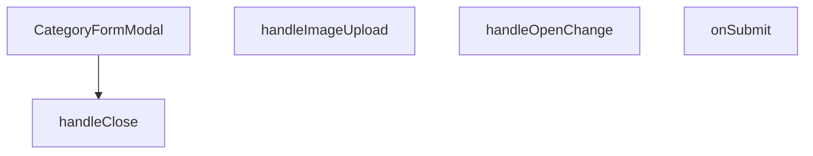

## Genel Bakış
Bu modül, yönetici panelinde kategorileri eklemek veya düzenlemek için kullanılan kontrollü bir form modalı bileşenidir. Kullanıcıdan kategori adı, açıklama ve görsel bilgilerini toplayarak doğrulama sürecinden geçirir ve sunucuya API aracılığıyla gönderir. Modal, dışarıdan kontrol edilen durumu ve mevcut kategori verisiyle esnek bir yapı sunarak hem yeni ekleme hem de düzenleme senaryolarını destekler.

## Fonksiyon Grupları

### Ana Bileşen
Modal penceresinin tüm görünümünü, form alanlarını, butonlarını ve temel iş akışını oluşturan ana React bileşenidir. Prop'lar aracılığıyla dışarıdan kontrol edilir ve form durumunu yöneterek kullanıcı etkileşimini orkestra eder.
- CategoryFormModal

### Form İşlemleri ve Veri Yönetimi
Kullanıcının yüklediği görselleri işleyen ve form verilerini doğruladıktan sonra API isteklerini başlatan asenkron iş mantığını içerir. Görsel yükleme ve form gönderimi gibi işlemleri yürüterek veri bütünlüğünü sağlar.
- handleImageUpload, onSubmit

### Modal Kontrol Mekanizmaları
Modalın açılıp kapanma durumunu yöneten, pencereler arası geçişleri kontrol eden ve kullanıcı arayüzünün tutarlılığını sağlayan yardımcı işlevleri içerir. Dış bileşenlerle senkronize çalışarak modal yaşam döngüsünü yönlendirir.
- handleClose, handleOpenChange

---

## AXIOMS – Mimari Varsayımlar

Bu modülün doğru çalışması için aşağıdaki mimari varsayımlar (aksiyomlar) geçerlidir:

[Aksiyom 1]: Eğer `open` prop'u verilmemiş veya `onOpenChange` prop'u sağlanmamışsa, modal'ın açılıp kapanma durumu kontrol edilemez, bileşen çalışamaz.

[Aksiyom 2]: Eğer `onSuccess` prop'u verilmemişse, form başarıyla gönderildiğinde üst bileşene bildirim yapılamaz, üst bileşenin listeyi yenilemesi veya bildirim göstermesi sağlanamaz.

[Aksiyom 3]: Eğer `category` prop'u `null` veya `undefined` ise, modal "yeni kategori ekleme" modunda çalışır; aksi halde "kategori düzenleme" modunda çalışır.

[Aksiyom 4]: Eğer `categorySchema` fonksiyonu çağrılamıyorsa veya geçerli bir Zod şeması döndürmüyorsa, form alanları (kategori adı, açıklama vb.) doğrulanamaz.

[Aksiyom 5]: Eğer `handleImageUpload` fonksiyonu dosya input change olayını (`React.ChangeEvent<HTMLInputElement>`) alamıyorsa, kullanıcı görsel yükleyemez.

[Aksiyom 6]: Eğer `onSubmit` fonksiyonu form verilerini (`CategoryFormValues`) alamıyorsa, API'ye gönderme işlemi başlatılamaz.

[Aksiyom 7]: Eğer `handleClose` veya `handleOpenChange` fonksiyonları `onOpenChange` prop'unu çağirmazsa, modal'ın kapanma eylemi üst bileşene yansıtılamaz.

[Aksiyom 8]: Eğer `open` prop'u `false` iken `onOpenChange(true)` çağrılmazsa, modal görünür hale gelemez.

---

## FONKSİYON DETAYLARI

### CategoryFormModal
**Ne yapar**: Açık/kapalı durumunu kontrol eden, kategori verisini alıp başarı durumunda bir geri bildirim sağlayan bir React bileşeni oluşturur.  
**Nasıl yapar**: `open`, `onOpenChange`, `category` ve `onSuccess` prop’larını alır; bu prop’lar bileşenin görünürlüğünü, dışarıdan kontrol edilen durum değişikliklerini, düzenlenecek/eklenecek kategori bilgisini ve işlem tamamlandığında tetiklenecek callback’i yönetir. Bileşen, bu prop’ları içeren bir fonksiyonel komponent (`React.FC`) döndürür.  
**Parametreler**:
- `open`: boolean — Modal penceresinin açık olup olmadığını belirler.  
- `onOpenChange`: (open: boolean) => void — Modal’ın açık/kapalı durumundaki değişiklikleri dışarıya bildiren fonksiyon.  
- `category`: Category | undefined — Düzenlenmekte olan kategori nesnesi; yeni bir kategori ekleniyorsa `undefined` olabilir.  
- `onSuccess`: () => void — Form başarıyla gönderildiğinde çalıştırılan geri çağırma fonksiyonu.  
**Dönüş**: `React.FC<CategoryFormModalProps>` — Belirtilen prop tiplerini kullanan bir fonksiyonel React bileşeni.

### handleImageUpload
**Ne yapar**: Kullanıcı bir dosya (görsel) seçtiğinde bu dosyayı işleyerek ilgili form alanına ekler.  
**Nasıl yapar**: `React.ChangeEvent<HTMLInputElement>` tipindeki olay nesnesini alır, seçilen dosyayı (eğer mevcutsa) okur ve gerekli durum güncellemelerini gerçekleştirir.  
**Parametreler**:
- `e`: React.ChangeEvent<HTMLInputElement> — Dosya girişindeki değişiklik olayını temsil eder.  
**Dönüş**: Belirtilmemiş; fonksiyonun dönüş tipi mevcut dokümantasyonda tanımlı değildir.

### onSubmit
**Ne yapar**: Kategori formundan gelen değerleri alır ve bu verileri işleyerek (örneğin API çağrısı) kaydetme işlemini başlatır.  
**Nasıl yapar**: `CategoryFormValues` tipindeki form değerlerini parametre olarak alır, gerekli doğrulama ve iş mantığını uygular, ardından başarılı bir işlem durumunda `onSuccess` callback’ini tetikleyebilir.  
**Parametreler**:
- `values`: CategoryFormValues — Formda toplanan kategori adı, açıklama, görsel vb. alanların değerlerini içeren nesne.  
**Dönüş**: Belirtilmemiş; fonksiyonun dönüş tipi mevcut dokümantasyonda tanımlı değildir.

### handleClose
**Ne yapar**: Bu fonksiyon, bir modal'ın kapatılma eylemini yönetmek için bir arrow function döndürür.
**Nasıl yapar**: Fonksiyon, parametresiz olarak çağrıldığında, bir boolean parametre alan ve işlev döndüren bir arrow function'ı return eder. Döndürülen bu arrow function, `openVal` parametresi false ise kendi kendini (`handleClose()`) çağırarak kapatma işlemini başlatır; true ise `onOpenChange(true)` çağrısı ile modal'ın açık kalmasını sağlar.
**Parametreler**: Parametre yoktur.
**Dönüş**: `(openVal: boolean) => void` tipinde bir arrow function döndürür.

### handleOpenChange
**Ne yapar**: Modal'ın açılıp kapatılma durumunu değiştirmek için bir işlevi tetikler.
**Nasıl yapar**: Fonksiyon, bir boolean alarak modal'ın görünür durumunu güncelleyen bir state değişimini veya callback'i çağırarak modal'ın açılış/kapatış mantığını yönetir. Detaylı iç mantık verilmemiştir, ancak isimlendirmesi ve kullanım amacı doğrultusunda bir kontrol mekanizması sağladığı açıktır.
**Parametreler**:
- openVal: boolean — Modal'ın yeni açılıp kapatma durumunu belirtir. `true` değerini alırsa modal açılır, `false` değerini alırsa modal kapanır.
**Dönüş**: Bilinmiyor (muhtemelen void).

---

## İTHALATLAR (IMPORTS)
- import: ../../../lib/type-converters::toSupabaseJson
- import: ../../../types/database.types::type { Database }
- import: ../../../types/db-rows::type { CategoryMetadata,DbCategory }
- import: ../../../utils/adminUi::adminButtonPrimaryClass
- import: ../../../utils/imageUtils::compressImage
- import: ../../ui/VentImage::VentImage
- import: @/i18n/I18nProvider::useI18n
- import: @/lib/supabase/client::supabaseBrowserClient
- import: @hookform/resolvers/zod::zodResolver
- import: @radix-ui/react-dialog
- import: @radix-ui/react-tabs
- import: lucide-react::Loader2
- import: lucide-react::Save
- import: lucide-react::Trash2
- import: lucide-react::Upload
- import: lucide-react::X
- import: react-hook-form::useForm
- import: react::React
- import: react::useEffect
- import: react::useState
- import: sonner::toast
- import: zod::z

---

## INTERFACES

### CategoryFormModalProps
- `open: boolean`
- `onOpenChange: (open: boolean) => void`
- `category?: DbCategory | null`
- `onSuccess: () => void`

---

## TYPE ALIASES

### CategoryUpdate
```typescript
type CategoryUpdate = Database['public']['Tables']['categories']['Update']
```

### CategoryInsert
```typescript
type CategoryInsert = Database['public']['Tables']['categories']['Insert']
```

### CategoryFormValues
```typescript
type CategoryFormValues = z.infer<typeof categorySchema>
```

---

## SABİTLER
- **categorySchema** (call) — `z.object({
    name: z.string().min(1, 'Kategori adı zorunludur'),
    slug...`

---

## AST POINTERS

### [N1_NASIL] AST Pointer: CategoryFormModal.tsx::useEffect_fetchParents
- **params**: (parametre yok)
- **ic_degiskenler**:
  - `fetchParents` — parent_id'si null olan kategorileri (mevcut kategori hariç) Supabase'den çeken async fonksiyon; parentIdOptions state'ini günceller
- **Dönüş**: yok (side effect: parentIdOptions state'ini set eder)

---

### [N2_NASIL] AST Pointer: CategoryFormModal.tsx::fetchParents
- **params**: (parametre yok)
- **ic_degiskenler**:
  - `data` — supabase.from('categories').select('id, name') sorgusundan dönen kategori listesi; parent adaylarını tutar
- **Dönüş**: yok (side effect: parentIdOptions state'ini günceller)

---

### [N3_NASIL] AST Pointer: CategoryFormModal.tsx::useEffect_formReset
- **params**: (parametre yok)
- **ic_degiskenler**:
  - `category` — prop'tan gelen mevcut kategori nesnesi; varsa form doldurulur, yoksa sıfırlanır
  - `form` — react-hook-form instance'ı; reset() ile form alanları doldurulur/sıfırlanır
  - `setPreviewImage` — previewImage state setter'ı; kategori görselini veya null'ı ayarlar
  - `category.name` — kategori adı, form.name alanına yazılır
  - `category.slug` — kategori slug'ı, form.slug alanına yazılır
  - `category.parent_id` — üst kategori ID'si, form.parent_id alanına yazılır
  - `category.description` — kategori açıklaması, form.description alanına yazılır
  - `category.seo_title` — SEO başlığı, form.seo_title alanına yazılır
  - `category.seo_desc` — SEO açıklaması, form.seo_desc alanına yazılır
  - `category.is_featured` — öne çıkan kategori bayrağı, form.is_featured alanına yazılır
  - `category.sort_order` — sıralama değeri, form.sort_order alanına yazılır
  - `category.image_url` — kategori görseli URL'i, form.image_url alanına yazılır ve setPreviewImage ile gösterilir
  - `category.metadata?.metric1?.value` — metadata metric1 değeri, form.metric1_value alanına yazılır
  - `category.metadata?.metric1?.label` — metadata metric1 etiketi, form.metric1_label alanına yazılır
  - `category.metadata?.metric2?.value` — metadata metric2 değeri, form.metric2_value alanına yazılır
  - `category.metadata?.metric2?.label` — metadata metric2 etiketi, form.metric2_label alanına yazılır
- **Dönüş**: yok (side effect: form alanlarını doldurur/sıfırlar)

---

### [N4_NASIL] AST Pointer: CategoryFormModal.tsx::handleImageUpload
- **params**: `(e: React.ChangeEvent<HTMLInputElement>)` — dosya seçim input change eventi
- **ic_degiskenler**:
  - `file` — input'tan seçilen ilk dosya (e.target.files[0]); yoksa fonksiyon erken döner
  - `compressedFile` — compressImage() ile sıkıştırılmış dosya nesnesi; Supabase storage'a yüklenir
  - `fileExt` — dosya uzantısı (örn "png", "jpg");点 dosya adından split ile çıkarılır
  - `fileName` — crypto.randomUUID() ile oluşturulan benzersiz dosya adı + uzantı
  - `filePath` — Supabase storage'daki tam yol: `category-images/${fileName}`
  - `uploadError` — supabase.storage.from('products').upload() sonucundaki hata nesnesi; varsa fırlatılır
  - `publicUrl` — supabase.storage.from('products').getPublicUrl(filePath) ile alınan herkese açık görsel URL'i
- **Dönüş**: yok (side effect: form.image_url alanını ve previewImage state'ini günceller; toast gösterir)

---

### [N5_NASIL] AST Pointer: CategoryFormModal.tsx::onSubmit
- **params**: `(values: CategoryFormValues)` — formdan gelen doğrulanmış form değerleri
- **ic_degiskenler**:
  - `metadata` — CategoryMetadata nesnesi; metric1 ve metric2 label/value çiftlerini tutar, Supabase JSON formatına dönüştürülerek kaydedilir
  - `updateData` — CategoryUpdate nesnesi; mevcut kategoriyi güncellerken kullanılacak tüm alanları barındırır
  - `insertData` — CategoryInsert nesnesi; yeni kategori eklenirken kullanılacak tüm alanları barındırır (authority_content: [] ek olarak eklenir)
  - `values.name` — formdan gelen kategori adı
  - `values.slug` — formdan gelen kategori slug'ı
  - `values.parent_id` — formdan gelen üst kategori ID'si
  - `values.description` — formdan gelen açıklama metni
  - `values.seo_title` — formdan gelen SEO başlığı
  - `values.seo_desc` — formdan gelen SEO açıklaması
  - `values.is_featured` — formdan gelen öne çıkan bayrağı
  - `values.sort_order` — formdan gelen sıralama değeri
  - `values.image_url` — formdan gelen görsel URL'i
  - `values.metric1_label` — formdan gelen metric1 etiketi
  - `values.metric1_value` — formdan gelen metric1 değeri
  - `values.metric2_label` — formdan gelen metric2 etiketi
  - `values.metric2_value` — formdan gelen metric2 değeri
  - `error` — supabase.from('categories').update() veya .insert() sonucundaki hata nesnesi; varsa fırlatılır
- **Dönüş**: yok (side effect: Supabase'de kategori oluşturur/günceller; toast gösterir; onSuccess() ve onOpenChange(false) çağırır)

---

### [N6_NASIL] AST Pointer: CategoryFormModal.tsx::handleClose
- **params**: (parametre yok)
- **ic_degiskenler**:
  - `form.formState.isDirty` — formda kaydedilmemiş değişiklik olup olmadığını boolean olarak tutar
  - `t('admin.categories.unsavedChangesConfirm')` — i18n çeviri fonksiyonu; onay mesajını döndürür
- **Dönüş**: yok (side effect: modal'ı kapatır veya onay dialog'u gösterir)

---

### [N7_NASIL] AST Pointer: CategoryFormModal.tsx::handleOpenChange
- **params**: `(openVal: boolean)` — modal'ın açılma/kapanma durumu
- **ic_degiskenler**: (yok — parametre doğrudan kullanılır)
- **Dönüş**: yok (side effect: openVal false ise handleClose çağırır, true ise onOpenChange(true) çağırır)

---

### [N8_NASIL] AST Pointer: CategoryFormModal.tsx::useEffect_beforeunload
- **params**: (parametre yok)
- **ic_degiskenler**:
  - `handleBeforeUnload` — beforeunload event handler'ı; formDirty ise tarayıcı kapatma/onay dialog'u gösterir
  - `form.formState.isDirty` — formda kaydedilmemiş değişiklik olup olmadığını boolean olarak tutar
- **Dönüş**: cleanup fonksiyonu döndürür (event listener'ı kaldırır)

---

### [N9_NASIL] AST Pointer: CategoryFormModal.tsx::handleBeforeUnload
- **params**: `(e: BeforeUnloadEvent)` — tarayıcı kapatma/toggle event nesnesi
- **ic_degiskenler**:
  - `form.formState.isDirty` — formda kaydedilmemiş değişiklik olup olmadığını boolean olarak tutar
- **Dönüş**: string boş dize (`''`) veya undefined (side effect: e.preventDefault() ve e.returnValue ile onay dialog'u tetikler)

---

### [N10_NASIL] AST Pointer: CategoryFormModal.tsx::cleanup_beforeunload
- **params**: (parametre yok)
- **ic_degiskenler**:
  - `window.removeEventListener` — beforeunload event listener'ını kaldırır
- **Dönüş**: yok (side effect: event listener'ı temizler)

---

### [N11_NASIL] AST Pointer: CategoryFormModal.tsx::renderParentOption
- **params**: `p` — parentIdOptions dizisindeki tek bir kategori nesnesi ({id, name})
- **ic_degiskenler**:
  - `p.id` — üst kategori ID'si; option'un value değeri olarak kullanılır
  - `p.name` — üst kategori adı; option içinde görüntülenen metin olarak kullanılır
- **Dönüş**: JSX `<option>` elementi (key=p.id, value=p.id, className="bg-surface-deep")

---


## MERMAID CALL GRAPH


## NODE ID STANDARD

  file: src\components\admin\categories\CategoryFormModal.tsx
  function: src\components\admin\categories\CategoryFormModal.tsx::CategoryFormModal
  function: src\components\admin\categories\CategoryFormModal.tsx::handleImageUpload
  function: src\components\admin\categories\CategoryFormModal.tsx::onSubmit
  function: src\components\admin\categories\CategoryFormModal.tsx::handleClose
  function: src\components\admin\categories\CategoryFormModal.tsx::handleOpenChange

---

## DISA AKTARILANLAR (EXPORTS)
  export: CategoryFormModal

---

## STİL TOKENLERİ

### Arbitrary Değerler (token'a geçirilmemiş)
Yok — tüm stiller token'a geçirilmiş. ✅

### Kullanılan Token'lar (zaten token'a geçirilmiş)
- (yok)

### Tailwind Sınıf Özeti
- **Renkler:** `bg-black/40`, `bg-black/60`, `bg-cyan-500`, `bg-red-500`, `bg-surface-deep`, `bg-white/1`, `bg-white/2`, `bg-white/3`, `bg-white/5`, `border-2`, `border-b`, `border-b-2`, `border-dashed`, `border-t`, `border-transparent`
- **Layout:** `absolute`, `backdrop-blur-2`, `backdrop-blur-sm`, `block`, `custom-scrollbar`, `fixed`, `flex`, `flex-1`, `flex-col`, `gap-2`, `gap-4`, `gap-6`, `gap-8`, `grid`, `grid-cols-2`
- **Varyant/Responsive:** `data-[state=active]:`, `focus-visible:`, `focus:`, `group-hover:`, `hover:`, `placeholder:` önekleri
- **Yardımcı Sınıflar:** `${adminButtonPrimaryClass`, `-translate-x-1/2`, `-translate-y-1/2`, `animate-spin`, `appearance-none`, `border`, `cursor-pointer`, `focus-visible:outline-none`, `focus-visible:ring-cyan-500/50`, `focus-visible:ring-offset-0`, `font-black`, `font-bold`, `font-medium`, `font-mono`, `font-normal`