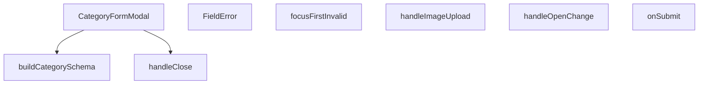

## Genel Bakış
Bu modül, yönetici panelinde kategorileri eklemek veya düzenlemek için kullanılan kontrollü bir form modalı bileşenidir. Kullanıcıdan kategori adı, açıklama ve görsel bilgilerini toplayarak doğrulama sürecinden geçirir ve sunucuya API aracılığıyla gönderir. Modal, dışarıdan kontrol edilen durumu ve mevcut kategori verisiyle esnek bir yapı sunarak hem yeni ekleme hem de düzenleme senaryolarını destekler.

## Fonksiyon Grupları

### Ana Bileşen
Modal penceresinin tüm görünümünü, form alanlarını, butonlarını ve temel iş akışını oluşturan ana React bileşenidir. Prop'lar aracılığıyla dışarıdan kontrol edilir ve form durumunu yöneterek kullanıcı etkileşimini orkestra eder.
- CategoryFormModal

### Form İşlemleri ve Veri Yönetimi
Kullanıcının yüklediği görselleri işleyen ve form verilerini doğruladıktan sonra API isteklerini başlatan asenkron iş mantığını içerir. Görsel yükleme ve form gönderimi gibi işlemleri yürüterek veri bütünlüğünü sağlar.
- handleImageUpload, onSubmit

### Modal Kontrol Mekanizmaları
Modalın açılıp kapanma durumunu yöneten, pencereler arası geçişleri kontrol eden ve kullanıcı arayüzünün tutarlılığını sağlayan yardımcı işlevleri içerir. Dış bileşenlerle senkronize çalışarak modal yaşam döngüsünü yönlendirir.
- handleClose, handleOpenChange

### Doğrulama ve Hata Yönetimi
Form alanları için doğrulama şemasını oluşturan, hata durumlarını görsel olarak sunan ve ilk hatalı alana odaklanarak kullanıcı deneyimini iyileştiren yardımcı fonksiyonları kapsar. Çeviri desteğiyle çok dilli hata mesajları sunabilir.
- buildCategorySchema, FieldError, focusFirstInvalid

---

## AXIOMS – Mimari Varsayımlar

Bu modül, dışarıdan kontrol edilen bir modal form yapısı üzerine kurulmuştur. Aşağıda fonksiyon imzalarından çıkarılabilir mimari varsayımlar yer almaktadır.

[Aksiyom 1]: `buildCategorySchema` fonksiyonu bir `t` (çeviri fonksiyonu) parametresi alır. Eğer çağrıya geçerli bir çeviri fonksiyonu sağlanmazsa, shema içindeki doğrulama mesajları üretilemez.

[Aksiyom 2]: `CategoryFormModal` bileşeni `open` ve `onOpenChange` parametreleri alır. Eğer bu kontrollü durum Prop'ları dışarıdan sağlanmazsa, modalın açılıp kapanması kontrol edilemez.

[Aksiyom 3]: `CategoryFormModal`, `category` parametresi alır (düzenleme modu için mevcut kategori verisi). Eğer `category` sağlanmazsa, modülün yeni kategori ekleme modunda çalışması beklenir.

[Aksiyom 4]: `onSubmit(values: CategoryFormValues)` fonksiyonu doğrulanmış form değerleriyle çağrılmalıdır. Eğer doğrulama hatası varken bu fonksiyon çağrılırsa, geçersiz veri sunucuya gönderilmiş olur.

[Aksiyom 5]: `focusFirstInvalid(errs: FieldErrors<CategoryFormValues>)` fonksiyonu, `FieldErrors<CategoryFormValues>` tipli hata nesnesi bekler. Eğer geçersiz tipte bir hata nesnesi verilirse, odak yönetimi beklenmeyen şekilde çalışır.

[Aksiyom 6]: `handleImageUpload(e: React.ChangeEvent<HTMLInputElement>)` fonksiyonu bir input change event'i bekler. Eğer event geçerli bir dosya içermiyorsa (örn: kullanıcı iptal ederse), görsel yükleme işlemi başarısız olur.

[Aksiyom 7]: `FieldError` bileşeni `id` parametresi ister, `message` opsiyoneldir. Eğer `id` sağlanmazsa, bileşen hangi alanla ilişkilendiğini bilemez.

[Aksiyom 8]: `onSuccess` callback'i `CategoryFormModal` tarafından sağlanmalıdır. Eğer sağlanmazsa, başarılı form gönderiminden sonra tetiklenecek遗ورUI güncelleme veya yönlendirme行为larıçalışmaz.

[Aksiyom 9]: `handleOpenChange(openVal: boolean)` fonksiyonu bool bir değer alır. Eğer boolean dışı bir değer geçilirse, modal durumu tutarsız hale gelir.

[Aksiyom 10]: `FIELD_FOCUS_ORDER` sabiti, `focusFirstInvalid` ile birlikte çalışarak hatalı alanlara sırayla odaklanmayı sağlar. Eğer bu dizi boş veya tanımsızsa, hatalı alanlara otomatik odaklama çalışmaz.

---

## FONKSİYON DETAYLARI

### buildCategorySchema
**Ne yapar**: Bir kategori formu için_VALIDASYON ŞEMASI_ oluşturur.
**Nasıl yapar**: Fonksiyon, bir `t` çeviri fonksiyonu alır ve bu fonksiyonu kullanarak form alanları için zod ile tanımlanmış bir şema (schema) döndürür. Bu şema, React Hook Form (RHF) kütüphanesi tarafından form doğrulaması için kullanılır. Fonksiyonun içinde `buildCategorySchema(t)` çağrısı yapılarak şema oluşturulur ve döndürülür. Bu sayede hata mesajları farklı dillere çevrilebilir.
**Parametreler**:
- `t`: `(key: string) => string` — Çeviri anahtarlarını yerel metinlere dönüştüren bir fonksiyon. Çoğunlukla i18n (uluslararasılaştırma) kütüphanelerinden gelir.
**Dönüş**: Oluşturulan zod şeması (örneğin `z.ZodObject`). Verilen kodda dönüş tipi açıkça belirtilmemiş ancak şema nesnesi döndürülür.

### FieldError
**Ne yapar**: Form alanının hemen altında bir hata mesajı satırı gösteren bir bileşendir.
**Nasıl yapar**: `id` ve opsiyonel `message` prop'larını alır. Eğer `message` mevcutsa ve boş değilse, verilen `id`'li bir `<p>` etiketini render eder. `message` yoksa veya boşsa, bileşen hiçbir şey render etmez (null döner). Bu, form hatalarının kullanıcıya yalnızca gerektiğinde ve temiz bir şekilde gösterilmesini sağlar.
**Parametreler**:
- `id`: `string` — Hata mesajının gösterileceği DOM elementinin `id` özelliği. Genellikle `aria-describedby` gibi erişilebilirlik özelliklerine referans olarak kullanılır.
- `message`: `string` (opsiyonel) — Gösterilecek hata metni. Eğer sağlanmazsa bileşen görünmez.
**Dönüş**: `React.FC<{ id: string; message?: string }>` — Bileşenin React Fonksiyonel Bileşen olduğunu belirtir.

### focusFirstInvalid
**Ne yapar**: 14 alanlı bir formda, ilk hatalı form alanına odaklanarak kullanıcıyı hataya yönlendirir.
**Nasıl yapar**: `errs` (tüm form hataları) objesini ve `FIELD_FOCUS_ORDER` (tanımlı alan sırası) dizisini kullanır. Alanları belirli bir sırayla (muhtemelen DOM'daki üstten alta sırayla) tarar, ilk olarak `errs` içinde bir hata bulunan alanı (`name`) tespit eder. Bulduğunda, `document.getElementById()` ile ilgili DOM elementini bulur ve `.focus()` metoduyla o elemana odaklanmayı sağlar. Bu yaklaşım, React Hook Form'un varsayılan `shouldFocusError` özelliğinin kapalı olduğu (`false`) durumlarda, odaklanma sırasının determinantik (tahmin edilebilir) ve tutarlı olmasını garanti altına alır.
**Parametreler**:
- `errs`: `FieldErrors<CategoryFormValues>` — React Hook Form'dan gelen, form alanlarındaki hataları içeren obje. Anahtarlar alan adları, değerler ise hata nesneleri veya undefined olabilir.
**Dönüş**: `void` — Fonksiyon herhangi bir değer döndürmez, yalnızca kenar etkisi (side effect) olarak DOM'da odak değişikliği yapar.

### CategoryFormModal
**Ne yapar**: Kategori oluşturmak veya düzenlemek için bir modal (sweetalert) formu sunan ana bileşendir.
**Nasıl yapar**: Bu bir React bileşenidir ve `open` prop'una göre görünür/görünmez olur. Kullanıcı formu doldurup gönderdiğinde `onSuccess` callback'ini çağırarak üst bileşene başarıyla procesin tamamlandığını bildirir. Form içinde `buildCategorySchema` ile oluşturulan zod şemasını kullanarak React Hook Form ile doğrulama yapar. Alan hataları için `FieldError` bileşenini ve ilk hatalı alana odaklanma mantığı için `focusFirstInvalid` fonksiyonunu kullanır. `category` prop'u verilmişse, bu bir düzenleme (edit) modudur ve form önceden doldurulur; verilmemişse yeni bir kategori oluşturma (create) modudur.
**Parametreler**:
- `open`: `boolean` — Modal'ın açık (true) veya kapalı (false) olduğunu belirten durum.
- `onOpenChange`: `(open: boolean) => void` — Modal'ın açılıp kapatılma isteklerini üst bileşene bildiren callback. Genellikle `open` durumunu güncellemek için kullanılır.
- `category`: `Category | undefined` — Düzenlenecek kategori verisi. Eğer sağlanırsa modal düzenleme modunda açılır, sağlanmazsa oluşturma modunda açılır.
- `onSuccess`: `() => void` — Form başarıyla gönderildiğinde ve kaydedildiğinde çağrılan callback. Üst bileşen genellikle bu callback ile veri listesini yeniler veya bir bildirim gösterir.
**Dönüş**: `React.FC<CategoryFormModalProps>` — Bileşenin belirtilen prop tipleriyle bir React Fonksiyonel Bileşen olduğunu belirtir.

### handleImageUpload
**Ne yapar**: Kullanıcı bir dosya (görsel) seçtiğinde bu dosyayı işleyerek ilgili form alanına ekler.  
**Nasıl yapar**: `React.ChangeEvent<HTMLInputElement>` tipindeki olay nesnesini alır, seçilen dosyayı (eğer mevcutsa) okur ve gerekli durum güncellemelerini gerçekleştirir.  
**Parametreler**:
- `e`: React.ChangeEvent<HTMLInputElement> — Dosya girişindeki değişiklik olayını temsil eder.  
**Dönüş**: Belirtilmemiş; fonksiyonun dönüş tipi mevcut dokümantasyonda tanımlı değildir.

### onSubmit
**Ne yapar**: Kategori formundan gelen değerleri alır ve bu verileri işleyerek (örneğin API çağrısı) kaydetme işlemini başlatır.  
**Nasıl yapar**: `CategoryFormValues` tipindeki form değerlerini parametre olarak alır, gerekli doğrulama ve iş mantığını uygular, ardından başarılı bir işlem durumunda `onSuccess` callback’ini tetikleyebilir.  
**Parametreler**:
- `values`: CategoryFormValues — Formda toplanan kategori adı, açıklama, görsel vb. alanların değerlerini içeren nesne.  
**Dönüş**: Belirtilmemiş; fonksiyonun dönüş tipi mevcut dokümantasyonda tanımlı değildir.

### handleClose
**Ne yapar**: Modal'ın kapatılma işlemini yöneten, kullanıcı onayı gerektiren asenkron bir fonksiyondur.
**Nasıl yapar**: Bu bir kapatma akışı (close guard) fonksiyonudur. Modal kapatılmak istendiğinde (openVal `false` olduğunda), önce kapatma isteğini yakalar. Ardından, `ConfirmDialog` bileşenini kullanarak kullanıcıya "Değişiklikleri atmak GERİ ALINAMAZ" uyarısıyla bir onay penceresi gösterir. Kullanıcı "danger" tonunda bir onay verirse (`tone:'danger'`), modal gerçekten kapatılır (`onOpenChange(false)` çağrılır). Kullanıcı onay vermezse kapatma işlemi iptal edilir ve modal açık kalır. Bu akış, eski senkron `window.confirm` kullanımının yerini alır ve kapatma işlemini asenkron, kontrollü ve kullanıcı deneyimini iyileştiren bir hale getirir.
**Parametreler**: Parametre almaz, ancak içinde bulunduğu bağlamda (closure) `open` ve `onOpenChange` gibi üst bileşen prop'larına erişir.
**Dönüş**: `Promise<void>` (veya basitçe `void` — asenkron olduğu için bir promise döndürür, ancak pratikte çağrılan yerlerce await edilmeyebilir). Fonksiyonun ana amacı değer döndürmek değil, kapatma akışını yönetmektir.

### handleOpenChange
**Ne yapar**: Modal'ın açılıp kapatılma durumunu değiştirmek için bir işlevi tetikler.
**Nasıl yapar**: Fonksiyon, bir boolean alarak modal'ın görünür durumunu güncelleyen bir state değişimini veya callback'i çağırarak modal'ın açılış/kapatış mantığını yönetir. Detaylı iç mantık verilmemiştir, ancak isimlendirmesi ve kullanım amacı doğrultusunda bir kontrol mekanizması sağladığı açıktır.
**Parametreler**:
- openVal: boolean — Modal'ın yeni açılıp kapatma durumunu belirtir. `true` değerini alırsa modal açılır, `false` değerini alırsa modal kapanır.
**Dönüş**: Bilinmiyor (muhtemelen void).

---

## İTHALATLAR (IMPORTS)
- import: ../../../lib/type-converters::toSupabaseJson
- import: ../../../types/database.types::type { Database }
- import: ../../../types/db-rows::type { CategoryMetadata,DbCategory }
- import: ../../../utils/adminUi::adminButtonPrimaryClass
- import: ../../../utils/imageUtils::compressImage
- import: ../../ui/VentImage::VentImage
- import: ../overlay/ConfirmProvider::useConfirm
- import: @/i18n/I18nProvider::useI18n
- import: @/lib/supabase/client::supabaseBrowserClient
- import: @hookform/resolvers/zod::zodResolver
- import: @radix-ui/react-dialog
- import: @radix-ui/react-tabs
- import: lucide-react::Loader2
- import: lucide-react::Save
- import: lucide-react::Trash2
- import: lucide-react::Upload
- import: lucide-react::X
- import: react-hook-form::type { FieldErrors }
- import: react-hook-form::useForm
- import: react::React
- import: react::useEffect
- import: react::useState
- import: sonner::toast
- import: zod::z

---

## INTERFACES

### CategoryFormModalProps
- `open: boolean`
- `onOpenChange: (open: boolean) => void`
- `category?: DbCategory | null`
- `onSuccess: () => void`

---

## TYPE ALIASES

### CategoryUpdate
```typescript
type CategoryUpdate = Database['public']['Tables']['categories']['Update']
```

### CategoryInsert
```typescript
type CategoryInsert = Database['public']['Tables']['categories']['Insert']
```

### CategoryFormValues
```typescript
type CategoryFormValues = z.infer<ReturnType<typeof buildCategorySchema>>
```

---

## SABİTLER
- **FIELD_FOCUS_ORDER** (array) — `[
    { name: 'name', id: 'category-name' },
    { name: 'slug', id: 'categor...`

---

## AST POINTERS

### [N1_NASIL] AST Pointer: src/components/admin/categories/CategoryFormModal.tsx::buildCategorySchema
- **params**: `t` — (`(key: string) => string`) i18n çeviri fonksiyonu, shema hata mesajlarını localized olarak üretmek için kullanılır
- **ic_degiskenler**: yok
- **Dönüş**: `z.object(...)` Zod shema nesnesi — kategori form alanlarının validasyon kurallarını tanımlar

### [N2_NASIL] AST Pointer: src/components/admin/categories/CategoryFormModal.tsx::FieldError
- **params**: `{ id, message }` — `id` hata mesajının HTML id'si, `message` gösterilecek hata metni (opsiyonel)
- **ic_degiskenler**: yok
- **Dönüş**: `JSX.Element | null` — hata mesajı varsa `<p>` elementi, yoksa `null`

### [N3_NASIL] AST Pointer: src/components/admin/categories/CategoryFormModal.tsx::focusFirstInvalid
- **params**: `errs` — (`FieldErrors<CategoryFormValues>`) react-hook-form hata nesnesi
- **ic_degiskenler**:
  - `first` — `FIELD_FOCUS_ORDER` dizisinde ilk hata alanını bulan nesne, odaklanılacak element bilgisini tutar
- **Dönüş**: `void` — odaklanma yanı etkisi yapar

### [N4_NASIL] AST Pointer: src/components/admin/categories/CategoryFormModal.tsx::CategoryFormModal
- **params**: `{ open, onOpenChange, category, onSuccess }` — `open` modalın açık olup olmadığı, `onOpenChange` durum değiştirici, `category` düzenlenecek kategori nesnesi (yeni ise null), `onSuccess` başarı callbacki
- **ic_degiskenler**:
  - `fetchParents` — üst kategorileri Supabase'den çeken async fonksiyon, parent_id options'ı günceller
  - `data` — `fetchParents` içindeki Supabase sorgusundan dönen üst kategori listesi
  - `form` — react-hook-form instance'ı, form alanlarını kontrol eder
  - `category` — prop'tan gelen kategori verisi, düzenleme modunda kullanılır
  - `previewImage` — yüklenen görselin preview URL'i
  - `parentIdOptions` — üst kategori seçenekleri dizisi
  - `supabase` — Supabase client instance'ı
  - `setParentIdOptions` — üst kategori seçeneklerini güncelleyen state setter
  - `setPreviewImage` — görsel preview'unu güncelleyen state setter
  - `handleBeforeUnload` — sayfa kapatma olayı için event handler
- **Dönüş**: `JSX.Element` — modal dialog JSX yapısı

### [N5_NASIL] AST Pointer: src/components/admin/categories/CategoryFormModal.tsx::handleImageUpload
- **params**: `e` — (`React.ChangeEvent<HTMLInputElement>`) dosya input change olayı
- **ic_degiskenler**:
  - `file` — seçilen dosya nesnesi
  - `compressedFile` — sıkıştırılmış görsel dosyası (compressImage API'sinden dönen)
  - `fileExt` — dosya uzantısı
  - `fileName` — benzersiz dosya adı (UUID ile oluşturulur)
  - `filePath` — Supabase storage'daki tam dosya yolu
  - `uploadError` — yükleme hata nesnesi
  - `publicUrl` — yüklenen görselin public URL'i
  - `uploadingImage` — yükleme durumu state'i
  - `setUploadingImage` — yükleme durumunu güncelleyen setter
  - `form` — react-hook-form instance'ı
  - `toast` — bildirim gösterme fonksiyonu
  - `compressImage` — görsel sıkıştırma fonksiyonu
  - `supabase` — Supabase client instance'ı
- **Dönüş**: `Promise<void>` — asenkron yükleme işlemi

### [N6_NASIL] AST Pointer: src/components/admin/categories/CategoryFormModal.tsx::onSubmit
- **params**: `values` — (`CategoryFormValues`) form değerleri
- **ic_degiskenler**:
  - `loading` — gönderim durumu state'i
  - `setLoading` — gönderim durumunu güncelleyen setter
  - `metadata` — kategori metadata nesnesi (metric1 ve metric2 değerleri)
  - `updateData` — güncelleme için veri nesnesi (kategori düzenleme modunda)
  - `insertData` – ekleme için veri nesnesi (yeni kategori modunda)
  - `category` — prop'tan gelen kategori verisi
  - `onSuccess` — başarı callbacki
  - `onOpenChange` — modal kapatma fonksiyonu
  - `toast` — bildirim gösterme fonksiyonu
  - `toSupabaseJson` — JSON formatına dönüştürme fonksiyonu
  - `supabase` — Supabase client instance'ı
- **Dönüş**: `Promise<void>` — asenkron Supabase insert/update işlemi

### [N7_NASIL] AST Pointer: src/components/admin/categories/CategoryFormModal.tsx::handleClose
- **params**: yok
- **ic_degiskenler**:
  - `ok` — onay dialogundan dönen boolean değer
  - `form` — react-hook-form instance'ı
  - `onOpenChange` — modal kapatma fonksiyonu
  - `confirm` — onay dialogu fonksiyonu
  - `t` — i18n çeviri fonksiyonu
- **Dönüş**: `Promise<void>` — asenkron onay dialogu ve modal kapatma

### [N8_NASIL] AST Pointer: src/components/admin/categories/CategoryFormModal.tsx::handleOpenChange
- **params**: `openVal` — (`boolean`) modal durumu (açık/kapalı)
- **ic_degiskenler**:
  - `handleClose` — modal kapatma fonksiyonu
  - `onOpenChange` — modal durum değiştirici
- **Dönüş**: `void` — modal durumunu yönetir

---


## MERMAID CALL GRAPH


## NODE ID STANDARD

  file: src\components\admin\categories\CategoryFormModal.tsx
  function: src\components\admin\categories\CategoryFormModal.tsx::buildCategorySchema
  function: src\components\admin\categories\CategoryFormModal.tsx::FieldError
  function: src\components\admin\categories\CategoryFormModal.tsx::focusFirstInvalid
  function: src\components\admin\categories\CategoryFormModal.tsx::CategoryFormModal
  function: src\components\admin\categories\CategoryFormModal.tsx::handleImageUpload
  function: src\components\admin\categories\CategoryFormModal.tsx::onSubmit
  function: src\components\admin\categories\CategoryFormModal.tsx::handleClose
  function: src\components\admin\categories\CategoryFormModal.tsx::handleOpenChange

---

## DISA AKTARILANLAR (EXPORTS)
  export: CategoryFormModal
  export: FieldError
  export: buildCategorySchema
  export: focusFirstInvalid

---

## STİL TOKENLERİ

### Arbitrary Değerler (token'a geçirilmemiş)
Yok — tüm stiller token'a geçirilmiş. ✅

### Kullanılan Token'lar (zaten token'a geçirilmiş)
- (yok)

### Tailwind Sınıf Özeti
- **Renkler:** `bg-admin-accent`, `bg-admin-bg`, `bg-admin-danger`, `bg-admin-surface-2`, `bg-black/40`, `bg-black/60`, `border-2`, `border-admin-border`, `border-b`, `border-b-2`, `border-dashed`, `border-t`, `border-transparent`, `data-[state=active]:border-admin-accent`, `data-[state=active]:text-admin-accent`
- **Layout:** `absolute`, `backdrop-blur-2`, `block`, `custom-scrollbar`, `fixed`, `flex`, `flex-1`, `flex-col`, `gap-2`, `gap-4`, `gap-6`, `gap-8`, `grid`, `grid-cols-2`, `h-4`
- **Varyant/Responsive:** `:`, `data-[state=active]:`, `focus-visible:`, `group-hover:`, `hover:`, `placeholder:` önekleri
- **Yardımcı Sınıflar:** `!border-admin-danger`, `${adminButtonPrimaryClass`, `-translate-x-1/2`, `-translate-y-1/2`, `:`, `animate-spin`, `appearance-none`, `border`, `cursor-pointer`, `focus-visible:outline-none`, `focus-visible:ring-admin-accent/30`, `focus-visible:ring-offset-0`, `font-bold`, `font-medium`, `font-mono`