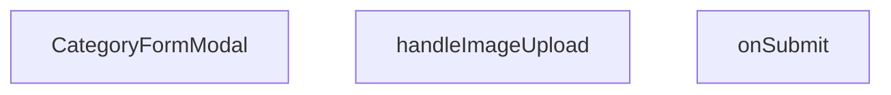

## Genel Bakış
`CategoryFormModal` bileşeni, yönetim panelinde kategori ekleme ve düzenleme işlemlerini gerçekleştiren bir modal formdur. Kullanıcıdan alınan kategori bilgilerini ve görsel dosyaları işleyerek API üzerinden gönderir, işlem sonucunda üst bileşene geri bildirim sağlar.

## Fonksiyon Grupları
### Modal ve Form Arayüzü
Modal penceresinin açılıp kapanmasını, form başlangıç değerlerini ve bileşenin genel görünümünü yönetir.  
- CategoryFormModal

### Görsel Yükleme
Kullanıcının seçtiği görsel dosyasını alır ve sonraki işlemler için hazır hale getirir.  
- handleImageUpload

### Form Gönderme ve İş Mantığı
Form verilerini doğrular, gerekli API çağrılarını yapar ve başarılı yanıt sonrasında `onSuccess` callback’ini tetikler.  
- onSubmit

---

## AXIOMS – Mimari Varsayımlar
Bu modül için özel aksiyom tanımlanmamıştır.

---

---

## FONKSIYON DETAYLARI

### CategoryFormModal
**Ne yapar**: Kategori ekleme veya düzenleme işlemleri için kullanılan bir modal form bileşenidir. Açık/kapalı durumu ve form verilerini dışarıdan alarak yönetir.
**Nasıl yapar**: `open` ve `onOpenChange` prop’ları ile modal görünürlüğü kontrol edilir; `category` prop’u mevcut kategori verisini forma yerleştirir; `onSuccess` callback’i başarılı kayıt/güncelleme sonrası üst bileşeni bilgilendirir.
**Parametreler**:
- `open`: Belirtilmemiş — Modalın açık olup olmadığını belirten değer.
- `onOpenChange`: Belirtilmemiş — Modalın açılıp kapanma durumunu güncellemek için kullanılan callback fonksiyonu.
- `category`: Belirtilmemiş — Düzenlenecek kategori bilgisini içeren obje (opsiyonel).
- `onSuccess`: Belirtilmemiş — Başarılı işlem sonrası tetiklenen callback fonksiyonu.
**Dönüş**: React.FC<CategoryFormModalProps> — React functional component olarak tanımlanmıştır.

### handleImageUpload
**Ne yapar**: Kullanıcının bir dosya seçmesi durumunda tetiklenen olay işleyicisidir. Seçilen dosyayı alarak resim yükleme sürecini başlatır.
**Nasıl yapar**: Input elemanındaki `change` olayını yakalar, `e.target.files` üzerinden seçilen dosyaya erişir ve gerekli işlemleri (örneğin önizleme oluşturma veya state’e kaydetme) gerçekleştirir.
**Parametreler**:
- `e`: React.ChangeEvent<HTMLInputElement> — Dosya seçme input’unda meydana gelen değişim olayı.
**Dönüş**: Belirtilmemiş.

### onSubmit
**Ne yapar**: Form gönderildiğinde çalışan işleyici fonksiyondur. Toplanan form değerlerini alarak kategori kaydetme veya güncelleme işlemini yürütür.
**Nasıl yapar**: `CategoryFormValues` türündeki değerleri alır; doğrulama, API çağrısı ve başarılı sonuçta `onSuccess`’i tetikleme gibi adımları içerir.
**Parametreler**:
- `values`: CategoryFormValues — Form alanlarından elde edilen verileri içeren nesne.
**Dönüş**: Belirtilmemiş.

---

## INTERFACES

### CategoryFormModalProps
- `open: boolean`
- `onOpenChange: (open: boolean) => void`
- `category?: DbCategory | null`
- `onSuccess: () => void`

---

## TYPE ALIASES

### CategoryUpdate
```typescript
type CategoryUpdate = Database['public']['Tables']['categories']['Update']
```

### CategoryInsert
```typescript
type CategoryInsert = Database['public']['Tables']['categories']['Insert']
```

### CategoryFormValues
```typescript
type CategoryFormValues = z.infer<typeof categorySchema>
```

---

## SABİTLER
- **categorySchema** (call) — `z.object({

    name: z.string().min(1, 'Kategori adı zorunludur'),

    slug...`

---

## AST POINTERS

### [N1_NASIL] AST Pointer: C:\Users\alize\venthub-hvac\src\components\admin\categories\CategoryFormModal.tsx::useEffectFetchParents
- **params**: (yok)
- **ic_degiskenler**:
  - `fetchParents` — scope içinde tanımlanan async fonksiyon, parent kategorileri getirir
  - `open` — dışarıdan gelen boolean değer, modalın açık/kapalı olduğunu belirtir
- **Dönüş**:

---


## MERMAID CALL GRAPH


## NODE ID STANDARD

  file: src\components\admin\categories\CategoryFormModal.tsx
  function: src\components\admin\categories\CategoryFormModal.tsx::CategoryFormModal
  function: src\components\admin\categories\CategoryFormModal.tsx::handleImageUpload
  function: src\components\admin\categories\CategoryFormModal.tsx::onSubmit

---

## DISA AKTARILANLAR (EXPORTS)
  export: CategoryFormModal