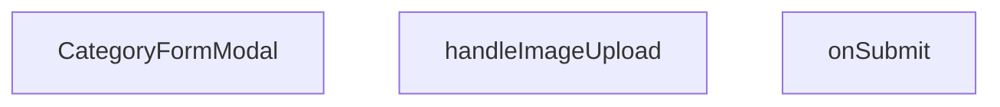

## Genel Bakış
Bu modül, yönetici panelinde kategorilerin eklenmesini ve düzenlenmesini sağlayan bir form modalı bileşenidir. Kullanıcıdan kategori adı, açıklama ve görsel bilgilerini toplar, doğrular ve ilgili API isteklerini başlatır. Bileşen, dışarıdan kontrol edilen açılıp kapanma durumu ve mevcut kategori verisi ile esnek bir yapı sunar.

## Fonksiyon Grupları
### Bileşenin Ana Yapısı
Tüm modal penceresinin yapısını, başlığını, form alanlarını ve butonlarını oluşturan ve yöneten ana React bileşenidir.
- CategoryFormModal

### Form İşlemleri ve Veri Yönetimi
Kullanıcının form verilerini doğrulayan, görsel yükleyen ve form gönderiminde gerekli API çağrılarını tetikleyen iş mantığını barındırır.
- handleImageUpload, onSubmit

---

## AXIOMS – Mimari Varsayımlar

Bu modül, kategori formu modal bileşeni olup, formun açılması, doğrulanması ve gönderilmesi için dış bağımlılıklara ve geçerli verilere ihtiyaç duyar.

[Aksiyom 1]: Eğer `open` prop'u `false` olarak verilirse, modal görüntülenmez ve form içeriği sıfırlanmaz (sadece kapanır).

[Aksiyom 2]: Eğer `onOpenChange` callback'i sağlanmazsa, modal'ın kapanma tetikleyicisi çalıştırılamaz ve kullanıcı modal'ı kapatamaz.

[Aksiyom 3]: Eğer `onSuccess` callback'i sağlanmazsa, form başarılı şekilde gönderildiğinde üst bileşene bildirim yapılamaz ve veri yenileme tetiklenemez.

[Aksiyom 4]: Eğer `category` prop'u verilmezse (undefined/null), modal "yeni kategori ekleme" modunda çalışır; verilirse "mevcut kategori düzenleme" moduna geçer.

[Aksiyom 5]: Eğer `categorySchema` (Zod şeması) geçerli bir şema olarak çağrılamazsa (`.parse` veya `.safeParse` hata fırlatırsa), form gönderimi reddedilir ve API isteği gönderilmez.

[Aksiyom 6]: Eğer `handleImageUpload` fonksiyonuna geçerli bir `React.ChangeEvent<HTMLInputElement>` verilmezse veya event içindeki dosya (`e.target.files`) boş/null ise, görsel yükleme işlemi gerçekleştirilmez.

[Aksiyom 7]: Eğer `onSubmit` fonksiyonuna `CategoryFormValues` tipine uymayan bir değer verilirse, TypeScript derleme zamanı hatası oluşur veya runtime'da beklenmeyen davranış gözlemlenebilir.

[Aksiyom 8]: Eğer `categorySchema` doğrulaması başarısız olursa, form hataları gösterilir ve `onSubmit` fonksiyonu çağrılmaz.

[Aksiyom 9]: Eğer `categorySchema` içinde tanımlı alanlar (ad, açıklama, görsel vb.) zorunluysa, kullanıcı bu alanları doldurmadan form gönderimi başarısız olur.

---

## FONKSİYON DETAYLARI

### CategoryFormModal
**Ne yapar**: Açık/kapalı durumunu kontrol eden, kategori verisini alıp başarı durumunda bir geri bildirim sağlayan bir React bileşeni oluşturur.  
**Nasıl yapar**: `open`, `onOpenChange`, `category` ve `onSuccess` prop’larını alır; bu prop’lar bileşenin görünürlüğünü, dışarıdan kontrol edilen durum değişikliklerini, düzenlenecek/eklenecek kategori bilgisini ve işlem tamamlandığında tetiklenecek callback’i yönetir. Bileşen, bu prop’ları içeren bir fonksiyonel komponent (`React.FC`) döndürür.  
**Parametreler**:
- `open`: boolean — Modal penceresinin açık olup olmadığını belirler.  
- `onOpenChange`: (open: boolean) => void — Modal’ın açık/kapalı durumundaki değişiklikleri dışarıya bildiren fonksiyon.  
- `category`: Category | undefined — Düzenlenmekte olan kategori nesnesi; yeni bir kategori ekleniyorsa `undefined` olabilir.  
- `onSuccess`: () => void — Form başarıyla gönderildiğinde çalıştırılan geri çağırma fonksiyonu.  
**Dönüş**: `React.FC<CategoryFormModalProps>` — Belirtilen prop tiplerini kullanan bir fonksiyonel React bileşeni.

### handleImageUpload
**Ne yapar**: Kullanıcı bir dosya (görsel) seçtiğinde bu dosyayı işleyerek ilgili form alanına ekler.  
**Nasıl yapar**: `React.ChangeEvent<HTMLInputElement>` tipindeki olay nesnesini alır, seçilen dosyayı (eğer mevcutsa) okur ve gerekli durum güncellemelerini gerçekleştirir.  
**Parametreler**:
- `e`: React.ChangeEvent<HTMLInputElement> — Dosya girişindeki değişiklik olayını temsil eder.  
**Dönüş**: Belirtilmemiş; fonksiyonun dönüş tipi mevcut dokümantasyonda tanımlı değildir.

### onSubmit
**Ne yapar**: Kategori formundan gelen değerleri alır ve bu verileri işleyerek (örneğin API çağrısı) kaydetme işlemini başlatır.  
**Nasıl yapar**: `CategoryFormValues` tipindeki form değerlerini parametre olarak alır, gerekli doğrulama ve iş mantığını uygular, ardından başarılı bir işlem durumunda `onSuccess` callback’ini tetikleyebilir.  
**Parametreler**:
- `values`: CategoryFormValues — Formda toplanan kategori adı, açıklama, görsel vb. alanların değerlerini içeren nesne.  
**Dönüş**: Belirtilmemiş; fonksiyonun dönüş tipi mevcut dokümantasyonda tanımlı değildir.

---

## INTERFACES

### CategoryFormModalProps
- `open: boolean`
- `onOpenChange: (open: boolean) => void`
- `category?: DbCategory | null`
- `onSuccess: () => void`

---

## TYPE ALIASES

### CategoryUpdate
```typescript
type CategoryUpdate = Database['public']['Tables']['categories']['Update']
```

### CategoryInsert
```typescript
type CategoryInsert = Database['public']['Tables']['categories']['Insert']
```

### CategoryFormValues
```typescript
type CategoryFormValues = z.infer<typeof categorySchema>
```

---

## SABİTLER
- **categorySchema** (call) — `z.object({

    name: z.string().min(1, 'Kategori adı zorunludur'),

    slug...`

---

## AST POINTERS

### [N1_NASIL] AST Pointer: src/components/admin/categories/CategoryFormModal.tsx::CategoryFormModal
- **params**: `open` — modal'ın açık olup olmadığını belirler (boolean), `onOpenChange` — modal durumunu değiştiren callback, `category` — düzenlenecek kategori objesi (null ise yeni kategori), `onSuccess` — başarılı işlem sonrası çağrılan callback
- **ic_degiskenler**:
  - `fetchParents` — supabase'den parent_id'si null olan kategorileri çekip `parentIdOptions` state'ini güncelleyen inner async fonksiyon; kendi kendine parent olmasını önler (`neq('id', category?.id || '00000000-...')`)
  - `form` — `useForm` ile oluşturulan form instance, `zodResolver(categorySchema)` ile doğrulanır
  - `parentIdOptions` — `setParentIdOptions` ile set edilen üst kategori listesi state'i
  - `previewImage` — `setPreviewImage` ile set edilen önizleme görseli URL'i state'i
  - `uploadingImage` — `setUploadingImage` ile set edilen yükleme durumu state'i (boolean)
  - `loading` — `setLoading` ile set edilen form gönderim yüklenme durumu state'i (boolean)
  - `category?.id` — mevcut kategorinin ID'si, fetchParents'ta self-parenting önlemede kullanılır
  - `category?.name, .slug, .parent_id, .description, .seo_title, .seo_desc, .is_featured, .sort_order, .image_url` — form reset'te mevcut kategori değerlerinden doldurulan alanlar
  - `category?.metadata?.metric1?.value, .label, .metadata?.metric2?.value, .label` — metadata içinden metric alanları, form reset'te kullanılır
  - `p.id`, `p.name` — select option render'ında her üst kategori için id ve adı
- **Dönüş**: `React.FC<CategoryFormModalProps>` — Dialog, Tabs, form alanları ve submit butonlarından oluşan JSX

### [N2_NASIL] AST Pointer: src/components/admin/categories/CategoryFormModal.tsx::handleImageUpload
- **params**: `e: React.ChangeEvent<HTMLInputElement>` — input change eventi
- **ic_degiskenler**:
  - `file` — `e.target.files?.[0]` ile elde edilen ilk seçilen dosya; yoksa fonksiyon erken return eder
  - `compressedFile` — `compressImage(file)` ile sıkıştırılmış dosya, Supabase'e yüklenmeden önce optimize edilir
  - `fileExt` — `file.name.split('.').pop()` ile elde edilen dosya uzantısı (ör: jpg, png)
  - `fileName` — `crypto.randomUUID()` ile üretilen benzersiz dosya adı, uzantıyla birleştirilir
  - `filePath` — `category-images/${fileName}` olarak tanımlı Supabase storage içi tam dosya yolu
  - `uploadError` — `supabase.storage.from('products').upload()` sonucu dönen hata; varsa fırlatılır
  - `publicUrl` — `supabase.storage.from('products').getPublicUrl(filePath)` ile elde edilen herkese açık görsel URL'i
- **Dönüş**: yok (yan etkiler: `form.setValue('image_url', publicUrl)`, `setPreviewImage(publicUrl)`, toast bildirimleri)

### [N3_NASIL] AST Pointer: src/components/admin/categories/CategoryFormModal.tsx::onSubmit
- **params**: `values: CategoryFormValues` — react-hook-form'dan gelen doğrulanmış form değerleri
- **ic_degiskenler**:
  - `metadata` — `CategoryMetadata` nesnesi; `values.metric1_label`, `values.metric1_value`, `values.metric2_label`, `values.metric2_value` değerlerinden oluşur, Supabase'e JSON olarak kaydedilir
  - `updateData` — `category` varsa (düzelleme modu) oluşturulan `CategoryUpdate` nesnesi; `values.name, .slug, .parent_id, .description, .seo_title, .seo_desc, .is_featured, .sort_order, .image_url` ve `toSupabaseJson(metadata)` içerir
  - `insertData` — `category` yoksa (yeni ekleme modu) oluşturulan `CategoryInsert` nesnesi; updateData ile aynı alanlara ek olarak `authority_content: []` içerir
  - `error` — `supabase.from('categories').update()` veya `.insert()` sonucu dönen hata; varsa fırlatılır
- **Dönüş**: yok (yan etkiler: `supabase.from('categories').update/insert` ile veritabanı yazma, `onSuccess()` çağrısı, `onOpenChange(false)` ile modal'ı kapatma, toast bildirimleri)

---


## MERMAID CALL GRAPH


## NODE ID STANDARD

  file: src\components\admin\categories\CategoryFormModal.tsx
  function: src\components\admin\categories\CategoryFormModal.tsx::CategoryFormModal
  function: src\components\admin\categories\CategoryFormModal.tsx::handleImageUpload
  function: src\components\admin\categories\CategoryFormModal.tsx::onSubmit

---

## DISA AKTARILANLAR (EXPORTS)
  export: CategoryFormModal

---

## STİL TOKENLERİ

### Arbitrary Değerler (token'a geçirilmemiş)
Yok — tüm stiller token'a geçirilmiş. ✅

### Kullanılan Token'lar (zaten token'a geçirilmiş)
- (yok)

### Tailwind Sınıf Özeti
- **Renkler:** `bg-black/40`, `bg-black/60`, `bg-cyan-500`, `bg-red-500`, `bg-surface-deep`, `bg-white/1`, `bg-white/2`, `bg-white/3`, `bg-white/5`, `border-2`, `border-b`, `border-b-2`, `border-dashed`, `border-t`, `border-transparent`
- **Layout:** `absolute`, `backdrop-blur-2`, `backdrop-blur-sm`, `block`, `custom-scrollbar`, `fixed`, `flex`, `flex-1`, `flex-col`, `gap-2`, `gap-4`, `gap-6`, `gap-8`, `grid`, `grid-cols-2`
- **Varyant/Responsive:** `data-[state=active]:`, `focus-visible:`, `focus:`, `group-hover:`, `hover:`, `placeholder:` önekleri
- **Yardımcı Sınıflar:** `${adminButtonPrimaryClass`, `-translate-x-1/2`, `-translate-y-1/2`, `animate-spin`, `appearance-none`, `border`, `cursor-pointer`, `focus-visible:outline-none`, `focus-visible:ring-cyan-500/50`, `focus-visible:ring-offset-0`, `font-black`, `font-bold`, `font-medium`, `font-mono`, `font-normal`