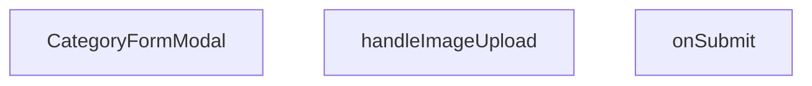

## Genel Bakış
Bu modül, yönetici panelinde kategori ekleme ve düzenleme işlemlerini yöneten bir form modal bileşenidir. Kullanıcıdan kategori adı, açıklama ve görsel gibi bilgileri alır, geçerlilik kontrollerini yapar ve ilgili API çağrılarını tetikler. Modal açılıp kapanma durumu, mevcut kategori verisi ve başarı durumunda çağrılacak geri çağrı (callback) gibi dışarıdan aldığı özelliklerle (props) esnek bir kullanım sunar.

## Fonksiyon Grupları
### Form Gönderimi ve Veri İşleme
Kullanıcının doldurduğu form verilerini alır, doğrular ve yeni bir kategori oluşturmak veya mevcut kategoriyi güncellemek için gerekli işlemleri başlatır.
- handleImageUpload, onSubmit

### Bileşenin Kendisi
Form modalının tüm yapısını, görünümünü ve alt bileşenlerini düzenleyen ana fonksiyondur. Açılma/kapanma durumu, başlık, form alanları ve butonlar gibi kullanıcı arayüzü ögelerini içerir.
- CategoryFormModal

---

## AXIOMS – Mimari Varsayımlar
Bu modül için özel aksiyom tanımlanmamıştır.

---

## FONKSİYON DETAYLARI

### CategoryFormModal
**Ne yapar**: Açık/kapalı durumunu kontrol eden, kategori verisini alıp başarı durumunda bir geri bildirim sağlayan bir React bileşeni oluşturur.  
**Nasıl yapar**: `open`, `onOpenChange`, `category` ve `onSuccess` prop’larını alır; bu prop’lar bileşenin görünürlüğünü, dışarıdan kontrol edilen durum değişikliklerini, düzenlenecek/eklenecek kategori bilgisini ve işlem tamamlandığında tetiklenecek callback’i yönetir. Bileşen, bu prop’ları içeren bir fonksiyonel komponent (`React.FC`) döndürür.  
**Parametreler**:
- `open`: boolean — Modal penceresinin açık olup olmadığını belirler.  
- `onOpenChange`: (open: boolean) => void — Modal’ın açık/kapalı durumundaki değişiklikleri dışarıya bildiren fonksiyon.  
- `category`: Category | undefined — Düzenlenmekte olan kategori nesnesi; yeni bir kategori ekleniyorsa `undefined` olabilir.  
- `onSuccess`: () => void — Form başarıyla gönderildiğinde çalıştırılan geri çağırma fonksiyonu.  
**Dönüş**: `React.FC<CategoryFormModalProps>` — Belirtilen prop tiplerini kullanan bir fonksiyonel React bileşeni.

### handleImageUpload
**Ne yapar**: Kullanıcı bir dosya (görsel) seçtiğinde bu dosyayı işleyerek ilgili form alanına ekler.  
**Nasıl yapar**: `React.ChangeEvent<HTMLInputElement>` tipindeki olay nesnesini alır, seçilen dosyayı (eğer mevcutsa) okur ve gerekli durum güncellemelerini gerçekleştirir.  
**Parametreler**:
- `e`: React.ChangeEvent<HTMLInputElement> — Dosya girişindeki değişiklik olayını temsil eder.  
**Dönüş**: Belirtilmemiş; fonksiyonun dönüş tipi mevcut dokümantasyonda tanımlı değildir.

### onSubmit
**Ne yapar**: Kategori formundan gelen değerleri alır ve bu verileri işleyerek (örneğin API çağrısı) kaydetme işlemini başlatır.  
**Nasıl yapar**: `CategoryFormValues` tipindeki form değerlerini parametre olarak alır, gerekli doğrulama ve iş mantığını uygular, ardından başarılı bir işlem durumunda `onSuccess` callback’ini tetikleyebilir.  
**Parametreler**:
- `values`: CategoryFormValues — Formda toplanan kategori adı, açıklama, görsel vb. alanların değerlerini içeren nesne.  
**Dönüş**: Belirtilmemiş; fonksiyonun dönüş tipi mevcut dokümantasyonda tanımlı değildir.

---

## INTERFACES

### CategoryFormModalProps
- `open: boolean`
- `onOpenChange: (open: boolean) => void`
- `category?: DbCategory | null`
- `onSuccess: () => void`

---

## TYPE ALIASES

### CategoryUpdate
```typescript
type CategoryUpdate = Database['public']['Tables']['categories']['Update']
```

### CategoryInsert
```typescript
type CategoryInsert = Database['public']['Tables']['categories']['Insert']
```

### CategoryFormValues
```typescript
type CategoryFormValues = z.infer<typeof categorySchema>
```

---

## SABİTLER
- **categorySchema** (call) — `z.object({

    name: z.string().min(1, 'Kategori adı zorunludur'),

    slug...`

---

## AST POINTERS

### [N1_NASIL] AST Pointer: src/components/admin/categories/CategoryFormModal.tsx::CategoryFormModal
- **params**: `open`, `onOpenChange`, `category`, `onSuccess`
- **ic_degiskenler**:
  - `fetchParents` — component içinde tanımlı async fonksiyon, parent kategorileri getirir ve `setParentIdOptions` ile state günceller.
  - `form` — `useForm` hookundan dönen nesne, form değerlerini yönetir (`reset`, `setValue` vb.).
  - `setParentIdOptions` — parent seçeneklerini tutan state setter.
  - `setPreviewImage` — seçilen/resim URL’sini tutan state setter.
  - `setUploadingImage` — resim yükleme sırasında loading state’i yöneten setter.
  - `setLoading` — form submit sırasında loading state’i yöneten setter.
  - `handleImageUpload` — resim seçildiğinde çalıştırılan async fonksiyon (aşağıda ayrı pointer).
  - `onSubmit` — form submit handler (aşağıda ayrı pointer).
- **Dönüş**: React bileşeni JSX döndürür; yan etkileri (`useEffect`) içinde veri çekme ve form resetleme yapılır.

### [N2_NASIL] AST Pointer: src/components/admin/categories/CategoryFormModal.tsx::fetchParents
- **params**: (parametre yok)
- **ic_degiskenler**:
  - `data` — Supabase sorgusundan dönen kategori listesi (`id`, `name` alanları).
- **Dönüş**: `setParentIdOptions(data)` ile state günceller; explicit return yoktur.

### [N3_NASIL] AST Pointer: src/components/admin/categories/CategoryFormModal.tsx::useEffect‑open
- **params**: (parametre yok) – `useEffect` callback
- **ic_degiskenler**:
  - `open` – component prop, modal açık olduğunda `fetchParents` çağrılır.
- **Dönüş**: yok (effect içinde yan etki).

### [N4_NASIL] AST Pointer: src/components/admin/categories/CategoryFormModal.tsx::useEffect‑category
- **params**: (parametre yok) – `useEffect` callback
- **ic_degiskenler**:
  - `category` – prop, var ise form `reset` edilir ve `setPreviewImage` çağrılır; yoksa boş değerlerle reset yapılır.
  - `form` – `useForm` nesnesi, `reset` metodu ile form değerlerini ayarlar.
  - `setPreviewImage` – resim önizleme state setter.
- **Dönüş**: yok (effect içinde yan etki).

### [N5_NASIL] AST Pointer: src/components/admin/categories/CategoryFormModal.tsx::handleImageUpload
- **params**: `e` — `React.ChangeEvent<HTMLInputElement>`
- **ic_degiskenler**:
  - `file` — seçilen dosya (`e.target.files?.[0]`).
  - `compressedFile` — `compressImage(file)` sonucu elde edilen sıkıştırılmış dosya.
  - `fileExt` — dosya uzantısı (`file.name.split('.').pop()`).
  - `fileName` — UUID ve uzantıdan oluşan yeni dosya adı.
  - `filePath` — Supabase storage içinde dosyanın yolu (`category-images/${fileName}`).
  - `uploadError` — storage upload işlemi sırasında oluşabilecek hata.
  - `publicUrl` — yüklenen dosyanın herkese açık URL’si (`supabase.storage.from('products').getPublicUrl(filePath)`).
- **Dönüş**: yok (state güncellemeleri ve toast bildirimleriyle yan etki).

### [N6_NASIL] AST Pointer: src/components/admin/categories/CategoryFormModal.tsx::onSubmit
- **params**: `values` — `CategoryFormValues`
- **ic_degiskenler**:
  - `metadata` — `CategoryMetadata` nesnesi, metric1 ve metric2 bilgilerini içerir.
  - `updateData` — `CategoryUpdate` nesnesi, mevcut kategori güncellenirken kullanılan alanlar ve `metadata` (JSON’a dönüştürülmüş).
  - `insertData` — `CategoryInsert` nesnesi, yeni kategori eklenirken kullanılan alanlar, `metadata` ve boş `authority_content` dizisi.
  - `error` — Supabase `update` veya `insert` işlemi sırasında oluşan hata.
- **Dönüş**: yok (state güncellemeleri, toast bildirimleri ve `onSuccess`, `onOpenChange` callback’leriyle yan etki).

### [N7_NASIL] AST Pointer: src/components/admin/categories/CategoryFormModal.tsx::optionRender
- **params**: `p` — parent seçenek nesnesi (`{ id, name }`)
- **ic_degiskenler**:
  - `p.id` — option value attribute.
  - `p.name` — option display text.
- **Dönüş**: JSX `<option>` elementi; explicit return yoktur (inline render).

---


## MERMAID CALL GRAPH


## NODE ID STANDARD

  file: src\components\admin\categories\CategoryFormModal.tsx
  function: src\components\admin\categories\CategoryFormModal.tsx::CategoryFormModal
  function: src\components\admin\categories\CategoryFormModal.tsx::handleImageUpload
  function: src\components\admin\categories\CategoryFormModal.tsx::onSubmit

---

## DISA AKTARILANLAR (EXPORTS)
  export: CategoryFormModal

---

## STİL TOKENLERİ

### Arbitrary Değerler (token'a geçirilmemiş)
Yok — tüm stiller token'a geçirilmiş. ✅

### Kullanılan Token'lar (zaten token'a geçirilmiş)
- (yok)

### Tailwind Sınıf Özeti
- **Renkler:** `bg-black/40`, `bg-black/60`, `bg-cyan-500`, `bg-red-500`, `bg-surface-deep`, `bg-white/1`, `bg-white/2`, `bg-white/3`, `bg-white/5`, `border-2`, `border-b`, `border-b-2`, `border-dashed`, `border-t`, `border-transparent`
- **Layout:** `absolute`, `backdrop-blur-2`, `backdrop-blur-sm`, `block`, `custom-scrollbar`, `fixed`, `flex`, `flex-1`, `flex-col`, `gap-2`, `gap-4`, `gap-6`, `gap-8`, `grid`, `grid-cols-2`
- **Responsive:** (yok)