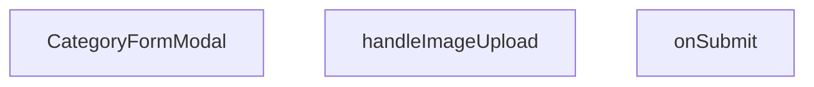

## Genel Bakış
Bu modül, yönetici panelinde kategorilerin eklenmesi ve düzenlenmesi için kullanılan bir form modalı bileşenidir. Kullanıcıdan kategori adı, açıklama ve görsel bilgilerini toplayarak doğrulama işleminden geçirir ve API aracılığıyla sunucuya gönderir. Modal, dışarıdan kontrol edilen açılıp kapanma durumu ve mevcut kategori verisiyle esnek bir yapı sunarak hem yeni ekleme hem de düzenleme senaryolarını destekler.

## Fonksiyon Grupları

### Bileşenin Ana Yapısı
Modal penceresinin tüm görünümünü, form alanlarını, başlık ve buton düzenini oluşturan ana React bileşenidir. Prop'lar aracılığıyla dışarıdan kontrol edilir ve form durumunu yönetir.
- CategoryFormModal

### Form İşlemleri ve Veri Yönetimi
Kullanıcının yüklediği görselleri işleyen ve form verilerini doğruladıktan sonra API isteklerini başlatan iş mantığını içerir. Görsel yükleme ve form gönderimi gibi asenkron işlemleri yürütür.
- handleImageUpload, onSubmit

---

## AXIOMS – Mimari Varsayımlar

Bu modül, kontrolcülü (controlled) bir form modalı bileşeni olup dış bağımlılıklara ve prop yapılandırmasına dayalı mimari varsayımlar içerir.

**[Aksiyom 1]:** Eğer `open` ve `onOpenChange` prop'ları dış bileşen tarafından doğru yönetilmezse, modal açılıp kapanamaz veya tutarsız bir UI durumu oluşur.

**[Aksiyom 2]:** Eğer `categorySchema` geçerli bir Zod (veya eşdeğer) validasyon şeması olarak çağrılamazsa, form değerleri `CategoryFormValues` tipine dönüştürülemez ve `onSubmit` fonksiyonu geçersiz veri ile çağrılır.

**[Aksiyom 3]:** Eğer `category` prop'u `undefined`/`null` olarak geçilirse, modal "yeni kategori oluşturma" modunda çalışır; Eğer geçilirse, mevcut kategori verisi ile "düzenleme" moduna geçer — bu durum form alanlarının önceden doldurulmasını gerektirir.

**[Aksiyom 4]:** Eğer `handleImageUpload` fonksiyonu bir `HTMLInputElement` change event'i dışındaki bir event ile çağrılırsa, `e.target.files` erişimi başarısız olur veya `undefined` döner.

**[Aksiyom 5]:** Eğer `onSuccess` callback'i başarıyla tetiklenmezse (örn. API hatası, promise reddedilmesi), dış bileşen başarılı işlem sonrasını bilemez ve UI güncellenmez.

**[Aksiyom 6]:** Eğer `categorySchema` çağrılabilir (callable) bir referans değilse (örn. modül yükleme hatası), form submission aşamasında runtime hatası oluşur.

---

## FONKSİYON DETAYLARI

### CategoryFormModal
**Ne yapar**: Açık/kapalı durumunu kontrol eden, kategori verisini alıp başarı durumunda bir geri bildirim sağlayan bir React bileşeni oluşturur.  
**Nasıl yapar**: `open`, `onOpenChange`, `category` ve `onSuccess` prop’larını alır; bu prop’lar bileşenin görünürlüğünü, dışarıdan kontrol edilen durum değişikliklerini, düzenlenecek/eklenecek kategori bilgisini ve işlem tamamlandığında tetiklenecek callback’i yönetir. Bileşen, bu prop’ları içeren bir fonksiyonel komponent (`React.FC`) döndürür.  
**Parametreler**:
- `open`: boolean — Modal penceresinin açık olup olmadığını belirler.  
- `onOpenChange`: (open: boolean) => void — Modal’ın açık/kapalı durumundaki değişiklikleri dışarıya bildiren fonksiyon.  
- `category`: Category | undefined — Düzenlenmekte olan kategori nesnesi; yeni bir kategori ekleniyorsa `undefined` olabilir.  
- `onSuccess`: () => void — Form başarıyla gönderildiğinde çalıştırılan geri çağırma fonksiyonu.  
**Dönüş**: `React.FC<CategoryFormModalProps>` — Belirtilen prop tiplerini kullanan bir fonksiyonel React bileşeni.

### handleImageUpload
**Ne yapar**: Kullanıcı bir dosya (görsel) seçtiğinde bu dosyayı işleyerek ilgili form alanına ekler.  
**Nasıl yapar**: `React.ChangeEvent<HTMLInputElement>` tipindeki olay nesnesini alır, seçilen dosyayı (eğer mevcutsa) okur ve gerekli durum güncellemelerini gerçekleştirir.  
**Parametreler**:
- `e`: React.ChangeEvent<HTMLInputElement> — Dosya girişindeki değişiklik olayını temsil eder.  
**Dönüş**: Belirtilmemiş; fonksiyonun dönüş tipi mevcut dokümantasyonda tanımlı değildir.

### onSubmit
**Ne yapar**: Kategori formundan gelen değerleri alır ve bu verileri işleyerek (örneğin API çağrısı) kaydetme işlemini başlatır.  
**Nasıl yapar**: `CategoryFormValues` tipindeki form değerlerini parametre olarak alır, gerekli doğrulama ve iş mantığını uygular, ardından başarılı bir işlem durumunda `onSuccess` callback’ini tetikleyebilir.  
**Parametreler**:
- `values`: CategoryFormValues — Formda toplanan kategori adı, açıklama, görsel vb. alanların değerlerini içeren nesne.  
**Dönüş**: Belirtilmemiş; fonksiyonun dönüş tipi mevcut dokümantasyonda tanımlı değildir.

---

## INTERFACES

### CategoryFormModalProps
- `open: boolean`
- `onOpenChange: (open: boolean) => void`
- `category?: DbCategory | null`
- `onSuccess: () => void`

---

## TYPE ALIASES

### CategoryUpdate
```typescript
type CategoryUpdate = Database['public']['Tables']['categories']['Update']
```

### CategoryInsert
```typescript
type CategoryInsert = Database['public']['Tables']['categories']['Insert']
```

### CategoryFormValues
```typescript
type CategoryFormValues = z.infer<typeof categorySchema>
```

---

## SABİTLER
- **categorySchema** (call) — `z.object({

    name: z.string().min(1, 'Kategori adı zorunludur'),

    slug...`

---

## AST POINTERS

### [N1_NASIL] AST Pointer: src/components/admin/categories/CategoryFormModal.tsx::CategoryFormModal
- **params**: `{ open, onOpenChange, category, onSuccess }`
- **ic_degiskenler**:
  - `fetchParents` — Supabase'den parent_id'si null olan kategorileri çeken async fonksiyon; modal açıldığında parent seçim listesini doldurur
- **Dönüş**: JSX (React bileşeni)

---


## MERMAID CALL GRAPH


## NODE ID STANDARD

  file: src\components\admin\categories\CategoryFormModal.tsx
  function: src\components\admin\categories\CategoryFormModal.tsx::CategoryFormModal
  function: src\components\admin\categories\CategoryFormModal.tsx::handleImageUpload
  function: src\components\admin\categories\CategoryFormModal.tsx::onSubmit

---

## DISA AKTARILANLAR (EXPORTS)
  export: CategoryFormModal

---

## STİL TOKENLERİ

### Arbitrary Değerler (token'a geçirilmemiş)
Yok — tüm stiller token'a geçirilmiş. ✅

### Kullanılan Token'lar (zaten token'a geçirilmiş)
- (yok)

### Tailwind Sınıf Özeti
- **Renkler:** `bg-black/40`, `bg-black/60`, `bg-cyan-500`, `bg-red-500`, `bg-surface-deep`, `bg-white/1`, `bg-white/2`, `bg-white/3`, `bg-white/5`, `border-2`, `border-b`, `border-b-2`, `border-dashed`, `border-t`, `border-transparent`
- **Layout:** `absolute`, `backdrop-blur-2`, `backdrop-blur-sm`, `block`, `custom-scrollbar`, `fixed`, `flex`, `flex-1`, `flex-col`, `gap-2`, `gap-4`, `gap-6`, `gap-8`, `grid`, `grid-cols-2`
- **Varyant/Responsive:** `data-[state=active]:`, `focus-visible:`, `focus:`, `group-hover:`, `hover:`, `placeholder:` önekleri
- **Yardımcı Sınıflar:** `${adminButtonPrimaryClass`, `-translate-x-1/2`, `-translate-y-1/2`, `animate-spin`, `appearance-none`, `border`, `cursor-pointer`, `focus-visible:outline-none`, `focus-visible:ring-cyan-500/50`, `focus-visible:ring-offset-0`, `font-black`, `font-bold`, `font-medium`, `font-mono`, `font-normal`