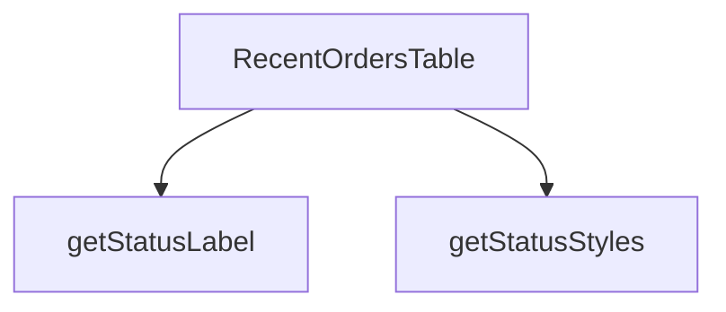

## Genel Bakış
RecentOrdersTable modülü, yönetim panelinde son siparişleri tablo formatında gösteren bir React bileşenidir. Bileşen, bir sipariş listesi ve başlık alarak verileri düzenler ve her bir siparişin durumuna uygun görsel stil ve etiketleri otomatik olarak üretir.

## Fonksiyon Grupları
### Ana Bileşen (Tablo Oluşturucu)
Sipariş dizisini alır, tablo yapısını ve satırlarını oluşturarak arayüze sunan ana React bileşenidir.
- RecentOrdersTable

### Durum Görselleştirme Yardımcıları
Sipariş durum metnine göre tablodaki ilgili hücre için uygun CSS stilsını ve okunabilir etiket metnini döndürerek tutarlı bir görünüm sağlar.
- getStatusStyles, getStatusLabel

---

## AXIOMS – Mimari Varsayımlar

RecentOrdersTable modülü, sipariş listesini tablo formatında gösteren bir React bileşeni olup durum görselleştirme yardımcı fonksiyonları kullanır. Bu modülün doğru çalışması için aşağıdaki varsayımlar geçerlidir:

---

## FONKSİYON DETAYLARI

### RecentOrdersTable
**Ne yapar**: Son siparişleri gösteren bir tablo bileşenidir. Verilen sipariş listesini, istenen başlıkla birlikte düzenli bir arayüzde sunar.
**Nasıl yapar**: `orders` prop'undan gelen diziye haritalama yaparak her sipariş için bir tablo satırı (`tr`) oluşturur. Her satırda siparişin kimliği, tarih, toplam tutar, müşteri adı ve durumu gibi bilgileri gösterir. Durum gösterimi için `getStatusStyles` ve `getStatusLabel` yardımcı fonksiyonlarını kullanarak duruma özel stil ve etiketler uygular.
**Parametreler**:
- orders: `Order[]` — Görüntülenecek sipariş nesneleri dizisi. Her nesne sipariş detaylarını içerir.
- title: `string` — Tablonun üzerinde gösterilecek başlık metni.
**Dönüş**: `React.FC<RecentOrdersTableProps>` — JSX ile oluşturulmuş, `<table>` elementi içeren React bileşeni.

### getStatusStyles
**Ne yapar**: Bir sipariş durumuna karşılık gelen CSS stil sınıfı nesnesini döndürür.
**Nasıl yapar**: `status` parametresiyle gelen durum dizesine göre (ör. "pending", "processing", "shipped", "delivered", "cancelled") önceden tanımlanmış stil sınıflarını içeren bir nesneyi döndürür. Bu nesne, ilgili durum göstergesine (badge) uygulanarak arka plan rengi, metin rengi gibi görsel özellikleri belirler.
**Parametreler**:
- status: `string` — Stillendirilecek sipariş durumunu belirten dize (ör. "pending", "shipped").
**Dönüş**: `object` — `{ className: string }` formatında, belirli CSS sınıflarını içeren nesne. Örneğin, `pending` durumu için `{ className: 'bg-yellow-100 text-yellow-800' }` gibi.

### getStatusLabel
**Ne yapar**: Bir sipariş durumu kodunu, kullanıcıya gösterilecek okunabilir etikete dönüştürür.
**Nasıl yapar**: `s` parametresiyle gelen durum dizesini (ör. "processing") alır ve bunu önceden tanımlanmış bir eşleme (mapping) kullanarak daha anlaşılır bir metne (ör. "İşleniyor") dönüştürür. Bu sayede arka uçtaki teknik durum kodları, arayüzde kullanıcı dostu biçimde sunulur.
**Parametreler**:
- s: `string` — Çevrilecek sipariş durum kodu.
**Dönüş**: `string` — Görüntülenecek insan tarafından okunabilir etiket metni. Durum eşleşmesi bulunamazsa, büyük harflerle düzenlenmiş ham durum dizesini döndürür.

---

## INTERFACES

### OrderData
- `id: string`
- `created_at: string`
- `total_amount: number`
- `status: string`
- `order_number?: string | null`

### RecentOrdersTableProps
- `orders: OrderData[]`
- `title: string`

---

## AST POINTERS

### [N1_NASIL] AST Pointer: components/admin/dashboard/RecentOrdersTable.tsx::RecentOrdersTable
- **params**: `{ orders, title }`
- **ic_degiskenler**:
  - `lang` — useI18n() hook'undan gelen dil bilgisi, formatDateTime ve formatCurrency fonksiyonlarına parametre olarak gönderilir
  - `dragScrollRef` — useDragScroll<HTMLDivElement>() hook'undan dönen ref nesnesi, sürükleme ile yatay kaydırma için tablo container'ına bağlanır
  - `getStatusStyles` — inner function, status parametresine göre Tailwind CSS stil sınıfı döndürür
  - `getStatusLabel` — inner function, status parametresine göre Türkçe durum etiketi döndürür
- **JSX İçi Erişimler**:
  - `title` — bileşen başlığı olarak <h3> içinde render edilir
  - `orders` — sipariş dizisi, length kontrolü ve map iterasyonu için kullanılır
  - `r.id` — her siparişin benzersiz kimliği, key prop'u ve link href'inde kullanılır
  - `r.order_number` — sipariş numarası, order_number yoksa fallback olarak id kullanılır, son 8 karakter truncate edilir
  - `r.created_at` — sipariş oluşturma tarihi, formatDateTime fonksiyonuna gönderilir
  - `r.total_amount` — sipariş tutarı, formatCurrency fonksiyonuna gönderilir
  - `r.status` — sipariş durumu, getStatusStyles ve getStatusLabel fonksiyonlarına gönderilir
  - `index` — map iterasyonu indeksi, animasyon gecikmesi için (index * 50) ms hesaplanır
- **Dönüş**: JSX (React.ReactNode) — sipariş tablosu layout'u

### [N2_NASIL] AST Pointer: components/admin/dashboard/RecentOrdersTable.tsx::getStatusStyles
- **params**: `(status: string)`
- **ic_degiskenler**: yok
- **Dönüş**: string — duruma göre Tailwind CSS stil sınıfı (örn: 'bg-emerald-500/10 text-emerald-400 ring-emerald-500/30' için 'completed')

### [N3_NASIL] AST Pointer: components/admin/dashboard/RecentOrdersTable.tsx::getStatusLabel
- **params**: `(s: string)`
- **ic_degiskenler**: yok
- **Dönüş**: string — duruma göre Türkçe etiket (örn: 'completed' → 'Tamamlandı', 'pending' → 'Teklif/Bekleniyor')

### [N4_NASIL] AST Pointer: components/admin/dashboard/RecentOrdersTable.tsx::orders.map callback
- **params**: `(r, index)` — r: sipariş nesnesi, index: dizi indeksi
- **ic_degiskenler**: yok
- **Kullanılan erişimler**:
  - `r.id` — key prop'u ve detay link href'i için kullanılır
  - `r.order_number` — sipariş numarası gösterimi (|| ile fallback olarak r.id kullanılır)
  - `r.created_at` — formatDateTime(r.created_at, lang) çağrısında tarih formatlaması için kullanılır
  - `r.total_amount` — formatCurrency(r.total_amount, lang) çağrısında para birimi formatlaması için kullanılır
  - `r.status` — getStatusStyles(r.status) ve getStatusLabel(r.status) çağrılarında kullanılır
  - `index` — animationDelay hesaplaması için kullanılır: `${index * 50}ms`
  - `lang` — parent scope'dan闭包 ile erişilen dil bilgisi, formatDateTime ve formatCurrency'e gönderilir
- **Dönüş**: JSX (<tr> elementi) — tek bir sipariş tablosu satırı

---

## MERMAID CALL GRAPH

## NODE ID STANDARD

  file: src\components\admin\dashboard\RecentOrdersTable.tsx
  function: src\components\admin\dashboard\RecentOrdersTable.tsx::RecentOrdersTable
  function: src\components\admin\dashboard\RecentOrdersTable.tsx::getStatusStyles
  function: src\components\admin\dashboard\RecentOrdersTable.tsx::getStatusLabel

---

## DISA AKTARILANLAR (EXPORTS)
  export: RecentOrdersTable

---

## STİL TOKENLERİ

### Arbitrary Değerler (token'a geçirilmemiş)
Yok — tüm stiller token'a geçirilmiş. ✅

### Kullanılan Token'lar (zaten token'a geçirilmiş)
- `rounded-hvac-2xl`, `tracking-hvac-normal`, `tracking-hvac-relaxed`

### Tailwind Sınıf Özeti
- **Renkler:** `bg-current`, `bg-cyan-500`, `bg-cyan-500/0`, `bg-cyan-500/5`, `bg-white/2`, `bg-white/5`, `border-collapse`, `border-white/5`, `group-hover/row:bg-cyan-500`, `group-hover/row:bg-white/10`, `group-hover/row:text-white`, `group-hover/table:text-cyan-400`, `hover:bg-cyan-500`, `hover:bg-white/3`, `hover:text-surface-deep`
- **Layout:** `-right-24`, `-top-24`, `absolute`, `backdrop-blur-md`, `custom-scrollbar`, `flex`, `flex-col`, `gap-2`, `gap-3`, `h-0.5`, `h-1.5`, `h-48`, `h-6`, `h-full`, `inline-flex`
- **Varyant/Responsive:** `active:`, `first:`, `group-hover/btn:`, `group-hover/link:`, `group-hover/row:`, `group-hover/table:`, `hover:`, `last:` önekleri
- **Yardımcı Sınıflar:** `${adminTableCellClass`, `${adminTableContainerClass`, `${adminTableHeadCellClass`, `${getStatusStyles(r.status`, `-ml-8`, `active:scale-95`, `animate-in`, `animate-pulse`, `blur-100`, `border`, `divide-white/5`, `divide-y`, `duration-300`, `duration-500`, `fade-in`