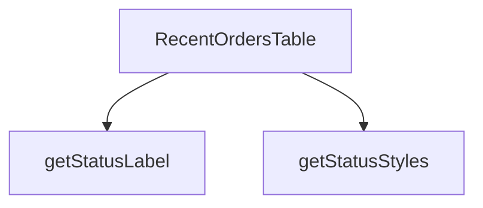

## Genel Bakış
RecentOrdersTable modülü, yönetim panelindeki son siparişleri tablo halinde görüntüleyen bir React bileşeni sağlar. Bileşen, sipariş verisini alır, her siparişin durumuna göre stil ve etiket oluşturmak için yardımcı fonksiyonları kullanır ve başlık ile birlikte tabloyu render eder.

## Fonksiyon Grupları
### UI Bileşeni
Sipariş verisini alarak tabloyu oluşturan ve kullanıcı arayüzüne sunan ana bileşendir.
- RecentOrdersTable

### Yardımcı Stil ve Etiket Üreticileri
Sipariş durumuna göre uygun CSS sınıflarını ve okunabilir etiket metinlerini döndürerek tablonun görsel tutarlılığını sağlar.
- getStatusStyles, getStatusLabel

---

## AXIOMS – Mimari Varsayımlar
Bu modül için özel aksiyom tanımlanmamıştır.

[Aksiyom 1]: Eğer `orders` parametresi `RecentOrdersTable` fonksiyonuna geçilmezse, fonksiyon çalıştırıldığında hata oluşur.  
[Aksiyom 2]: Eğer `orders` dizisindeki herhangi bir öğe `status` özelliğine sahip değilse, `getStatusStyles` ve `getStatusLabel` fonksiyonları beklenmeyen sonuçlar üretir.  
[Aksiyom 3]: Eğer `status` değeri `getStatusStyles` fonksiyonuna geçilmezse, fonksiyonun döndürdüğü stil nesnesi geçersiz olur.  
[Aksiyom 4]: Eğer `s` değeri `getStatusLabel` fonksiyonuna geçilmezse, fonksiyonun döndürdüğü etiket geçersiz olur.  
[Aksiyom 5]: Eğer `title` parametresi `RecentOrdersTable` fonksiyonuna geçilmezse, tablo başlığı görüntülenmez.

---

## FONKSİYON DETAYLARI

---

## INTERFACES

### OrderData
- `id: string`
- `created_at: string`
- `total_amount: number`
- `status: string`
- `order_number?: string | null`

### RecentOrdersTableProps
- `orders: OrderData[]`
- `title: string`

---

## AST POINTERS

### [N1_NASIL] AST Pointer: `src/components/admin/dashboard/RecentOrdersTable.tsx`::RecentOrdersTable

- **params**:  
  - `orders` — dizi; tabloda listelenecek sipariş/teklif kayıtları.  
  - `title` — string; tablo başlığı (sayfa başlığında gösterilir).  

- **ic_degiskenler**:  
  - `lang` — `useI18n()` hook’u ile alınan aktif dil kodu; `formatDateTime` ve `formatCurrency` fonksiyonlarında yerel ayar olarak kullanılır.  
  - `dragScrollRef` — `useDragScroll<HTMLDivElement>()` ile oluşturulmuş ref; tablo sarmalayıcısı `
`’a bağlanarak yatay kaydırmayı sürükleme desteği sağlar.  
  - `getStatusStyles` — bileşen içinde tanımlı yardımcı fonksiyon; sipariş durumuna göre renk/Tailwind sınıflarını döndürür.  
  - `getStatusLabel` — bileşen içinde tanımlı yardımcı fonksiyon; sipariş durumu string’ini Türkçe etikete çevirir.  
  - `adminTableContainerClass` — dışarıdan import edilen CSS sınıf sabiti; tablo kabının (`div`) dış stilleri.  
  - `adminTableHeadCellClass` — dışarıdan import edilen CSS sınıf sabiti; başlık hücrelerinin (`<th>`) stilleri.  
  - `adminTableCellClass` — dışarıdan import edilen CSS sınıf sabiti; veri hücrelerinin (`<td>`) stilleri.  
  - `formatDateTime` — dışarıdan import edilen fonksiyon; tarih/saat formatlaması (lang ile).  
  - `formatCurrency` — dışarıdan import edilen fonksiyon; para birimi formatlaması (lang ile).  
  - `Routes` — dışarıdan import edilen route yapılandırması; “Tümünü Gör” linki için `Routes.admin.orders()` kullanılır.  
  - `Link` — `next/link` bileşeni; “Tümünü Gör” butonu ve satır detay linki için kullanılır.  
  - `ChevronRight` — `lucide-react` ikonu; “Tümünü Gör” butonunda ok simgesi.  
  - `PackageSearch` — `lucide-react` ikonu; boş tablo durumu (`AdminEmptyState`) için icon prop’u.  
  - `ExternalLink` — `lucide-react` ikonu; satır detay linkinde dışa açılma simgesi.  
  - `AdminEmptyState` — dışarıdan import edilen bileşen; `orders.length === 0` olduğunda gösterilen boş durum arayüzü.  
  - `index` — `orders.map()` callback’inin ikinci parametresi; her satıra gecikmeli animasyon (`animationDelay`) hesaplamak için kullanılır. (Dikkat: bu değişken map callback’i tanımlandığı yerde yakalanır, bileşen gövdesinde doğrudan referans yoktur, fakat JSX içinde `style` bağlamında kullanıldığı için erişilir).  

- **Dönüş**: `React.JSX.Element` – ana sayfa bileşeninin döndürdüğü JSX ağacı.

---

## MERMAID CALL GRAPH

## NODE ID STANDARD

  file: src\components\admin\dashboard\RecentOrdersTable.tsx
  function: src\components\admin\dashboard\RecentOrdersTable.tsx::RecentOrdersTable
  function: src\components\admin\dashboard\RecentOrdersTable.tsx::getStatusStyles
  function: src\components\admin\dashboard\RecentOrdersTable.tsx::getStatusLabel

---

## DISA AKTARILANLAR (EXPORTS)
  export: RecentOrdersTable

---

## STİL TOKENLERİ

### Arbitrary Değerler (token'a geçirilmemiş)
Yok — tüm stiller token'a geçirilmiş. ✅

### Kullanılan Token'lar (zaten token'a geçirilmiş)
- `rounded-hvac-2xl`, `tracking-hvac-normal`, `tracking-hvac-relaxed`

### Tailwind Sınıf Özeti
- **Renkler:** `bg-current`, `bg-cyan-500`, `bg-cyan-500/0`, `bg-cyan-500/5`, `bg-white/2`, `bg-white/5`, `border-collapse`, `border-white/5`, `group-hover/row:bg-cyan-500`, `group-hover/row:bg-white/10`, `group-hover/row:text-white`, `group-hover/table:text-cyan-400`, `hover:bg-cyan-500`, `hover:bg-white/3`, `hover:text-surface-deep`
- **Layout:** `-right-24`, `-top-24`, `absolute`, `backdrop-blur-md`, `custom-scrollbar`, `flex`, `flex-col`, `gap-2`, `gap-3`, `h-0.5`, `h-1.5`, `h-48`, `h-6`, `h-full`, `inline-flex`
- **Varyant/Responsive:** `active:`, `first:`, `group-hover/btn:`, `group-hover/link:`, `group-hover/row:`, `group-hover/table:`, `hover:`, `last:` önekleri
- **Yardımcı Sınıflar:** `${adminTableCellClass`, `${adminTableContainerClass`, `${adminTableHeadCellClass`, `${getStatusStyles(r.status`, `-ml-8`, `active:scale-95`, `animate-in`, `animate-pulse`, `blur-100`, `border`, `divide-white/5`, `divide-y`, `duration-300`, `duration-500`, `fade-in`