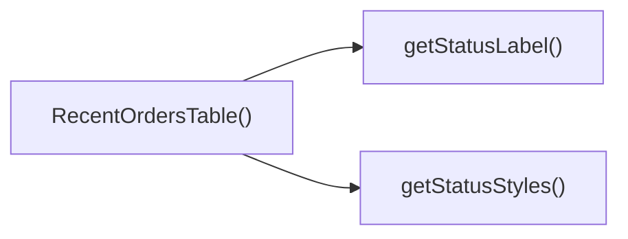

## Genel Bakış
RecentOrdersTable modülü, yönetim panelindeki son siparişleri tablo halinde görüntüleyen bir React bileşeni sağlar. Bileşen, sipariş verisini alır, her siparişin durumuna göre stil ve etiket oluşturmak için yardımcı fonksiyonları kullanır ve başlık ile birlikte tabloyu render eder.

## Fonksiyon Grupları
### UI Bileşeni
Sipariş verisini alarak tabloyu oluşturan ve kullanıcı arayüzüne sunan ana bileşendir.
- RecentOrdersTable

### Yardımcı Stil ve Etiket Üreticileri
Sipariş durumuna göre uygun CSS sınıflarını ve okunabilir etiket metinlerini döndürerek tablonun görsel tutarlılığını sağlar.
- getStatusStyles, getStatusLabel

---

## AXIOMS – Mimari Varsayımlar
Bu modül için özel aksiyom tanımlanmamıştır.

[Aksiyom 1]: Eğer `orders` parametresi `RecentOrdersTable` fonksiyonuna geçilmezse, fonksiyon çalıştırıldığında hata oluşur.  
[Aksiyom 2]: Eğer `orders` dizisindeki herhangi bir öğe `status` özelliğine sahip değilse, `getStatusStyles` ve `getStatusLabel` fonksiyonları beklenmeyen sonuçlar üretir.  
[Aksiyom 3]: Eğer `status` değeri `getStatusStyles` fonksiyonuna geçilmezse, fonksiyonun döndürdüğü stil nesnesi geçersiz olur.  
[Aksiyom 4]: Eğer `s` değeri `getStatusLabel` fonksiyonuna geçilmezse, fonksiyonun döndürdüğü etiket geçersiz olur.  
[Aksiyom 5]: Eğer `title` parametresi `RecentOrdersTable` fonksiyonuna geçilmezse, tablo başlığı görüntülenmez.

---

---

## FONKSİYON DETAYLARI

### RecentOrdersTable
**Ne yapar**: Bir React bileşeni olarak, son siparişlerin listelendiği bir tabloyu görüntüler. Bileşen, müşteri bilgisi, sipariş kalemleri, toplam tutar ve durum gibi alanları içeren bir tablo oluşturur.
**Nasıl yapar**: Bileşen, `orders` dizisindeki her bir sipariş için bir tablo satırı render eder. Her satırda sipariş numarası, müşteri adı, ürünler, toplam ve durum bilgisi yer alır. Durum bilgisi, `getStatusStyles` ve `getStatusLabel` yardımcı fonksiyonları kullanılarak biçimlendirilir.
**Parametreler**:
- `orders: Array` — Görüntülenecek sipariş listesi. Her bir eleman sipariş detaylarını içerir.
- `title: string` — Tablonun başlık metni.
**Dönüş**: `React.FC<RecentOrdersTableProps>` — Siparişleri listeleyen bir React fonksiyonel bileşeni döndürür.

### getStatusStyles
**Ne yapar**: Bir sipariş durumu için CSS stillerini veya sınıf adlarını döndürür. Durum koduna göre tablodaki durum hücresine uygulanacak biçimlendirmeyi belirler.
**Nasıl yapar**: `status` parametresini bir dizi durum değeriyle karşılaştırır (örneğin: `'completed'`, `'pending'`, `'cancelled'`). Eşleşen duruma göre ilgili CSS sınıfını veya stil nesnesini döndürür.
**Parametreler**:
- `status: string` — Sipariş durumunu temsil eden metin (örneğin `'completed'`, `'pending'`).
**Dönüş**: Verilen bilgide dönüş tipi belirtilmemiştir. Genellikle bir CSS sınıf adı (`string`) veya bir stil nesnesi (`object`) döndürür.

### getStatusLabel
**Ne yapar**: Bir sipariş durumu kodu için okunabilir bir etiket (label) metni döndürür. Durum kodunu kullanıcı arayüzünde gösterilecek daha anlaşılır bir ifadeye dönüştürür.
**Nasıl yapar**: `s` parametresini bir dizi durum koduyla karşılaştırır. Örneğin `'completed'` durumu için `'Tamamlandı'`, `'pending'` için `'Beklemede'` gibi karşılık gelen metni döndürür.
**Parametreler**:
- `s: string` — Durum kodu (örneğin `'completed'`, `'pending'`).
**Dönüş**: Verilen bilgide dönüş tipi belirtilmemiştir. Genellikle bir metin (`string`) döndürür.

---

## INTERFACES

### OrderData
- `id: string`
- `created_at: string`
- `total_amount: number`
- `status: string`
- `order_number?: string | null`

### RecentOrdersTableProps
- `orders: OrderData[]`
- `title: string`

---

## AST POINTERS

### [N1_NASIL] AST Pointer: `src/components/admin/dashboard/RecentOrdersTable.tsx`::RecentOrdersTable

- **params**:  
  - `orders` — dizi; tabloda listelenecek sipariş/teklif kayıtları.  
  - `title` — string; tablo başlığı (sayfa başlığında gösterilir).  

- **ic_degiskenler**:  
  - `lang` — `useI18n()` hook’u ile alınan aktif dil kodu; `formatDateTime` ve `formatCurrency` fonksiyonlarında yerel ayar olarak kullanılır.  
  - `dragScrollRef` — `useDragScroll<HTMLDivElement>()` ile oluşturulmuş ref; tablo sarmalayıcısı `
`’a bağlanarak yatay kaydırmayı sürükleme desteği sağlar.  
  - `getStatusStyles` — bileşen içinde tanımlı yardımcı fonksiyon; sipariş durumuna göre renk/Tailwind sınıflarını döndürür.  
  - `getStatusLabel` — bileşen içinde tanımlı yardımcı fonksiyon; sipariş durumu string’ini Türkçe etikete çevirir.  
  - `adminTableContainerClass` — dışarıdan import edilen CSS sınıf sabiti; tablo kabının (`div`) dış stilleri.  
  - `adminTableHeadCellClass` — dışarıdan import edilen CSS sınıf sabiti; başlık hücrelerinin (`<th>`) stilleri.  
  - `adminTableCellClass` — dışarıdan import edilen CSS sınıf sabiti; veri hücrelerinin (`<td>`) stilleri.  
  - `formatDateTime` — dışarıdan import edilen fonksiyon; tarih/saat formatlaması (lang ile).  
  - `formatCurrency` — dışarıdan import edilen fonksiyon; para birimi formatlaması (lang ile).  
  - `Routes` — dışarıdan import edilen route yapılandırması; “Tümünü Gör” linki için `Routes.admin.orders()` kullanılır.  
  - `Link` — `next/link` bileşeni; “Tümünü Gör” butonu ve satır detay linki için kullanılır.  
  - `ChevronRight` — `lucide-react` ikonu; “Tümünü Gör” butonunda ok simgesi.  
  - `PackageSearch` — `lucide-react` ikonu; boş tablo durumu (`AdminEmptyState`) için icon prop’u.  
  - `ExternalLink` — `lucide-react` ikonu; satır detay linkinde dışa açılma simgesi.  
  - `AdminEmptyState` — dışarıdan import edilen bileşen; `orders.length === 0` olduğunda gösterilen boş durum arayüzü.  
  - `index` — `orders.map()` callback’inin ikinci parametresi; her satıra gecikmeli animasyon (`animationDelay`) hesaplamak için kullanılır. (Dikkat: bu değişken map callback’i tanımlandığı yerde yakalanır, bileşen gövdesinde doğrudan referans yoktur, fakat JSX içinde `style` bağlamında kullanıldığı için erişilir).  

- **Dönüş**: `React.JSX.Element` – ana sayfa bileşeninin döndürdüğü JSX ağacı.

---

### [N2_NASIL] AST Pointer: `src/components/admin/dashboard/RecentOrdersTable.tsx`::getStatusStyles

- **params**:  
  - `status` — string; sipariş durumu (‘completed’, ‘pending’, ‘processing’, ‘cancelled’ veya diğer).  

- **ic_degiskenler**: (yok)  

- **Dönüş**: `string` – duruma uygun Tailwind CSS sınıfı (renk, arka plan, halka stilleri).

---

### [N3_NASIL] AST Pointer: `src/components/admin/dashboard/RecentOrdersTable.tsx`::getStatusLabel

- **params**:  
  - `s` — string; sipariş durumu (‘completed’, ‘pending’, ‘processing’, ‘cancelled’ veya diğer).  

- **ic_degiskenler**: (yok)  

- **Dönüş**: `string` – durumun Türkçe etiketi (bilinmiyorsa `s` aynen döner).

---

### [N4_NASIL] AST Pointer: `src/components/admin/dashboard/RecentOrdersTable.tsx`::(orders.map callback)

- **params**:  
  - `r` — sipariş/teklif nesnesi; `id`, `order_number`, `created_at`, `total_amount`, `status` alanlarına erişilir.  
  - `index` — number; listede sıra, animasyon gecikmesi hesaplamada kullanılır.  

- **ic_degiskenler**:  
  - `r.id` — `r`’nin benzersiz kimliği; detay linki (`/admin/orders/${r.id}`) oluşturmak ve geri kalan karakterlerle (order_number yoksa) sipariş numarasını türetmek için kullanılır.  
  - `r.order_number` — siparişin kullanıcıya gösterilen numarası; varsa, `r.id` yerine tercih edilir ve son 8 karaktere kısaltılır.  
  - `r.created_at` — sipariş oluşturma zamanı; `formatDateTime(r.created_at, lang)` ile formatlanır.  
  - `r.total_amount` — sipariş toplam tutarı; `formatCurrency(r.total_amount, lang)` ile formatlanır.  
  - `r.status` — sipariş durumu; `getStatusStyles(r.status)` ve `getStatusLabel(r.status)` ile görsel etiket üretilir.  
  - `lang` — bileşenden yakalanan dil kodu; tarih ve para formatlamada kullanılır.  
  - `formatDateTime` — import edilmiş tarih/saat formatlayıcı.  
  - `formatCurrency` — import edilmiş para birimi formatlayıcı.  
  - `getStatusStyles` — bileşenden yakalanan yardımcı; durum CSS sınıflarını döndürür.  
  - `getStatusLabel` — bileşenden yakalanan yardımcı; durum Türkçe etiketini döndürür.  
  - `adminTableCellClass` — import edilmiş CSS sınıf sabiti; tüm veri hücrelerinin (`<td>`) stilleri.  
  - `Link` — `next/link` bileşeni; detay sayfasına giden köprü.  
  - `ExternalLink` — `lucide-react` ikonu; detay linkindeki dışa açılma simgesi.  

- **Dönüş**: `React.JSX.Element` – her sipariş satırı için `<tr>` öğesi.

---

## ÇAĞRI HARİTASI

### Disariya Cagrilar (Outgoing)
RecentOrdersTable() fonksiyonu, getStatusStyles ve getStatusLabel fonksiyonlarını çağırıyor.

### Disaridan Cagrilanlar (Incoming)
Verilen veride bu modülü kullanan dış dosya ya da fonksiyon belirtilmemiş.

### Ic Ice Fonksiyonlar (Nested)
Yok.

---

## DOSYA-İÇİ ÇAĞRI GRAFİĞİ
  RecentOrdersTable() → getStatusLabel()
  RecentOrdersTable() → getStatusStyles()

---

## NODE ID STANDARD

  file: src\components\admin\dashboard\RecentOrdersTable.tsx
  function: src\components\admin\dashboard\RecentOrdersTable.tsx::RecentOrdersTable
  function: src\components\admin\dashboard\RecentOrdersTable.tsx::getStatusStyles
  function: src\components\admin\dashboard\RecentOrdersTable.tsx::getStatusLabel

---

## DISA AKTARILANLAR (EXPORTS)
  export: RecentOrdersTable