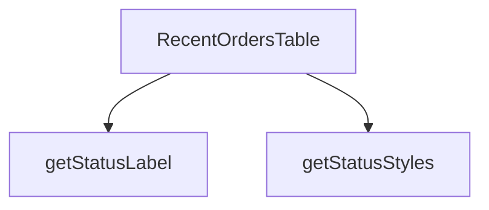

## Genel Bakış
Bu modül, admin dashboard'unda son siparişleri listeleyen bir React bileşeni ve bu bileşenin kullandığı yardımcı fonksiyonları içerir. Modülün temel amacı, sipariş verilerini tablo formatında görüntülemek ve her siparişin durumunu kullanıcıya anlaşılır bir etiket ve stil ile sunmaktır.

## Fonksiyon Grupları
### Ana Bileşen
Bu grup, modülün ana kullanıcı arayüzü bileşenini ve onun temel yapılandırmasını sağlar. Bileşen, dışarıdan gelen sipariş verilerini ve bir başlığı alarak bir tablo oluşturur.
- RecentOrdersTable

### Durum Biçimlendirme Yardımcıları
Bu grup, sipariş durumu bilgisini kullanıcı arayüzünde göstermek için gerekli stil ve metin dönüşümlerini gerçekleştirir. Ana bileşen, bu fonksiyonları kullanarak durum bilgisini biçimlendirir.
- getStatusStyles, getStatusLabel

---

## AXIOMS – Mimari Varsayımlar

Bu modül için özel aksiyom tanımlanmamıştır.

**Neden:** Fonksiyon gövdeleri sağlanmadığından, yalnızca imzalardan aksiyom üretilemez. İmzalardan (`orders`, `title`, `status`, `s` parametreleri) çıkarım yapmak, değişken isimlerinden bilgi çıkarmak anlamına gelir ve bu kurallar gereği yasaktır.

---

## FONKSİYON DETAYLARI

### RecentOrdersTable
**Ne yapar**: Son siparişlerin görüntülendiği bir React bileşenidir. Sipariş listesini ve bir başlık bilgisini alarak kullanıcı arayüzünde bir tablo oluşturur.
**Nasıl yapar**: Kaynak dosya adı `RecentOrdersTable.tsx` olup `admin/dashboard` klasöründe yer alır. Bileşen, aldığı `orders` verisini tablo formatında render eder. Bileşen içinde `getStatusStyles` ve `getStatusLabel` yardımcı fonksiyonlarını kullanarak sipariş durumlarına göre görsel stiller ve etiketler belirler. Fonksiyon `React.FC<RecentOrdersTableProps>` tipinde bir bileşen döndürür.
**Parametreler**:
- orders: bilinmiyor — Sipariş verilerini içeren koleksiyon. Tip bilgisi `RecentOrdersTableProps` tanımında belirtilmiştir ancak kaynakta detay verilmemiştir.
- title: bilinmiyor — Bileşenin görüntüleyeceği tablo başlığı. Tip bilgisi `RecentOrdersTableProps` tanımında belirtilmiştir ancak kaynakta detay verilmemiştir.
**Dönüş**: `React.FC<RecentOrdersTableProps>` — `RecentOrdersTableProps` arayüzüne uygun props alan bir React fonksiyonel bileşeni döndürür.

### getStatusStyles
**Ne yapar**: Geliştirildi ancak detay üretilemedi.

### getStatusLabel
**Ne yapar**: Geliştirildi ancak detay üretilemedi.

---

## İTHALATLAR (IMPORTS)
- import: ../../../hooks/useDragScroll::useDragScroll
- import: ../../../i18n/I18nProvider::useI18n
- import: ../../../i18n/currency::SYSTEM_CURRENCY
- import: ../../../i18n/datetime::formatDateTime
- import: ../../../i18n/format::formatCurrency
- import: ../../../lib/admin/orderStatusLabels::orderStatusLabel
- import: ../../../utils/routes::Routes
- import: ../AdminEmptyState::AdminEmptyState
- import: lucide-react::ChevronRight
- import: lucide-react::ExternalLink
- import: lucide-react::PackageSearch
- import: next/link::Link
- import: react::React

---

## INTERFACES

### OrderData
- `id: string`
- `created_at: string`
- `total_amount: number`
- `status: string`
- `order_number?: string | null`

### RecentOrdersTableProps
- `orders: OrderData[]`
- `title: string`

---

## AST POINTERS

### [N1_NASIL] AST Pointer: RecentOrdersTable.tsx::RecentOrdersTable
- **params**: `orders`, `title`
- **ic_degiskenler**:
  - `lang` — `useI18n()` hook'undan destructure edilen dil kodu; `formatDateTime` ve `formatCurrency` çağrılarına ikinci argüman olarak geçilir
  - `t` — `useI18n()` hook'undan destructure edilen çeviri fonksiyonu; tablo başlıklarını, boş durum metinlerini ve buton etiketlerini yerelleştirmek için kullanılır
  - `dragScrollRef` — `useDragScroll<HTMLDivElement>()` hook'undan dönen ref; tablo kapsayıcısının `ref` prop'una atanarak yatay sürükleme-kaydırma davranışı sağlar
  - `getStatusStyles` — sipariş durum string'ine göre Tailwind CSS sınıf dizesi döndüren iç fonksiyon (ayrı bkz. N2_NASIL)
  - `getStatusLabel` — `orderStatusLabel` fonksiyonunu `t` ile birlikte sararak durum etiketi döndüren iç fonksiyon
  - `orderNo` — her satır için `r.order_number` yoksa `r.id` değerinin son 8 karakteri alınıp büyük harfe çevrilerek önüne `#` eklenerek oluşturulan sipariş numarası dizesi (map callback'i içinde tanımlı)
  - `r` — `orders` dizisinin her bir elemanı; `r.id`, `r.order_number`, `r.created_at`, `r.total_amount`, `r.status` alanlarına erişilir
  - `index` — `orders.map` callback'indeki dizi indeksi; animasyon gecikmesini hesaplamak için `index * 50` ms olarak kullanılır
- **Dönüş**: JSX (sipariş tablosu içeren `div` ağacı)

### [N2_NASIL] AST Pointer: RecentOrdersTable.tsx::getStatusStyles
- **params**: `status`
- **ic_degiskenler**: yok (yalnızca switch-case dalları)
- **Dönüş**: string — duruma karşılık gelen Tailwind CSS sınıf dizesi; `'paid'` ve `'delivered'` → success, `'pending'`/`'shipped'`/`'refunded'`/`'partial_refunded'` → warning, `'confirmed'`/`'processing'` → accent, `'cancelled'` → danger, diğer tüm değerler → varsayılan yüzey rengi

### [N3_NASIL] AST Pointer: RecentOrdersTable.tsx::getStatusLabel
- **params**: `s`
- **ic_degiskenler**: yok
- **Dönüş**: `orderStatusLabel(s, t)` çağrısının dönüşü — insan tarafından okunabilir durum etiketi (çevrilmiş string)

### [N4_NASIL] AST Pointer: RecentOrdersTable.tsx::orders.map callback
- **params**: `r`, `index`
- **ic_degiskenler**:
  - `orderNo` — `r.order_number` varsa onu, yoksa `r.id`yi alıp `.toString().slice(-8).toUpperCase()` ile son 8 haneyi büyük harfe çevirip başına `#` ekleyerek oluşturulan sipariş numarası dizesi
- **Dönüş**: JSX (`<tr>` satır elementi; sipariş numarası, tarih, tutar, durum etiketi ve detay bağlantısı sütunlarını içerir)

---

## MERMAID CALL GRAPH

## NODE ID STANDARD

  file: src\components\admin\dashboard\RecentOrdersTable.tsx
  function: src\components\admin\dashboard\RecentOrdersTable.tsx::RecentOrdersTable
  function: src\components\admin\dashboard\RecentOrdersTable.tsx::getStatusStyles
  function: src\components\admin\dashboard\RecentOrdersTable.tsx::getStatusLabel

---

## DISA AKTARILANLAR (EXPORTS)
  export: RecentOrdersTable

---

## STİL TOKENLERİ

### Arbitrary Değerler (token'a geçirilmemiş)
Yok — tüm stiller token'a geçirilmiş. ✅

### Kullanılan Token'lar (zaten token'a geçirilmiş)
- (yok)

### Tailwind Sınıf Özeti
- **Renkler:** `bg-admin-accent`, `bg-admin-accent-weak`, `bg-admin-surface`, `bg-admin-surface-2`, `bg-current`, `border-admin-border`, `border-collapse`, `group-hover/row:bg-admin-accent`, `group-hover/row:bg-admin-surface-3`, `group-hover/row:text-admin-fg`, `group-hover/table:text-admin-accent`, `hover:bg-admin-accent`, `hover:bg-admin-surface-2`, `hover:text-admin-accent-fg`, `text-admin-accent`
- **Layout:** `-right-24`, `-top-24`, `absolute`, `custom-scrollbar`, `flex`, `flex-col`, `gap-2`, `gap-3`, `h-0.5`, `h-1.5`, `h-48`, `h-6`, `h-full`, `inline-flex`, `items-center`
- **Varyant/Responsive:** `active:`, `first:`, `group-hover/btn:`, `group-hover/link:`, `group-hover/row:`, `group-hover/table:`, `hover:`, `last:` önekleri
- **Yardımcı Sınıflar:** `${adminTableCellClass`, `${adminTableContainerClass`, `${adminTableHeadCellClass`, `${getStatusStyles(r.status`, `-ml-8`, `active:scale-95`, `animate-in`, `animate-pulse`, `blur-100`, `border`, `divide-admin-border`, `divide-y`, `duration-300`, `duration-500`, `fade-in`