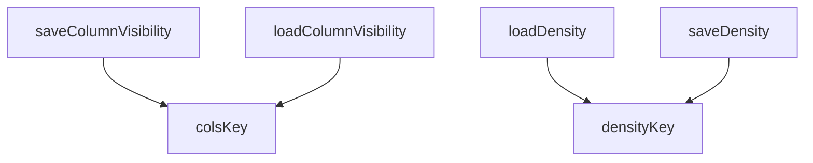

## Genel Bakış
Bu modül, veri tablosu bileşeninin (data-table) kullanıcı tercihlerini (sütun görünürlüğü ve yoğunluk) kalıcı olarak saklamak ve yüklemekten sorumludur. Yerel depolama (localStorage) üzerinde anahtar-tabanlı bir yapı kullanarak, kullanıcın tablo düzeni tercihlerinin oturumlar arası korunmasını sağlar.

## Fonksiyon Grupları
### Anahtar Üretimi
Bu grup, veri tablosu tercihlerini depolamak için benzersiz ve tutarlı yerel depolama anahtarları oluşturur. Fonksiyonlar, verilen bir temel anahtarı (persistKey) ile sütun görünürlüğü ve yoğunluk için alt anahtarlar türetir.
- densityKey, colsKey

### Depolama İşlemleri
Bu grup, yerel depolama ile doğrudan etkileşime girerek tercihleri okuma (yükleme) ve yazma (kaydetme) işlemlerini yönetir. Fonksiyonlar, belirli bir anahtarla ilişkili veriyi depolar veya depolamadan okur ve hataları yönetir.
- loadDensity, saveDensity, loadColumnVisibility, saveColumnVisibility

---

## AXIOMS – Mimari Varsayımlar

Bu modül, veri tablosu yapılandırmasını (yoğunluk ve sütun görünürlüğü) yerel depolama (`localStorage`) aracılığıyla kalıcı hale getirmek için bir araç seti sunar.

[Aksiyom 1]: Eğer `loadDensity` fonksiyonu çağrıldığında, `persistKey` için yerel depolamada (`localStorage`) daha önce bir `density` değeri kaydedilmemişse, fonksiyon varsayılan bir `Density` nesnesi döndürür (bu nesnenin içeriği ve yapısı bilinmiyor, çünkü docstring'den bilgi çıkarılmaz).
[Aksiyom 2]: Eğer `loadColumnVisibility` fonksiyonu çağrıldığında, `persistKey` için yerel depolamada (`localStorage`) daha önce bir `visibility` kaydı yoksa, fonksiyon `defaults` parametresi olarak verilen `Record<string, boolean>` değerini doğrudan döndürür.
[Aksiyom 3]: Eğer `saveDensity` veya `saveColumnVisibility` fonksiyonları, `persistKey` olarak geçerli bir dize alamazsa (örn. boş dize veya `null`/`undefined`), kayıt işlemi sessizce başarısız olur veya beklenmeyen davranışlar oluşur (hata yönetimi bilinmiyor).
[Aksiyom 4]: Eğer yerel depolama (`localStorage`) doluysa, erişilemez durumdaysa veya tarayıcı politikaları tarafından engelleniyorsa, `saveDensity` ve `saveColumnVisibility` fonksiyonları verileri kalıcı olarak kaydedemez.
[Aksiyom 5]: `densityKey` ve `colsKey` fonksiyonları, aynı `persistKey` için her zaman aynı dize değerlerini döndürmelidir; aksi halde depolanan veriler tutarsız hale gelir.
[Aksiyom 6]: Bu modül, tarayıcı ortamında (`window.localStorage` nesnesinin mevcut ve işlevsel olduğu bir ortam) çalışmak üzere tasarlanmıştır. Sunucu tarafı (Node.js) gibi `localStorage`'ın bulunmadığı bir ortamda çalıştırılırsa, çalışma zamanı hataları oluşur.

---

## FONKSİYON DETAYLARI

### densityKey
**Ne yapar**: Verilen bir anahtar için yerel depolamada satır yoğunluğu tercihini saklamak üzere oluşturulacak benzersiz depolama anahtarını üretir.
**Nasıl yapar**: Sabit bir ön ek (`KEY_PREFIX`) ile verilen `persistKey` parametresonu birleştirir ve sonuna `:density` ekleyerek tam bir yerel depolama anahtarı döndürür. Bu, farklı bileşenlerin tercihlerini çakıştırmadan saklamasını sağlar.
**Parametreler**:
- persistKey: string — Bu bileşen (veya tablo) için benzersiz tanımlayıcı bir anahtar.
**Dönüş**: string — Yerel depolamada kullanılabilecek tam formatta anahtar dizesi.

### colsKey
**Ne yapar**: Verilen bir anahtar için yerel depolamada sütun görünürlüğü tercihlerini saklamak üzere oluşturulacak benzersiz depolama anahtarını üretir.
**Nasıl yapar**: Sabit bir ön ek (`KEY_PREFIX`) ile verilen `persistKey` parametresonu birleştirir ve sonuna `:cols` ekleyerek tam bir yerel depolama anahtarı döndürür. `densityKey` fonksiyonuyla aynı yapıyı kullanır, ancak farklı bir son ekle sütun görünürlüğü verisi için ayrıştırır.
**Parametreler**:
- persistKey: string — Bu bileşen (veya tablo) için benzersiz tanımlayıcı bir anahtar.
**Dönüş**: string — Yerel depolamada kullanılabilecek tam formatta anahtar dizesi.

### loadDensity
**Ne yapar**: Yerel depolamadan satır yoğunluğu tercihini (örn. `compact` veya `comfortable`) okur. Değer eksik, geçersiz veya okunamıyorsa `comfortable` (veya `DEFAULT_DENSITY` sabiti) değerini döndürür.
**Nasıl yapar**: Önce ortamın sunucu tarafı olup olmadığını kontrol eder (`window` nesnesi yoksa). Ardından `densityKey` fonksiyonunu kullanarak depolama alanını okumaya çalışır. Okunan ham değer `compact` veya `comfortable` ise onu doğrudan döndürür. Herhangi bir hata oluşursa (depolama kullanılamıyorsa, engellenmişse veya değer geçersizse) sessizce `DEFAULT_DENSITY` değerine geri döner.
**Parametreler**:
- persistKey: string — Okunacak tercihin ait olduğu bileşen tanımlayıcısı.
**Dönüş**: Density — Geçerli bir yoğunluk değeri (`"compact"` veya `"comfortable"`).

### saveDensity
**Ne yapar**: Verilen satır yoğunluğu değerini yerel depolamaya en iyi çabayla kaydeder. Kayıt başarısız olursa (kota dolu, özel mod, SSR ortamı) hatayı yutar.
**Nasıl yapar**: Ortamın sunucu tarafı olup olmadığını kontrol eder. Değilse, `densityKey` fonksiyonunu kullanarak oluşturulan anahtar ile `density` değerini yerel depolamaya yazmaya çalışır. Herhangi bir yazma hatası oluşursa sessizce işlevini sonlandırır, çünkü tercihleri saklama bir "best-effort" (en iyi çaba) işlemidir.
**Parametreler**:
- persistKey: string — Kaydedilecek tercihin ait olduğu bileşen tanımlayıcısı.
- density: Density — Kaydedilecek yoğunluk değeri (`"compact"` veya `"comfortable"`).
**Dönüş**: void

### loadColumnVisibility
**Ne yapar**: Yerel depolamadan sütun görünürlük ayarlarını okur ve bunları verilen varsayılan değerlerle birleştirir. Depolanan değerler, mevcut sütunlar için varsayılanların üzerine yazılır; depolamada olmayan yeni sütunlar ise varsayılan görünürlüklerini korur.
**Nasıl yapar**: Ortam kontrolü ve `colsKey` ile depolama okuma işlemi `loadDensity`'e benzer. Ancak burada JSON dizisi parse edilir ve doğrulanır (null, dizi veya geçersiz tiplere karşı). Geçerli bir nesne elde edildiğinde, `defaults` nesnesinin tüm anahtarları için döngüye girilir. Depolanan nesnede karşılık gelen anahtar varsa ve değeri bir boolean ise bu değer `merged` nesnesine yazılır; böylece depolanan tercihler varsayılanların üzerine yazılır. Hata veya geçersiz veri durumunda `{...defaults}` döndürülerek tüm sütunların başlangıç görünürlüklerine dönülür.
**Parametreler**:
- persistKey: string — Görünürlük ayarlarının ait olduğu bileşen tanımlayıcısı.
- defaults: Record<string, boolean> — Sütun adlarını (anahtar) ve başlangıç görünürlüklerini (boolean) içeren nesne.
**Dönüş**: Record<string, boolean> — Birleştirilmiş sütun görünürlük ayarlarını içeren nesne.

### saveColumnVisibility
**Ne yapar**: Verilen sütun görünürlük nesnesini yerel depolamaya en iyi çabayla JSON olarak kaydeder. Kayıt başarısız olursa hatayı yutar.
**Nasıl yapar**: Ortam kontrolü sonrası, `colsKey` fonksiyonuyla oluşturulan anahtarı kullanarak `visibility` nesnesini `JSON.stringify` ile dizgie çevirip yerel depolamaya yazar. Depolama alanı dolu, özel modda veya erişilemezse oluşan hata sessizce yakalanır ve işlev sonlanır.
**Parametreler**:
- persistKey: string — Kaydedilecek ayarların ait olduğu bileşen tanımlayıcısı.
- visibility: Record<string, boolean> — Sütun adlarını ve istenen görünürlük durumlarını (boolean) içeren nesne.
**Dönüş**: void

---

## AST POINTERS

### [N1_NASIL] AST Pointer: src/components/admin/data-table/persist.ts::densityKey
- **params**: `persistKey: string` — localStorage anahtarının temel bileşeni, benzersiz alan adı
- **ic_degiskenler**: (yok — sadece template literal döndürür)
- **Dönüş**: `string` — `${KEY_PREFIX}${persistKey}:density` formatında localStorage anahtarı

### [N2_NASIL] AST Pointer: src/components/admin/data-table/persist.ts::colsKey
- **params**: `persistKey: string` — localStorage anahtarının temel bileşeni, benzersiz alan adı
- **ic_degiskenler**: (yok — sadece template literal döndürür)
- **Dönüş**: `string` — `${KEY_PREFIX}${persistKey}:cols` formatında localStorage anahtarı

### [N3_NASIL] AST Pointer: src/components/admin/data-table/persist.ts::loadDensity
- **params**: `persistKey: string` — localStorage'dan hangi alanın yoğunluk tercihinin yükleneceğini belirler
- **ic_degiskenler**:
  - `raw` — `window.localStorage.getItem(...)` çağrısından dönen ham string değer; `'compact'` veya `'comfortable'` olup olmadığı kontrol edilir
- **Dönüş**: `Density` — geçerli bir değer yoksa `DEFAULT_DENSITY`, geçerliyse `raw` doğrudan döndürülür

### [N4_NASIL] AST Pointer: src/components/admin/data-table/persist.ts::saveDensity
- **params**:
  - `persistKey: string` — localStorage anahtarı üretiminde kullanılır
  - `density: Density` — kaydedilecek yoğunluk değeri (`'compact'` veya `'comfortable'`)
- **ic_degiskenler**: (yok — `densityKey(persistKey)` sonucu doğrudan `setItem`'e verilir)
- **Dönüş**: `void` — yan etki: `window.localStorage.setItem` ile veri yazılır

### [N5_NASIL] AST Pointer: src/components/admin/data-table/persist.ts::loadColumnVisibility
- **params**:
  - `persistKey: string` — localStorage anahtarı üretiminde kullanılır
  - `defaults: Record<string, boolean>` — sütun görünürlüğü için varsayılan değerler sözlüğü; hem fallback hem birleştirme başlangıç noktası
- **ic_degiskenler**:
  - `raw` — `window.localStorage.getItem(colsKey(persistKey))` çağrısından dönen ham JSON string; boşsa `{ ...defaults }` döndürülür
  - `parsed` — `JSON.parse(raw)` sonucu `unknown` türünde; `null`, non-object veya `Array` ise `{ ...defaults }` döndürülür
  - `merged` — `{ ...defaults }` ile oluşturulan kopya sözlük; sadece `boolean` türündeki değerler buraya kopyalanarak birleştirilir
- **Dönüş**: `Record<string, boolean>` — birleştirilmiş sütun görünürlüğü sözlüğü; hata durumunda bile `{ ...defaults }` döner

### [N6_NASIL] AST Pointer: src/components/admin/data-table/persist.ts::saveColumnVisibility
- **params**:
  - `persistKey: string` — localStorage anahtarı üretiminde kullanılır
  - `visibility: Record<string, boolean>` — kaydedilecek sütun görünürlüğü sözlüğü
- **ic_degiskenler**: (yok — `colsKey(persistKey)` ve `JSON.stringify(visibility)` doğrudan `setItem`'e verilir)
- **Dönüş**: `void` — yan etki: `window.localStorage.setItem` ile JSON string olarak yazılır

---

## MERMAID CALL GRAPH

## NODE ID STANDARD

  file: src\components\admin\data-table\persist.ts
  function: src\components\admin\data-table\persist.ts::densityKey
  function: src\components\admin\data-table\persist.ts::colsKey
  function: src\components\admin\data-table\persist.ts::loadDensity
  function: src\components\admin\data-table\persist.ts::saveDensity
  function: src\components\admin\data-table\persist.ts::loadColumnVisibility
  function: src\components\admin\data-table\persist.ts::saveColumnVisibility

---

## DISA AKTARILANLAR (EXPORTS)
  export: colsKey
  export: densityKey
  export: loadColumnVisibility
  export: loadDensity
  export: saveColumnVisibility
  export: saveDensity