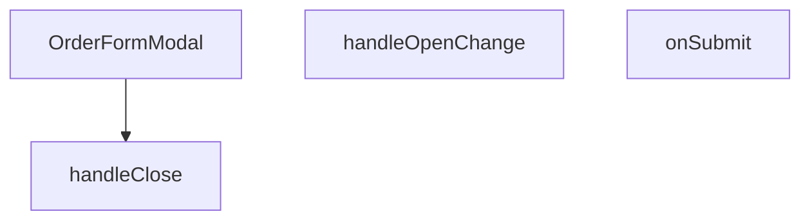

## Genel Bakış
Bu modül, admin arayüzündeki sipariş yönetimi için kullanılan bir modal form bileşenidir. Yeni bir sipariş oluşturma veya mevcut sipariş bilgilerini düzenleme işlevini sunarak, form verilerininvalidasyonunu ve sunucuya gönderilmesini yönetir.

## Fonksiyon Grupları
### Ana Bileşen ve Yapılandırma
Bu grup, modalın temel yapısını, props kabulünü ve başlangıç yapılandırmasını tanımlar.
- OrderFormModal

### Olay Yönetimi ve Durum Kontrolü
Bu grup, modalın açılıp kapanma mantığını ve form gönderiminden sonraki akışı (başarı/hata durumlarını) kontrol eder.
- handleClose, handleOpenChange, onSubmit

---

## AXIOMS – Mimari Varsayımlar

Bu modül, bir sipariş formu modal bileşeni olup sipariş oluşturma/düzenleme işlemlerini yönetir.

[Aksiyom 1]: Eğer `open` prop'u boolean değer değilse, modal bileşeni düzgün açılıp kapanamaz ve kullanıcı arayüzü tutarsız duruma düşer.

[Aksiyom 2]: Eğer `onOpenChange` prop'u sağlanmamışsa, modal'ın açık/kapalı durumu dışarıdan değiştirilemez ve `handleOpenChange` çağrıldığında bileşen kontrolsüz kalır.

[Aksiyom 3]: Eğer `orderId` parametresi undefined ise, bileşen yeni bir sipariş oluurma modunda çalışır; bir değer ise mevcut siparişi düzenleme moduna geçer.

[Aksiyom 4]: Eğer `orderFormSchema` geçerli bir Zod şeması değilse, form doğrulama hata verir ve geçersiz veriler işlenebilir.

[Aksiyom 5]: Eğer `onSubmit` fonksiyonu async olarak çağrılmazsa, asenkron API istekleri sıraya girer veya sonuç beklenmeden işlemler devam eder.

[Aksiyom 6]: Eğer `values` parametresi `OrderFormValues` yapısına uymuyorsa, form gönderimi başarısız olur veya beklenmeyen veri işlenir.

[Aksiyom 7]: Eğer `onSuccess` callback'i sağlanmamışsa, başarılı form gönderimi sonrası modal kapanmaz veya kullanıcıya başarı bildirimi verilmez.

---

## FONKSİYON DETAYLARI

### OrderFormModal
**Ne yapar**: Sipariş formunu açıp düzenleyen modal bileşenidir. Yeni bir sipariş oluşturmak veya mevcut bir siparişi düzenlemek için bir form gösterir ve yönetici arayüzünden formun açılıp kapanmasını kontrol eder.
**Nasıl yapar**: `open` prop'una bağlı olarak modalı görüntüler. `orderId` prop'u ile mevcut bir siparişin verilerini yükler. Form提交后 `onSuccess` callback'ini çağırarak ana bileşene başarıyı bildirir. İçerisindeki `handleClose`, `handleOpenChange` ve `onSubmit` yardımcı fonksiyonlarını kullanarak form akışını yönetir.
**Parametreler**:
- open: boolean — Modalın açık olup olmadığını belirten durum.
- onOpenChange: (open: boolean) => void — Modalın durumunu güncellemek için çağrılan geri çağırma fonksiyonu.
- orderId?: string | number — Düzenlenecek siparişin benzersiz tanımlayıcısı. Yeni sipariş oluştururken geçilmeyebilir.
- onSuccess?: () => void — Form başarıyla gönderildiğinde çağrılan geri çağırma fonksiyonu.
**Dönüş**: React.FC<OrderFormModalProps> — Tipi belirtilmiş bir React fonksiyonel bileşeni.

### handleClose
**Ne yapar**: Modalın kapatılma işlemini yöneten içerdek bir fonksiyondur. Sadece modal kapalı olduğunda ilgili temizlik veya kapatma mantığını uygular.
**Nasıl yapar**: Fonksiyon, bir `openVal` boolean parametresi alır. Eğer bu değer `false` (modal kapatılmak isteniyorsa) ise, kendi içinde tekrar `handleClose` çağrısı yaparak kapanma işlemini tetikler. Eğer değer `true` ise, `onOpenChange(true)` çağrısı ile modalın açık kalmasını sağlar. Bu yapı, modalın kapanma sürecini kontrol eden bir durum makinesi mantığına benzer.
**Parametreler**:
- openVal: boolean — Modalın hedef durumu (açık veya kapalı).
**Dönüş**: void — Fonksiyon doğrudan bir değer döndürmez.

### handleOpenChange
**Ne yapar**: Modalın açık/kapalı durumunu güncellemek için kullanılan bir yardımcı fonksiyondur. Genellikle bir state setter (örn. `setOpen`) olarak atanır.
**Nasıl yapar**: Doğrudan bir mantık içermez, sadece prop olarak gelen `onOpenChange` callback'ini çağırarak üst bileşenin state'ini günceller. Bu sayede modalın durumu üst bileşen tarafından yönetilir.
**Parametreler**:
- openVal: boolean — Modalın ayarlanacak yeni durumu (açıksa true, kapalıysa false).
**Dönüş**: void — Fonksiyon doğrudan bir değer döndürmez.

### onSubmit
**Ne yapar**: Form gönderimini işleyen asenkron fonksiyondur. Geçerli form verilerini alır, bir API isteği gönderir ve sonuca göre başarı veya hata yönetimi yapar.
**Nasıl yapar**: `OrderFormValues` tipli `values` parametresini alır. Fonksiyon `async` olduğu için içinde `await` ile asenkron işlemler (örn. API çağrısı) yapılabilir. İşlem başarılı olursa `onSuccess` callback'ini çağırır, başarısız olursa hata yönetimi yapar. Genellikle bir form kütüphanesinin (örn. React Hook Form) submit handler'ı olarak kullanılır.
**Parametreler**:
- values: OrderFormValues — Doğrulanmış form verilerini içeren nesne.
**Dönüş**: Promise<void> — Asenkron bir işlem başlatır, doğrudan anlamlı bir değer döndürmez.

---

## İTHALATLAR (IMPORTS)
- import: ../../../utils/adminUi::adminButtonPrimaryClass
- import: @/hooks/useRole::useRole
- import: @/i18n/I18nProvider::useI18n
- import: @/i18n/format::formatCurrency
- import: @/lib/admin/mutateWithAudit::AdminPermissionError
- import: @/lib/admin/mutateWithAudit::mutateWithAudit
- import: @/lib/orderStatusService::updateOrderStatus
- import: @/lib/supabase/client::supabaseBrowserClient
- import: @hookform/resolvers/zod::zodResolver
- import: @radix-ui/react-dialog
- import: @radix-ui/react-tabs
- import: lucide-react::Loader2
- import: lucide-react::Save
- import: lucide-react::X
- import: react-hook-form::useForm
- import: react::React
- import: react::useEffect
- import: react::useState
- import: sonner::toast
- import: zod::z

---

## INTERFACES

### DetailOrderItem
- `id: string`
- `product_id?: string | null`
- `product_name: string`
- `quantity: number`
- `price_at_time: number`
- `product_image_url?: string | null`

### DetailOrder
- `id: string`
- `user_id: string | null`
- `total_amount: number | null`
- `status: string`
- `payment_status?: string | null`
- `created_at: string`
- `customer_name?: string | null`
- `customer_email?: string | null`
- `customer_phone?: string | null`
- `shipping_address?: unknown`
- `order_number?: string | null`
- `conversation_id?: string | null`
- `carrier?: string | null`
- `tracking_number?: string | null`
- `tracking_url?: string | null`
- `shipped_at?: string | null`
- `delivered_at?: string | null`
- `shipping_method?: string | null`
- `invoice_type?: string | null`
- `invoice_info?: unknown`
- `legal_consents?: unknown`
- `venthub_order_items: DetailOrderItem[]`

### OrderFormModalProps
- `open: boolean`
- `onOpenChange: (open: boolean) => void`
- `orderId: string | null`
- `onSuccess: () => void`

---

## TYPE ALIASES

### OrderFormValues
```typescript
type OrderFormValues = z.infer<typeof orderFormSchema>
```

---

## SABİTLER
- **orderFormSchema** (call) — `z.object({
  status: z.string().min(1, 'Durum zorunludur'),
  customer_name: ...`

---

## AST POINTERS

### [N1_NASIL] AST Pointer: OrderFormModal.tsx::OrderFormModal
- **params**: `{ open: boolean, onOpenChange: (open: boolean) => void, orderId: string | null, onSuccess: () => void }`
- **ic_degiskenler**: (Bileşen gövdesinde tanımlı ana değişkenler burada, ancak verilen snippet'te bileşenin dış gövdesi yok)
- **Dönüş**: `React.FC<OrderFormModalProps>` bileşeni.

### [N2_NASIL] AST Pointer: OrderFormModal.tsx::useEffect (order yükleme)
- **params**: (parametre yok)
- **ic_degiskenler**:
  - `active` — Asenkron işlemin hâlâ geçerli olup olmadığını izlemek için kullanılan bayrak. Temizleme fonksiyonunda `false` yapılır.
  - `data` — Supabase'den gelen sipariş ve kalemler verisi.
  - `error` — Supabase sorgusundan dönen hata nesnesi.
  - `mappedItems` — `data.venthub_order_items` dizisinin `DetailOrderItem` tipine dönüştürülmüş hali.
  - `it` — `mappedItems` dizisi üzerinde `map` işleminde kullanılan iterasyon değişkeni.
  - `detailOrder` — Supabase'den gelen ham verinin `DetailOrder` tipine dönüştürülmüş, uygulama için düzenlenmiş tam sipariş nesnesi.
  - `err` — `try-catch` bloğunda yakalanan hata nesnesi.
- **Dönüş**: Cleanup fonksiyonu döndürür: `() => { active = false }`.

### [N3_NASIL] AST Pointer: OrderFormModal.tsx::handleClose
- **params**: (parametre yok)
- **ic_degiskenler**:
  - `form.formState.isDirty` — Formda kaydedilmemiş değişiklik olup olmadığını belirten boolean.
- **Dönüş**: yok (yan etki: `onOpenChange(false)` çağırır veya onay penceresi gösterir).

### [N4_NASIL] AST Pointer: OrderFormModal.tsx::handleOpenChange
- **params**: `openVal: boolean`
- **ic_degiskenler**:
  - `openVal` — Diyalogun açılıp kapatılacağını belirten parametre.
- **Dönüş**: yok (yan etki: `handleClose()` veya `onOpenChange(true)` çağırır).

### [N5_NASIL] AST Pointer: OrderFormModal.tsx::useEffect (beforeunload)
- **params**: (parametre yok)
- **ic_degiskenler**:
  - `handleBeforeUnload` — `beforeunload` olayını işleyen fonksiyon. Form kirliyse tarayıcının ayrılmasını engeller.
- **Dönüş**: Cleanup fonksiyonu döndürür: `() => { window.removeEventListener('beforeunload', handleBeforeUnload) }`.

### [N6_NASIL] AST Pointer: OrderFormModal.tsx::handleBeforeUnload
- **params**: `e: BeforeUnloadEvent`
- **ic_degiskenler**:
  - `e` — `beforeunload` olay nesnesi.
  - `form.formState.isDirty` — Form kirliliği durumu.
- **Dönüş**: `string` (boş string) veya `undefined`.

### [N7_NASIL] AST Pointer: OrderFormModal.tsx::onSubmit
- **params**: `values: OrderFormValues`
- **ic_degiskenler**:
  - `order` — Mevcut sipariş durumu (component state'ten). Guard kontrolünde kullanılır: `if (!order) return`.
  - `values` — Formdan gelen güncellenmiş değerler.
  - `statusRes` — `updateOrderStatus` servis çağrısının sonucu.
  - `error` — `mutateWithAudit` veya Supabase `update` işleminde oluşan hata.
- **Dönüş**: yok (yan etki: Supabase'de güncelleme yapar, toast gösterir, `onSuccess()` ve `onOpenChange(false)` çağırır).

### [N8_NASIL] AST Pointer: OrderFormModal.tsx::mutateWithAudit -> fn (iç fonksiyon)
- **params**: (parametre yok, `values` ve `order` dış kapsamdan kapanır)
- **ic_degiskenler**:
  - `values` — Form değerleri (dış kapsamdan).
  - `order` — Mevcut sipariş (dış kapsamdan).
  - `statusRes` — `updateOrderStatus` sonucu.
  - `error` — Supabase `update` hatası.
- **Dönüş**: yok (yan etki: durum değişikliği ve alan güncellemesi yapar).

### [N9_NASIL] AST Pointer: OrderFormModal.tsx::orderItems.map (JSX içinde)
- **params**: `it` (her bir `DetailOrderItem` öğesi)
- **ic_degiskenler**:
  - `it` — Dizideki tek bir sipariş kalemi.
  - `qty` — `it.quantity` sayısına dönüşmüş, 0 olabilir.
  - `unitPrice` — `it.price_at_time` sayısına dönüşmüş, 0 olabilir.
  - `totalPrice` — `qty * unitPrice` çarpımı.
- **Dönüş**: JSX `<tr>` elementi (tabl satırı).

---


## MERMAID CALL GRAPH


## NODE ID STANDARD

  file: src\components\admin\orders\OrderFormModal.tsx
  function: src\components\admin\orders\OrderFormModal.tsx::OrderFormModal
  function: src\components\admin\orders\OrderFormModal.tsx::handleClose
  function: src\components\admin\orders\OrderFormModal.tsx::handleOpenChange
  function: src\components\admin\orders\OrderFormModal.tsx::onSubmit

---

## DISA AKTARILANLAR (EXPORTS)
  export: OrderFormModal

---

## STİL TOKENLERİ

### Arbitrary Değerler (token'a geçirilmemiş)
Yok — tüm stiller token'a geçirilmiş. ✅

### Kullanılan Token'lar (zaten token'a geçirilmiş)
- (yok)

### Tailwind Sınıf Özeti
- **Renkler:** `bg-black/60`, `bg-surface-deep`, `bg-white/1`, `bg-white/2`, `bg-white/3`, `border-b`, `border-b-2`, `border-t`, `border-transparent`, `border-white/10`, `border-white/5`, `data-[state=active]:border-cyan-400`, `data-[state=active]:text-cyan-400`, `focus-visible:border-cyan-500/50`, `focus:bg-white/5`
- **Layout:** `backdrop-blur-sm`, `custom-scrollbar`, `fixed`, `flex`, `flex-1`, `flex-col`, `gap-2`, `gap-4`, `gap-6`, `grid`, `grid-cols-2`, `items-center`, `justify-between`, `justify-center`, `left-1/2`
- **Varyant/Responsive:** `data-[state=active]:`, `focus-visible:`, `focus:`, `group-hover:`, `hover:`, `placeholder:` önekleri
- **Yardımcı Sınıflar:** `${adminButtonPrimaryClass`, `-translate-x-1/2`, `-translate-y-1/2`, `animate-in`, `animate-spin`, `appearance-none`, `border`, `cursor-pointer`, `divide-white/2`, `divide-white/5`, `divide-y`, `fade-in`, `focus-visible:outline-none`, `font-black`, `font-bold`