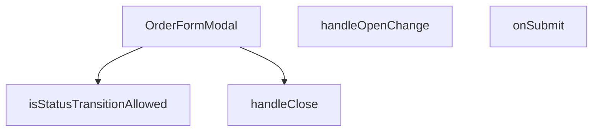

## Genel Bakış
Bu modül, admin paneli için sipariş oluşturma ve düzenleme işlemlerini yöneten bir React modal form bileşenidir. Ana sorumlulukları, form durumunu (açık/kapalı) kontrol etmek, geçerli sipariş verilerini toplamak ve sunucuya göndermektir. Ayrıca sipariş durumu geçişlerinin geçerliliğini doğrulama gibi yardımcı bir işlevi de barındırır.

## Fonksiyon Grupları
### Ana Bileşen ve Yapılandırma
Bu grup, modalın temel yapısını, kabul ettiği özelliklerini (props) ve bileşenin genel yaşam döngüsünü tanımlar. Tüm diğer işlevleri barındıran üst düzey konteynırdır.
- `OrderFormModal`

### Durum Yönetimi ve Etkileşim
Bu grup, kullanıcının modal ile etkileşimini (açma/kapama) ve formun gönderiminden sonraki iş akışını (başarı/hata durumlarını) yönetir. Modalın akış kontrolü bu fonksiyonlar tarafından sağlanır.
- `handleClose`, `handleOpenChange`, `onSubmit`

### Yardımcı Doğruluk Kontrolü
Bu grup, iş mantığına ait bir kuralı doğrulayan saf bir yardımcı fonksiyondur. Sipariş durumunun geçerli bir hedefe dönüştürülüp dönüştürülemeyeceğini kontrol ederek form verisi hazırlığına veya kullanıcı bildirimine yardımcı olabilir.
- `isStatusTransitionAllowed`

---

## AXIOMS – Mimari Varsayımlar

Bu modül, admin sipariş yönetimi için bir modal form bileşeni olup, durum geçiş doğrulaması ve form gönderimi işlevlerini içerir.

**[Aksiyom 1]**: Eğer `STATUS_FLOW` sabiti tanımlı veya dolu değilse, hiçbir durum geçişi izin verilmez (`isStatusTransitionAllowed` her zaman `false` döner).

**[Aksiyom 2]**: Eğer `TERMINAL_STATUSES` sabiti tanımlı değilse, terminal durumdaki siparişlerin durum değişikliği kontrolü yapılamaz ve geçiş hatalı şekilde izin verilebilir.

**[Aksiyom 3]**: Eğer `current` durumu `TERMINAL_STATUSES` içinde yer alıyorsa, herhangi bir `target` durumuna geçiş yapılamaz (`isStatusTransitionAllowed` `false` döner).

**[Aksiyom 4]**: Eğer `current` -> `target` geçişi `STATUS_FLOW` yapısında tanımlı değilse, o geçiş izin verilmez.

**[Aksiyom 5]**: Eğer `onOpenChange` callback'i sağlanmıyorsa, modal'ın open durumu bileşen dışında güncellenemez ve modal kapanamaz.

**[Aksiyom 6]**: Eğer `onSuccess` callback'i sağlanmıyorsa, başarılı form gönderiminden sonra dış listede yenileme/tefid tetiklenemez.

**[Aksiyom 7]**: Eğer `orderFormSchema` geçersiz veya tanımsızsa, form doğrulaması başarısız olur ve gönderim engellenir.

**[Aksiyom 8]**: Eğer `orderId` değeri `null`/`undefined` ise, modal yeni sipariş oluşturma modunda çalışır;否则 mevcut sipariş düzenleme moduna geçer.

**[Aksiyom 9]**: Eğer `open` prop'u `false` ise, modal render edilmez veya görünmez durumda olur.

---

## FONKSİYON DETAYLARI

### isStatusTransitionAllowed
**Ne yapar**: Sipariş statü geçişlerinin izin verilip verilmediğini belirler. Mevcut statü ile hedef statü arasındaki geçişin iş kurallarına uygun olup olmadığını kontrol ederek, geçersiz statü değişimlerini engeller. Bu fonksiyon sipariş yönetim sisteminde durum makinesi (state machine) mantığını uygular.

**Nasıl yapar**: Fonksiyon öncelikle aynı statüye geçiş durumunu (current === target) kontrol ederek başlar ve bu durumda her zaman izin verir. Ardından hem mevcut hem de hedef statünün `TERMINAL_STATUSES` (terminal/kapanış statüleri, örneğin iptal ve iade) kümesinde yer alıp almadığını belirler. Terminal durumdan aktif (non-terminal) bir duruma geçişin kesinlikle yasak olduğunu kontrol eder — bu, iptal veya iade işleminden sonra siparişin tekrar aktif hale getirilmesini önleyerek para ve stok kayıtlarının tutarlılığını korur. İki terminal statü arasındaki geçiş (örneğin iptal → iade veya kısmi iade → tam iade) serbesttir. Aktif bir durumdan herhangi bir terminal duruma geçiş her zaman izin verilir (müşteri iptal/iade talebi). Son olarak, aktif durumlar arasındaki geçişler için `STATUS_FLOW` dizisindeki sıralamayı kullanarak yalnızca ileri yönlü (happy-path) geçişlere izin verir; geriye doğru geçiş yasaktır.

**Parametreler**:
- current: string — Siparişin o anki mevcut durumunu (statü) temsil eder. `STATUS_FLOW` veya `TERMINAL_STATUSES` listelerinde yer alan geçerli bir statü değeri olmalıdır (örn: "pending", "confirmed", "cancelled", "refunded" gibi).
- target: string — Siparişin geçilmek istenen hedef durumunu (statü) temsil eder. Yine geçerli bir statü değeri olmalıdır ve mevcut durumdan bu duruma geçişin iş kurallarına uygunluğu kontrol edilir.

**Dönüş**: boolean — `true` dönerse geçiş izinlidir ve statü güncellenebilir. `false` dönerse geçiş iş kurallarına aykırıdır ve engellenmelidir. Terminal statüler `TERMINAL_STATUSES` olarak readonly string[] cast edilerek kontrol edilir; statü akış sıralaması `STATUS_FLOW` readonly string[] dizisi üzerinden belirlenir.

### OrderFormModal
**Ne yapar**: Sipariş formunu açıp düzenleyen modal bileşenidir. Yeni bir sipariş oluşturmak veya mevcut bir siparişi düzenlemek için bir form gösterir ve yönetici arayüzünden formun açılıp kapanmasını kontrol eder.
**Nasıl yapar**: `open` prop'una bağlı olarak modalı görüntüler. `orderId` prop'u ile mevcut bir siparişin verilerini yükler. Form提交后 `onSuccess` callback'ini çağırarak ana bileşene başarıyı bildirir. İçerisindeki `handleClose`, `handleOpenChange` ve `onSubmit` yardımcı fonksiyonlarını kullanarak form akışını yönetir.
**Parametreler**:
- open: boolean — Modalın açık olup olmadığını belirten durum.
- onOpenChange: (open: boolean) => void — Modalın durumunu güncellemek için çağrılan geri çağırma fonksiyonu.
- orderId?: string | number — Düzenlenecek siparişin benzersiz tanımlayıcısı. Yeni sipariş oluştururken geçilmeyebilir.
- onSuccess?: () => void — Form başarıyla gönderildiğinde çağrılan geri çağırma fonksiyonu.
**Dönüş**: React.FC<OrderFormModalProps> — Tipi belirtilmiş bir React fonksiyonel bileşeni.

### handleClose
**Ne yapar**: Modalın kapatılma işlemini yöneten içerdek bir fonksiyondur. Sadece modal kapalı olduğunda ilgili temizlik veya kapatma mantığını uygular.
**Nasıl yapar**: Fonksiyon, bir `openVal` boolean parametresi alır. Eğer bu değer `false` (modal kapatılmak isteniyorsa) ise, kendi içinde tekrar `handleClose` çağrısı yaparak kapanma işlemini tetikler. Eğer değer `true` ise, `onOpenChange(true)` çağrısı ile modalın açık kalmasını sağlar. Bu yapı, modalın kapanma sürecini kontrol eden bir durum makinesi mantığına benzer.
**Parametreler**:
- openVal: boolean — Modalın hedef durumu (açık veya kapalı).
**Dönüş**: void — Fonksiyon doğrudan bir değer döndürmez.

### handleOpenChange
**Ne yapar**: Modalın açık/kapalı durumunu güncellemek için kullanılan bir yardımcı fonksiyondur. Genellikle bir state setter (örn. `setOpen`) olarak atanır.
**Nasıl yapar**: Doğrudan bir mantık içermez, sadece prop olarak gelen `onOpenChange` callback'ini çağırarak üst bileşenin state'ini günceller. Bu sayede modalın durumu üst bileşen tarafından yönetilir.
**Parametreler**:
- openVal: boolean — Modalın ayarlanacak yeni durumu (açıksa true, kapalıysa false).
**Dönüş**: void — Fonksiyon doğrudan bir değer döndürmez.

### onSubmit
**Ne yapar**: Form gönderimini işleyen asenkron fonksiyondur. Geçerli form verilerini alır, bir API isteği gönderir ve sonuca göre başarı veya hata yönetimi yapar.
**Nasıl yapar**: `OrderFormValues` tipli `values` parametresini alır. Fonksiyon `async` olduğu için içinde `await` ile asenkron işlemler (örn. API çağrısı) yapılabilir. İşlem başarılı olursa `onSuccess` callback'ini çağırır, başarısız olursa hata yönetimi yapar. Genellikle bir form kütüphanesinin (örn. React Hook Form) submit handler'ı olarak kullanılır.
**Parametreler**:
- values: OrderFormValues — Doğrulanmış form verilerini içeren nesne.
**Dönüş**: Promise<void> — Asenkron bir işlem başlatır, doğrudan anlamlı bir değer döndürmez.

---

## İTHALATLAR (IMPORTS)
- import: ../../../utils/adminUi::adminButtonPrimaryClass
- import: @/hooks/useRole::useRole
- import: @/i18n/I18nProvider::useI18n
- import: @/i18n/format::formatCurrency
- import: @/lib/admin/mutateWithAudit::AdminPermissionError
- import: @/lib/admin/mutateWithAudit::mutateWithAudit
- import: @/lib/orderStatusService::updateOrderStatus
- import: @/lib/supabase/client::supabaseBrowserClient
- import: @hookform/resolvers/zod::zodResolver
- import: @radix-ui/react-dialog
- import: @radix-ui/react-tabs
- import: lucide-react::Loader2
- import: lucide-react::Save
- import: lucide-react::X
- import: react-hook-form::useForm
- import: react::React
- import: react::useEffect
- import: react::useState
- import: sonner::toast
- import: zod::z

---

## INTERFACES

### DetailOrderItem
- `id: string`
- `product_id?: string | null`
- `product_name: string`
- `quantity: number`
- `price_at_time: number`
- `product_image_url?: string | null`

### DetailOrder
- `id: string`
- `user_id: string | null`
- `total_amount: number | null`
- `status: string`
- `payment_status?: string | null`
- `created_at: string`
- `customer_name?: string | null`
- `customer_email?: string | null`
- `customer_phone?: string | null`
- `shipping_address?: unknown`
- `order_number?: string | null`
- `conversation_id?: string | null`
- `carrier?: string | null`
- `tracking_number?: string | null`
- `tracking_url?: string | null`
- `shipped_at?: string | null`
- `delivered_at?: string | null`
- `shipping_method?: string | null`
- `invoice_type?: string | null`
- `invoice_info?: unknown`
- `legal_consents?: unknown`
- `venthub_order_items: DetailOrderItem[]`

### OrderFormModalProps
- `open: boolean`
- `onOpenChange: (open: boolean) => void`
- `orderId: string | null`
- `onSuccess: () => void`

---

## TYPE ALIASES

### OrderFormValues
```typescript
type OrderFormValues = z.infer<typeof orderFormSchema>
```

---

## SABİTLER
- **orderFormSchema** (call) — `z.object({
  status: z.string().min(1, 'Durum zorunludur'),
  customer_name...`
- **STATUS_FLOW** (as_expression) — `['pending', 'paid', 'confirmed', 'shipped', 'delivered'] as const`
- **TERMINAL_STATUSES** (as_expression) — `['cancelled', 'refunded', 'partial_refunded'] as const`

---

## AST POINTERS

### [N1_NASIL] AST Pointer: src/components/admin/orders/OrderFormModal.tsx::isStatusTransitionAllowed
- **params**: (current: string, target: string)
- **ic_degiskenler**:
  - `currentTerminal` — Mevcut durumun terminal (iptal/iade) durumu olup olmadığını belirler
  - `targetTerminal` — Hedef durumun terminal (iptal/iade) durumu olup olmadığını belirler
  - `ci` — Mevcut durumun STATUS_FLOW dizisindeki indeksi
  - `ti` — Hedef durumun STATUS_FLOW dizisindeki indeksi
- **Dönüş**: boolean (durum geçişinin izin verilip verilmediğini belirler)

### [N2_NASIL] AST Pointer: src/components/admin/orders/OrderFormModal.tsx::OrderFormModal
- **params**: ({ open, onOpenChange, orderId, onSuccess })
- **ic_degiskenler**:
  - `orderId` — Düzenlenecek siparişin benzersiz tanımlayıcısı
  - `open` — Modal'ın açık olup olmadığını belirleyen boolean state
  - `onOpenChange` — Modal durumunu güncelleyen callback fonksiyon
  - `onSuccess` — Başarılı kayıt sonrası çağrılan callback fonksiyon
  - `order` — Yüklenen sipariş verisini tutan state (DetailOrder tipinde)
  - `loadingOrder` — Sipariş yüklenirken loading durumunu gösteren boolean state
  - `saving` — Kaydetme işlemi sırasında loading durumunu gösteren boolean state
  - `hasWriteAccess` — Kullanıcının yazma izni olup olmadığını belirleyen boolean
  - `form` — react-hook-form form instance'ı (OrderFormValues tipinde)
  - `handleClose` — Modal kapatma mantığını içeren fonksiyon
  - `handleOpenChange` — Modal açma/kapatma mantığını içeren fonksiyon
  - `onSubmit` — Form gönderme işlemini yöneten async fonksiyon
  - `t` —Uluslararasılaştırma fonksiyonu
  - `lang` —Mevcut dil ayarı
  - `supabase` —Supabase client instance'ı
- **Dönüş**: React.FC<OrderFormModalProps> (React bileşen dönüşü)

### [N3_NASIL] AST Pointer: src/components/admin/orders/OrderFormModal.tsx::handleClose
- **params**: (parametre yok)
- **ic_degiskenler**:
  - `form.formState.isDirty` — Formda kaydedilmemiş değişiklik olup olmadığını kontrol eder
  - `onOpenChange` — Modal durumunu güncelleyen callback fonksiyonu
- **Dönüş**: yok (yan etki: modal'ı kapatır veya onay penceresi gösterir)

### [N4_NASIL] AST Pointer: src/components/admin/orders/OrderFormModal.tsx::handleOpenChange
- **params**: (openVal: boolean)
- **ic_degiskenler**:
  - `openVal` — Modal'ın yeni durumu (true/false)
  - `handleClose` — Modal kapatma mantığını içeren fonksiyon
  - `onOpenChange` — Modal durumunu güncelleyen callback fonksiyon
- **Dönüş**: yok (yan etki: handleClose veya onOpenChange çağırır)

### [N5_NASIL] AST Pointer: src/components/admin/orders/OrderFormModal.tsx::onSubmit
- **params**: (values: OrderFormValues)
- **ic_degiskenler**:
  - `order` — Mevcut sipariş verisi (DetailOrder tipinde)
  - `values` — Form verileri (OrderFormValues tipinde)
  - `isStatusTransitionAllowed` — Durum geçişinin izin verilip verilmediğini kontrol eden fonksiyon
  - `setSaving` — Saving state'ini güncelleyen fonksiyon
  - `mutateWithAudit` — Audit korumalı veri güncelleme fonksiyonu
  - `hasWriteAccess` — Kullanıcının yazma izni olup olmadığını belirleyen boolean
  - `supabase` —Supabase client instance'ı
  - `updateOrderStatus` — Sipariş durumunu güncelleyen servis fonksiyonu
  - `statusRes` — updateOrderStatus sonucu (ok ve error alanları)
  - `error` — Hata nesnesi (unknown tipinde)
- **Dönüş**: yok (yan etki: toast mesajları gösterir, onSuccess ve onOpenChange çağırır)

---


## MERMAID CALL GRAPH


## NODE ID STANDARD

  file: src\components\admin\orders\OrderFormModal.tsx
  function: src\components\admin\orders\OrderFormModal.tsx::isStatusTransitionAllowed
  function: src\components\admin\orders\OrderFormModal.tsx::OrderFormModal
  function: src\components\admin\orders\OrderFormModal.tsx::handleClose
  function: src\components\admin\orders\OrderFormModal.tsx::handleOpenChange
  function: src\components\admin\orders\OrderFormModal.tsx::onSubmit

---

## DISA AKTARILANLAR (EXPORTS)
  export: OrderFormModal
  export: isStatusTransitionAllowed

---

## STİL TOKENLERİ

### Arbitrary Değerler (token'a geçirilmemiş)
Yok — tüm stiller token'a geçirilmiş. ✅

### Kullanılan Token'lar (zaten token'a geçirilmiş)
- (yok)

### Tailwind Sınıf Özeti
- **Renkler:** `bg-black/60`, `bg-surface-deep`, `bg-white/1`, `bg-white/2`, `bg-white/3`, `border-b`, `border-b-2`, `border-t`, `border-transparent`, `border-white/10`, `border-white/5`, `data-[state=active]:border-cyan-400`, `data-[state=active]:text-cyan-400`, `focus-visible:border-cyan-500/50`, `focus:bg-white/5`
- **Layout:** `backdrop-blur-sm`, `custom-scrollbar`, `fixed`, `flex`, `flex-1`, `flex-col`, `gap-2`, `gap-4`, `gap-6`, `grid`, `grid-cols-2`, `items-center`, `justify-between`, `justify-center`, `left-1/2`
- **Varyant/Responsive:** `data-[state=active]:`, `focus-visible:`, `focus:`, `group-hover:`, `hover:`, `placeholder:` önekleri
- **Yardımcı Sınıflar:** `${adminButtonPrimaryClass`, `-translate-x-1/2`, `-translate-y-1/2`, `animate-in`, `animate-spin`, `appearance-none`, `border`, `cursor-pointer`, `divide-white/2`, `divide-white/5`, `divide-y`, `fade-in`, `focus-visible:outline-none`, `font-black`, `font-bold`