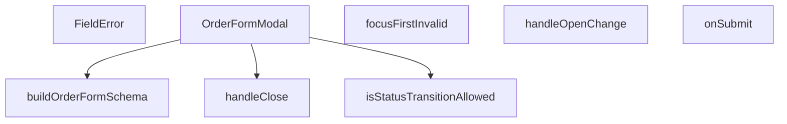

## Genel Bakış
Bu modül, sipariş verilerini düzenlemek için kullanılan bir modal form bileşenini içerir. Formun doğrulama şemasını oluşturur, durum geçişlerinin izin verilip verilmediğini kontrol eder ve form gönderimi ile modal yönetimini sağlar.

## Fonksiyon Grupları
### Form Yapılandırması ve Doğrulama
Formun yapısını ve doğrulama kurallarını tanımlar, form hatalarında odaklanma ve sipariş durumu geçişlerinin kurallarını uygular.
- buildOrderFormSchema, focusFirstInvalid, isStatusTransitionAllowed

### UI Bileşenleri
Form alanlarındaki hata mesajlarını kullanıcıya göstermek için kullanılan bir bileşen sağlar.
- FieldError

### Modal Yönetimi
Modalın kapatılması ve açık/kapalı durumunun değiştirilmesi gibi kullanıcı etkileşimlerini yönetir.
- handleClose, handleOpenChange

### Form İşleme
Form başarıyla gönderildiğinde çalışacak olan asenkron işlemi ve sunucu tarafı etkileşimini yönetir.
- onSubmit

### Ana Bileşen
Tüm diğer fonksiyonları ve bileşenleri bir araya getirerek sipariş düzenleme modalını oluşturan ana bileşendir.
- OrderFormModal

---

## AXIOMS – Mimari Varsayımlar
- Bu modül davranışsal mantık içermez (salt veri / konfigürasyon / tip tanımı).
- [Aksiyom 1]: Modülün dışa açtığı yapı (anahtar kümesi / şema) bir sözleşmedir; tüketiciler bu sabit yapıya bağlıdır — kırıcı değişiklik tüm tüketicileri etkiler.
- [Aksiyom 2]: Bir öğe ekleme/çıkarma yapısal-uyumlu olmalı; ilgili tipler ve seçiciler aynı commit'te güncel tutulmalıdır.

---

## FONKSİYON DETAYLARI

### buildOrderFormSchema
**Ne yapar**: Sipariş formunun doğrulama şemasını oluşturur. Form alanlarının geçerlilik kurallarını tanımlayan bir Zod (veya benzeri) şema nesnesi üretir.
**Nasıl yapar**: Parametre olarak aldığı çeviri fonksiyonu `t` aracılığıyla hata mesajlarını yerelleştirir. Gövde içinde `buildOrderFormSchema(t)` çağrılarak şema oluşturulur; bu, şema üretiminin ayrı bir yardımcı fonksiyona devredildiğini gösterir.
**Parametreler**:
- t: (key: string) => string — Uluslararasılaştırma (i18n) için çeviri anahtarlarını çözümleyen fonksiyon. Şema doğrulama hata mesajlarında kullanılır.
**Dönüş**: Belirtilmemiş (bilinmiyor).

### FieldError
**Ne yapar**: Geliştirildi ancak detay üretilemedi.

### focusFirstInvalid
**Ne yapar**: Geliştirildi ancak detay üretilemedi.

### isStatusTransitionAllowed
**Ne yapar**: Geliştirildi ancak detay üretilemedi.

### OrderFormModal
**Ne yapar**: Geliştirildi ancak detay üretilemedi.

### handleClose
**Ne yapar**: Geliştirildi ancak detay üretilemedi.

### handleOpenChange
**Ne yapar**: Geliştirildi ancak detay üretilemedi.

### onSubmit
**Ne yapar**: Geliştirildi ancak detay üretilemedi.

---

## İTHALATLAR (IMPORTS)
- import: ../../../i18n/currency::SYSTEM_CURRENCY
- import: ../../../utils/adminUi::adminButtonPrimaryClass
- import: ../overlay/ConfirmProvider::useConfirm
- import: @/hooks/useRole::useRole
- import: @/i18n/I18nProvider::useI18n
- import: @/i18n/format::formatCurrency
- import: @/lib/admin/mutateWithAudit::AdminPermissionError
- import: @/lib/admin/mutateWithAudit::mutateWithAudit
- import: @/lib/orderStatusService::updateOrderStatus
- import: @/lib/supabase/client::supabaseBrowserClient
- import: @hookform/resolvers/zod::zodResolver
- import: @radix-ui/react-dialog
- import: @radix-ui/react-tabs
- import: lucide-react::Loader2
- import: lucide-react::Save
- import: lucide-react::X
- import: react-hook-form::type { FieldErrors }
- import: react-hook-form::useForm
- import: react::React
- import: react::useEffect
- import: react::useState
- import: sonner::toast
- import: zod::z

---

## INTERFACES

### DetailOrderItem
- `id: string`
- `product_id?: string | null`
- `product_name: string`
- `quantity: number`
- `price_at_time: number`
- `product_image_url?: string | null`

### DetailOrder
- `id: string`
- `user_id: string | null`
- `total_amount: number | null`
- `status: string`
- `payment_status?: string | null`
- `created_at: string`
- `customer_name?: string | null`
- `customer_email?: string | null`
- `customer_phone?: string | null`
- `shipping_address?: unknown`
- `order_number?: string | null`
- `conversation_id?: string | null`
- `carrier?: string | null`
- `tracking_number?: string | null`
- `tracking_url?: string | null`
- `shipped_at?: string | null`
- `delivered_at?: string | null`
- `shipping_method?: string | null`
- `invoice_type?: string | null`
- `invoice_info?: unknown`
- `legal_consents?: unknown`
- `venthub_order_items: DetailOrderItem[]`

### OrderFormModalProps
- `open: boolean`
- `onOpenChange: (open: boolean) => void`
- `orderId: string | null`
- `onSuccess: () => void`

---

## TYPE ALIASES

### OrderFormValues
```typescript
type OrderFormValues = z.infer<ReturnType<typeof buildOrderFormSchema>>
```

---

## SABİTLER
- **FIELD_FOCUS_ORDER** (array) — `[
  { name: 'customer_name', id: 'order-customer-name' },
  { name: 'custom...`
- **STATUS_FLOW** (as_expression) — `['pending', 'paid', 'confirmed', 'shipped', 'delivered'] as const`
- **TERMINAL_STATUSES** (as_expression) — `['cancelled', 'refunded', 'partial_refunded'] as const`

---

## AST POINTERS

### [N1_NASIL] AST Pointer: src/components/admin/orders/OrderFormModal.tsx::buildOrderFormSchema
- **params**: `t` — çeviri fonksiyonu, anahtar alır ve yerelleştirilmiş string döndürür
- **ic_degiskenler**:
  - `z.object({...})` — Zod şema nesnesi; `status`, `customer_name`, `customer_email`, `customer_phone`, `carrier`, `tracking_number`, `shipping_method` alanlarını tanımlar
  - `status` — z.string(), min 1 karakter, boş olamaz
  - `customer_name` — z.string(), min 1 karakter, boş olamaz
  - `customer_email` — z.string(), email formatı zorunlu, min 1 karakter
  - `customer_phone` — z.string(), opsiyonel ve nullable
  - `carrier` — z.string(), opsiyonel ve nullable
  - `tracking_number` — z.string(), opsiyonel ve nullable
  - `shipping_method` — z.string(), opsiyonel ve nullable
- **Dönüş**: z.object Zod şeması

### [N2_NASIL] AST Pointer: src/components/admin/orders/OrderFormModal.tsx::FieldError
- **params**: `id` — string, hata mesajının DOM id'si; `message` — string (opsiyonel), gösterilecek hata mesajı
- **ic_degiskenler**:
  - `message` — koşul: truthy ise `<p>` etiketi render edilir, falsy ise null döner
  - `id` — `<p>` etiketinin `id` ve `aria-describedby` bağlamında kullanılan kimliği
- **Dönüş**: JSX elementi (`<p>`) veya `null`

### [N3_NASIL] AST Pointer: src/components/admin/orders/OrderFormModal.tsx::focusFirstInvalid
- **params**: `errs` — `FieldErrors<OrderFormValues>`, form hatalarını içeren nesne
- **ic_degiskenler**:
  - `first` — `FIELD_FOCUS_ORDER` dizisi üzerinde `.find()` ile bulunan, `errs[name]` değeri truthy olan ilk öğe; bulunamazsa fonksiyon erken döner
  - `first.id` — bulunan öğenin `id` değeri; `document.getElementById()` ile DOM elemanı seçilir ve `.focus()` ile odaklanılır
- **Dönüş**: void

### [N4_NASIL] AST Pointer: src/components/admin/orders/OrderFormModal.tsx::isStatusTransitionAllowed
- **params**: `current` — mevcut durum string'i; `target` — hedef durum string'i
- **ic_degiskenler**:
  - `currentTerminal` — `TERMINAL_STATUSES` dizisi içinde `current` var mı kontrolü sonucu (boolean)
  - `targetTerminal` — `TERMINAL_STATUSES` dizisi içinde `target` var mı kontrolü sonucu (boolean)
  - `ci` — `STATUS_FLOW` dizisinde `current` öğesinin indeksi; bulunamazsa -1
  - `ti` — `STATUS_FLOW` dizisinde `target` öğesindeki indeksi; bulunamazsa -1
- **Dönüş**: boolean — geçiş izinli ise `true`, değilse `false`

### [N5_NASIL] AST Pointer: src/components/admin/orders/OrderFormModal.tsx::handleClose
- **params**: yok
- **ic_degiskenler**:
  - `form.formState.isDirty` — formda değişiklik olup olmadığını gösteren boolean; dirty değilse `onOpenChange(false)` çağrılır
  - `ok` — `confirm()` fonksiyonundan dönen boolean; kullanıcı onay verirse `onOpenChange(false)` çağrılır
- **Dönüş**: yok (async, yan etki: modal kapatma)

### [N6_NASIL] AST Pointer: src/components/admin/orders/OrderFormModal.tsx::handleOpenChange
- **params**: `openVal` — boolean, modal'ın yeni açık/kapalı durumu
- **ic_degiskenler**:
  - `openVal` — false ise `handleClose()` çağrılır, true ise `onOpenChange(true)` çağrılır
- **Dönüş**: yok

### [N7_NASIL] AST Pointer: src/components/admin/orders/OrderFormModal.tsx::onSubmit
- **params**: `values` — `OrderFormValues` tipinde, form verileri
- **ic_degiskenler**:
  - `order` — mevcut sipariş nesnesi; yoksa fonksiyon erken döner
  - `values.status` — formdaki yeni durum; `order.status` ile karşılaştırılır
  - `statusRes` — `updateOrderStatus()` servisinden dönen sonuç nesnesi; `.ok` değeri false ise hata fırlatılır
  - `statusRes.error` — hata durumunda fırlatılan hata mesajı
  - `error` — `supabase.from('venthub_orders').update()` sonucu; hata varsa fırlatılır
  - `mutateWithAudit` — denetimli güncelleme fonksiyonu; `resource`, `canWrite`, `action`, `rowPk`, `before`, `after`, `auditedByEdge`, `fn` parametreleri alır
  - `hasWriteAccess` — yazma yetkisi olup olmadığını gösteren boolean
  - `order.id` — sipariş kimliği, güncelleme sorgusunda kullanılır
  - `order.user_id` — kullanıcı kimliği, `updateOrderStatus`'a gönderilir
  - `order.status` — eski durum, `before` ve `oldStatus` olarak kullanılır
  - `order.customer_name`, `order.customer_email`, `order.customer_phone`, `order.carrier`, `order.tracking_number`, `order.shipping_method` — eski değerler, `before` nesnesinde kullanılır
  - `values.customer_name`, `values.customer_email`, `values.customer_phone`, `values.carrier`, `values.tracking_number`, `values.shipping_method` — yeni değerler, `after` nesnesinde ve `update` sorgusunda kullanılır
  - `error` (catch bloğu) — yakalanan hata; `AdminPermissionError` ise yetki hatası mesajı, değilse genel hata mesajı gösterilir
  - `setSaving` — yükleme durumunu ayarlayan fonksiyon; try başında true, finally'de false
  - `onSuccess` — başarılı kayıt sonrası çağrılan callback
  - `onOpenChange` — modal kapatma fonksiyonu; başarılı kayıt sonrası `false` ile çağrılır
- **Dönüş**: yok (async, yan etki: veritabanı güncelleme, toast mesajı, modal kapatma)

---


## MERMAID CALL GRAPH


## NODE ID STANDARD

  file: OrderFormModal.tsx
  function: OrderFormModal.tsx::buildOrderFormSchema
  function: OrderFormModal.tsx::FieldError
  function: OrderFormModal.tsx::focusFirstInvalid
  function: OrderFormModal.tsx::isStatusTransitionAllowed
  function: OrderFormModal.tsx::OrderFormModal
  function: OrderFormModal.tsx::handleClose
  function: OrderFormModal.tsx::handleOpenChange
  function: OrderFormModal.tsx::onSubmit

---

## DISA AKTARILANLAR (EXPORTS)
  export: FieldError
  export: OrderFormModal
  export: buildOrderFormSchema
  export: focusFirstInvalid
  export: isStatusTransitionAllowed

---

## STİL TOKENLERİ

### Arbitrary Değerler (token'a geçirilmemiş)
Yok — tüm stiller token'a geçirilmiş. ✅

### Kullanılan Token'lar (zaten token'a geçirilmiş)
- (yok)

### Tailwind Sınıf Özeti
- **Renkler:** `bg-admin-bg`, `bg-admin-surface`, `bg-admin-surface-2`, `bg-black/60`, `border-admin-border`, `border-b`, `border-b-2`, `border-t`, `border-transparent`, `data-[state=active]:border-admin-accent`, `data-[state=active]:text-admin-accent`, `focus-visible:bg-admin-surface-2`, `focus-visible:border-admin-accent/30`, `hover:bg-admin-surface-2`, `hover:bg-admin-surface-3`
- **Layout:** `custom-scrollbar`, `fixed`, `flex`, `flex-1`, `flex-col`, `gap-2`, `gap-4`, `gap-6`, `grid`, `grid-cols-2`, `items-center`, `justify-between`, `justify-center`, `left-1/2`, `max-h-90vh`
- **Varyant/Responsive:** `:`, `data-[state=active]:`, `focus-visible:`, `group-hover:`, `hover:`, `placeholder:` önekleri
- **Yardımcı Sınıflar:** `!border-admin-danger`, `${adminButtonPrimaryClass`, `-translate-x-1/2`, `-translate-y-1/2`, `:`, `animate-in`, `animate-spin`, `appearance-none`, `border`, `cursor-pointer`, `cursor-pointer${statusError`, `divide-admin-border`, `divide-y`, `fade-in`, `focus-visible:outline-none`