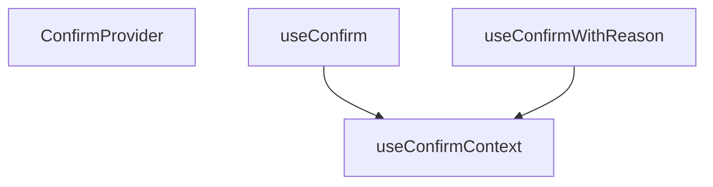

## Genel Bakış
Bu modül, React uygulaması genelinde tutarlı bir modal onay diyaloğu sunmak için tasarlanmış bir bağlam (context) sağlayıcısı ve tüketici hook'larını içerir. Asenkron "Evet/Hayır" kararlarını yöneten merkezi bir altyapı katmanı görevi görür ve farklı onay senaryoları için pratik API'ler sunar.

## Fonksiyon Grupları
### Onay Bağlamı Sağlayıcısı
Bu grup, onay diyaloğunun tüm çocuk bileşenler tarafından erişilebilir olmasını sağlayan React bağlamını oluşturur ve yönetir. Sağlayıcı, asenkron onay isteklerinin durumunu ve çözücü fonksiyonlarını barındırır.
- `ConfirmProvider`

### Bağlam Tüketici Hook'ları
Bu grup, alt bileşenlerin onay diyaloğunu tetiklemek için kullanacağı hook'ları sunar. Farklı dönüş tipleriyle (boolean veya detaylı sonuç) onay istekleri başlatır ve kullanıcı kararını bekleyerek sonucu bir Promise ile döndürür.
- `useConfirmContext`, `useConfirm`, `useConfirmWithReason`

---

## AXIOMS – Mimari Varsayımlar

Bu modül için fonksiyon gövdeleri sağlanmadığından, fonksiyon gövdesine dayalı özel aksiyom tanımlanamaz.

---

## FONKSİYON DETAYLARI

### useConfirmContext
**Ne yapar**: Onay mekanizmasının React bağlamını (context) tüketen bir kanca fonksiyonudur. `<ConfirmProvider>` bileşeni tarafından sağlanan `confirm` fonksiyonuna erişim sağlar. Bu kanca, bağlam dışında çağrıldığında hata fırlatarak geliştiriciye açık bir uyarı verir.

**Nasıl yapar**: `React.useContext` ile `ConfirmContext` bağlamını okur. Eğer bağlam değeri yoksa (yani fonksiyon `<ConfirmProvider>` ağacı dışında çağrıldıysa), açıklayıcı bir hata mesajıyla `throw` eder. Bağlam mevcutsa, doğrudan bağlam değerini döndürür. Hata mesajında `AdminLayout` içinde `<ConfirmProvider>` mount edilmesi gerektiği belirtilir.

**Parametreler**:
- Bu fonksiyon parametre almaz.

**Dönüş**: `(options: ConfirmOptions) => Promise<ConfirmResult>` — Onay seçeneklerini kabul eden ve onay sonucunu çözümleyen bir fonksiyon döner. `ConfirmResult` yapısı `confirmed` (boolean) ve `reason` (string) alanlarını içerir.

### useConfirm
**Ne yapar**: Onay isteyen imperatif bir kancadır. `ConfirmProvider` içinde tanımlanan onay dialogunu programatik olarak açmak ve kullanıcının kararını beklemek için kullanılır.

**Nasıl yapar**: `React.useContext` hook'u ile `ConfirmContext` değerini alır. Eğer kanca `ConfirmProvider` bileşeninin dışında çağrıldıysa (context mevcut değilse) bir hata fırlatır. Aksi takdirde, context'in sağladığı `(options: ConfirmOptions) => Promise<boolean>` imzasındaki fonksiyonu doğrudan döndürür.

**Parametreler**: Parametresizdir.

**Dönüş**: `(options: ConfirmOptions) => Promise<boolean>` tipinde bir fonksiyon. Bu fonksiyon, verilen `ConfirmOptions` yapılandırmasıyla onay dialogunu açar ve kullanıcının onay (`true`) veya iptal (`false`) kararını temsil eden bir Promise resolve eder.

### useConfirmWithReason
**Ne yapar**: Geliştirildi ancak detay üretilemedi.

### ConfirmProvider
**Ne yapar**: Çocuk bileşenlere onay dialogu (`alertdialog`) yetenekini sağlayan bir React bileşenidir. `ConfirmContext` oluşturur ve dialogun tüm state'ini, açma/kapatma mantığını ve Promise çözümlemesini yönetir.

**Nasıl yapar**: `useI18n` hook'u ile çeviri fonksiyonunu (`t`) alır. `useState` hook'ları ile dialog için gerekli seçenekler (`options`) ve typed onay input değerini (`typed`) yönetir. `resolverRef` ile açılan dialog'a karşılık gelen Promise'in `resolve` fonksiyonunu saklar. `confirm` callback'i, yeni bir dialog açmak için çağrılır: input'u sıfırlar, seçenekleri ayarlar ve yeni bir Promise oluşturup resolve fonksiyonunu ref'e kaydeder. `settle` callback'i, dialog kapatıldığında Promise'i çözümler (sonuç `true` veya `false`) ve state'i temizler. `handleOpenChange`, dialog'unRadiX tarafından kapatılma olayını yakalar (ESC, arka plan tıklaması) ve her durumda `settle(false)` çağırarak asılı kalan promise'i çözer. JSX içinde `ConfirmContext.Provider` ile `confirm` fonksiyonunu alt bileşenlere iletir. Ardından, `Dialog.Root` ile options mevcutsa (`options !== null`) açılan bir modal dialog render eder. Dialog, `role="alertdialog"` ve `aria-modal="true"` özelliklerini taşır, dışarı tıklamayla kapatmayı engeller (`onPointerDownOutside`, `onInteractOutside`), ilk odaklanmayı en az yıkıcı eylem olan iptal butonuna yapar (`onOpenAutoFocus`). İçerik,Opsiyonel bir başlık, açıklama, `requireTypedConfirmation` seçeneği aktifse bir text input ve onay/iptal butonları içerir.

**Parametreler**:
- `children`: `React.ReactNode` — Bileşenin sağladığı onay dialogunu kullanacak olan alt React düğümleri.

**Dönüş**: `JSX.Element`. `ConfirmContext.Provider` ve dialog yapısını içeren JSX ağacı döndürür.

---

## İTHALATLAR (IMPORTS)
- import: ../../../i18n/I18nProvider::useI18n
- import: @radix-ui/react-dialog
- import: react::React

---

## INTERFACES

### ConfirmOptions
ONAY YÜZEYİ — `window.confirm` yerine. Cetvel: docs/standards/admin-design-standard.md §4.7, §4.8 NEDEN `window.confirm` YASAK (2026-08-15 denetimi): · stilsiz ve i18n'i taşıyamaz, · mobilde "bu site tekrar sormasın" ile **kalıcı olarak susturulabilir** → `confirm` `false` döner, silme sessizce ipta
- `title?: string`
- `description: string`
- `confirmLabel?: string`
- `cancelLabel?: string`
- `tone?: 'danger' | 'default'`
- `requireTypedConfirmation?: string`
- `reason?: {`

### ConfirmResult
`useConfirmWithReason`'ın dönüşü.
- `confirmed: boolean`
- `reason: string`

---

## TYPE ALIASES

### Resolver
```typescript
type Resolver = (value: ConfirmResult) => void
```

---

## SABİTLER
- **ConfirmContext** (call) — `React.createContext<
  ((options: ConfirmOptions) => Promise<ConfirmResult>)...`

---

## AST POINTERS

### [N1_NASIL] AST Pointer: ConfirmProvider.tsx::useConfirmContext
- **params**: yok
- **ic_degiskenler**:
  - `ctx` — `React.useContext(ConfirmContext)` çağrısı ile elde edilen bağlam değeri; `<ConfirmProvider>` dışında çağrılırsa hata fırlatır, aksi halde `(options: ConfirmOptions) => Promise<ConfirmResult}` tipinde fonksiyon döndürür
- **Dönüş**: `(options: ConfirmOptions) => Promise<ConfirmResult>` — ConfirmContext içindeki `confirm` fonksiyonu

### [N2_NASIL] AST Pointer: ConfirmProvider.tsx::useConfirm
- **params**: yok
- **ic_degiskenler**:
  - `ask` — `useConfirmContext()` çağrısından dönen onay fonksiyonu
  - `React.useCallback` içindeki `options` parametresi — `ConfirmOptions` tipinde onay seçenekleri; `ask(options)` çağrısının sonucundan `confirmed` alanını çıkarır
- **Dönüş**: `(options: ConfirmOptions) => Promise<boolean>` — sadece `confirmed` boolean değerini döndüren sarılı fonksiyon

### [N3_NASIL] AST Pointer: ConfirmProvider.tsx::useConfirmWithReason
- **params**: yok
- **ic_degiskenler**: yok
- **Dönüş**: `(options: ConfirmOptions) => Promise<ConfirmResult>` — `useConfirmContext()` doğrudan döndürülür; `confirmed` ve `reason` alanlarını içeren sonuç

### [N4_NASIL] AST Pointer: ConfirmProvider.tsx::ConfirmProvider
- **params**:
  - `children` — `React.ReactNode` tipinde; sağlayıcı içine yerleştirilen alt bileşenler
- **ic_degiskenler**:
  - `t` — `useI18n()` çağrısından destructure edilen çeviri fonksiyonu
  - `options` — `React.useState<ConfirmOptions | null>(null)` ile yönetilen durum; mevcut onay iletişim kutusunun yapılandırması, `null` ise iletişim kutusu kapalı
  - `setOptions` — `options` durumunu güncelleyen setter fonksiyonu
  - `typed` — `React.useState('')` ile yönetilen durum; kullanıcının "yazarak onayla" alanına girdiği metin
  - `setTyped` — `typed` durumunu güncelleyen setter fonksiyonu
  - `reason` — `React.useState('')` ile yönetilen durum; kullanıcının gerekçe alanına girdiği metin
  - `setReason` — `reason` durumunu güncelleyen setter fonksiyonu
  - `resolverRef` — `React.useRef<Resolver | null>(null)` ile oluşturulan ref; `confirm` fonksiyonunun oluşturduğu Promise'in `resolve` fonksiyonunu tutar
  - `cancelRef` — `React.useRef<HTMLButtonElement>(null)` ile oluşturulan ref; iptal butonuna referans, `onOpenAutoFocus` içinde odaklanmak için kullanılır
  - `reasonRef` — `React.useRef('')` ile oluşturulan ref; `settle` fonksiyonunun bayat closure sorununu önlemek için gerekçe metninin güncel değerini tutar
  - `confirm` — `React.useCallback` ile sarılı fonksiyon; `next` parametresi alır (`ConfirmOptions`), `typed`/`reason`/`reasonRef` değerlerini sıfırlar, `options` durumunu `next` olarak ayarlar ve `Promise<ConfirmResult>` döndürür
  - `settle` — `React.useCallback` ile sarılı fonksiyon; `confirmed` parametresi alır (`boolean`), `resolverRef.current`'ı çağırarak `{ confirmed, reason }` sonucunu iletir, ref'i temizler ve tüm durumları sıfırlar
  - `handleOpenChange` — `React.useCallback` ile sarılı fonksiyon; `open` parametresi alır (`boolean`), `open` false ise `settle(false)` çağırarak sözü çözümler
  - `isDanger` — `options?.tone === 'danger'` ifadesi; onay tonunun yıkıcı olup olmadığını belirten boolean
  - `needsTyped` — `Boolean(options?.requireTypedConfirmation)` ifadesi; yazarak onay gerektirip gerektirmediğini belirten boolean
  - `typedOk` — `!needsTyped || typed.trim() === options?.requireTypedConfirmation` ifadesi; yazarak onay koşulunun sağlanıp sağlanmadığını belirten boolean
  - `reasonOk` — `!options?.reason?.required || reason.trim().length > 0` ifadesi; gerekçe zorunlu ise boş olup olmadığını kontrol eden boolean
  - `canConfirm` — `typedOk && reasonOk` ifadesi; onay butonunun aktif olup olmadığını belirleyen boolean
  - JSX içindeki `onOpenAutoFocus` handler'ı — `event` parametresi alır, `event.preventDefault()` çağırır ve `cancelRef.current?.focus()` ile odaklanmayı iptal butonuna yönlendirir
  - JSX içindeki `onChange` handler'ı (reason textarea) — `event` parametresi alır, `setReason(event.target.value)` ve `reasonRef.current = event.target.value` ile hem state'i hem ref'i günceller
- **Dönüş**: yok — `ConfirmContext.Provider` içinde `confirm` fonksiyonunu value olarak verir ve `Dialog.Root` ile onay iletişim kutusunu render eder

---


## MERMAID CALL GRAPH


## NODE ID STANDARD

  file: src\components\admin\overlay\ConfirmProvider.tsx
  function: src\components\admin\overlay\ConfirmProvider.tsx::useConfirmContext
  function: src\components\admin\overlay\ConfirmProvider.tsx::useConfirm
  function: src\components\admin\overlay\ConfirmProvider.tsx::useConfirmWithReason
  function: src\components\admin\overlay\ConfirmProvider.tsx::ConfirmProvider

---

## DISA AKTARILANLAR (EXPORTS)
  export: ConfirmOptions
  export: ConfirmProvider
  export: ConfirmResult
  export: useConfirm
  export: useConfirmContext
  export: useConfirmWithReason

---

## STİL TOKENLERİ

### Arbitrary Değerler (token'a geçirilmemiş)
Yok — tüm stiller token'a geçirilmiş. ✅

### Kullanılan Token'lar (zaten token'a geçirilmiş)
- (yok)

### Tailwind Sınıf Özeti
- **Renkler:** `bg-admin-surface-2`, `bg-black/60`, `border-admin-border`, `placeholder:text-admin-fg-subtle`, `text-admin-fg`, `text-admin-fg-muted`, `text-base`, `text-sm`, `text-xs`
- **Layout:** `block`, `fixed`, `flex`, `flex-wrap`, `gap-2`, `h-12`, `items-center`, `justify-end`, `max-w-90vw`, `p-6`, `sm:max-w-modal`, `w-full`, `z-backdrop`
- **Varyant/Responsive:** `:`, `disabled:`, `focus-visible:`, `placeholder:`, `sm:` önekleri
- **Yardımcı Sınıflar:** `${adminModalContentClass`, `${isDanger`, `:`, `adminTableActionDangerClass`, `adminTableActionPrimaryClass`, `border`, `disabled:cursor-not-allowed`, `disabled:opacity-40`, `focus-visible:outline-none`, `focus-visible:ring-2`, `focus-visible:ring-admin-accent/30`, `font-semibold`, `inset-0`, `leading-relaxed`, `pt-2`