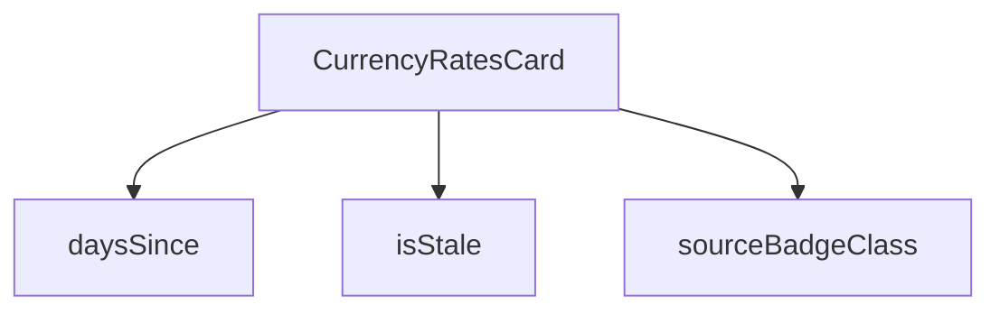

## Genel Bakış
Bu modül, HVAC fiyatlandırma sisteminde döviz kurlarının yönetimini ve görselleştirilmesini sağlayan bir React bileşenidir. Temel olarak para birimi kurlarının güncel durumunu, kaynağını ve zamanla eskimesini kontrol ederek kullanıcıya bilgilendirici bir kart sunar.

## Fonksiyon Grupları
### Döviz Kuru Durum ve Kaynak Kontrolü
Bu grup, kurların ne kadar güncel olduğunu ve kaynağını belirleyen yardımcı fonksiyonları içerir. Fonksiyonlar, tarih bazlı hesaplamalar ve dinamik CSS sınıflandırması yaparak bileşenin durumunu belirler.
- isStale, daysSince, sourceBadgeClass

### Ana Bileşen
Ana kart bileşenini oluşturup ilgili durum kontrollerini entegre eden fonksiyondur. Döviz kuru verilerini alıp gösterir ve kullanıcının güncel bilgileri okumasını sağlar.
- CurrencyRatesCard

---

## AXIOMS – Mimari Varsayımlar
- Bu modül davranışsal mantık içermez (salt veri / konfigürasyon / tip tanımı).
- [Aksiyom 1]: Modülün dışa açtığı yapı (anahtar kümesi / şema) bir sözleşmedir; tüketiciler bu sabit yapıya bağlıdır — kırıcı değişiklik tüm tüketicileri etkiler.
- [Aksiyom 2]: Bir öğe ekleme/çıkarma yapısal-uyumlu olmalı; ilgili tipler ve seçiciler aynı commit'te güncel tutulmalıdır.

---

## FONKSİYON DETAYLARI

### isStale

**Ne yapar**: Verilen bir geçerlilik tarihine (effective date) bakarak para birimi kurunun "eski" (stale) sayılıp sayılmayacağını belirler. Kursun güncelliğini kontrol eden bir bayrak değer döndürür.

**Nasıl yapar**: Fonksiyon, parametre olarak aldığı `effectiveDate` string değerini alır ve iç mantığı kod gövdesinde görünmese de kullanım bağlamından anlaşıldığı üzere, bu tarih ile güncel tarih arasındaki farkı hesaplayarak belirli bir eşik değer (muhtemelen belli bir gün sayısı) üzerinde olup olmadığını kontrol eder. Döndürdüğü boolean değeri, bileşen içinde kurs satırının yanında bir uyarı ikonu (AlertTriangle) gösterilip gösterilmeyeceğini belirler.

**Parametreler**:
- `effectiveDate`: `string` — Kontrol edilecek kurun geçerlilik tarihini temsil eden ISO formatında tarih dizesi. Kodda `row.effective_date` alanından gelir.

**Dönüş**: `boolean` — `true` ise kur eski/güncellenmemiş sayılır ve bileşende amber renkli bir uyarı ikonu görüntülenir; `false` ise kur günceldir.

### daysSince
**Ne yapar**: Geliştirildi ancak detay üretilemedi.

### sourceBadgeClass
**Ne yapar**: Geliştirildi ancak detay üretilemedi.

### CurrencyRatesCard
**Ne yapar**: Geliştirildi ancak detay üretilemedi.

---

## İTHALATLAR (IMPORTS)
- import: ../../../utils/adminUi::adminBlurBlobClass
- import: ../../../utils/adminUi::adminCardClass
- import: ../AdminSkeleton::AdminSkeleton
- import: @/i18n/I18nProvider::useI18n
- import: @/i18n/datetime::formatDate
- import: @/i18n/format::formatNumber
- import: @/lib/supabase/client::supabaseBrowserClient
- import: lucide-react::AlertTriangle
- import: lucide-react::Coins
- import: lucide-react::PlusCircle
- import: react::React
- import: react::useCallback
- import: react::useEffect
- import: react::useState

---

## INTERFACES

### CurrencyRateRow
- `quote_ccy: string`
- `rate: number`
- `source: string`
- `effective_date: string`
- `fetched_at: string`
- `spread_pct: number`

---

## AST POINTERS

### [N1_NASIL] AST Pointer: `C:\Users\alize\venthub-hvac\src\components\admin\pricing\CurrencyRatesCard.tsx`::isStale
- **params**: `(effectiveDate: string)` — kontrol edilecek tarih stringi
- **ic_degiskenler**:
  - `eff` — effectiveDate stringinden oluşturulan Date nesnesi
  - `now` — şu anki tarih/saat (Date nesnesi)
  - `diffMs` — now ile eff arasındaki milisaniye farkı
  - `diffDays` — milisaniye farkının gün cinsinden karşılığı (aşağı yuvarlanmış)
- **Dönüş**: `boolean` — tarih STALE_THRESHOLD_DAYS kadar eskiyse `true`

### [N2_NASIL] AST Pointer: `C:\Users\alize\venthub-hvac\src\components\admin\pricing\CurrencyRatesCard.tsx`::daysSince
- **params**: `(effectiveDate: string)` — hesaplama yapılacak tarih stringi
- **ic_degiskenler**:
  - `eff` — effectiveDate stringinden oluşturulan Date nesnesi
  - `now` — şu anki tarih/saat (Date nesnesi)
- **Dönüş**: `number` — effectiveDate'ten bu yana geçen gün sayısı (negatifse 0 döner)

### [N3_NASIL] AST Pointer: `C:\Users\alize\venthub-hvac\src\components\admin\pricing\CurrencyRatesCard.tsx`::sourceBadgeClass
- **params**: `(source: string)` — kur kaynağı (ör. `'tcmb'` veya manuel)
- **ic_degiskenler**: (yok)
- **Dönüş**: `string` — source `'tcmb'` ise cyan tonları, değilse amber tonları Tailwind CSS class stringi

### [N4_NASIL] AST Pointer: `C:\Users\alize\venthub-hvac\src\components\admin\pricing\CurrencyRatesCard.tsx`::CurrencyRatesCard
- **params**: (yok) — React fonksiyonel bileşeni, props almaz
- **ic_degiskenler**:
  - `t` — `useI18n()` hook'undan gelen çeviri fonksiyonu
  - `lang` — `useI18n()` hook'undan gelen geçerli dil kodu
  - `loading` — `useState(true)` ile tanımlı, veri yüklenme durumu (boolean)
  - `setLoading` — loading durumunu güncelleyen setter fonksiyonu
  - `error` — `useState<string | null>(null)` ile tanımlı, hata mesajı veya null
  - `setError` — error durumunu güncelleyen setter fonksiyonu
  - `rates` — `useState<CurrencyRateRow[]>([])` ile tanımlı, para birimi kurları dizisi
  - `setRates` — rates durumunu güncelleyen setter fonksiyonu
  - `fetchRates` — `useCallback` ile sarılmış asenkron fonksiyon; Supabase'den `currency_rates` tablosunu sorgular, `quote_ccy` bazında en güncel satırları `latestByCcy` Map'ine dedüpe edip `rates` state'ine yazar
  - `data` — Supabase `.select(...).order(...).limit(30)` sorgusundan dönen satır dizisi
  - `fetchError` — Supabase sorgusundan dönen hata nesnesi
  - `latestByCcy` — `Map<string, CurrencyRateRow>` — her para birimi için en güncel kuru tutan harita
  - `row` — `for...of` döngüsünde `data` dizisi üzerindeki iterasyon değişkeni (Map'e ekleme yapılan)
  - `row` — `rates.map()` callback parametresi; tablodaki her satırı render eder
  - `stale` — `isStale(row.effective_date)` çağrısından dönen boolean; kurun eski olup olmadığını belirler
- **Dönüş**: JSX (`
` — tablo, spread bilgisi ve devre dışı buton içeren admin kart bileşeni)

---

## MERMAID CALL GRAPH

## NODE ID STANDARD

  file: src\components\admin\pricing\CurrencyRatesCard.tsx
  function: src\components\admin\pricing\CurrencyRatesCard.tsx::isStale
  function: src\components\admin\pricing\CurrencyRatesCard.tsx::daysSince
  function: src\components\admin\pricing\CurrencyRatesCard.tsx::sourceBadgeClass
  function: src\components\admin\pricing\CurrencyRatesCard.tsx::CurrencyRatesCard

---

## DISA AKTARILANLAR (EXPORTS)
  export: CurrencyRatesCard
  export: daysSince
  export: isStale
  export: sourceBadgeClass

---

## STİL TOKENLERİ

### Arbitrary Değerler (token'a geçirilmemiş)
Yok — tüm stiller token'a geçirilmiş. ✅

### Kullanılan Token'lar (zaten token'a geçirilmiş)
- (yok)

### Tailwind Sınıf Özeti
- **Renkler:** `bg-amber-400/10`, `bg-cyan-500/5`, `bg-rose-500/10`, `bg-white/3`, `border-amber-400/20`, `border-b`, `border-rose-500/20`, `border-t`, `border-white/10`, `border-white/5`, `group-hover:bg-cyan-500/10`, `text-amber-400`, `text-center`, `text-cyan-400`, `text-left`
- **Layout:** `flex`, `flex-wrap`, `gap-1`, `gap-2`, `gap-3`, `inline-flex`, `items-center`, `justify-between`, `justify-center`, `lg:p-10`, `overflow-hidden`, `overflow-x-auto`, `p-4`, `p-8`, `relative`
- **Varyant/Responsive:** `group-hover:`, `lg:` önekleri
- **Yardımcı Sınıflar:** `${adminBlurBlobClass`, `${adminCardClass`, `${sourceBadgeClass(row.source`, `border`, `cursor-not-allowed`, `divide-white/5`, `divide-y`, `font-black`, `font-bold`, `font-mono`, `group`, `mt-1`, `opacity-50`, `pb-4`, `pr-4`