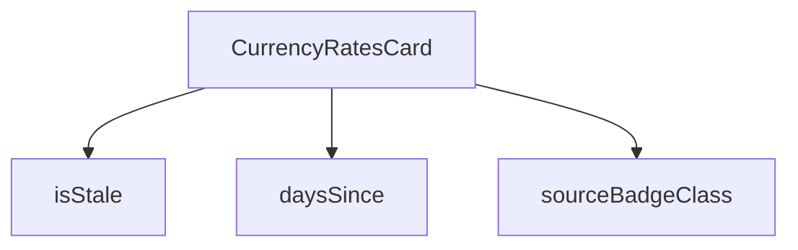

## Genel Bakış
Bu modül, HVAC fiyatlandırma sisteminde döviz kurlarının yönetimini ve görselleştirilmesini sağlayan bir React bileşenidir. Para birimi kurlarının güncel durumunu, kaynağını ve zamanla eskimesini kontrol ederek kullanıcıya bilgilendirici bir kart sunar.

## Fonksiyon Grupları
### Döviz Kuru Durum ve Kaynak Kontrolü
Bu grup, kurların ne kadar güncel olduğunu ve kaynağını belirleyen yardımcı fonksiyonları içerir. Tarih bazlı hesaplamalar ve dinamik CSS sınıflandırması yaparak bileşenin durumunu belirler.
- isStale, daysSince, sourceBadgeClass

### Ana Bileşen
Ana kart bileşenini oluşturup ilgili durum kontrollerini entegre eden fonksiyondur. Döviz kuru verilerini alıp gösterir ve kullanıcının güncel bilgileri okumasını sağlar.
- CurrencyRatesCard

---

## AXIOMS – Mimari Varsayımlar

Bu modül, döviz kurlarının zaman bazlı durumunu ve kaynağını değerlendirerek kullanıcıya sunan bir React bileşenidir.

[Aksiyom 1]: Eğer `isStale` fonksiyonuna geçerli bir tarih string'i sağlanmazsa, fonksiyon eskime durumunu doğru hesaplayamaz.

[Aksiyom 2]: Eğer `daysSince` fonksiyonuna geçerli bir tarih formatı verilmezse, gün sayısı hesaplaması yapılamaz.

[Aksiyom 3]: Eğer `sourceBadgeClass` fonksiyonuna bilinen bir kaynak değeri verilmezse, uygun CSS sınıfı belirlenemez.

[Aksiyom 4]: Eğer `CurrencyRatesCard` bileşeni döviz kuru verilerine erişemezse, kart boş veya hatalı durumda görüntülenir.

[Aksiyom 5]: Eğer `effectiveDate` parametresi bugünden yeterince eski bir tarih içeriyorsa, `isStale` fonksiyonu `true` döndürür; ancak eşik değeri fonksiyon gövdesinde tanımlıdır ve bu belgede belirtilmemiştir.

---

## FONKSİYON DETAYLARI

### isStale
**Ne yapar**: Verilen etkinlik tarihinin (effective date) güncel olup olmadığını kontrol eder. Tarih belirli bir süreden daha eski ise "stale" (bayatlamış/geçersiz) olarak değerlendirilir ve `true` döndürür.
**Nasıl yapar**: Fonksiyonun iç mantığı verilen kaynak kodunda gösterilmemiştir. Sadece imzası ve kullanım şekli bilinmektedir. Çağrıldığı yerde `row.effective_date` değeri parametre olarak iletilir ve dönüş değeri bir boolean olarak tablo satırında uyarı gösterilip gösterilmeyeceğini belirler.
**Parametreler**:
- effectiveDate: string — Kontrol edilecek tarih değeri, ISO formatında bir tarih string'i olması beklenir
**Dönüş**: boolean — Tarih eski/stale ise `true`, güncel ise `false` döner

### daysSince
**Ne yapar**: Geliştirildi ancak detay üretilemedi.

### sourceBadgeClass
**Ne yapar**: Geliştirildi ancak detay üretilemedi.

### CurrencyRatesCard
**Ne yapar**: Geliştirildi ancak detay üretilemedi.

---

## İTHALATLAR (IMPORTS)
- import: ../../../utils/adminUi::adminCardClass
- import: ../AdminSkeleton::AdminSkeleton
- import: @/i18n/I18nProvider::useI18n
- import: @/i18n/datetime::formatDate
- import: @/i18n/format::formatNumber
- import: @/lib/supabase/client::supabaseBrowserClient
- import: lucide-react::AlertTriangle
- import: lucide-react::Coins
- import: lucide-react::PlusCircle
- import: react::React
- import: react::useCallback
- import: react::useEffect
- import: react::useState

---

## INTERFACES

### CurrencyRateRow
- `quote_ccy: string`
- `rate: number`
- `source: string`
- `effective_date: string`
- `fetched_at: string`
- `spread_pct: number`

---

## AST POINTERS

### [N1_NASIL] AST Pointer: CurrencyRatesCard.tsx::isStale
- **params**: `effectiveDate: string`
- **ic_degiskenler**:
  - `eff` — `effectiveDate` parametresinden `new Date()` ile oluşturulan Date nesnesi; geçerlilik tarihini temsil eder
  - `now` — `new Date()` ile oluşturulan anlık tarih/saat nesnesi
  - `diffMs` — `now.getTime() - eff.getTime()` hesaplamasıyla elde edilen iki tarih arasındaki milisaniye farkı
  - `diffDays` — `diffMs` değerinin `Math.floor(diffMs / (1000 * 60 * 60 * 24))` formülüyle gün cinsine dönüştürülmüş tam sayı değeri
- **Dönüş**: `boolean` — `diffDays >= STALE_THRESHOLD_DAYS` koşulu sağlanıyorsa `true`, aksi halde `false`; ayrıca `eff.getTime()` `NaN` ise doğrudan `false` döner

### [N2_NASIL] AST Pointer: CurrencyRatesCard.tsx::daysSince
- **params**: `effectiveDate: string`
- **ic_degiskenler**:
  - `eff` — `effectiveDate` parametresinden `new Date()` ile oluşturulan Date nesnesi; geçerlilik tarihini temsil eder
  - `now` — `new Date()` ile oluşturulan anlık tarih/saat nesnesi
- **Dönüş**: `number` — `Math.max(0, Math.floor((now.getTime() - eff.getTime()) / (1000 * 60 * 60 * 24)))` formülüyle hesaplanan, 0'dan küçük olmayan gün sayısı; `eff.getTime()` `NaN` ise doğrudan `0` döner

### [N3_NASIL] AST Pointer: CurrencyRatesCard.tsx::sourceBadgeClass
- **params**: `source: string`
- **ic_degiskenler**: yok (tek ifadeli arrow function)
- **Dönüş**: `string` — `source === 'tcmb'` ise `'bg-admin-accent-weak border-admin-accent/30 text-admin-accent'`, aksi halde `'bg-admin-warning-weak border-admin-warning/30 text-admin-warning'` CSS sınıf dizesi

### [N4_NASIL] AST Pointer: CurrencyRatesCard.tsx::CurrencyRatesCard
- **params**: yok
- **ic_degiskenler**:
  - `t` — `useI18n()` hook'undan destructure edilen çeviri fonksiyonu; tablo başlıklarını, hata mesajlarını, buton metinlerini ve uyarılarda kullanılır
  - `lang` — `useI18n()` hook'undan destructure edilen dil kodu; `formatNumber` ve `formatDate` çağrılarına iletilir
  - `loading` — `useState(true)` ile tanımlanan boolean state; veri yüklenme durumunu kontrol eder
  - `setLoading` — `loading` state'ini güncelleyen setter fonksiyonu
  - `error` — `useState<string | null>(null)` ile tanımlanan state; yükleme hatası oluştuğunda hata mesajını tutar
  - `setError` — `error` state'ini güncelleyen setter fonksiyonu
  - `rates` — `useState<CurrencyRateRow[]>([])` ile tanımlanan state; her para birimi için en güncel kur satırlarını tutar
  - `setRates` — `rates` state'ini güncelleyen setter fonksiyonu
  - `fetchRates` — `useCallback` ile sarılmış async fonksiyon; Supabase'den `currency_rates` tablosunu sorgular, her `quote_ccy` için en güncel satırı `latestByCcy` Map'inde biriktirir ve `setRates` ile state'e yazar
- **Dönüş**: `JSX` — Dış sarmalayıcı `div` içinde başlık (Coins ikonu + çeviri başlık/altyazı), yükleme/hata/boş durum koşulları, kur tablosu (rates.map ile satırlar), spread bilgisi (rates.map ile etiketler) ve devre dışı "manuel kur ekle" butonu render eder

### [N5_NASIL] AST Pointer: CurrencyRatesCard.tsx::fetchRates (useCallback içinde)
- **params**: yok
- **ic_degiskenler**:
  - `data` — `supabase.from('currency_rates').select(...)` sorgusundan dönen veri dizisi; `quote_ccy`, `rate`, `source`, `effective_date`, `fetched_at`, `spread_pct` alanlarını içerir
  - `fetchError` — Supabase sorgusundan dönen hata nesnesi (`error` olarak yeniden adlandırılmış); varsa `throw` ile fırlatılır
  - `latestByCcy` — `new Map<string, CurrencyRateRow>()` ile oluşturulan Map; her `quote_ccy` için yalnızca ilk (en güncel) satırı tutar, çünkü veri `effective_date` ve `fetched_at` azalan sırayla gelir
  - `row` — `data` dizisi üzerindeki `for...of` döngüsündeki mevcut `CurrencyRateRow` nesnesi
  - `err` — `catch` bloğunda yakalanan hata; `instanceof Error` kontrolüyle `err.message` veya `String(err)` olarak `setError`'a iletilir
- **Dönüş**: yok (void) — yan etki: `setLoading(true/false)`, `setError(null/hata mesajı)`, `setRates(Array.from(latestByCcy.values()))` çağrılarıyla state güncellenir

### [N6_NASIL] AST Pointer: CurrencyRatesCard.tsx::useEffect callback
- **params**: yok
- **ic_degiskenler**: yok
- **Dönüş**: yok — `fetchRates()` fonksiyonunu çağırır; bağımlılık dizisi `[fetchRates]` ile yalnızca `fetchRates` değiştiğinde tetiklenir

### [N7_NASIL] AST Pointer: CurrencyRatesCard.tsx::rates.map (tablo satırları)
- **params**: `row` — `CurrencyRateRow` tipinde, rates dizisindeki tekil kur nesnesi
- **ic_degiskenler**:
  - `stale` — `isStale(row.effective_date)` çağrısının döndürüdüğü boolean; kurun güncel olup olmadığını belirler, `true` ise tarih yanında uyarı ikonu gösterilir
- **Dönüş**: `JSX` — `<tr>` elementi; dört `<td>` hücresi içerir: `row.quote_ccy` (para birimi kodu), `row.rate` (`formatNumber` ile biçimlendirilmiş kur), `row.source` (`sourceBadgeClass` ile CSS sınıfı uygulanmış etiket, `'tcmb'` ise çeviri anahtarı `sourceTcmb` aksi halde `sourceManual`), `row.effective_date` (`formatDate` ile biçimlendirilmiş tarih ve opsiyonel `stale` uyarısı)

### [N8_NASIL] AST Pointer: CurrencyRatesCard.tsx::rates.map (spread gösterimi)
- **params**: `row` — `CurrencyRateRow` tipinde, rates dizisindeki tekil kur nesnesi
- **ic_degiskenler**: yok
- **Dönüş**: `JSX` — `` elementi; `row.quote_ccy` ve `row.spread_pct` (`formatNumber` ile iki ondalık basamaklı biçimde) değerlerini yüzde işaretiyle birlikte gösterir

---

## MERMAID CALL GRAPH

## NODE ID STANDARD

  file: src\components\admin\pricing\CurrencyRatesCard.tsx
  function: src\components\admin\pricing\CurrencyRatesCard.tsx::isStale
  function: src\components\admin\pricing\CurrencyRatesCard.tsx::daysSince
  function: src\components\admin\pricing\CurrencyRatesCard.tsx::sourceBadgeClass
  function: src\components\admin\pricing\CurrencyRatesCard.tsx::CurrencyRatesCard

---

## DISA AKTARILANLAR (EXPORTS)
  export: CurrencyRatesCard
  export: daysSince
  export: isStale
  export: sourceBadgeClass

---

## STİL TOKENLERİ

### Arbitrary Değerler (token'a geçirilmemiş)
Yok — tüm stiller token'a geçirilmiş. ✅

### Kullanılan Token'lar (zaten token'a geçirilmiş)
- (yok)

### Tailwind Sınıf Özeti
- **Renkler:** `bg-admin-danger-weak`, `bg-admin-surface-2`, `bg-admin-warning-weak`, `border-admin-border`, `border-admin-danger/30`, `border-admin-warning/30`, `border-b`, `border-t`, `text-admin-accent`, `text-admin-danger`, `text-admin-fg`, `text-admin-fg-muted`, `text-admin-warning`, `text-center`, `text-left`
- **Layout:** `flex`, `flex-wrap`, `gap-1`, `gap-2`, `gap-3`, `inline-flex`, `items-center`, `justify-between`, `justify-center`, `lg:p-10`, `overflow-hidden`, `overflow-x-auto`, `p-4`, `p-8`, `relative`
- **Varyant/Responsive:** `lg:` önekleri
- **Yardımcı Sınıflar:** `${adminCardClass`, `${sourceBadgeClass(row.source`, `border`, `cursor-not-allowed`, `divide-admin-border`, `divide-y`, `font-bold`, `font-mono`, `font-semibold`, `group`, `mt-1`, `opacity-50`, `pb-4`, `pr-4`, `pt-6`