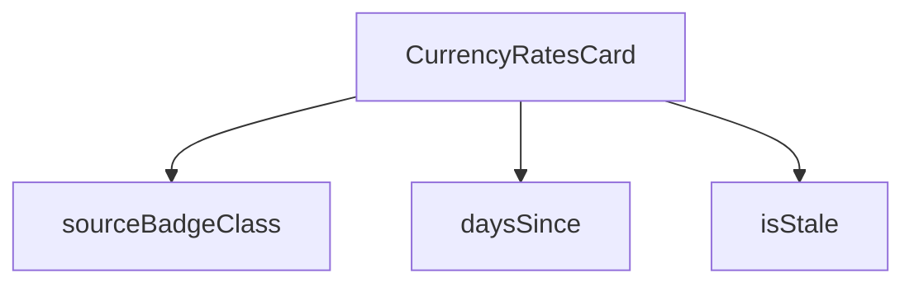

## Genel Bakış
Bu modül, HVAC fiyatlandırma sisteminde döviz kurlarının yönetimini ve görselleştirilmesini sağlayan bir React bileşenidir. Para birimi kurlarının güncel durumunu, kaynağını ve zamanla eskimesini kontrol ederek kullanıcıya bilgilendirici bir kart sunar.

## Fonksiyon Grupları
### Döviz Kuru Durum ve Kaynak Kontrolü
Kurların ne kadar güncel olduğunu ve kaynağını belirleyen yardımcı fonksiyonları içerir. Tarih bazlı hesaplamalar ve dinamik CSS sınıflandırması yaparak bileşenin durumunu belirler.
- isStale, daysSince, sourceBadgeClass

### Ana Bileşen
Ana kart bileşenini oluşturup ilgili durum kontrollerini entegre eder. Döviz kuru verilerini alıp gösterir ve kullanıcının güncel bilgileri okumasını sağlar.
- CurrencyRatesCard

---

## AXIOMS – Mimari Varsayımlar

Bu modül için özel aksiyom tanımlanmamıştır. Fonksiyon gövdeleri sağlanmadığından, yalnızca imzalardan mimari varsayım çıkarımı yapılamaz.

---

## FONKSİYON DETAYLARI

### isStale
**Ne yapar**: Verilen bir tarihin (effectiveDate) güncel olup olmadığını kontrol eder. Eğer tarih belirli bir süreden daha eskiyse "stale" (bayat/geçersiz) olarak kabul edilir ve `true` döndürür; aksi halde `false` döndürür. Döviz kuru verilerinin ne kadar güncel olduğunu takip etmek için kullanılır.

**Nasıl yapar**: Fonksiyonun iç mantığı verilen kaynak kodda gösterilmemiştir. Sadece imzası ve dönüş tipi bilinmektedir. Muhtemelen verilen tarih ile bugün arasındaki farkı hesaplayarak belirli bir eşik değerini aşıp aşmadığını kontrol eder.

**Parametreler**:
- effectiveDate: string — Kontrol edilecek tarihi temsil eden string değer. "YYYY-MM-DD" formatında bir tarih olması beklenir.

**Dönüş**: boolean — Tarih eski/stale ise `true`, güncel ise `false` döndürür.

### daysSince
**Ne yapar**: Geliştirildi ancak detay üretilemedi.

### sourceBadgeClass
**Ne yapar**: Geliştirildi ancak detay üretilemedi.

### CurrencyRatesCard
**Ne yapar**: Geliştirildi ancak detay üretilemedi.

---

## İTHALATLAR (IMPORTS)
- import: ../../../utils/adminUi::adminCardClass
- import: ../AdminSkeleton::AdminSkeleton
- import: @/i18n/I18nProvider::useI18n
- import: @/i18n/datetime::formatDate
- import: @/i18n/format::formatNumber
- import: @/lib/supabase/client::supabaseBrowserClient
- import: lucide-react::AlertTriangle
- import: lucide-react::Coins
- import: lucide-react::PlusCircle
- import: react::React
- import: react::useCallback
- import: react::useEffect
- import: react::useState

---

## INTERFACES

### CurrencyRateRow
- `quote_ccy: string`
- `rate: number`
- `source: string`
- `effective_date: string`
- `fetched_at: string`
- `spread_pct: number`

---

## AST POINTERS

### [N1_NASIL] AST Pointer: src/components/admin/pricing/CurrencyRatesCard.tsx::isStale
- **params**: `effectiveDate: string`
- **ic_degiskenler**:
  - `eff` — `effectiveDate` parametresinden `new Date()` ile oluşturulan Date nesnesi
  - `now` — mevcut zamanı temsil eden `new Date()` nesnesi
  - `diffMs` — `now.getTime()` ile `eff.getTime()` arasındaki milisaniye farkı
  - `diffDays` — `diffMs` değerinin gün cinsinden karşılığı; `Math.floor(diffMs / (1000 * 60 * 60 * 24))` ile hesaplanır
- **Dönüş**: `boolean` — `eff` geçerli bir tarih değilse `false`; aksi halde `diffDays >= STALE_THRESHOLD_DAYS` koşulunun sonucu

### [N2_NASIL] AST Pointer: src/components/admin/pricing/CurrencyRatesCard.tsx::daysSince
- **params**: `effectiveDate: string`
- **ic_degiskenler**:
  - `eff` — `effectiveDate` parametresinden `new Date()` ile oluşturulan Date nesnesi
  - `now` — mevcut zamanı temsil eden `new Date()` nesnesi
- **Dönüş**: `number` — `eff` geçerli bir tarih değilse `0`; aksi halde `Math.max(0, Math.floor((now.getTime() - eff.getTime()) / (1000 * 60 * 60 * 24)))` sonucu (negatif olamaz)

### [N3_NASIL] AST Pointer: src/components/admin/pricing/CurrencyRatesCard.tsx::sourceBadgeClass
- **params**: `source: string`
- **ic_degiskenler**: yok (tek ifadeli arrow function)
- **Dönüş**: `string` — `source === 'tcmb'` ise `'bg-admin-accent-weak border-admin-accent/30 text-admin-accent'`; aksi halde `'bg-admin-warning-weak border-admin-warning/30 text-admin-warning'`

### [N4_NASIL] AST Pointer: src/components/admin/pricing/CurrencyRatesCard.tsx::CurrencyRatesCard
- **params**: yok
- **ic_degiskenler**:
  - `t` — `useI18n()` kancasından gelen çeviri fonksiyonu; `t('admin.pricing.settings.currencyRates.title')` gibi anahtarlarla metin üretmek için kullanılır
  - `lang` — `useI18n()` kancasından gelen dil kodu; `formatNumber` ve `formatDate` fonksiyonlarına iletilir
  - `loading` — `useState(true)` ile oluşturulan boolean state; veri yüklenme durumunu gösterir
  - `setLoading` — `loading` state'ini güncelleyen setter fonksiyonu
  - `error` — `useState<string | null>(null)` ile oluşturulan state; hata mesajını tutar, yoksa `null`
  - `setError` — `error` state'ini güncelleyen setter fonksiyonu
  - `rates` — `useState<CurrencyRateRow[]>([])` ile oluşturulan state; her para birimi için en güncel kur satırlarını tutar
  - `setRates` — `rates` state'ini güncelleyen setter fonksiyonu
  - `fetchRates` — `useCallback` ile sarılmış async fonksiyon; `supabase` üzerinden `currency_rates` tablosundan veri çeker, her `quote_ccy` için en güncel satırı `latestByCcy` Map'inde biriktirir ve `setRates` ile state'e yazar
- **Dönüş**: `JSX.Element` — Dış sarmalayıcı `div` (adminCardClass ile); içinde başlık, koşullu içerik (loading skeleton / hata uyarısı / boş mesaj / kur tablosu), spread bilgisi ve devre dışı "manuel kur ekle" butonu bulunur

### [N5_NASIL] AST Pointer: src/components/admin/pricing/CurrencyRatesCard.tsx::fetchRates (useCallback)
- **params**: yok
- **ic_degiskenler**:
  - `data` — `supabase.from('currency_rates').select(...)` sorgusundan dönen satır dizisi; `quote_ccy, rate, source, effective_date, fetched_at, spread_pct` alanlarını içerir
  - `fetchError` — supabase sorgusundan dönen hata nesnesi; varsa `throw` ile yakalanır
  - `latestByCcy` — `new Map<string, CurrencyRateRow>()` ile oluşturulan Map; her `quote_ccy` için yalnızca ilk (en güncel) satırı saklar
  - `row` — `data` dizisi üzerindeki `for...of` döngüsündeki mevcut satır; `row.quote_ccy` anahtar olarak kullanılır
  - `err` — `catch` bloğunda yakalanan hata; `instanceof Error` kontrolüyle `err.message` veya `String(err)` olarak `setError`'a yazılır
- **Dönüş**: yok (void) — yan etki olarak `setLoading`, `setError`, `setRates` state setter'larını çağırır

### [N6_NASIL] AST Pointer: src/components/admin/pricing/CurrencyRatesCard.tsx::useEffect callback
- **params**: yok
- **ic_degiskenler**: yok
- **Dönüş**: yok — bileşen mount edildiğinde ve `fetchRates` değiştiğinde `fetchRates()` çağrısını tetikler

### [N7_NASIL] AST Pointer: src/components/admin/pricing/CurrencyRatesCard.tsx::rates.map (tablo satırları)
- **params**: `row` — `CurrencyRateRow` tipinde; `quote_ccy`, `rate`, `source`, `effective_date` alanlarına erişilir
- **ic_degiskenler**:
  - `stale` — `isStale(row.effective_date)` çağrısının sonucu; kurun güncel olup olmadığını belirten boolean
- **Dönüş**: `JSX.Element` — `<tr>` satırı; para birimi adı, `formatNumber` ile biçimlendirilmiş kur, `sourceBadgeClass` ile CSS sınıfı atanmış kaynak etiketi, `formatDate` ile biçimlendirilmiş tarih ve `stale` ise `daysSince` ile hesaplanmış gün sayısıyla uyarı ikonu içerir

### [N8_NASIL] AST Pointer: src/components/admin/pricing/CurrencyRatesCard.tsx::rates.map (spread gösterimi)
- **params**: `row` — `CurrencyRateRow` tipinde; `quote_ccy` ve `spread_pct` alanlarına erişilir
- **ic_degiskenler**: yok
- **Dönüş**: `JSX.Element` — `` etiketi; `row.quote_ccy` ve `formatNumber(row.spread_pct, lang, ...)` ile yüzde biçiminde spread değerini gösterir

---

## MERMAID CALL GRAPH

## NODE ID STANDARD

  file: src\components\admin\pricing\CurrencyRatesCard.tsx
  function: src\components\admin\pricing\CurrencyRatesCard.tsx::isStale
  function: src\components\admin\pricing\CurrencyRatesCard.tsx::daysSince
  function: src\components\admin\pricing\CurrencyRatesCard.tsx::sourceBadgeClass
  function: src\components\admin\pricing\CurrencyRatesCard.tsx::CurrencyRatesCard

---

## DISA AKTARILANLAR (EXPORTS)
  export: CurrencyRatesCard
  export: daysSince
  export: isStale
  export: sourceBadgeClass

---

## STİL TOKENLERİ

### Arbitrary Değerler (token'a geçirilmemiş)
Yok — tüm stiller token'a geçirilmiş. ✅

### Kullanılan Token'lar (zaten token'a geçirilmiş)
- (yok)

### Tailwind Sınıf Özeti
- **Renkler:** `bg-admin-danger-weak`, `bg-admin-surface-2`, `bg-admin-warning-weak`, `border-admin-border`, `border-admin-danger/30`, `border-admin-warning/30`, `border-b`, `border-t`, `text-admin-accent`, `text-admin-danger`, `text-admin-fg`, `text-admin-fg-muted`, `text-admin-warning`, `text-center`, `text-left`
- **Layout:** `flex`, `flex-wrap`, `gap-1`, `gap-2`, `gap-3`, `inline-flex`, `items-center`, `justify-between`, `justify-center`, `lg:p-10`, `overflow-hidden`, `overflow-x-auto`, `p-4`, `p-8`, `relative`
- **Varyant/Responsive:** `lg:` önekleri
- **Yardımcı Sınıflar:** `${adminCardClass`, `${sourceBadgeClass(row.source`, `border`, `cursor-not-allowed`, `divide-admin-border`, `divide-y`, `font-bold`, `font-mono`, `font-semibold`, `group`, `mt-1`, `opacity-50`, `pb-4`, `pr-4`, `pt-6`