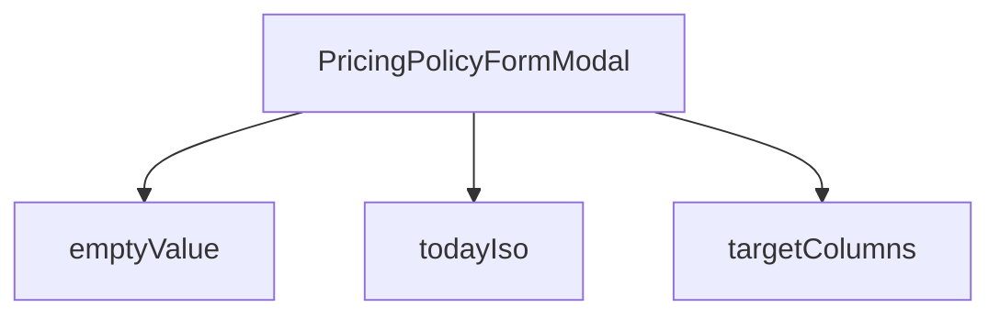

## Genel Bakış
Bu modül, yönetim panelinde fiyat politikası oluşturma ve düzenleme işlemlerini gerçekleştiren bir modal form bileşenidir. Bileşen, dışarıdan aldığı `open`, `policy`, `onClose` ve `onSaved` parametreleriyle açılış/kapanış durumunu ve veri akışını yönetir. Form alanı varsayılan değerlerini, tarih bilgisini ve hedef sütun yapılandırmalarını hazırlayan yardımcı fonksiyonlar içerir.

## Fonksiyon Grupları

### Form Değer ve Yapılandırma Yardımcıları
Formun ihtiyaç duyduğu başlangıç değerlerini, güncel tarih bilgisini ve hedef sütun tanımlarını hazırlayan yardımcı fonksiyonlardır. Ana bileşen bu fonksiyonları form alanlarını başlatmak ve yapılandırmak için kullanır.
- emptyValue, todayIso, targetColumns

### Ana Bileşen
Fiyat politikası formunun modal pencere içinde görüntülenmesinden, kullanıcı etkileşimlerinin işlenmesinden ve kaydetme/kapatma aksiyonlarının tetiklenmesinden sorumludur. Dışarıdan gelen politika verisiyle formu doldurur veya boş değerlerle yeni kayıt modunda açar.
- PricingPolicyFormModal

---

## AXIOMS – Mimari Varsayımlar
- Bu modül davranışsal mantık içermez (salt veri / konfigürasyon / tip tanımı).
- [Aksiyom 1]: Modülün dışa açtığı yapı (anahtar kümesi / şema) bir sözleşmedir; tüketiciler bu sabit yapıya bağlıdır — kırıcı değişiklik tüm tüketicileri etkiler.
- [Aksiyom 2]: Bir öğe ekleme/çıkarma yapısal-uyumlu olmalı; ilgili tipler ve seçiciler aynı commit'te güncel tutulmalıdır.

---

## FONKSİYON DETAYLARI

### emptyValue
**Ne yapar**: `PolicyFormValue` tipinde, form alanlarının başlangıç değerlerini içeren boş bir nesne döndürür. Yeni bir fiyat politikası oluşturulurken formun varsayılan durumunu temsil eder.
**Nasıl yapar**: Sabit değerlere sahip bir nesne literal'ı döndürür. `scope` değeri `4`, `fxLock` ve `isActive` değerleri `true`, `priority` değeri `0` olarak ayarlanmıştır. `id`, `targetId` ve `frozenRate` alanları `null`, `note` alanı boş string olarak başlatılır.
**Parametreler**:
- Bu fonksiyon parametre almaz.
**Dönüş**: `PolicyFormValue` — Form değerlerini temsil eden nesne. Alanları: `id` (null), `scope` (4), `targetId` (null), `fxLock` (true), `note` (''), `priority` (0), `isActive` (true), `frozenRate` (null).

### targetColumns
**Ne yapar**: Geliştirildi ancak detay üretilemedi.

### todayIso
**Ne yapar**: Geliştirildi ancak detay üretilemedi.

### PricingPolicyFormModal
**Ne yapar**: Geliştirildi ancak detay üretilemedi.

---

## İTHALATLAR (IMPORTS)
- import: ./RuleScopeTargetPicker::RuleScopeTargetPicker
- import: @/components/admin/overlay/AdminModal::AdminModal
- import: @/hooks/useRole::useRole
- import: @/i18n/I18nProvider::useI18n
- import: @/lib/admin/mutateWithAudit::AdminPermissionError
- import: @/lib/admin/mutateWithAudit::mutateWithAudit
- import: @/lib/services/fxLockAdmin.service::resolveFxLockFreeze
- import: @/lib/services/fxLockAdmin.service::type FxLockFreezeDecision
- import: @/lib/supabase/client::supabaseBrowserClient
- import: lucide-react::AlertTriangle
- import: lucide-react::Lock
- import: react::React
- import: react::useCallback
- import: react::useEffect
- import: react::useState
- import: sonner::toast

---

## INTERFACES

### PolicyFormValue
KUR KİLİDİ FORMU (FX-LOCK 2/2b · pricing-standard §8). TEK TASARIM KARARI, HER ŞEYİ AÇIKLAYAN: **dondurulan kur ELLE GİRİLMEZ.** Kur bir tercih değil bir ÖLÇÜMDÜR; admin'e yazdırmak, kilidin künyesini (`fx_frozen_rate`) uydurulabilir bir alana çevirirdi ve "bu fiyat neden güncellenmedi" sorusunun ce
- `id: string | null`
- `scope: number`
- `targetId: string | null`
- `fxLock: boolean`
- `note: string`
- `priority: number`
- `isActive: boolean`
- `frozenRate: number | null`

### PricingPolicyFormModalProps
- `open: boolean`
- `policy: PolicyFormValue | null`
- `onClose: () => void`
- `onSaved: () => void`

---

## SABİTLER
- **SCOPE_OPTIONS** (array) — `[
  { value: 1, key: 'product' },
  { value: 2, key: 'brand' },
  { value:...`

---

## AST POINTERS

### [N1_NASIL] AST Pointer: PricingPolicyFormModal.tsx::emptyValue
- **params**: (parametre yok)
- **ic_degiskenler**: (iç değişken yok — doğrudan sabit obje döndürülür)
- **Dönüş**: `PolicyFormValue` tipinde obje. Alanları: `id` (null), `scope` (4), `targetId` (null), `fxLock` (true), `note` (''), `priority` (0), `isActive` (true), `frozenRate` (null)

---

## MERMAID CALL GRAPH

## NODE ID STANDARD

  file: src\components\admin\pricing\PricingPolicyFormModal.tsx
  function: src\components\admin\pricing\PricingPolicyFormModal.tsx::emptyValue
  function: src\components\admin\pricing\PricingPolicyFormModal.tsx::targetColumns
  function: src\components\admin\pricing\PricingPolicyFormModal.tsx::todayIso
  function: src\components\admin\pricing\PricingPolicyFormModal.tsx::PricingPolicyFormModal

---

## DISA AKTARILANLAR (EXPORTS)
  export: PricingPolicyFormModal
  export: emptyValue
  export: targetColumns
  export: todayIso

---

## STİL TOKENLERİ

### Arbitrary Değerler (token'a geçirilmemiş)
Yok — tüm stiller token'a geçirilmiş. ✅

### Kullanılan Token'lar (zaten token'a geçirilmiş)
- (yok)

### Tailwind Sınıf Özeti
- **Renkler:** `text-admin-accent`, `text-admin-danger`, `text-admin-fg`, `text-admin-fg-muted`, `text-admin-warning`, `text-sm`, `text-xs`
- **Layout:** `block`, `flex`, `gap-2`, `gap-3`, `items-center`, `items-start`, `justify-end`
- **Varyant/Responsive:** (yok)
- **Yardımcı Sınıflar:** `font-mono`, `font-semibold`, `italic`, `mt-0.5`, `mt-1`, `shrink-0`, `space-y-4`