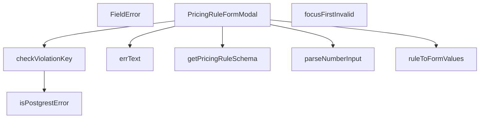

## Genel Bakış
Bu modül, yönetici panelinde fiyatlandırma kurallarını oluşturmak veya düzenlemek için kullanılan bir modal form bileşenidir. Ana bileşen, form alanlarını dinamik olarak oluşturur, kullanıcının girdiği verileri doğrular ve sunucuya kaydederken oluşabilecek hataları (örn. benzersizlik ihlallerini) işler. Modül, form şeması tanımlamadan hata ayıklamaya kadar tüm form yaşam döngüsünü merkezi olarak yönetir.

## Fonksiyon Grupları
### Form Şeması ve Veri Dönüşümü
Form alanlarının yapısını, doğrulama kurallarını ve varsayılan değerlerini tanımlar; ayrıca mevcut bir kural kaydını formun kullanabileceği formata dönüştürür.
- `getPricingRuleSchema`, `ruleToFormValues`

### Girdi İşleme ve Doğrulama
Kullanıcıdan alınan ham girdileri (özellikle sayısal alanları) uygun türlere dönüştürür, form doğrulama hatalarını kullanıcıya gösterilecek biçime getirir ve ilk geçersiz alana otomatik odaklanmayı sağlar.
- `parseNumberInput`, `FieldError`, `focusFirstInvalid`

### Hata Yönetimi
Veritabanından veya API'den dönen hataları analiz eder; özellikle benzersizlik ihlali gibi iş kuralları hatalarını tanır ve insan tarafından okunabilir hata metinleri üretir.
- `isPostgrestError`, `checkViolationKey`, `errText`

### Ana Bileşen
Tüm yardımcı fonksiyonları bir araya getirerek modalın açılmasını, formun gönderilme sürecini ve durum yönetimini koordine eden üst düzey React bileşenidir.
- `PricingRuleFormModal`

---

## AXIOMS – Mimari Varsayımlar
- Bu modül davranışsal mantık içermez (salt veri / konfigürasyon / tip tanımı).
- [Aksiyom 1]: Modülün dışa açtığı yapı (anahtar kümesi / şema) bir sözleşmedir; tüketiciler bu sabit yapıya bağlıdır — kırıcı değişiklik tüm tüketicileri etkiler.
- [Aksiyom 2]: Bir öğe ekleme/çıkarma yapısal-uyumlu olmalı; ilgili tipler ve seçiciler aynı commit'te güncel tutulmalıdır.

---

## FONKSİYON DETAYLARI

### getPricingRuleSchema
**Ne yapar**: Fiyatlandırma kuralları formunun validasyon şemasını (Zod şemasını) oluşturmak için gerekli fonksiyonu döndürür.
**Nasıl yapar**: Fonksiyon, bir `t` (çeviri/i18n fonksiyonu) parametresi alır ve bu parametreyi, oluşturacağı validasyon şeması içindeki hata mesajlarını uluslararasılaştırmak için kullanır. Sonuç olarak, bir sonraki aşamada çağrılacak olan bir şema oluşturucu fonksiyonun referansını döndürür.
**Parametreler**:
- `t`: `(key: string) => string` — Çeviri anahtarlarını yerel metne dönüştüren i18n fonksiyonu.
**Dönüş**: Şema oluşturucu bir fonksiyonu döndürür. Belirli dönüş tipi dokümante edilmemiş ancak kullanım amacına göre bir Zod şema fonksiyonudur.

### ruleToFormValues
**Ne yapar**: Veritabanından gelen bir fiyatlandırma kuralı nesnesini (`PricingRuleRow`), form bileşeninin state'ine uygun formata dönüştürür.
**Nasıl yapar**: Girdi nesnesindeki her bir alanı, formun başlangıç değerleriyle eşleşecek şekilde haritalandırır. `method` alanı gibi bazı alanlar değer dönüşümüne uğrar (örn: `'fixed'` dışındaki tüm değerler `'cost_plus'a` dönüştürülür). `currency`, `valid_from`, `valid_to` gibi boş olabilen alanlar için `?? ''` (nullish coalescing) kullanarak varsayılan boş dize atanır.
**Parametreler**:
- `rule`: `PricingRuleRow` — Veritabanından gelen, kuralın mevcut durumunu temsil eden nesne.
**Dönüş**: `PricingRuleFormValues` — Formun state'ine atanacak, tüm alanların başlangıç değerlerini içeren nesne.

### parseNumberInput
**Ne yapar**: Form girişinden gelen ham sayıyı temsil eden dizeyi, JavaScript'teki kullanılabilir bir sayısal değere veya `null`'a dönüştürür.
**Nasıl yapar**: Girdi dizesinin başındaki ve sonundaki boşlukları temizler, ondalık ayracı olarak virgül (`','`) kullanımını nokta (`'.'`) ile değiştirir (TR-ABD localize sorunlarını önler). Eğer temizlenmiş dize boş ise `null`, aksi takdirde `Number()` fonksiyonu ile dönüştürme yapar. Geçerli olmayan bir dize girişinde `NaN` döner, bu değer daha sonra form validasyonu (Zod) tarafından yakalanır.
**Parametreler**:
- `raw`: `string` — Formdaki bir sayısal alanın ham dize giriş değeri.
**Dönüş**: `number | null` — Başarılı dönüşümde sayıyı, boş girişte `null`, geçersiz girişte `NaN` döner.

### isPostgrestError
**Ne yapar**: Bir hata nesnesinin, Supabase/PostgREST tarafından fırlatılan belirli bir hata yapısına (`PostgrestError`) sahip olup olmadığını kontrol eder.
**Nasıl yapar**: Hata nesnesinin bir `object` olduğunu, `null` olmadığını ve `code` ile `message` özelliklerine sahip olduğunu kontrol eden bir tip koruması (type guard) fonksiyonudur. TypeScript'in `error is PostgrestError` dönüş tipi, fonksiyon `true` döndüğünde orijinal `error` değişkeninin `PostgrestError` tipine sahip olduğunu doğrular.
**Parametreler**:
- `error`: `unknown` — İşlenecek herhangi bir hata nesnesi.
**Dönüş**: `error is PostgrestError` (boolean) — Hatanın `PostgrestError` yapısına uygun olup olmadığı.

### checkViolationKey
**Ne yapar**: Postgres veritabanı `CHECK`straint ihlali (`23514` hata kodu) oluşan bir hatayı analiz ederek, kullanıcıya gösterilecek i18n hata mesajı anahtarını döndürür.
**Nasıl yapar**: Öncelikle `isPostgrestError` ile hatanın PostgREST hatası olup olmadığını ve kodunun `'23514'` olup olmadığını kontrol eder. Ardından, hata mesajı ve detaylarını birleştirip içinde anahtar kelimeleri arar. Tespit ettiği CHECK constraint adına göre önceden tanımlı, kullanıcıya anlamlı i18n mesaj anahtarlarını döndürür. Ham SQL hata metnini doğrudan göstermez, böylece veritabanı şema detayları kullanıcından gizlenir.
**Parametreler**:
- `error`: `unknown` — İşlenecek hata nesnesi.
**Dönüş**: `string | null` — Eşleşen bir CHECK constraint bulunursa i18n mesaj anahtarı, aksi halde `null`.

### errText
**Ne yapar**: React Hook Form (RHF) kütüphanesinden gelen hata mesajını güvenli bir şekilde string türüne daraltır. RHF'nin `FieldError` tipindeki `message` alanı `unknown` olarak tanımlıdır; bu fonksiyon, `any` kullanmadan bu değeri `string` ya da `undefined` olarak döndürerek tip güvenliği sağlar.

**Nasıl yapar**: Gelen `message` parametresinin türünü kontrol eder. Eğer değer bir string ise onu string olarak döndürür; aksi halde `undefined` döndürür. Bu sayede `any` türüne başvurmadan tip daraltma (type narrowing) işlemi gerçekleştirilir.

**Parametreler**:
- `message: unknown` — React Hook Form'un hata nesnesinden gelen mesaj değeri. Türü önceden bilinmediği için `unknown` olarak tanımlanmıştır.

**Dönüş**: `string | undefined` — Eğer gelen mesaj bir string ise o string değerini; değilse `undefined` döndürür.

### FieldError
**Ne yapar**: Geliştirildi ancak detay üretilemedi.

### focusFirstInvalid
**Ne yapar**: Geliştirildi ancak detay üretilemedi.

### PricingRuleFormModal
**Ne yapar**: Bir fiyatlandırma kuralı oluşturmak veya düzenlemek için açılan modal form bileşenini temsil eder.
**Nasıl yapar**: Bu bir React fonksiyonel bileşenidir. `open`, `rule`, `onClose` ve `onSaved` prop'larını alır. `open` prop'u modal'ın görünür olup olmadığını kontrol eder. Düzenleme modunda ise `rule` prop'u ile mevcut kural değerleri form alanlarına doldurulur. Form gönderildiğinde `onSaved` callback'i ile üst bileşene bildirimde bulunur ve `onClose` ile kapanır.
**Parametreler**:
- `open`: `boolean` — Modal'ın açık olup olmadığını belirler.
- `rule`: `PricingRuleRow` (opsiyonel) — Düzenleme modunda, formun önceden doldurulacağı kural nesnesi.
- `onClose`: `() => void` — Modal kapatılmak istendiğinde çağrılan fonksiyon.
- `onSaved`: `(saved: PricingRuleRow) => void` — Kural başarıyla kaydedildiğinde çağrılan fonksiyon.
**Dönüş**: `React.FC<PricingRuleFormModalProps>` — React fonksiyonel bileşeni.

---

## İTHALATLAR (IMPORTS)
- import: ../overlay/ConfirmProvider::useConfirm
- import: ./RuleScopeTargetPicker::RuleScopeTargetPicker
- import: @/hooks/useRole::useRole
- import: @/i18n/I18nProvider::useI18n
- import: @/i18n/format::formatCurrency
- import: @/i18n/format::formatNumber
- import: @/lib/admin/mutateWithAudit::AdminPermissionError
- import: @/lib/admin/mutateWithAudit::mutateWithAudit
- import: @/lib/supabase/client::supabaseBrowserClient
- import: @hookform/resolvers/zod::zodResolver
- import: @radix-ui/react-dialog
- import: @supabase/supabase-js::type { PostgrestError }
- import: lucide-react::AlertTriangle
- import: lucide-react::Loader2
- import: lucide-react::Save
- import: lucide-react::X
- import: react-hook-form::type { FieldErrors }
- import: react-hook-form::useForm
- import: react::React
- import: react::useCallback
- import: react::useEffect
- import: react::useMemo
- import: react::useState
- import: sonner::toast
- import: zod::z

---

## INTERFACES

### ImpactSample
- `product: SampleProduct`
- `beforeGross: number | null`

### PricingRuleFormModalProps
- `open: boolean`
- `rule: PricingRuleRow | null`
- `onClose: () => void`
- `onSaved: () => void`

---

## TYPE ALIASES

### RateInputMode
```typescript
type RateInputMode = 'percent' | 'coefficient' | 'fixed'
```

### PricingRuleFormValues
```typescript
type PricingRuleFormValues = z.infer<ReturnType<typeof getPricingRuleSchema>>
```

---

## SABİTLER
- **EMPTY_VALUES** (object) — `{
  scope: 4,
  product_id: null,
  brand_id: null,
  category_id: null,
...`
- **FIELD_FOCUS_ORDER** (array) — `[
  { name: 'margin_pct', id: 'rule-rate' },
  { name: 'fixed_price', id: '...`

---

## AST POINTERS

### [N1_NASIL] AST Pointer: PricingRuleFormModal.tsx::getPricingRuleSchema
- **params**: `t` — çeviri fonksiyonu, `key: string` alır ve `string` döndürür
- **ic_degiskenler**:
  - `v` — superRefine callback'inde doğrulanan form değerleri objesi
  - `ctx` — Zod doğrulama context'i, `addIssue` metoduyla hata ekler
  - `targetIssue` — scope hedef alanı eksik olduğunda hata ekleyen yardımcı fonksiyon; `path` parametresi `'product_id' | 'brand_id' | 'category_id'` alır
  - `path` — `targetIssue` fonksiyonuna iletilen alan adı
- **Dönüş**: z.object Zod şeması (superRefine ile genişletilmiş)

### [N2_NASIL] AST Pointer: PricingRuleFormModal.tsx::ruleToFormValues
- **params**: `rule` — `PricingRuleRow` tipinde veritabanı satırı
- **ic_degiskenler**: yok (doğrudan return objesi oluşturulur)
- **Dönüş**: `PricingRuleFormValues` objesi

### [N3_NASIL] AST Pointer: PricingRuleFormModal.tsx::parseNumberInput
- **params**: `raw` — ham string input
- **ic_degiskenler**:
  - `normalized` — `raw` değerinin trimlenmiş ve virgülün noktaya çevrilmiş hali
- **Dönüş**: `number | null` — boş string ise `null`, aksi halde `Number(normalized)`

### [N4_NASIL] AST Pointer: PricingRuleFormModal.tsx::isPostgrestError
- **params**: `error` — `unknown` tipinde hata
- **ic_degiskenler**: yok
- **Dönüş**: `boolean` — type guard; `error` obje, null değil, `code` ve `message` alanlarına sahipse `true`

### [N5_NASIL] AST Pointer: PricingRuleFormModal.tsx::checkViolationKey
- **params**: `error` — `unknown` tipinde hata
- **ic_degiskenler**:
  - `detail` — `error.message` ve `error.details` değerlerinin birleştirilmiş string hali
- **Dönüş**: `string | null` — constraint violation mesaj anahtarı veya `null`

### [N6_NASIL] AST Pointer: PricingRuleFormModal.tsx::errText
- **params**: `message` — `unknown` tipinde hata mesajı
- **ic_degiskenler**: gövde verilmemiş
- **Dönüş**: `string | undefined`

### [N7_NASIL] AST Pointer: PricingRuleFormModal.tsx::FieldError
- **params**: `id` — input element ID'si (`string`), `message` — hata mesajı (`string`, opsiyonel)
- **ic_degiskenler**: yok
- **Dönüş**: JSX element veya `null` — `message` varsa `<p>` etiketi, yoksa `null`

### [N8_NASIL] AST Pointer: PricingRuleFormModal.tsx::focusFirstInvalid
- **params**: `errs` — `FieldErrors<PricingRuleFormValues>` tipinde form hataları objesi
- **ic_degiskenler**:
  - `first` — `FIELD_FOCUS_ORDER` dizisinde `errs[name]` eşleşen ilk öğe
- **Dönüş**: `void`

### [N9_NASIL] AST Pointer: PricingRuleFormModal.tsx::PricingRuleFormModal
- **params**: `open` — modal açık mı (`boolean`), `rule` — düzenlenen kural (`PricingRuleRow | null`), `onClose` — kapatma callback'i, `onSaved` — kayıt başarılı callback'i
- **ic_degiskenler**:
  - `form` — `useForm` hook dönüşü; `register`, `setValue`, `reset`, `handleSubmit`, `formState`, `clearErrors`, `watch` metotlarını içerir
  - `values` — `watch()` ile izlenen tüm form değerleri
  - `mode` — `useState<RateInputMode>`; `'percent'` veya `'fixed'` modu
  - `setMode` — `mode` state.setter fonksiyonu
  - `rateRaw` — `useState<string>`; oran input'unun ham string değeri
  - `setRateRaw` — `rateRaw` state.setter fonksiyonu
  - `impactCount` — `useState<number | null>`; etki alanındaki ürün sayısı
  - `setImpactCount` — `impactCount` state.setter fonksiyonu
  - `impactSamples` — `useState<ImpactSample[]>`; örnek ürün listesi
  - `setImpactSamples` — `impactSamples` state.setter fonksiyonu
  - `impactLoading` — `useState<boolean>`; etki hesaplama yükleniyor mu
  - `setImpactLoading` — `impactLoading` state.setter fonksiyonu
  - `existingRules` — `useState<PricingRuleRow[]>`; mevcut kurallar listesi
  - `setExistingRules` — `existingRules` state.setter fonksiyonu
  - `saving` — `useState<boolean>`; kayıt işlemi devam ediyor mu
  - `setSaving` — `saving` state.setter fonksiyonu
  - `hasWriteAccess` — `useRole()` hook'undan gelen yazma yetkisi (`boolean`)
  - `confirm` — `useConfirm()` hook'undan gelen onay dialog fonksiyonu
  - `supabase` — Supabase istemcisi (hook'tan geliyor)
  - `locale` — yerel ayar bilgisi (JSX'te kullanılıyor)
  - `draftRule` — `useMemo` ile hesaplanmış, form değerlerinden türetilen kural objesi
  - `draftRulePayload` — form değerlerini `PricingRuleCreateInput` formatına dönüştüren fonksiyon; `values` parametresi alır
  - `draftLosesFor` — ürünün mevcut kurallarla karşılaştırmasını yapıp draft kuralın kaybedip kaybetmediğini kontrol eden fonksiyon; `product: SampleProduct` parametresi alır
  - `handleRateChange` — oran input değişikliğini işleyen fonksiyon; `raw: string` ve `nextMode: RateInputMode` parametreleri alır
  - `switchMode` — mod geçişini işleyen fonksiyon; `nextMode: RateInputMode` parametresi alır
  - `handleScopeChange` — kapsam değişikliğini işleyen fonksiyon; `nextScope: number` parametresi alır
  - `handleTargetChange` — hedef ID değişikliğini işleyen fonksiyon; `nextId: string | null` parametresi alır
  - `handleClose` — kapatma işlemini işleyen async fonksiyon; kaydedilmemiş değişiklik kontrolü yapar
  - `handleSubmit` — form gönderimini işleyen async fonksiyon; `v: PricingRuleFormValues` parametresi alır
  - `renderImpactSample` — etki örneğini JSX olarak render eden fonksiyon; `{ product, beforeGross }` parametresi alır
  - `handleBeforeUnload` — sayfa kapanış uyarısı için event handler; `e: BeforeUnloadEvent` parametresi alır
  - `alive` — useEffect cleanup'larında kullanılan boolean flag
  - `timer` — debounce için setTimeout ID'si
  - `targetIssue` — scope hedef alanı eksikliğinde hata ekleyen yardımcı fonksiyon (superRefine içinde)
  - `next` — `ruleToFormValues(rule)` dönüşü, form resetleme için kullanılır
  - `nextMode` — `RateInputMode` tipinde mod değeri (useEffect içinde)
  - `rules` — `listPricingRules` dönüşü, mevcut kurallar listesi
  - `count` — `countProductsInScope` dönüşü, ürün sayısı
  - `samples` — `sampleProductsInScope` dönüşü, örnek ürün dizisi
  - `withBefore` — `ImpactSample[]` tipinde, önceki fiyat bilgisi eklenmiş örnekler
  - `product` — döngüdeki `SampleProduct` öğesi
  - `price` — `resolvePrice` dönüşünden destructure edilen fiyat objesi
  - `payload` — `PricingRuleCreateInput` tipinde kayıt payload'ı
  - `authData` — `supabase.auth.getUser()` dönüşü
  - `userId` — kimlik doğrulama kullanıcı ID'si (`string | null`)
  - `checkKey` — `checkViolationKey(e)` dönüşü, constraint violation anahtarı
  - `e` — catch bloğundaki hata objesi
  - `m` — JSX map döngüsündeki mod öğesi (`{ key, label }`)
  - `rivals` — `existingRules` filtrelenmiş hali, rakip kurallar
  - `winner` — `sortRules` ile sıralanan kurallar dizisinin ilk elemanı
  - `ancestors` — `Set<string>` tipinde ürün kategori ataları kümesi
  - `today` — günün tarihi string olarak (`YYYY-MM-DD` formatında)
  - `after` — `computePriceFromRule` dönüşü, hesaplanmış fiyat
  - `loses` — `draftLosesFor(product)` dönüşü, boolean
- **Dönüş**: JSX element (React.FC)

---


## MERMAID CALL GRAPH


## NODE ID STANDARD

  file: src\components\admin\pricing\PricingRuleFormModal.tsx
  function: src\components\admin\pricing\PricingRuleFormModal.tsx::getPricingRuleSchema
  function: src\components\admin\pricing\PricingRuleFormModal.tsx::ruleToFormValues
  function: src\components\admin\pricing\PricingRuleFormModal.tsx::parseNumberInput
  function: src\components\admin\pricing\PricingRuleFormModal.tsx::isPostgrestError
  function: src\components\admin\pricing\PricingRuleFormModal.tsx::checkViolationKey
  function: src\components\admin\pricing\PricingRuleFormModal.tsx::errText
  function: src\components\admin\pricing\PricingRuleFormModal.tsx::FieldError
  function: src\components\admin\pricing\PricingRuleFormModal.tsx::focusFirstInvalid
  function: src\components\admin\pricing\PricingRuleFormModal.tsx::PricingRuleFormModal

---

## DISA AKTARILANLAR (EXPORTS)
  export: FieldError
  export: PricingRuleFormModal
  export: checkViolationKey
  export: errText
  export: focusFirstInvalid
  export: getPricingRuleSchema
  export: isPostgrestError
  export: parseNumberInput
  export: ruleToFormValues

---

## STİL TOKENLERİ

### Arbitrary Değerler (token'a geçirilmemiş)
Yok — tüm stiller token'a geçirilmiş. ✅

### Kullanılan Token'lar (zaten token'a geçirilmiş)
- (yok)

### Tailwind Sınıf Özeti
- **Renkler:** `bg-admin-accent`, `bg-admin-bg`, `bg-admin-surface`, `bg-admin-surface-2`, `bg-admin-surface-3`, `bg-black/60`, `border-admin-border`, `border-b`, `border-t`, `hover:bg-admin-surface-3`, `hover:text-admin-fg`, `text-admin-accent`, `text-admin-accent-fg`, `text-admin-danger`, `text-admin-fg`
- **Layout:** `fixed`, `flex`, `flex-1`, `flex-col`, `flex-wrap`, `gap-1`, `gap-2`, `gap-3`, `gap-4`, `grid`, `grid-cols-1`, `h-11`, `h-4`, `h-9`, `inline-flex`
- **Varyant/Responsive:** `:`, `focus-visible:`, `hover:`, `md:` önekleri
- **Yardımcı Sınıflar:** `!border-admin-danger`, `$`, `${adminButtonPrimaryClass`, `${adminInputClass`, `${adminInputClass}${charmError`, `${adminInputClass}${maxMarginError`, `${adminInputClass}${minMarginError`, `${adminInputClass}${minQuantityError`, `${adminInputClass}${priorityError`, `${adminInputClass}${rateErrorIds`, `${adminInputClass}${roundToError`, `${adminInputClass}${surchargeError`, `${adminInputClass}${validToError`, `${adminInputClass}${vatError`, `${adminModalScrollAreaClass`