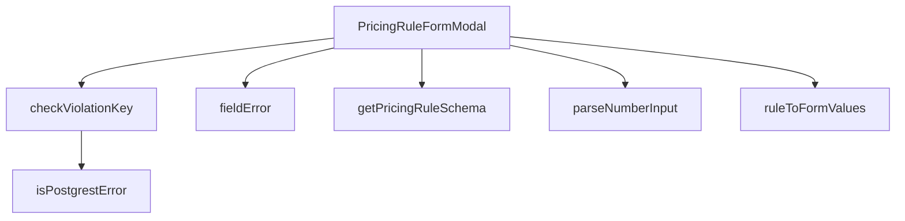

## Genel Bakış
Bu modül, yönetici panelinde fiyatlandırma kurallarını oluşturmak veya düzenlemek için kullanılan bir modal form bileşenidir. Ana bileşen, form alanlarını dinamik olarak oluşturur, kullanıcının girdiği verileri doğrular ve sunucuya kaydederken oluşabilecek hataları (örn. benzersizlik ihlallerini) işler. Modül, form şeması tanımlamadan hata ayıklamaya kadar tüm form yaşam döngüsünü merkezi olarak yönetir.

## Fonksiyon Grupları
### Form Şeması ve Veri Dönüşümü
Bu grup, form alanlarının yapısını ve varsayılan değerlerini tanımlar, ayrıca mevcut veriyi formun kullanabileceği formatlara dönüştürür.
- `getPricingRuleSchema`, `ruleToFormValues`

### Girdi İşleme ve Doğrulama
Kullanıcıdan alınan ham girdileri (özellikle sayısal alanları) işleyip uygun türlere dönüştürür ve formvalidasyon hatalarını formatlar.
- `parseNumberInput`, `fieldError`

### Hata Yönetimi
Veritabanından veya API'den dönen hataları analiz eder, özellikle benzersizlik ihlali gibi iş kuralları hatalarını tanır ve uygulama içinde ele alınabilir hale getirir.
- `isPostgrestError`, `checkViolationKey`

### Ana Bileşen (Orkestrasyon)
Tüm bu yardımcı fonksiyonları bir araya getirerek modalın açılmasını, formunsubmission sürecini ve durum yönetimini koordine eden üst düzey React bileşenidir.
- `PricingRuleFormModal`

---

## AXIOMS – Mimari Varsayımlar

Bu modül, bir fiyatlandırma kuralı (Pricing Rule) oluşturma/düzenleme formunu modal olarak sunar. Aşağıdaki mimari varsayımlar modülün doğru çalışması için zorunludur.

**[Aksiyom 1 – Çeviri Fonksiyonu Zorunluluğu]:** Eğer `getPricingRuleSchema` fonksiyonuna geçerli bir `t: (key: string) => string` çeviri fonksiyonu sağlanmazsa, form validasyon şemasındaki semua hata mesajları yerelleştirilmemiş (raw key) olarak görünür ve kullanıcı deneyimi bozulur.

**[Aksiyom 2 – PricingRuleRow Veri Shape'i]:** Eğer `ruleToFormValues` fonksiyonuna beklenen `PricingRuleRow` shape'ine uymayan bir nesne verilirse, form alanları yanlış/eksik değerlerle başlatılır; modal düzenleme modunda hatalı veri gösterimi oluşur.

**[Aksiyom 3 – Sayısal Girdi Null Handling]:** Eğer `parseNumberInput` tarafından döndürülen `null` değeri çağrıucuda ele alınmazsa (örn. form submit sırasında), geçersiz/NaN değerler backend'e gönderilir ve beklenmeyen hatalar oluşur.

**[Aksiyom 4 – PostgREST Hata Formatı Varsayımı]:** Eğer backend'den dönen hata PostgREST hata formatında (`PostgrestError`) değilse, hem `isPostgrestError` hem de `checkViolationKey` fonksiyonları `false`/`null` döndürür; bu durumda duplicate veya constraint violation hataları kullanıcıya anlamsız bir şekilde gösterilir.

**[Aksiyom 5 – EMPTY_VALUES Shape Eşleşmesi]:** Eğer `EMPTY_VALUES` sabitinin shape'i form alanlarıyla eşleşmiyorsa (alan isimleri, türleri değişmişse), modal yeni kural oluşturma modunda boş/bozuk form değerleriyle başlatılır.

**[Aksiyom 6 – Modal Props Zorunluluğu]:** Eğer `PricingRuleFormModal` bileşenine `open`, `onClose` veya `onSaved` callback'leri sağlanmazsa, modal açılamaz, kapatılamaz veya kayıt sonrası tetikleme (list yenileme vb.) gerçekleşmez.

**[Aksiyom 7 – Validation Schema ile fieldError Tutarlılığı]:** Eğer `getPricingRuleSchema` tarafından döndürülen Zod şemasındaki alan isimleri ile `fieldError`'ın beklediği message formatı uyumsuzsa, form submit sırasında validasyon hataları doğru alanlara bağlanmaz ve kullanıcı hangi alanda hata olduğunu bilemez.

---

## FONKSİYON DETAYLARI

### getPricingRuleSchema
**Ne yapar**: Fiyatlandırma kuralları formunun validasyon şemasını (Zod şemasını) oluşturmak için gerekli fonksiyonu döndürür.
**Nasıl yapar**: Fonksiyon, bir `t` (çeviri/i18n fonksiyonu) parametresi alır ve bu parametreyi, oluşturacağı validasyon şeması içindeki hata mesajlarını uluslararasılaştırmak için kullanır. Sonuç olarak, bir sonraki aşamada çağrılacak olan bir şema oluşturucu fonksiyonun referansını döndürür.
**Parametreler**:
- `t`: `(key: string) => string` — Çeviri anahtarlarını yerel metne dönüştüren i18n fonksiyonu.
**Dönüş**: Şema oluşturucu bir fonksiyonu döndürür. Belirli dönüş tipi dokümante edilmemiş ancak kullanım amacına göre bir Zod şema fonksiyonudur.

### ruleToFormValues
**Ne yapar**: Veritabanından gelen bir fiyatlandırma kuralı nesnesini (`PricingRuleRow`), form bileşeninin state'ine uygun formata dönüştürür.
**Nasıl yapar**: Girdi nesnesindeki her bir alanı, formun başlangıç değerleriyle eşleşecek şekilde haritalandırır. `method` alanı gibi bazı alanlar değer dönüşümüne uğrar (örn: `'fixed'` dışındaki tüm değerler `'cost_plus'a` dönüştürülür). `currency`, `valid_from`, `valid_to` gibi boş olabilen alanlar için `?? ''` (nullish coalescing) kullanarak varsayılan boş dize atanır.
**Parametreler**:
- `rule`: `PricingRuleRow` — Veritabanından gelen, kuralın mevcut durumunu temsil eden nesne.
**Dönüş**: `PricingRuleFormValues` — Formun state'ine atanacak, tüm alanların başlangıç değerlerini içeren nesne.

### parseNumberInput
**Ne yapar**: Form girişinden gelen ham sayıyı temsil eden dizeyi, JavaScript'teki kullanılabilir bir sayısal değere veya `null`'a dönüştürür.
**Nasıl yapar**: Girdi dizesinin başındaki ve sonundaki boşlukları temizler, ondalık ayracı olarak virgül (`','`) kullanımını nokta (`'.'`) ile değiştirir (TR-ABD localize sorunlarını önler). Eğer temizlenmiş dize boş ise `null`, aksi takdirde `Number()` fonksiyonu ile dönüştürme yapar. Geçerli olmayan bir dize girişinde `NaN` döner, bu değer daha sonra form validasyonu (Zod) tarafından yakalanır.
**Parametreler**:
- `raw`: `string` — Formdaki bir sayısal alanın ham dize giriş değeri.
**Dönüş**: `number | null` — Başarılı dönüşümde sayıyı, boş girişte `null`, geçersiz girişte `NaN` döner.

### isPostgrestError
**Ne yapar**: Bir hata nesnesinin, Supabase/PostgREST tarafından fırlatılan belirli bir hata yapısına (`PostgrestError`) sahip olup olmadığını kontrol eder.
**Nasıl yapar**: Hata nesnesinin bir `object` olduğunu, `null` olmadığını ve `code` ile `message` özelliklerine sahip olduğunu kontrol eden bir tip koruması (type guard) fonksiyonudur. TypeScript'in `error is PostgrestError` dönüş tipi, fonksiyon `true` döndüğünde orijinal `error` değişkeninin `PostgrestError` tipine sahip olduğunu doğrular.
**Parametreler**:
- `error`: `unknown` — İşlenecek herhangi bir hata nesnesi.
**Dönüş**: `error is PostgrestError` (boolean) — Hatanın `PostgrestError` yapısına uygun olup olmadığı.

### checkViolationKey
**Ne yapar**: Postgres veritabanı `CHECK`straint ihlali (`23514` hata kodu) oluşan bir hatayı analiz ederek, kullanıcıya gösterilecek i18n hata mesajı anahtarını döndürür.
**Nasıl yapar**: Öncelikle `isPostgrestError` ile hatanın PostgREST hatası olup olmadığını ve kodunun `'23514'` olup olmadığını kontrol eder. Ardından, hata mesajı ve detaylarını birleştirip içinde anahtar kelimeleri arar. Tespit ettiği CHECK constraint adına göre önceden tanımlı, kullanıcıya anlamlı i18n mesaj anahtarlarını döndürür. Ham SQL hata metnini doğrudan göstermez, böylece veritabanı şema detayları kullanıcından gizlenir.
**Parametreler**:
- `error`: `unknown` — İşlenecek hata nesnesi.
**Dönüş**: `string | null` — Eşleşen bir CHECK constraint bulunursa i18n mesaj anahtarı, aksi halde `null`.

### PricingRuleFormModal
**Ne yapar**: Bir fiyatlandırma kuralı oluşturmak veya düzenlemek için açılan modal form bileşenini temsil eder.
**Nasıl yapar**: Bu bir React fonksiyonel bileşenidir. `open`, `rule`, `onClose` ve `onSaved` prop'larını alır. `open` prop'u modal'ın görünür olup olmadığını kontrol eder. Düzenleme modunda ise `rule` prop'u ile mevcut kural değerleri form alanlarına doldurulur. Form gönderildiğinde `onSaved` callback'i ile üst bileşene bildirimde bulunur ve `onClose` ile kapanır.
**Parametreler**:
- `open`: `boolean` — Modal'ın açık olup olmadığını belirler.
- `rule`: `PricingRuleRow` (opsiyonel) — Düzenleme modunda, formun önceden doldurulacağı kural nesnesi.
- `onClose`: `() => void` — Modal kapatılmak istendiğinde çağrılan fonksiyon.
- `onSaved`: `(saved: PricingRuleRow) => void` — Kural başarıyla kaydedildiğinde çağrılan fonksiyon.
**Dönüş**: `React.FC<PricingRuleFormModalProps>` — React fonksiyonel bileşeni.

### fieldError
**Ne yapar**: Form alanları için hata mesajını işleyen ve muhtemelen UI'da gösterilmek üzere formatlayan bir yardımcı fonksiyondur.
**Nasıl yapar**: Verilen `message` parametresinin (hata bilgisi) işlenmesi ve form alanına özgü bir hata gösterimi üretmesi beklenen bir yardımcı fonksiyondur. Belirli bir mantığı docstring'de detaylandırılmamıştır, ancak genellikle form library'lerindeki (örn. react-hook-form) hata gösterimiyle entegre çalışır.
**Parametreler**:
- `message`: `unknown` — İşlenecek hata bilgisi, string veya nesne olabilir.
**Dönüş**: Belirtilmemiş, muhtemelen `string` veya `ReactNode` gibi bir hata gösterim elemanı döndürür.

---

## İTHALATLAR (IMPORTS)
- import: ./RuleScopeTargetPicker::RuleScopeTargetPicker
- import: @/hooks/useRole::useRole
- import: @/i18n/I18nProvider::useI18n
- import: @/i18n/format::formatCurrency
- import: @/i18n/format::formatNumber
- import: @/lib/admin/mutateWithAudit::AdminPermissionError
- import: @/lib/admin/mutateWithAudit::mutateWithAudit
- import: @/lib/supabase/client::supabaseBrowserClient
- import: @hookform/resolvers/zod::zodResolver
- import: @radix-ui/react-dialog
- import: @supabase/supabase-js::type { PostgrestError }
- import: lucide-react::AlertTriangle
- import: lucide-react::Loader2
- import: lucide-react::Save
- import: lucide-react::X
- import: react-hook-form::useForm
- import: react::React
- import: react::useCallback
- import: react::useEffect
- import: react::useMemo
- import: react::useState
- import: sonner::toast
- import: zod::z

---

## INTERFACES

### ImpactSample
- `product: SampleProduct`
- `beforeGross: number | null`

### PricingRuleFormModalProps
- `open: boolean`
- `rule: PricingRuleRow | null`
- `onClose: () => void`
- `onSaved: () => void`

---

## TYPE ALIASES

### RateInputMode
```typescript
type RateInputMode = 'percent' | 'coefficient' | 'fixed'
```

### PricingRuleFormValues
```typescript
type PricingRuleFormValues = z.infer<ReturnType<typeof getPricingRuleSchema>>
```

---

## SABİTLER
- **EMPTY_VALUES** (object) — `{
  scope: 4,
  product_id: null,
  brand_id: null,
  category_id: null,
...`

---

## AST POINTERS

### [N1_NASIL] AST Pointer: src/components/admin/pricing/PricingRuleFormModal.tsx::getPricingRuleSchema
- **params**: `t` — i18n çeviri fonksiyonu, validation mesajlarını lokalize etmek için kullanılır
- **ic_degiskenler**:
  - `v` — superRefine callback'inde form değerlerini temsil eden Zod doğrulama nesnesi (scope, method, margin_pct, fixed_price, product_id, brand_id, category_id, round_to, charm_ending, currency, min_margin_abs, max_margin_abs, valid_from, valid_to alanlarını içerir)
  - `ctx` — Zod RefinementCtx, `addIssue` ile hata eklemek için kullanılır
  - `targetIssue` — scope hedefi için hata üreten yerel fonksiyon; path parametresi ile hangi alanın eksik olduğunu belirtir
- **Dönüş**: Zod schema nesnesi (PricingRuleFormValues tipini doğrulayan object schema + superRefine)

---

### [N2_NASIL] AST Pointer: src/components/admin/pricing/PricingRuleFormModal.tsx::ruleToFormValues
- **params**: `rule` — PricingRuleRow tipinde veritabanından gelen fiyatlandırma kuralı satırı
- **ic_degiskenler**: yok (doğrudan `rule` özelliklerinden return objesi oluşturulur)
- **Dönüş**: PricingRuleFormValues — rule alanlarını form input değerlerine dönüştürülmüş nesne; `rule.method` === 'fixed' olduğunda 'fixed', aksi halde 'cost_plus' olarak normalize eder; `rule.currency` ve `rule.valid_from`/`rule.valid_to` null ise boş string fallback kullanır

---

### [N3_NASIL] AST Pointer: src/components/admin/pricing/PricingRuleFormModal.tsx::parseNumberInput
- **params**: `raw` — string, kullanıcının girdiği ham sayısal metin
- **ic_degiskenler**:
  - `normalized` — `raw`'ın trim edilip virgülünün noktaya dönüştürülmüş hali; TR locale girdisi için normalize
- **Dönüş**: `number | null` — boş string ise null, aksi halde `Number(normalized)` sonucu

---

### [N4_NASIL] AST Pointer: src/components/admin/pricing/PricingRuleFormModal.tsx::isPostgrestError
- **params**: `error` — unknown tipinde yakalanan hata
- **ic_degiskenler**: yok (doğrudan `error` üzerinde `typeof`, `null` kontrolü ve `'code' in`, `'message' in` member check yapılır)
- **Dönüş**: `error is PostgrestError` — type guard; nesne olup `code` ve `message` özelliğine sahipse true

---

### [N5_NASIL] AST Pointer: src/components/admin/pricing/PricingRuleFormModal.tsx::checkViolationKey
- **params**: `error` — unknown tipinde yakalanan hata
- **ic_degiskenler**:
  - `detail` — `${error.message} ${error.details ?? ''}` birleşimi; violation constraint adını içeren aranacak metin
- **Dönüş**: `string | null` — PostgrestError code '23514' değilse null; `detail` içinde `pricing_rule_method_fields`, `pricing_rule_scope_target`, `min_quantity`, `scope` kalıp kontrolü ile i18n anahtar döner; eşleşme yoksa `'admin.pricing.rules.errors.checkViolation'`

---

### [N6_NASIL] AST Pointer: src/components/admin/pricing/PricingRuleFormModal.tsx::PricingRuleFormModal
- **params**: `{ open, rule, onClose, onSaved }` — `open`: modalın açık olup olmadığı, `rule`: düzenlenecek PricingRuleRow (yeni kural için undefined/null), `onClose`: kapatma callback'i, `onSaved`: kayıt başarılı sonrası callback
- **ic_degiskenler**:
  - `EMPTY_VALUES` — sabit, formun varsayılan boş değerleri objesi
  - `next` — `ruleToFormValues(rule)` çağrısının sonucu; mevcut kuralı form değerlerine dönüştürür
  - `nextMode` — `next.method === 'fixed' ? 'fixed' : 'percent'`; form yüklendiğinde input modunu belirler
  - `setMode` — RateInputMode state setter; yüzde/sabit fiyat geçişi
  - `setRateRaw` — ham oran girdisi state setter
  - `reset` — react-hook-form `reset` fonksiyonu; form değerlerini toplu olarak sıfırlar
  - `setExistingRules` — mevcut fiyatlandırma kuralları listesi state setter
  - `supabase` — Supabase istemci instance'ı; API çağrıları için kullanılır
  - `rules` — `listPricingRules(supabase)` sonucu; mevcut kurallar dizisi
  - `alive` — cleanup flag; async işlemler sırasında bileşen unmount edildiğinde state güncellemesini engeller
  - `scope` — form değerinden gelen mevcut kapsam (1=product, 2=brand, 3=category, 4=all)
  - `targetId` — kapsam 1-3 olduğunda hedef ID
  - `setImpactCount` — etki sayısı state setter
  - `setImpactSamples` — etki örnekleri state setter
  - `setImpactLoading` — etki hesaplama yükleme durumu state setter
  - `SAMPLE_SIZE` — sabit, örnekleme için çekilecek ürün sayısı
  - `IMPACT_DEBOUNCE_MS` — sabit, debounce bekleme süresi
  - `count` — `countProductsInScope` sonucu; kapsam dahilindeki ürün sayısı
  - `samples` — `sampleProductsInScope` sonucu; örnek ürün dizisi
  - `withBefore` — ImpactSample[] dizisi; her ürün için mevcut gross fiyatı eklenmiş hali
  - `product` — for döngüsü içindeki tekil ürün; `resolvePrice` ile fiyatı çözümlenir
  - `price` — `resolvePrice` sonucu; `{ price }` destructuring
  - `timer` — `setTimeout` sonucu; debounce timer referansı
  - `values` — react-hook-form `getValues()` mevcut form değerleri
  - `draftRule` — `buildPayload` callback'inin döndürdüğü PricingRuleCreateInput; hesaplama ve karşılaştırma için kullanılır
  - `DRAFT_RULE_ID` — sabit, draft kural için geçici ID
  - `ancestors` — `new Set<string>`; ürünün kategori ataları seti
  - `today` — `new Date().toISOString().slice(0, 10)`; bugünün YYYY-MM-DD stringi, geçerlilik kontrolü için
  - `rivals` — `existingRules.filter(...)` sonucu; draft ile rekabet eden kurallar dizisi
  - `winner` — `sortRules([...rivals, draftRule], null)[0]`; sıralama sonrası birinci kural
  - `payload` — PricingRuleCreateInput; DB'ye gönderilecek ham veri objesi; `scope` değerine göre product_id/brand_id/category_id'i koşullu atar, method'a göre margin_pct/fixed_price seçer, currency uppercase'e dönüştürülür
  - `authData` — `supabase.auth.getUser()` sonucu; `authData.user?.id` ile userId alınır
  - `userId` — `authData.user?.id ?? null`; audit trail için kullanıcı ID'si
  - `setSaving` — kaydetme durumu state setter
  - `mutateWithAudit` — audit log'lu veri yazma fonksiyonu; resource, canWrite, action, rowPk, before/after ile çağrılır
  - `hasWriteAccess` — boolean; kullanıcının yazma izni olup olmadığı
  - `checkKey` — `checkViolationKey(e)` sonucu; DB constraint ihlali için i18n anahtarı
  - `e` — catch bloğunda yakalanan hata
  - `handleBeforeUnload` — `beforeunload` event handler; form kirliyse tarayıcı kapatmayı engeller
  - `raw` — handleRateChange parametresi; ham oran girdisi
  - `parsed` — `parseNumberInput(raw)` sonucu; parse edilmiş sayı veya null
  - `marginPct` — `values.margin_pct` kısayolu; geçerli marj yüzdesi
  - `nextScope` — handleScopeChange parametresi; yeni scope değeri
  - `nextId` — handleTargetChange parametresi; yeni hedef ID
- **Dönüş**: JSX.Element — React functional component; pricing kuralı ekleme/düzenleme modalı; form alanlarını, etki hesaplamasını, kaydetme mantığını render eder

---

### [N7_NASIL] AST Pointer: src/components/admin/pricing/PricingRuleFormModal.tsx::fieldError
- **params**: `message` — unknown tipinde hata mesajı
- **ic_degiskenler**: yok
- **Dönüş**: `JSX.Element | null` — message string ise `<p>` ile rose-400 renkli hata metni, değilse null

---


## MERMAID CALL GRAPH


## NODE ID STANDARD

  file: src\components\admin\pricing\PricingRuleFormModal.tsx
  function: src\components\admin\pricing\PricingRuleFormModal.tsx::getPricingRuleSchema
  function: src\components\admin\pricing\PricingRuleFormModal.tsx::ruleToFormValues
  function: src\components\admin\pricing\PricingRuleFormModal.tsx::parseNumberInput
  function: src\components\admin\pricing\PricingRuleFormModal.tsx::isPostgrestError
  function: src\components\admin\pricing\PricingRuleFormModal.tsx::checkViolationKey
  function: src\components\admin\pricing\PricingRuleFormModal.tsx::PricingRuleFormModal
  function: src\components\admin\pricing\PricingRuleFormModal.tsx::fieldError

---

## DISA AKTARILANLAR (EXPORTS)
  export: PricingRuleFormModal
  export: checkViolationKey
  export: getPricingRuleSchema
  export: isPostgrestError
  export: parseNumberInput
  export: ruleToFormValues

---

## STİL TOKENLERİ

### Arbitrary Değerler (token'a geçirilmemiş)
Yok — tüm stiller token'a geçirilmiş. ✅

### Kullanılan Token'lar (zaten token'a geçirilmiş)
- (yok)

### Tailwind Sınıf Özeti
- **Renkler:** `bg-black/60`, `bg-cyan-400`, `bg-slate-800`, `bg-surface-deep`, `bg-white/2`, `bg-white/3`, `border-b`, `border-t`, `border-white/10`, `border-white/5`, `hover:bg-white/10`, `hover:text-white`, `text-amber-400`, `text-cyan-400`, `text-cyan-500`
- **Layout:** `backdrop-blur-sm`, `fixed`, `flex`, `flex-1`, `flex-col`, `flex-wrap`, `gap-1`, `gap-2`, `gap-3`, `gap-4`, `grid`, `grid-cols-1`, `h-11`, `h-4`, `h-9`
- **Varyant/Responsive:** `:`, `focus-visible:`, `hover:`, `md:` önekleri
- **Yardımcı Sınıflar:** `$`, `${adminButtonPrimaryClass`, `${adminInputClass`, `${adminModalScrollAreaClass`, `-translate-x-1/2`, `-translate-y-1/2`, `:`, `===`, `animate-spin`, `border`, `cursor-pointer`, `focus-visible:ring-2`, `focus-visible:ring-cyan-400/20`, `focus-visible:ring-cyan-400/40`, `font-black`