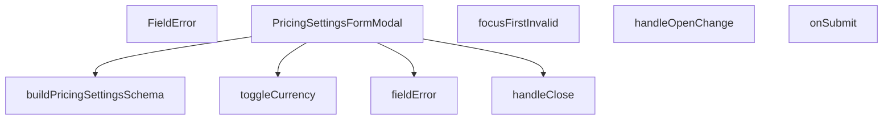

## Genel Bakış
Bu modül, yönetici panelindeki fiyatlandırma ayarlarını düzenlemek için kullanılan kontrollü bir modal form bileşenidir. Form validasyonu, para birimi seçimi ve ayarların sunucuya gönderilmesi dahil olmak üzere fiyatlandırma yapılandırmasıyla ilgili tüm kullanıcı etkileşimlerini yönetir. Bileşen, form durumunu ve modal açılış/kapanış akışını kontrol ederek bir dizi işlevi bir araya getirir.

## Fonksiyon Grupları
### Modal Kontrol ve Durum Yönetimi
Bu grup, modalın açılıp kapanmasını ve formun temel akışını kontrol eden temel işlevleri kapsar.
- `handleClose`, `handleOpenChange`, `PricingSettingsFormModal`

### Form İşlemleri ve İş Mantığı
Bu grup, form içindeki veri manipülasyonunu ve sunucuya gönderme sürecini yöneten işlevlerden oluşur.
- `toggleCurrency`, `onSubmit`

### Validasyon ve Şema Oluşturma
Bu işlev, form alanları için tip güvenli ve çok dilli bir validasyon şeması tanımlar.
- `buildPricingSettingsSchema`

### Hata Yönetimi ve Yardımcı Bileşenler
Bu grup, form hatalarını göstermek ve yönetmek için yardımcı bileşen ve fonksiyonları içerir.
- `FieldError`, `fieldError`, `focusFirstInvalid`

---

## AXIOMS – Mimari Varsayımlar
- Bu modül davranışsal mantık içermez (salt veri / konfigürasyon / tip tanımı).
- [Aksiyom 1]: Modülün dışa açtığı yapı (anahtar kümesi / şema) bir sözleşmedir; tüketiciler bu sabit yapıya bağlıdır — kırıcı değişiklik tüm tüketicileri etkiler.
- [Aksiyom 2]: Bir öğe ekleme/çıkarma yapısal-uyumlu olmalı; ilgili tipler ve seçiciler aynı commit'te güncel tutulmalıdır.

---

## FONKSİYON DETAYLARI

### buildPricingSettingsSchema
**Ne yapar**: PricingSettingsFormModal içinde kullanılacak Zod validasyon şemasını oluşturmak için gerekli olan fonksiyondur. Form alanlarının doğrulama kurallarını tanımlar.

**Nasıl yapar**: Dışarıdan alınan çeviri fonksiyonu `t` parametresini kullanarak, hata mesajlarının lokalize edilmesini sağlar. Bu fonksiyon bir fabrika fonksiyonu olarak davranır ve validasyon şemasını döndürür.

**Parametreler**:
- `t`: `(key: string) => string` — Lokalizasyon için kullanılan çeviri fonksiyonu. Verilen anahtar kelimeye karşılık gelen çevrilmiş metni döndürür.

**Dönüş**: Zod validasyon nesnesi (tip bilgisi verilmemiştir)

### FieldError
**Ne yapar**: Form alanının hemen altında görüntülenen hata mesajı satırını render eden bir React bileşenidir. Hata mesajı yoksa (undefined veya boş) DOM'a hiçbir eleman basmaz; bu sayede gereksiz boşluk oluşmaz.

**Nasıl yapar**: `message` parametresinin dolu olup olmadığını kontrol eder. Mesaj mevcutsa, verilen `id` değeriyle ilişkilendirilmiş bir hata satırı olarak DOM'a basar. Mesaj yoksa `null` döndürerek hiçbir şey render etmez.

**Parametreler**:
- `id`: `string` — Hata mesajının ilişkilendirildiği form alanının benzersiz kimliği. Erişilebilirlik (accessibility) amacıyla kullanılır.
- `message`: `string` (opsiyonel) — Gösterilecek hata mesajı metni. Tanımlı olmadığında bileşen hiçbir şey render etmez.

**Dönüş**: `React.FC<{ id: string; message?: string }>` — id ve message props alan bir React fonksiyonel bileşeni döndürür.

### focusFirstInvalid
**Ne yapar**: Geliştirildi ancak detay üretilemedi.

### PricingSettingsFormModal
**Ne yapar**: Geliştirildi ancak detay üretilemedi.

### fieldError
**Ne yapar**: Geliştirildi ancak detay üretilemedi.

### handleClose
**Ne yapar**: Geliştirildi ancak detay üretilemedi.

### handleOpenChange
**Ne yapar**: Geliştirildi ancak detay üretilemedi.

### toggleCurrency
**Ne yapar**: Geliştirildi ancak detay üretilemedi.

### onSubmit
**Ne yapar**: Geliştirildi ancak detay üretilemedi.

---

## İTHALATLAR (IMPORTS)
- import: ../overlay/ConfirmProvider::useConfirm
- import: @/hooks/useRole::useRole
- import: @/i18n/I18nProvider::useI18n
- import: @/lib/admin/mutateWithAudit::AdminPermissionError
- import: @/lib/admin/mutateWithAudit::mutateWithAudit
- import: @/lib/supabase/client::supabaseBrowserClient
- import: @/lib/type-converters::toSupabaseJson
- import: @hookform/resolvers/zod::zodResolver
- import: @radix-ui/react-dialog
- import: lucide-react::Loader2
- import: lucide-react::Save
- import: lucide-react::X
- import: react-hook-form::type { FieldErrors }
- import: react-hook-form::useForm
- import: react::React
- import: react::useEffect
- import: react::useState
- import: sonner::toast
- import: zod::z

---

## INTERFACES

### PricingSettingsFormModalProps
- `open: boolean`
- `onOpenChange: (open: boolean) => void`
- `initialValues: PricingSettingsValues | null`
- `onSuccess: () => void`

---

## TYPE ALIASES

### PricingCurrencyCode
```typescript
type PricingCurrencyCode = (typeof PRICING_CURRENCY_OPTIONS)[number]
```

### PricingSettingsValues
```typescript
type PricingSettingsValues = z.infer<typeof pricingSettingsSchema>
```

---

## SABİTLER
- **PRICING_CURRENCY_OPTIONS** (as_expression) — `['TRY', 'EUR', 'USD'] as const`
- **pricingSettingsSchema** (call) — `buildPricingSettingsSchema((key) => key)`
- **DEFAULT_PRICING_SETTINGS** (object) — `{
  base_currency: 'TRY',
  enabled_currencies: ['TRY'],
  default_vat_rat...`
- **FIELD_FOCUS_ORDER** (array) — `[
  // Para birimi grubunda TRY kapatılamaz → odak ilk DEĞİŞTİRİLEBİLİR kutu...`

---

## AST POINTERS

### [N1_NASIL] AST Pointer: PricingSettingsFormModal.tsx::buildPricingSettingsSchema
- **params**: `t` — çeviri fonksiyonu, `key: string` alır ve string döndürür
- **ic_degiskenler**:
  - `v` — `t` fonksiyonunu saran yardımcı fonksiyon, `admin.pricing.settings.validation.${key}` ön ekini otomatik ekler
- **Dönüş**: Zod şeması (`z.object`) — `base_currency`, `enabled_currencies`, `default_vat_rate_pct`, `default_price_is_vat_inclusive`, `default_round_to`, `default_charm_ending`, `display_spread_pct` alanlarını doğrular

### [N2_NASIL] AST Pointer: PricingSettingsFormModal.tsx::FieldError
- **params**: `id` — hata mesajının HTML `id` niteliği, `message` — opsiyonel hata metni
- **ic_degiskenler**: yok
- **Dönüş**: `message` varsa `<p>` elementi (role="alert", className="mt-1 text-xs font-bold tracking-tighter text-admin-danger"), yoksa `null`

### [N3_NASIL] AST Pointer: PricingSettingsFormModal.tsx::focusFirstInvalid
- **params**: `errs` — `FieldErrors<PricingSettingsValues>` türünde form hataları nesnesi
- **ic_degiskenler**:
  - `first` — `FIELD_FOCUS_ORDER` dizisinde `errs[name]` eşleşen ilk eleman; bulunamazsa fonksiyon erken döner
- **Dönüş**: `void` — yan etki olarak `document.getElementById(first.id)?.focus()` çağrısı yapar

### [N4_NASIL] AST Pointer: PricingSettingsFormModal.tsx::PricingSettingsFormModal
- **params**: `open` — modal açık/kapalı durumu, `onOpenChange` — durum değişiklik callback'i, `initialValues` — başlangıç form değerleri, `onSuccess` — başarılı kayıt sonrası callback
- **ic_degiskenler**:
  - `form` — `useForm` hook'undan dönen form nesnesi (zodResolver ile)
  - `saving` — `useState` ile tutulan kayıt durumu boolean'ı
  - `enabledCurrencies` — `form.watch('enabled_currencies')` ile izlenen etkin para birimleri dizisi
  - `handleBeforeUnload` — `beforeunload` olayı için event handler, `form.formState.isDirty` kontrolü yapar
  - `handleClose` — async kapatma fonksiyonu, kirli form durumunda onay ister
  - `handleOpenChange` — `openVal` parametreli, kapalı durumda `handleClose()` çağırır
  - `toggleCurrency` — `code` parametreli, TRY hariç para birimi seçimini açar/kapatır
  - `fieldError` — `name` parametreli, form hata mesajını string olarak döndürür
  - `onSubmit` — async form gönderim fonksiyonu
  - `t` — `useI18n` hook'undan gelen çeviri fonksiyonu
  - `hasWriteAccess` — `useRole` hook'undan gelen yazma yetkisi boolean'ı
  - `supabase` — Supabase istemcisi
  - `confirm` — onay dialog fonksiyonu
  - `mutateWithAudit` — denetimli veri değiştirme fonksiyonu
  - `toSupabaseJson` — JSON dönüştürücü yardımcı fonksiyon
- **Dönüş**: `React.FC<PricingSettingsFormModalProps>` — modal JSX'i

### [N5_NASIL] AST Pointer: PricingSettingsFormModal.tsx::fieldError
- **params**: `name` — `keyof PricingSettingsValues` türünde form alan adı
- **ic_degiskenler**:
  - `message` — `form.formState.errors[name]?.message` erişimi; string ise döndürülür, değilse `undefined`
- **Dönüş**: `string | undefined`

### [N6_NASIL] AST Pointer: PricingSettingsFormModal.tsx::handleClose
- **params**: yok
- **ic_degiskenler**:
  - `ok` — `confirm()` fonksiyonunun dönüş değeri; kullanıcı onay verirse `true`
- **Dönüş**: yok — yan etki olarak form kirli değilse `onOpenChange(false)` çağırır; kirliyse onay dialogu gösterir, onaylanırsa `onOpenChange(false)` çağırır

### [N7_NASIL] AST Pointer: PricingSettingsFormModal.tsx::handleOpenChange
- **params**: `openVal` — boolean, modal'ın yeni açık/kapalı durumu
- **ic_degiskenler**: yok
- **Dönüş**: yok — `openVal` false ise `handleClose()` çağırır, true ise `onOpenChange(true)` çağırır

### [N8_NASIL] AST Pointer: PricingSettingsFormModal.tsx::toggleCurrency
- **params**: `code` — `PricingCurrencyCode` türünde para birimi kodu
- **ic_degiskenler**:
  - `current` — `form.getValues('enabled_currencies')` sonucu; mevcut etkin para birimleri dizisi, yoksa boş dizi
  - `next` — `current` dizisi içinde `code` varsa filtrelenmiş hali, yoksa eklenmiş hali
- **Dönüş**: yok — yan etki olarak `form.setValue('enabled_currencies', next, { shouldDirty: true, shouldValidate: true })` çağrısı yapar; `code === 'TRY'` ise erken döner (taban para birimi kapatılamaz)

### [N9_NASIL] AST Pointer: PricingSettingsFormModal.tsx::onSubmit
- **params**: `values` — `PricingSettingsValues` türünde form değerleri
- **ic_degiskenler**:
  - `authData` — `supabase.auth.getUser()` sonucu; kullanıcı kimlik bilgisi
  - `userId` — `authData.user?.id` değeri; yoksa `null`
  - `payload` — `values` nesnesinin `base_currency: 'TRY'` ile birleştirilmiş kopyası
  - `error` — `supabase.from('site_settings').upsert(...)` sonucu; hata varsa fırlatılır
  - `e` — `catch` bloğunda yakalanan `unknown` türünde hata
  - `msg` — hata türüne göre belirlenen mesaj: `AdminPermissionError` ise yetki hatası, `Error` ise `e.message`, diğer durumlarda genel hata mesajı
- **Dönüş**: yok — yan etkiler: `setSaving(true/false)`, `mutateWithAudit` ile denetimli kayıt, başarılıysa `toast.success` + `onSuccess()` + `onOpenChange(false)`, hata durumunda `toast.error(msg)`

---


## MERMAID CALL GRAPH


## NODE ID STANDARD

  file: src\components\admin\pricing\PricingSettingsFormModal.tsx
  function: src\components\admin\pricing\PricingSettingsFormModal.tsx::buildPricingSettingsSchema
  function: src\components\admin\pricing\PricingSettingsFormModal.tsx::FieldError
  function: src\components\admin\pricing\PricingSettingsFormModal.tsx::focusFirstInvalid
  function: src\components\admin\pricing\PricingSettingsFormModal.tsx::PricingSettingsFormModal
  function: src\components\admin\pricing\PricingSettingsFormModal.tsx::fieldError
  function: src\components\admin\pricing\PricingSettingsFormModal.tsx::handleClose
  function: src\components\admin\pricing\PricingSettingsFormModal.tsx::handleOpenChange
  function: src\components\admin\pricing\PricingSettingsFormModal.tsx::toggleCurrency
  function: src\components\admin\pricing\PricingSettingsFormModal.tsx::onSubmit

---

## DISA AKTARILANLAR (EXPORTS)
  export: DEFAULT_PRICING_SETTINGS
  export: FieldError
  export: PRICING_CURRENCY_OPTIONS
  export: PricingCurrencyCode
  export: PricingSettingsFormModal
  export: PricingSettingsValues
  export: buildPricingSettingsSchema
  export: focusFirstInvalid
  export: pricingSettingsSchema

---

## STİL TOKENLERİ

### Arbitrary Değerler (token'a geçirilmemiş)
Yok — tüm stiller token'a geçirilmiş. ✅

### Kullanılan Token'lar (zaten token'a geçirilmiş)
- (yok)

### Tailwind Sınıf Özeti
- **Renkler:** `bg-admin-accent-weak`, `bg-admin-bg`, `bg-admin-surface-2`, `bg-black/60`, `bg-transparent`, `border-admin-accent/30`, `border-admin-border`, `border-b`, `border-t`, `group-hover:text-admin-accent`, `hover:bg-admin-surface-3`, `hover:border-admin-border`, `hover:text-admin-fg`, `text-admin-accent`, `text-admin-danger`
- **Layout:** `block`, `custom-scrollbar`, `fixed`, `flex`, `flex-1`, `flex-col`, `flex-wrap`, `gap-2`, `gap-3`, `gap-4`, `grid`, `grid-cols-1`, `h-4`, `h-5`, `items-center`
- **Varyant/Responsive:** `:`, `focus-visible:`, `group-hover:`, `hover:`, `md:` önekleri
- **Yardımcı Sınıflar:** `!border-admin-danger`, `$`, `${adminButtonPrimaryClass`, `${adminInputClass}${fieldError('default_charm_ending`, `${adminInputClass}${fieldError('default_round_to`, `${adminInputClass}${fieldError('default_vat_rate_pct`, `${adminInputClass}${fieldError('display_spread_pct`, `${disabled`, `-translate-x-1/2`, `-translate-y-1/2`, `:`, `animate-spin`, `border`, `checked`, `cursor-not-allowed`