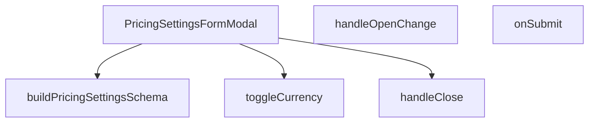

## Genel Bakış
Bu modül, yönetici panelinde fiyatlandırma ayarlarını düzenlemek için kullanılan kontrollü bir modal form bileşenidir. Para birimi seçimi, form validasyonu ve ayarların kaydedilmesi dahil olmak üzere fiyatlandırma yapılandırmasıyla ilgili tüm kullanıcı etkileşimlerini yönetir. Bileşen, form durumunu ve modal açılış/kapanış akışını kontrol ederek bir dizi işlevi bir araya getirir.

## Fonksiyon Grupları
### Modal Kontrol ve Durum Yönetimi
Grup, modalın açılıp kapanmasını ve formun temel akışını kontrol eden temel işlevleri kapsar.
- `handleClose`, `handleOpenChange`, `PricingSettingsFormModal`

### Form İşlemleri ve İş Mantığı
Bu grup, form içindeki veriManipülasyonunu ve sunucuya gönderme sürecini yöneten işlevlerden oluşur.
- `toggleCurrency`, `onSubmit`

### Validasyon ve Şema Oluşturma
Bu işlev, form alanları için tip güvenli ve çok dilli bir validasyon şeması tanımlar.
- `buildPricingSettingsSchema`

---

## AXIOMS – Mimari Varsayımlar
Bu modül, fiyatlandırma ayarlarını düzenlemek için bir form modalı sunar. Aşağıda modülün doğru çalışması için gerekli mimari varsayımlar listelenmiştir.

[Aksiyom 1]: Eğer `PRICING_CURRENCY_OPTIONS` sabiti boşsa veya geçerli bir Para Birimi Kodu içermiyorsa, `toggleCurrency` fonksiyonu işlevini yerine getiremez ve kullanıcı hangi para biriminin seçili olduğunu belirleyemez.

[Aksiyom 2]: Eğer `pricingSettingsSchema` çağrısı (yani form şeması) başarısızsa veya geçerli bir Zod şeması döndürmüyorsa, `onSubmit` fonksiyonu form verilerini doğrulayamaz ve hatalı veriler kaydedilebilir.

[Aksiyom 3]: Eğer `initialValues` prop'u sağlanmamışsa veya `DEFAULT_PRICING_SETTINGS` nesnesi tanımsızsa, form başlangıçta boş alanlarla açılır ve kullanıcı tüm alanları manuel olarak doldurmak zorunda kalır.

[Aksiyom 4]: Eğer `open` prop'u `true` ise ancak `handleOpenChange` fonksiyonu çağrılamıyorsa (örneğin `onOpenChange` callback'i tanımsızsa), modal kapatılamaz ve kullanıcı arayüzünde takılma yaşanır.

[Aksiyom 5]: Eğer `onSuccess` callback'i sağlanmamışsa, form başarıyla gönderildikten sonra kullanıcıya başarı bildirimi gösterilemez veya modal otomatik kapatılamaz.

[Aksiyom 6]: Eğer `buildPricingSettingsSchema` fonksiyonu bir hata fırlatıyorsa veya beklenen formatta (örneğin bir Zod şeması) döndürmüyorsa, `pricingSettingsSchema` sabit değeri geçersiz olur ve formun doğrulama mantığı bozulur.

[Aksiyom 7]: Eğer `onSubmit` fonksiyonu `async` bir işlem sırasında-network hatası veya sunucu hatası-alınırsa ve bu hata yakalanıp kullanıcıya iletilemezse, kullanıcı gönderme işleminin başarıp başarısız olduğunu bilemez.

---

## FONKSİYON DETAYLARI

### buildPricingSettingsSchema
**Ne yapar**: PricingSettingsFormModal içinde kullanılacak Zod validasyon şemasını oluşturmak için gerekli olan fonksiyondur. Form alanlarının doğrulama kurallarını tanımlar.

**Nasıl yapar**: Dışarıdan alınan çeviri fonksiyonu `t` parametresini kullanarak, hata mesajlarının lokalize edilmesini sağlar. Bu fonksiyon bir fabrika fonksiyonu olarak davranır ve validasyon şemasını döndürür.

**Parametreler**:
- `t`: `(key: string) => string` — Lokalizasyon için kullanılan çeviri fonksiyonu. Verilen anahtar kelimeye karşılık gelen çevrilmiş metni döndürür.

**Dönüş**: Zod validasyon nesnesi (tip bilgisi verilmemiştir)

### PricingSettingsFormModal
**Ne yapar**: Geliştirildi ancak detay üretilemedi.

### handleClose
**Ne yapar**: Geliştirildi ancak detay üretilemedi.

### handleOpenChange
**Ne yapar**: Geliştirildi ancak detay üretilemedi.

### toggleCurrency
**Ne yapar**: Geliştirildi ancak detay üretilemedi.

### onSubmit
**Ne yapar**: Geliştirildi ancak detay üretilemedi.

---

## İTHALATLAR (IMPORTS)
- import: @/hooks/useRole::useRole
- import: @/i18n/I18nProvider::useI18n
- import: @/lib/admin/mutateWithAudit::AdminPermissionError
- import: @/lib/admin/mutateWithAudit::mutateWithAudit
- import: @/lib/supabase/client::supabaseBrowserClient
- import: @/lib/type-converters::toSupabaseJson
- import: @hookform/resolvers/zod::zodResolver
- import: @radix-ui/react-dialog
- import: lucide-react::Loader2
- import: lucide-react::Save
- import: lucide-react::X
- import: react-hook-form::useForm
- import: react::React
- import: react::useEffect
- import: react::useState
- import: sonner::toast
- import: zod::z

---

## INTERFACES

### PricingSettingsFormModalProps
- `open: boolean`
- `onOpenChange: (open: boolean) => void`
- `initialValues: PricingSettingsValues | null`
- `onSuccess: () => void`

---

## TYPE ALIASES

### PricingCurrencyCode
```typescript
type PricingCurrencyCode = (typeof PRICING_CURRENCY_OPTIONS)[number]
```

### PricingSettingsValues
```typescript
type PricingSettingsValues = z.infer<typeof pricingSettingsSchema>
```

---

## SABİTLER
- **PRICING_CURRENCY_OPTIONS** (as_expression) — `['TRY', 'EUR', 'USD'] as const`
- **pricingSettingsSchema** (call) — `buildPricingSettingsSchema((key) => key)`
- **DEFAULT_PRICING_SETTINGS** (object) — `{
  base_currency: 'TRY',
  enabled_currencies: ['TRY'],
  default_vat_rat...`

---

## AST POINTERS

### [N1_NASIL] AST Pointer: PricingSettingsFormModal.tsx::buildPricingSettingsSchema
- **params**: (t: (key: string) => string)
- **ic_degiskenler**:
  - `v` — Translation helper fonksiyonu; verilen key'i `admin.pricing.settings.validation.` prefix'i ile birleştirerek t fonksiyonunu çağırır
- **Dönüş**: Zod schema nesnesi (pricing ayarları için validasyon kurallarını tanımlar)

### [N2_NASIL] AST Pointer: PricingSettingsFormModal.tsx::PricingSettingsFormModal
- **params**: (open: boolean, onOpenChange: (open: boolean) => void, initialValues?: PricingSettingsValues, onSuccess?: () => void)
- **ic_degiskenler**:
  - `form` — useForm hook'undan gelen form instance'ı (react-hook-form)
  - `t` — useI18n hook'undan gelen çeviri fonksiyonu
  - `hasWriteAccess` — useRole hook'undan gelen yazma izni boolean'ı
  - `saving` — Form submission durumunu takip eden state (boolean)
  - `setSaving` — saving state'ini güncelleyen setter fonksiyonu
  - `handleClose` — Modal kapatma işlevi (değişiklik kontrolü ile)
  - `handleOpenChange` — Modal open state değişiklik işlevi
  - `handleBeforeUnload` — Sayfadan ayrılma engelleme işlevi (kirli form durumunda)
  - `toggleCurrency` — Para birimi toggle işlevi
  - `onSubmit` — Form submission asenkron işlevi
  - `enabledCurrencies` — Formun enabled_currencies alanından gelen array (JSX içinde kullanılır)
- **Dönüş**: React.FC<PricingSettingsFormModalProps> (Pricing ayarları form modalı)

### [N3_NASIL] AST Pointer: PricingSettingsFormModal.tsx::handleClose
- **params**: (yok)
- **ic_degiskenler**:
  - `form.formState.isDirty` — Formda kaydedilmemiş değişiklik olup olmadığını kontrol eder
- **Dönüş**: yok (yan etki: onOpenChange(false) çağırır, gerekirse onay dialoğu gösterir)

### [N4_NASIL] AST Pointer: PricingSettingsFormModal.tsx::handleOpenChange
- **params**: (openVal: boolean)
- **ic_degiskenler**: (yok — sadece parametre ve mevcut state kullanılır)
- **Dönüş**: yok (yan etki: handleClose() veya onOpenChange(true) çağırır)

### [N5_NASIL] AST Pointer: PricingSettingsFormModal.tsx::toggleCurrency
- **params**: (code: PricingCurrencyCode)
- **ic_degiskenler**:
  - `current` — Mevcut enabled_currencies array'i (form.getValues ile alınır)
  - `next` — Toggle sonrası güncellenmiş enabled_currencies array'i
- **Dönüş**: yok (yan etki: form.setValue ile enabled_currencies güncellenir)

### [N6_NASIL] AST Pointer: PricingSettingsFormModal.tsx::onSubmit
- **params**: (values: PricingSettingsValues)
- **ic_degiskenler**:
  - `authData` — Supabase auth.getUser() sonucu gelen kullanıcı verisi
  - `userId` — authData.user?.id veya null (kullanıcı ID'si)
  - `payload` — Güncellenmiş pricing değerleri (base_currency her zaman 'TRY' olarak zorlanır)
  - `e` — Catch bloğundaki hata nesnesi
  - `msg` — Kullanıcıya gösterilecek hata mesajı (AdminPermissionError, Error veya genel hata)
- **Dönüş**: yok (yan etki: mutateWithAudit ile veritabanına kaydeder, toast mesajı gösterir, onSuccess ve onOpenChange çağırır)

### [N7_NASIL] AST Pointer: PricingSettingsFormModal.tsx::innerUpsertFunction
- **params**: (yok — anonymous async fonksiyon)
- **ic_degiskenler**:
  - `error` — Supabase upsert işleminde oluşabilecek hata
- **Dönüş**: Promise<void> (veritabanına upsert işlemi yapar, hata fırlatabilir)

---


## MERMAID CALL GRAPH


## NODE ID STANDARD

  file: src\components\admin\pricing\PricingSettingsFormModal.tsx
  function: src\components\admin\pricing\PricingSettingsFormModal.tsx::buildPricingSettingsSchema
  function: src\components\admin\pricing\PricingSettingsFormModal.tsx::PricingSettingsFormModal
  function: src\components\admin\pricing\PricingSettingsFormModal.tsx::handleClose
  function: src\components\admin\pricing\PricingSettingsFormModal.tsx::handleOpenChange
  function: src\components\admin\pricing\PricingSettingsFormModal.tsx::toggleCurrency
  function: src\components\admin\pricing\PricingSettingsFormModal.tsx::onSubmit

---

## DISA AKTARILANLAR (EXPORTS)
  export: DEFAULT_PRICING_SETTINGS
  export: PRICING_CURRENCY_OPTIONS
  export: PricingCurrencyCode
  export: PricingSettingsFormModal
  export: PricingSettingsValues
  export: buildPricingSettingsSchema
  export: pricingSettingsSchema

---

## STİL TOKENLERİ

### Arbitrary Değerler (token'a geçirilmemiş)
Yok — tüm stiller token'a geçirilmiş. ✅

### Kullanılan Token'lar (zaten token'a geçirilmiş)
- (yok)

### Tailwind Sınıf Özeti
- **Renkler:** `bg-black/60`, `bg-cyan-400/10`, `bg-slate-950/40`, `bg-surface-deep`, `bg-transparent`, `bg-white/2`, `border-b`, `border-cyan-400/20`, `border-cyan-400/30`, `border-t`, `border-white/10`, `border-white/5`, `group-hover:text-cyan-400`, `hover:bg-white/10`, `hover:border-white/10`
- **Layout:** `backdrop-blur-sm`, `block`, `custom-scrollbar`, `fixed`, `flex`, `flex-1`, `flex-col`, `flex-wrap`, `gap-2`, `gap-3`, `gap-4`, `grid`, `grid-cols-1`, `h-4`, `h-5`
- **Varyant/Responsive:** `:`, `focus-visible:`, `group-hover:`, `hover:`, `md:` önekleri
- **Yardımcı Sınıflar:** `$`, `${adminButtonPrimaryClass`, `${disabled`, `-translate-x-1/2`, `-translate-y-1/2`, `:`, `animate-spin`, `border`, `checked`, `cursor-not-allowed`, `cursor-pointer`, `focus-visible:ring-cyan-400/20`, `font-black`, `font-bold`, `group`