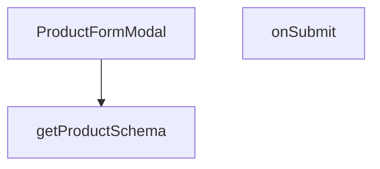

## Genel Bakış
Bu modül, yönetici panelinde ürün ekleme ve düzenleme işlemlerini gerçekleştiren form modalı bileşenidir. Doğrulama şeması oluşturarak form alanlarının güvenli bir şekilde doldurulmasını sağlar ve gönderilen verileri sunucuya aktararak geri bildirim akışlarını yönetir.

## Fonksiyon Grupları
### Form Doğrulama Şeması
Ürün formundaki alanlar için dinamik bir doğrulama şeması oluşturur; çeviri fonksiyonuyla birlikte hata mesajlarının çoklu dil destekli olmasını sağlar.
- getProductSchema

### Modal Bileşeni ve Etkileşim Yönetimi
Ürün ekleme/düzenleme modunda açılan modal penceresini, form yapılandırmasını ve kullanıcı etkileşimlerini (açma/kapama, başarı/hata durumları) yöneten ana bileşendir.
- ProductFormModal

### Form Gönderim İş Akışı
Kullanıcının doldurduğu form verilerini doğrular, sunucuya asenkron olarak gönderir ve sürecin sonucuna göre üst bileşeni bilgilendirerek gerekli UI güncellemelerini tetikler.
- onSubmit

---

## AXIOMS – Mimari Varsayımlar

Bu modül, yönetici panelinde ürün ekleme/düzenleme işlemlerini gerçekleştiren bir form modalı bileşenidir ve aşağıdaki mimari varsayımlara dayanır.

[Aksiyom 1]: Eğer `getProductSchema` fonksiyonuna geçirilen `t` (çeviri fonksiyonu) çalışmıyorsa veya beklenen anahtarları döndürmüyorsa, form alanlarının başlık/etiket değerleri hatalı veya boş oluşur.

[Aksiyom 2]: Eğer `ProductFormModal` bileşenine `open` prop'u sağlanmıyorsa, modalın başlangıç görünürlük durumu belirsiz olur ve bileşen kontrollü bir şekilde açılamaz.

[Aksiyom 3]: Eğer `onClose` callback'i sağlanmıyorsa, kullanıcı modalı kapatmaya çalıştığında üst bileşene bildirim yapılamaz ve modal kapatma işlevsel olarak bozulur.

[Aksiyom 4]: Eğer `onSuccess` callback'i sağlanmıyorsa, form başarıyla gönderildikten sonra üst bileşen bu durumdan haberdar olamaz; örneğin liste yenileme veya yönlendirme gibi sonraki adımlar tetiklenemez.

[Aksiyom 5]: Eğer `_productId` prop'u belirtilmiyorsa, modal "yeni ürün ekleme" modunda çalışır; belirtiliyorsa "düzenleme" moduna geçer ve mevcut ürün verilerini yüklemesi beklenir.

[Aksiyom 6]: Eğer `onSubmit` fonksiyonuna geçilen `ProductFormValues` geçerli bir veri içermiyorsa, asenkron sunucu isteği hatalı veriyle gönderilir veya form doğrulama aşamasında başarısız olur.

[Aksiyom 7]: Eğer modal `open=true` durumdayken bileşen yeniden render edilmiyorsa, form alanlarının başlangıç değerleri (düzenleme modunda mevcut ürün verileri) güncellenmeyebilir.

---

## FONKSİYON DETAYLARI

### getProductSchema
**Ne yapar**: Verilen bir metin çeviri fonksiyonunu (`t`) kullanarak, ürün formu için gerekli olan validasyon şemasını (Yup veya Zod benzeri) oluşturan bir işlevi çağırır. Bu işlev, form alanları için gerekli kuralları ve hata mesajlarını tanımlar.

**Nasıl yapar**: Fonksiyon, kendi iç mantığına sahip değildir; sadece daha önce tanımlanmış (muhtemelen farklı bir dosyadan import edilmiş) `getProductSchema` adlı bir işlevi bir wrapper (kapsayıcı) gibi çağırarak sonucunu döndürür. Bu yapı, belirli bir bağlamda (örn: bir React bileşeni içinde) işlevin tekrar tekrar kullanılmasını sağlar ve ana işlevi dışarıdan bağımsız bir şekilde test edilebilir hale getirebilir.

**Parametreler**:
- `t`: `(key: string) => string` — Bir metin anahtarını (key) yerelleştirilmiş (localized) bir metin dizgesine çeviren fonksiyon. Bu, genellikle uluslararasılaştırma (i18n) kütüphanelerinden sağlanan bir çeviri fonksiyonudur.

**Dönüş**: Fonksiyonun dönüş tipi kodda belirsiz (`void` veya `bilinmiyor`) olarak not edilmiştir, ancak `getProductSchema` işlevi muhtemelen bir `Schema` nesnesi (örn: Yup.object() veya Zod.object()) döndürmektedir. Bu nesne, formun validasyon kurallarını temsil eder.

### ProductFormModal
**Ne yapar**: Bu fonksiyon, ürün ekleme veya düzenleme işlemleri için kullanılan bir modal form bileşenini tanımlar. Belirtilen ürün ID'sine göre yeni ürün oluşturma veya mevcut ürünü düzenleme amacı taşır.

**Nasıl yapar**: Bileşen, açık/kapalı durumu `open` prop'u ile kontrol edilen bir modal yapısı içerir. Form alanları ve geçerlilik kontrolleri bileşen içinde yönetilir; form gönderimi `onSubmit` fonksiyonu ile gerçekleştirilir.

**Parametreler**:
- `_productId: any` — Düzenlenecek ürünün benzersiz kimliği. Yeni ürün oluştururken `null` veya `undefined` olabilir.
- `open: boolean` — Modalın görünür olup olmadığını belirleyen kontrol değişkeni.
- `onClose: () => void` — Modal kapatıldığında çağrılan geri çağırma fonksiyonu.
- `onSuccess: () => void` — Form başarıyla gönderildikten sonra çağrılan başarı bildirim fonksiyonu.

**Dönüş**: `JSX.Element` — Render edilen modal bileşenini döndürür.

### onSubmit
**Ne yapar**: `ProductFormModal` bileşeni içinde formun gönderilmesiyle tetiklenen işleyici fonksiyondur. Form değerlerini alarak gerekli doğrulama ve API çağrılarını başlatır.

**Nasıl yapar**: Parametre olarak gelen `ProductFormValues` nesnesini işler; genellikle bir API servisine POST veya PUT isteği yapar ve başarılı sonuçta `onSuccess` prop'unu çağırarak üst bileşene bildirim gönderir.

**Parametreler**:
- `values: ProductFormValues` — Formdaki tüm alan değerlerini içeren veri nesnesi.

**Dönüş**: Kod parçasında dönüş tipi belirtilmemiştir; yaygın kullanımda `void` veya `Promise<void>` döndürebilir.

---

## İTHALATLAR (IMPORTS)
- import: ../../../types/db-rows::type { DbCategory, DbJson,DbProductInsert, DbProductUpdate }
- import: @/i18n/I18nProvider::useI18n
- import: @/lib/services/product.columns::VARIANT_DETAIL_COLUMNS
- import: @/lib/supabase/client::supabaseBrowserClient
- import: @hookform/resolvers/zod::zodResolver
- import: @radix-ui/react-dialog
- import: lucide-react::Loader2
- import: lucide-react::Save
- import: lucide-react::X
- import: react-hook-form::useForm
- import: react::React
- import: react::useCallback
- import: react::useEffect
- import: react::useState
- import: sonner::toast
- import: zod

---

## INTERFACES

### ProductFormModalProps
- `_productId?: string | null`
- `open: boolean`
- `onClose: () => void`
- `onSuccess: () => void`

---

## TYPE ALIASES

### ProductFormValues
```typescript
type ProductFormValues = z.infer<ReturnType<typeof getProductSchema>>
```

---

## AST POINTERS

### [N1_NASIL] AST Pointer: src/components/admin/products/ProductFormModal.tsx::getProductSchema
- **params**: (t: (key: string) => string)
- **ic_degiskenler**:
  - `t` — Translation fonksiyonu, Zod validasyon mesajlarını lokalize etmek için kullanılır
- **Dönüş**: Zod schema nesnesi (ProductFormValues için validasyon şeması)

### [N2_NASIL] AST Pointer: src/components/admin/products/ProductFormModal.tsx::ProductFormModal
- **params**: ({ _productId, open, onClose, onSuccess })
- **ic_degiskenler**:
  - `_productId` — Düzenlenecek ürünün ID'si (undefined ise yeni ürün ekleniyor)
  - `open` — Modal'ın açık/kapalı durumunu kontrol eden boolean prop
  - `onClose` — Modal'ı kapatma callback fonksiyonu
  - `onSuccess` — Başarılı kayıt/güncelleme sonrası çağrılacak callback fonksiyonu
  - `t` — useI18n() hook'undan gelen translation fonksiyonu
  - `loading` — Form submission ve veri yükleme durumunu takip eden state
  - `setLoading` — Loading state'ini güncellemek için setter fonksiyonu
  - `categories` — Kategorilerin tutulduğu state dizisi
  - `setCategories` — Categories state'ini güncellemek için setter fonksiyonu
  - `descriptionI18n` — Description'ın çok dilli versiyonunu tutan state (tr ve en)
  - `setDescriptionI18n` — DescriptionI18n state'ini güncellemek için setter fonksiyonu
  - `productSchema` — useMemo ile hesaplanan Zod validasyon şeması
  - `register` — react-hook-form'dan form alanlarını kaydetmek için fonksiyon
  - `handleSubmit` — Form submission handler'ı
  - `reset` — Form alanlarını sıfırlamak için fonksiyon
  - `errors` — Form validasyon hatalarını içeren nesne
  - `loadProduct` — useCallback ile tanımlanan ürün yükleme fonksiyonu
- **Dönüş**: JSX (Dialog modal bileşeni)

### [N3_NASIL] AST Pointer: src/components/admin/products/ProductFormModal.tsx::ProductFormModal::onSubmit
- **params**: (values: ProductFormValues)
- **ic_degiskenler**:
  - `values` — Form verilerini içeren parametre (ProductFormValues tipi)
  - `description` — values nesnesinden destructure edilen description alanı
  - `rest` — values nesnesinden description hariç diğer tüm alanlar
  - `description_i18n` — Mevcut descriptionI18n state'i ile yeni description'ı birleştiren nesne
  - `payload` — Veritabanına gönderilecek güncelleme/ekleme verisi (koşullu olarak DbProductUpdate veya DbProductInsert)
- **Dönüş**: Promise<void> (async fonksiyon, değer döndürmez)

---


## MERMAID CALL GRAPH


## NODE ID STANDARD

  file: src\components\admin\products\ProductFormModal.tsx
  function: src\components\admin\products\ProductFormModal.tsx::getProductSchema
  function: src\components\admin\products\ProductFormModal.tsx::ProductFormModal
  function: src\components\admin\products\ProductFormModal.tsx::onSubmit

---

## DISA AKTARILANLAR (EXPORTS)
  export: ProductFormModal
  export: getProductSchema

---

## STİL TOKENLERİ

### Arbitrary Değerler (token'a geçirilmemiş)
Yok — tüm stiller token'a geçirilmiş. ✅

### Kullanılan Token'lar (zaten token'a geçirilmiş)
- (yok)

### Tailwind Sınıf Özeti
- **Renkler:** `bg-black/50`, `bg-primary-navy`, `bg-white`, `hover:bg-blue-700`, `hover:bg-slate-100`, `hover:bg-slate-50`, `text-industrial-gray`, `text-red-500`, `text-slate-500`, `text-white`, `text-xl`, `text-xs`
- **Layout:** `backdrop-blur-sm`, `fixed`, `flex`, `gap-2`, `gap-3`, `gap-4`, `grid`, `grid-cols-1`, `items-center`, `justify-between`, `justify-end`, `left-1/2`, `max-h-90vh`, `max-w-2xl`, `md:grid-cols-2`
- **Varyant/Responsive:** `focus-visible:`, `hover:`, `md:` önekleri
- **Yardımcı Sınıflar:** `-translate-x-1/2`, `-translate-y-1/2`, `animate-spin`, `border`, `focus-visible:outline-none`, `font-bold`, `inset-0`, `mb-6`, `mt-8`, `px-4`, `px-6`, `py-2`, `rounded-2xl`, `rounded-full`, `rounded-lg`