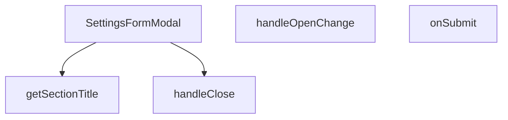

## Genel Bakış

Bu modül, admin panelindeki ayarlar sayfasında kullanılan bir form modal bileşenidir. Bölüm bazlı (section) ayarların düzenlenmesi için açılır pencere sunar, form gönderimlerini yönetir ve ilgili bölüm başlıklarını dinamik olarak gösterir. Bileşen, kontrollü (controlled) bir modal yapısıyla açılıp kapanma durumlarını üst bileşen yönetir.

## Fonksiyon Grupları

### Modal Yönetim Korumaları

Modal penceresinin açılıp kapanma akışını kontrol eden işleyiciler. Dışarıdan gelen open durumunu işler ve kapanma taleplerini üst bileşene iletir.

- handleClose, handleOpenChange

### Form Gönderim İşleme

Kullanıcının doldurduğu form verilerini alarak ilgili ayarları kaydetme işlemini başlatır. Asenkron yapıda çalışarak API çağrılarını yönetir.

- onSubmit

### Arayüz Yardımcıları

Mevcut section prop'una göre modal içinde gösterilecek başlık metnini belirler. Kullanıcıya hangi ayar bölümünde olduğunu gösterir.

- getSectionTitle

---

## AXIOMS – Mimari Varsayımlar
Bu modül bir React form modal bileşeni olup, ayarlar bölümünü yönetir ve validasyon şemalarını kullanır.

[Aksiyom 1]: Eğer `open` prop'u `true` olarak ayarlanmamışsa, modal görünür olmaz.
[Aksiyom 2]: Eğer `onOpenChange` fonksiyonu çağrılmazsa, modal'ın açılıp kapanması kontrol edilemez.
[Aksiyom 3]: Eğer `section` prop'u geçerli bir bölüm adı içermiyorsa, ilgili form şeması yüklenemez ve form boş kalır.
[Aksiyom 4]: Eğer `initialValues` prop'u `undefined` veya `null` olarak geçilirse, form alanları varsayılan değerlerle başlatılır.
[Aksiyom 5]: Eğer `onSuccess` fonksiyonu çağrılmazsa, form başarıyla gönderildiğinde dışarıya bildirim yapılamaz.
[Aksiyom 6]: Eğer `handleClose()` fonksiyonu çağrılmadan önce `onOpenChange` ile modal kapatılmamışsa, modal'ın kapanması tetiklenemez.
[Aksiyom 7]: Eğer `onSubmit` fonksiyonu asynchronous olarak çalışırken hata oluşursa ve bu hata yakalanmamışsa, form gönderme işlemi başarısız olur.
[Aksiyom 8]: Eğer `section` değerine karşılık gelen validasyon şeması çağrılamıyorsa, form verileri validasyondan geçemez.
[Aksiyom 9]: Eğer `getSectionTitle()` fonksiyonu `section` propuna karşılık gelen başlığı bulamıyorsa, modal başlığı boş kalır.
[Aksiyom 10]: Eğer `handleOpenChange(openVal)` fonksiyonu `openVal` parametresi olarak `false` alırsa ve bu değer `onOpenChange` prop'una iletilmezse, modal kapatılamaz.

---

## FONKSİYON DETAYLARI

### SettingsFormModal

**Ne yapar**: Ayarlar formunu gösteren modal bileşenidir. Belirli bir ayar section'ına ait form alanlarını açar, kullanıcının değerleri düzenlemesini sağlar ve başarılı kaydetme sonrasında callbacks'leri tetikler.

**Nasıl yapar**: React fonksiyonel bileşeni olarak tanımlanmıştır ve `SettingsFormModalProps` arayüzünden gelen props'ları alır. Bileşen, modal açık/kapalı durumunu (`open`) kontrol eder, bölüm bazlı form alanlarını `section` parametresine göre render eder, başlangıç değerlerini `initialValues` ile alır ve form başarıyla gönderildiğinde `onSuccess` callback'ini çağırarak üst bileşene bildirimde bulunur. Modalın kapanma/açılma sürecini ise `onOpenChange` ile yönetir.

**Parametreler**:
- `open: boolean` — Modalın görünürlük durumunu belirtir. `true` olduğunda modal açılır, `false` olduğunda kapanır.
- `onOpenChange: (open: boolean) => void` — Modalın açık/kapalı durumu değiştiğinde çağrılan callback fonksiyonu. Üst bileşenin modal durumunu yönetmesini sağlar.
- `section: string` — Hangi ayar section'ının gösterileceğini belirten bölüm tanımlayıcısı. Form alanları bu değere göre filtrelenir veya section'a özgü render mantığı devreye girer.
- `initialValues: Record<string, unknown>` — Form alanlarının başlangıç değerlerini tutan nesne. Düzenleme modunda mevcut ayar değerlerini taşır.
- `onSuccess: () => void` — Form başarıyla gönderildikten ve kaydedildikten sonra çağrılan callback fonksiyonu. Üst bileşenin listeyi yenilemesi veya bildirim göstermesi için tetikleyici görevi görür.

**Dönüş**: `React.FC<SettingsFormModalProps>` — Props tanımlı bir React fonksiyonel bileşeni döndürür.

### handleClose
**Ne yapar**: Geliştirildi ancak detay üretilemedi.

### handleOpenChange
**Ne yapar**: Geliştirildi ancak detay üretilemedi.

### onSubmit
**Ne yapar**: Geliştirildi ancak detay üretilemedi.

### getSectionTitle
**Ne yapar**: Geliştirildi ancak detay üretilemedi.

---

## İTHALATLAR (IMPORTS)
- import: @/hooks/useRole::useRole
- import: @/i18n/I18nProvider::useI18n
- import: @/lib/admin/mutateWithAudit::AdminPermissionError
- import: @/lib/admin/mutateWithAudit::mutateWithAudit
- import: @/lib/supabase/client::supabaseBrowserClient
- import: @/lib/type-converters::toSupabaseJson
- import: @hookform/resolvers/zod::zodResolver
- import: @radix-ui/react-dialog
- import: lucide-react::Loader2
- import: lucide-react::Save
- import: lucide-react::X
- import: react-hook-form::useForm
- import: react::React
- import: react::useEffect
- import: react::useState
- import: sonner::toast
- import: zod::z

---

## INTERFACES

### SettingsFormModalProps
- `open: boolean`
- `onOpenChange: (open: boolean) => void`
- `section: SettingsSection | null`
- `initialValues: Record<string, unknown> | null`
- `onSuccess: () => void`

---

## TYPE ALIASES

### SettingsSection
```typescript
type SettingsSection = 'general' | 'payment' | 'admins' | 'system'
```

---

## SABİTLER
- **generalSchema** (call) — `z.object({
  site_name: z.string().min(1, 'Site adı zorunludur'),
  tagline: ...`
- **paymentSchema** (call) — `z.object({
  iyzico_enabled: z.boolean(),
  iyzico_mode: z.enum(['sandbox', '...`
- **adminsSchema** (call) — `z.object({
  admin_sessions_timeout: z.string().min(1, 'Oturum süresi zorunlu...`
- **systemSchema** (call) — `z.object({
  system_log_level: z.enum(['debug', 'info', 'warn', 'error']),
  ...`

---

## AST POINTERS

### [N1_NASIL] AST Pointer: SettingsFormModal::getSchema (anonim)
- **params**: (parametre yok)
- **ic_degiskenler**:
  - `section` — props'tan gelen bölüm adı, hangi şemanın döneceğini belirler
- **Dönüş**: Zod schema nesnesi (`generalSchema | paymentSchema | adminsSchema | systemSchema`)

---


## MERMAID CALL GRAPH


## NODE ID STANDARD

  file: src\components\admin\settings\SettingsFormModal.tsx
  function: src\components\admin\settings\SettingsFormModal.tsx::SettingsFormModal
  function: src\components\admin\settings\SettingsFormModal.tsx::handleClose
  function: src\components\admin\settings\SettingsFormModal.tsx::handleOpenChange
  function: src\components\admin\settings\SettingsFormModal.tsx::onSubmit
  function: src\components\admin\settings\SettingsFormModal.tsx::getSectionTitle

---

## DISA AKTARILANLAR (EXPORTS)
  export: SettingsFormModal
  export: SettingsSection

---

## STİL TOKENLERİ

### Arbitrary Değerler (token'a geçirilmemiş)
Yok — tüm stiller token'a geçirilmiş. ✅

### Kullanılan Token'lar (zaten token'a geçirilmiş)
- (yok)

### Tailwind Sınıf Özeti
- **Renkler:** `bg-black/60`, `bg-slate-950/40`, `bg-surface-deep`, `bg-transparent`, `bg-white/2`, `border-b`, `border-t`, `border-white/10`, `border-white/5`, `group-hover:text-cyan-400`, `hover:bg-white/10`, `hover:border-white/10`, `hover:text-white`, `text-cyan-400`, `text-red-400`
- **Layout:** `backdrop-blur-sm`, `block`, `custom-scrollbar`, `fixed`, `flex`, `flex-1`, `flex-col`, `gap-2`, `gap-4`, `grid`, `grid-cols-1`, `grid-cols-2`, `h-5`, `items-center`, `items-start`
- **Varyant/Responsive:** `focus-visible:`, `group-hover:`, `hover:`, `md:` önekleri
- **Yardımcı Sınıflar:** `!bg-slate-950`, `!border-white/5`, `${adminButtonPrimaryClass`, `${adminInputClass`, `-translate-x-1/2`, `-translate-y-1/2`, `animate-spin`, `border`, `cursor-pointer`, `focus-visible:ring-cyan-400/20`, `font-black`, `font-bold`, `group`, `group-hover:-translate-y-px`, `inset-0`