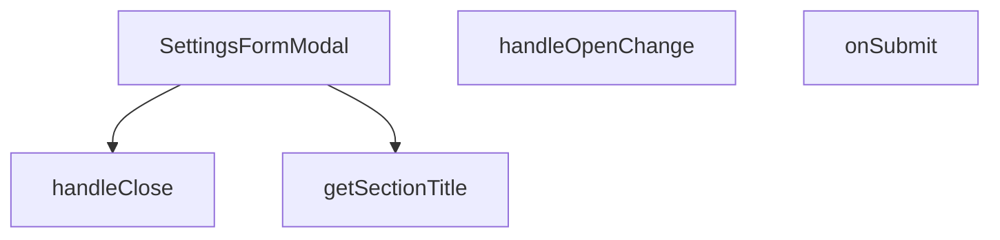

## Genel Bakış
Bu modül, admin panelindeki ayarlar bölümünde bölüm bazlı yapılandırma düzenlemeleri için kullanılan kontrollü bir form modal bileşenidir. Modal penceresinin açılıp kapanmasını yönetir, form gönderimlerini işler ve ilgili bölüm başlıklarını dinamik olarak belirler.

## Fonksiyon Grupları
### Modal Durum Yönetimi
Modal penceresinin açılıp kapanma akışını kontrol eder ve üst bileşen ile iletişim kurarak durum değişikliklerini yönetir.
- handleClose, handleOpenChange

### Form İşlemleri
Kullanıcıdan toplanan form verilerini alır ve sunucuya göndererek ayarların güncellenmesi işlemini başlatır. Bu işlem asenkron bir yapıda çalışır.
- onSubmit

### Yardımcı İşlevler
Modal başlığını, mevcut ayar bölümüne göre dinamik olarak belirler ve bileşen içi okunabilirliği artırır.
- getSectionTitle

---

## AXIOMS – Mimari Varsayımlar
Bu modül, ayarlar formunu section bazlı olarak yöneten kontrollü bir modal bileşenidir.

[Aksiyom 1]: Eğer `section` parametresi `generalSchema`, `paymentSchema`, `adminsSchema` veya `systemSchema` değerlerinden biri değilse, form_Validasyon şeması seçilemez ve form gönderimi hatalı çalışır.

[Aksiyom 2]: Eğer `initialValues` prop'u sağlanmazsa, form boş değerlerle

---

## FONKSİYON DETAYLARI

### SettingsFormModal
**Ne yapar**: Admin panelindeki ayarlar sayfası için form içeren bir modal bileşenidir. Kullanıcının ayar formunu görüntülemesini, düzenlemesini ve kaydetmesini sağlar.

**Nasıl yapar**: React functional component (FC) olarak tanımlanmıştır ve `SettingsFormModalProps` arabirimi ile belirlenen prop'ları alır. Modal'ın açık/kapalı durumunu, hangi ayar bölümünün gösterileceğini, başlangıç değerlerini ve başarı durumunda çalışacak callback fonksiyonunu yönetir. Bileşen, form submit işlemleri ve validasyon mantığını içerebilir.

**Parametreler**:
- open: boolean — Modal'ın açık olup olmadığını belirten durum bayrağı. Modal'ın render edilip edilmeyeceğini kontrol eder.
- onOpenChange: (open: boolean) => void — Modal'ın açık/kapalı durumu değiştiğinde çağrılan callback fonksiyonu. Parent bileşenin modal durumunu güncellemesini sağlar.
- section: string — Hangi ayar bölümünün formunun gösterileceğini belirten tanımlayıcı. Form alanlarının ve değerlerinin section'a göre değişmesini sağlar.
- initialValues: Record<string, any> — Form alanlarının başlangıç değerlerini içeren nesne. Düzenleme modunda mevcut verilerin form alanlarına doldurulması için kullanılır.
- onSuccess: () => void — Form başarıyla gönderildiğinde ve kaydedildiğinde çağrılan callback fonksiyonu. Parent bileşenin verileri yenilemesini veya bildirim göstermesini tetikler.

**Dönüş**: `React.FC<SettingsFormModalProps>` tipinde bir React functional component döndürür. Bu, React JSX elementleri üreten bir bileşendir.

### handleClose
**Ne yapar**: Geliştirildi ancak detay üretilemedi.

### handleOpenChange
**Ne yapar**: Geliştirildi ancak detay üretilemedi.

### onSubmit
**Ne yapar**: Geliştirildi ancak detay üretilemedi.

### getSectionTitle
**Ne yapar**: Geliştirildi ancak detay üretilemedi.

---

## İTHALATLAR (IMPORTS)
- import: @/hooks/useRole::useRole
- import: @/i18n/I18nProvider::useI18n
- import: @/lib/admin/mutateWithAudit::AdminPermissionError
- import: @/lib/admin/mutateWithAudit::mutateWithAudit
- import: @/lib/supabase/client::supabaseBrowserClient
- import: @/lib/type-converters::toSupabaseJson
- import: @hookform/resolvers/zod::zodResolver
- import: @radix-ui/react-dialog
- import: lucide-react::Loader2
- import: lucide-react::Save
- import: lucide-react::X
- import: react-hook-form::useForm
- import: react::React
- import: react::useEffect
- import: react::useState
- import: sonner::toast
- import: zod::z

---

## INTERFACES

### SettingsFormModalProps
- `open: boolean`
- `onOpenChange: (open: boolean) => void`
- `section: SettingsSection | null`
- `initialValues: Record<string, unknown> | null`
- `onSuccess: () => void`

---

## TYPE ALIASES

### SettingsSection
```typescript
type SettingsSection = 'general' | 'payment' | 'admins' | 'system'
```

---

## SABİTLER
- **generalSchema** (call) — `z.object({
  site_name: z.string().min(1, 'Site adı zorunludur'),
  tagline...`
- **paymentSchema** (call) — `z.object({
  iyzico_enabled: z.boolean(),
  iyzico_mode: z.enum(['sandbox',...`
- **adminsSchema** (call) — `z.object({
  admin_sessions_timeout: z.string().min(1, 'Oturum süresi zorunl...`
- **systemSchema** (call) — `z.object({
  system_log_level: z.enum(['debug', 'info', 'warn', 'error']),
...`

---

## AST POINTERS

### [N1_NASIL] AST Pointer: SettingsFormModal.tsx::getSchema (anonim)
- **params**: () — parametre yok
- **ic_degiskenler**: yok
- **Kullanılan closure değişkenleri**: `section` — hangi ayarlar bölümünün aktif olduğunu belirten string; `generalSchema`, `paymentSchema`, `adminsSchema`, `systemSchema` — bölüm bazlı Zod doğrulama şemaları
- **Dönüş**: ZodSchema — `section` değerine göre ilgili şemayı döndürür; `section` falsy ise `generalSchema` döner

---


## MERMAID CALL GRAPH


## NODE ID STANDARD

  file: src\components\admin\settings\SettingsFormModal.tsx
  function: src\components\admin\settings\SettingsFormModal.tsx::SettingsFormModal
  function: src\components\admin\settings\SettingsFormModal.tsx::handleClose
  function: src\components\admin\settings\SettingsFormModal.tsx::handleOpenChange
  function: src\components\admin\settings\SettingsFormModal.tsx::onSubmit
  function: src\components\admin\settings\SettingsFormModal.tsx::getSectionTitle

---

## DISA AKTARILANLAR (EXPORTS)
  export: SettingsFormModal
  export: SettingsSection

---

## STİL TOKENLERİ

### Arbitrary Değerler (token'a geçirilmemiş)
Yok — tüm stiller token'a geçirilmiş. ✅

### Kullanılan Token'lar (zaten token'a geçirilmiş)
- (yok)

### Tailwind Sınıf Özeti
- **Renkler:** `bg-black/60`, `bg-slate-950/40`, `bg-surface-deep`, `bg-transparent`, `bg-white/2`, `border-b`, `border-t`, `border-white/10`, `border-white/5`, `group-hover:text-cyan-400`, `hover:bg-white/10`, `hover:border-white/10`, `hover:text-white`, `text-cyan-400`, `text-red-400`
- **Layout:** `backdrop-blur-sm`, `block`, `custom-scrollbar`, `fixed`, `flex`, `flex-1`, `flex-col`, `gap-2`, `gap-4`, `grid`, `grid-cols-1`, `grid-cols-2`, `h-5`, `items-center`, `items-start`
- **Varyant/Responsive:** `focus-visible:`, `group-hover:`, `hover:`, `md:` önekleri
- **Yardımcı Sınıflar:** `!bg-slate-950`, `!border-white/5`, `${adminButtonPrimaryClass`, `${adminInputClass`, `-translate-x-1/2`, `-translate-y-1/2`, `animate-spin`, `border`, `cursor-pointer`, `focus-visible:ring-cyan-400/20`, `font-black`, `font-bold`, `group`, `group-hover:-translate-y-px`, `inset-0`