## Genel Bakış
Bu modül, admin panelindeki ayarlar bölümünde kullanılan kontrollü bir form modal bileşenidir. Form validasyon şemalarını oluşturur, modalın açılıp kapanma durumunu yönetir ve kullanıcı tarafından girilen ayar verilerinin gönderilmesini sağlar. Ayrıca form hatalarını görüntüler ve ilk geçersiz alana odaklanma gibi kullanıcı deneyimi iyileştirmeleri sunar.

## Fonksiyon Grupları
### Şema Oluşturma
Formun geçerliliğini kontrol etmek için kullanılan validasyon şemalarını, ilgili ayar bölümüne göre dinamik olarak oluşturur.
- buildGeneralSchema, buildPaymentSchema, buildAdminsSchema, buildSystemSchema

### Modal Durum Yönetimi
Modal penceresinin açılıp kapanma akışını kontrol eder ve üst bileşen ile iletişim kurarak durum değişikliklerini yönetir.
- handleClose, handleOpenChange

### Form İşlemleri ve Hata Yönetimi
Form gönderimini işler, form hatalarını belirler ve kullanıcı arayüzünde hata mesajlarını gösterir. Ayrıca form hataları varsa ilk geçersiz alana odaklanmayı sağlar.
- onSubmit, focusFirstInvalid, fieldError, FieldError

### Yardımcı İşlevler
Modal başlığını, mevcut ayar bölümüne göre dinamik olarak belirler ve bileşen içi okunabilirliği artırır.
- getSectionTitle

### Ana Bileşen
Tüm bu grupları bir araya getiren, formu ve modalı yapılandıran ana bileşendir.
- SettingsFormModal

---

## AXIOMS – Mimari Varsayımlar
- Bu modül davranışsal mantık içermez (salt veri / konfigürasyon / tip tanımı).
- [Aksiyom 1]: Modülün dışa açtığı yapı (anahtar kümesi / şema) bir sözleşmedir; tüketiciler bu sabit yapıya bağlıdır — kırıcı değişiklik tüm tüketicileri etkiler.
- [Aksiyom 2]: Bir öğe ekleme/çıkarma yapısal-uyumlu olmalı; ilgili tipler ve seçiciler aynı commit'te güncel tutulmalıdır.

---

## FONKSİYON DETAYLARI

### buildGeneralSchema
**Ne yapar**: Genel ayarlar bölümünün form doğrulama şemasını oluşturur. `v` parametresi aracılığıyla doğrulama mesajlarını uluslararasılaştırma (i18n) sisteminden çeker.
**Nasıl yapar**: Verilen `v` fonksiyonunu kullanarak genel ayarlar için geçerli bir doğrulama şeması üretir. Gövdedeki mantığa göre, eğer `section` tanımlı değilse doğrudan `buildGeneralSchema(v)` çağrılır; `section` tanımlıysa switch-case yapısıyla ilgili bölümün şeması oluşturulur. `'general'` durumunda `buildGeneralSchema(v)`, `'payment'` durumunda `buildPaymentSchema(v)`, `'admins'` durumunda `buildAdminsSchema(v)`, `'system'` durumunda `buildSystemSchema()` çağrılır.
**Parametreler**:
- v: (key: string) => string — Doğrulama mesaharını i18n anahtarına göre döndüren fonksiyon. `t('admin.settings.validation.${key}')` şeklinde çağrılır.
**Dönüş**: Bilinmiyor — kaynakta dönüş tipi belirtilmemiş.

### buildPaymentSchema
**Ne yapar**: Geliştirildi ancak detay üretilemedi.

### buildAdminsSchema
**Ne yapar**: Geliştirildi ancak detay üretilemedi.

### buildSystemSchema
**Ne yapar**: Geliştirildi ancak detay üretilemedi.

### FieldError
**Ne yapar**: Geliştirildi ancak detay üretilemedi.

### focusFirstInvalid
**Ne yapar**: Geliştirildi ancak detay üretilemedi.

### SettingsFormModal
**Ne yapar**: Admin panelindeki ayarlar sayfası için form içeren bir modal bileşenidir. Kullanıcının ayar formunu görüntülemesini, düzenlemesini ve kaydetmesini sağlar.

**Nasıl yapar**: React functional component (FC) olarak tanımlanmıştır ve `SettingsFormModalProps` arabirimi ile belirlenen prop'ları alır. Modal'ın açık/kapalı durumunu, hangi ayar bölümünün gösterileceğini, başlangıç değerlerini ve başarı durumunda çalışacak callback fonksiyonunu yönetir. Bileşen, form submit işlemleri ve validasyon mantığını içerebilir.

**Parametreler**:
- open: boolean — Modal'ın açık olup olmadığını belirten durum bayrağı. Modal'ın render edilip edilmeyeceğini kontrol eder.
- onOpenChange: (open: boolean) => void — Modal'ın açık/kapalı durumu değiştiğinde çağrılan callback fonksiyonu. Parent bileşenin modal durumunu güncellemesini sağlar.
- section: string — Hangi ayar bölümünün formunun gösterileceğini belirten tanımlayıcı. Form alanlarının ve değerlerinin section'a göre değişmesini sağlar.
- initialValues: Record<string, any> — Form alanlarının başlangıç değerlerini içeren nesne. Düzenleme modunda mevcut verilerin form alanlarına doldurulması için kullanılır.
- onSuccess: () => void — Form başarıyla gönderildiğinde ve kaydedildiğinde çağrılan callback fonksiyonu. Parent bileşenin verileri yenilemesini veya bildirim göstermesini tetikler.

**Dönüş**: `React.FC<SettingsFormModalProps>` tipinde bir React functional component döndürür. Bu, React JSX elementleri üreten bir bileşendir.

### fieldError
**Ne yapar**: Geliştirildi ancak detay üretilemedi.

### handleClose
**Ne yapar**: Geliştirildi ancak detay üretilemedi.

### handleOpenChange
**Ne yapar**: Geliştirildi ancak detay üretilemedi.

### onSubmit
**Ne yapar**: Geliştirildi ancak detay üretilemedi.

### getSectionTitle
**Ne yapar**: Geliştirildi ancak detay üretilemedi.

---

## İTHALATLAR (IMPORTS)
- import: ../overlay/ConfirmProvider::useConfirm
- import: @/hooks/useRole::useRole
- import: @/i18n/I18nProvider::useI18n
- import: @/lib/admin/mutateWithAudit::AdminPermissionError
- import: @/lib/admin/mutateWithAudit::mutateWithAudit
- import: @/lib/supabase/client::supabaseBrowserClient
- import: @/lib/type-converters::toSupabaseJson
- import: @hookform/resolvers/zod::zodResolver
- import: @radix-ui/react-dialog
- import: lucide-react::Loader2
- import: lucide-react::Save
- import: lucide-react::X
- import: react-hook-form::type { FieldErrors }
- import: react-hook-form::useForm
- import: react::React
- import: react::useEffect
- import: react::useState
- import: sonner::toast
- import: zod::z

---

## INTERFACES

### SettingsFormModalProps
- `open: boolean`
- `onOpenChange: (open: boolean) => void`
- `section: SettingsSection | null`
- `initialValues: Record<string, unknown> | null`
- `onSuccess: () => void`

---

## TYPE ALIASES

### SettingsSection
```typescript
type SettingsSection = 'general' | 'payment' | 'admins' | 'system'
```

---

## SABİTLER
- **FIELD_FOCUS_ORDER** (array) — `[
  { name: 'site_name', id: 'settings-site-name' },
  { name: 'tagline', i...`

---

## AST POINTERS

### [N1_NASIL] AST Pointer: SettingsFormModal.tsx::buildGeneralSchema
- **params**: `v` — (key: string) => string tipinde çeviri fonksiyonu
- **ic_degiskenler**: yok
- **Dönüş**: z.object (Zod şeması) — site_name, tagline, contact_email, support_phone, headquarters, logo_url alanlarını doğrular

### [N2_NASIL] AST Pointer: SettingsFormModal.tsx::buildPaymentSchema
- **params**: `v` — (key: string) => string tipinde çeviri fonksiyonu
- **ic_degiskenler**: yok
- **Dönüş**: z.object (Zod şeması) — iyzico_enabled, iyzico_mode, iyzico_api_key alanlarını doğrular

### [N3_NASIL] AST Pointer: SettingsFormModal.tsx::buildAdminsSchema
- **params**: `v` — (key: string) => string tipinde çeviri fonksiyonu
- **ic_degiskenler**: yok
- **Dönüş**: z.object (Zod şeması) — admin_sessions_timeout, mfa_required alanlarını doğrular

### [N4_NASIL] AST Pointer: SettingsFormModal.tsx::buildSystemSchema
- **params**: (parametre yok)
- **ic_degiskenler**: yok
- **Dönüş**: z.object (Zod şeması) — system_log_level, debug_mode alanlarını doğrular

### [N5_NASIL] AST Pointer: SettingsFormModal.tsx::FieldError
- **params**: `id` — string, `message` — string (opsiyonel)
- **ic_degiskenler**: yok
- **Dönüş**: JSX — message varsa `<p>` elementi (role="alert", className="mt-1 text-xs font-bold tracking-tighter text-admin-danger"), yoksa null

### [N6_NASIL] AST Pointer: SettingsFormModal.tsx::focusFirstInvalid
- **params**: `errs` — FieldErrors<Record<string, unknown>>
- **ic_degiskenler**:
  - `first` — FIELD_FOCUS_ORDER dizisinde errs[name] eşleşen ilk öğe; bulunamazsa fonksiyon erken döner
- **Dönüş**: void — bulunan öğenin id'si ile document.getElementById(first.id)?.focus() çağrısı yapar

### [N7_NASIL] AST Pointer: SettingsFormModal.tsx::getSchema
- **params**: (parametre yok)
- **ic_degiskenler**:
  - `v` — t fonksiyonunu kullanarak `admin.settings.validation.${key}` anahtarını çeviren arrow function
- **Dönüş**: Zod şeması — section değerine göre buildGeneralSchema, buildPaymentSchema, buildAdminsSchema veya buildSystemSchema çağrısı; section yoksa buildGeneralSchema(v) döner

### [N8_NASIL] AST Pointer: SettingsFormModal.tsx::fieldError
- **params**: `name` — string
- **ic_degiskenler**:
  - `message` — form.formState.errors[name]?.message değeri; typeof kontrolü ile string ise döndürülür, değilse undefined
- **Dönüş**: string | undefined

### [N9_NASIL] AST Pointer: SettingsFormModal.tsx::handleClose
- **params**: (parametre yok)
- **ic_degiskenler**:
  - `ok` — confirm fonksiyonunun await ile beklenen boolean dönüş değeri
- **Dönüş**: void (async) — form.formState.isDirty false ise doğrudan onOpenChange(false) çağrısı yapar; true ise confirm dialog gösterir, ok true ise onOpenChange(false) çağrısı yapar

### [N10_NASIL] AST Pointer: SettingsFormModal.tsx::handleOpenChange
- **params**: `openVal` — boolean
- **ic_degiskenler**: yok
- **Dönüş**: void — openVal false ise handleClose() çağrısı yapar, true ise onOpenChange(true) çağrısı yapar

### [N11_NASIL] AST Pointer: SettingsFormModal.tsx::onSubmit
- **params**: `values` — Record<string, unknown>
- **ic_degiskenler**:
  - `authData` — supabase.auth.getUser() sonucu; authData.user?.id ile kullanıcı kimliği alınır
  - `userId` — authData.user?.id || null; veritabanına yazılacak kullanıcı kimliği
  - `e` — catch bloğunda yakalanan unknown tipinde hata
  - `msg` — hata tipine göre belirlenen mesaj: AdminPermissionError ise t('admin.settings.noPermission'), Error ise e.message, diğer durumlarda t('admin.settings.saveError')
- **Dönüş**: void (async) — section yoksa erken döner; setSaving(true) ile başlar; mutateWithAudit ile site_settings tablosuna upsert yapar (key: section, value: toSupabaseJson(values), updated_by: userId, updated_at: ISO tarih); başarılıysa toast.success, onSuccess(), onOpenChange(false); hatada toast.error; finally'de setSaving(false)

### [N12_NASIL] AST Pointer: SettingsFormModal.tsx::getSectionTitle
- **params**: (parametre yok)
- **ic_degiskenler**: yok
- **Dönüş**: string — section değerine göre çevrilmiş başlık: 'general' ise t('admin.settings.generalSettingsTitle'), 'payment' ise t('admin.settings.paymentSettingsTitle'), 'admins' ise t('admin.settings.adminsPolicyTitle'), 'system' ise t('admin.settings.systemConfigTitle'); section yoksa boş string

---


## MERMAID CALL GRAPH

```mermaid
graph TD
    SettingsFormModal_tsx__FieldError["FieldError"]
    SettingsFormModal_tsx__SettingsFormModal["SettingsFormModal"]
    SettingsFormModal_tsx__buildAdminsSchema["buildAdminsSchema"]
    SettingsFormModal_tsx__buildGeneralSchema["buildGeneralSchema"]
    SettingsFormModal_tsx__buildPaymentSchema["buildPaymentSchema"]
    SettingsFormModal_tsx__buildSystemSchema["buildSystemSchema"]
    SettingsFormModal_tsx__fieldError["fieldError"]
    SettingsFormModal_tsx__focusFirstInvalid["focusFirstInvalid"]
    SettingsFormModal_tsx__getSectionTitle["getSectionTitle"]
    SettingsFormModal_tsx__handleClose["handleClose"]
    SettingsFormModal_tsx__handleOpenChange["handleOpenChange"]
    SettingsFormModal_tsx__onSubmit["onSubmit"]
    SettingsFormModal_tsx__SettingsFormModal --> SettingsFormModal_tsx__handleClose
    SettingsFormModal_tsx__SettingsFormModal --> SettingsFormModal_tsx__fieldError
    SettingsFormModal_tsx__SettingsFormModal --> SettingsFormModal_tsx__buildAdminsSchema
    SettingsFormModal_tsx__SettingsFormModal --> SettingsFormModal_tsx__buildPaymentSchema
    SettingsFormModal_tsx__SettingsFormModal --> SettingsFormModal_tsx__buildGeneralSchema
    SettingsFormModal_tsx__SettingsFormModal --> SettingsFormModal_tsx__buildSystemSchema
    SettingsFormModal_tsx__SettingsFormModal --> SettingsFormModal_tsx__getSectionTitle
```


## NODE ID STANDARD

  file: src\components\admin\settings\SettingsFormModal.tsx
  function: src\components\admin\settings\SettingsFormModal.tsx::buildGeneralSchema
  function: src\components\admin\settings\SettingsFormModal.tsx::buildPaymentSchema
  function: src\components\admin\settings\SettingsFormModal.tsx::buildAdminsSchema
  function: src\components\admin\settings\SettingsFormModal.tsx::buildSystemSchema
  function: src\components\admin\settings\SettingsFormModal.tsx::FieldError
  function: src\components\admin\settings\SettingsFormModal.tsx::focusFirstInvalid
  function: src\components\admin\settings\SettingsFormModal.tsx::SettingsFormModal
  function: src\components\admin\settings\SettingsFormModal.tsx::fieldError
  function: src\components\admin\settings\SettingsFormModal.tsx::handleClose
  function: src\components\admin\settings\SettingsFormModal.tsx::handleOpenChange
  function: src\components\admin\settings\SettingsFormModal.tsx::onSubmit
  function: src\components\admin\settings\SettingsFormModal.tsx::getSectionTitle

---

## DISA AKTARILANLAR (EXPORTS)
  export: FieldError
  export: SettingsFormModal
  export: SettingsSection
  export: buildAdminsSchema
  export: buildGeneralSchema
  export: buildPaymentSchema
  export: buildSystemSchema
  export: focusFirstInvalid

---

## STİL TOKENLERİ

### Arbitrary Değerler (token'a geçirilmemiş)
Yok — tüm stiller token'a geçirilmiş. ✅

### Kullanılan Token'lar (zaten token'a geçirilmiş)
- (yok)

### Tailwind Sınıf Özeti
- **Renkler:** `bg-admin-bg`, `bg-admin-surface-2`, `bg-black/60`, `bg-transparent`, `border-admin-border`, `border-b`, `border-t`, `group-hover:text-admin-accent`, `hover:bg-admin-surface-3`, `hover:border-admin-border`, `hover:text-admin-fg`, `text-admin-accent`, `text-admin-danger`, `text-admin-fg`, `text-admin-fg-muted`
- **Layout:** `block`, `custom-scrollbar`, `fixed`, `flex`, `flex-1`, `flex-col`, `gap-2`, `gap-4`, `grid`, `grid-cols-1`, `grid-cols-2`, `h-5`, `items-center`, `items-start`, `justify-between`
- **Varyant/Responsive:** `:`, `focus-visible:`, `group-hover:`, `hover:`, `md:` önekleri
- **Yardımcı Sınıflar:** `!bg-admin-surface-3`, `!border-admin-border`, `!border-admin-danger`, `${adminButtonPrimaryClass`, `${adminInputClass`, `${adminInputClass}${fieldError('admin_sessions_timeout`, `${adminInputClass}${fieldError('contact_email`, `${adminInputClass}${fieldError('headquarters`, `${adminInputClass}${fieldError('iyzico_api_key`, `${adminInputClass}${fieldError('logo_url`, `${adminInputClass}${fieldError('site_name`, `${adminInputClass}${fieldError('support_phone`, `${adminInputClass}${fieldError('tagline`, `-translate-x-1/2`, `-translate-y-1/2`