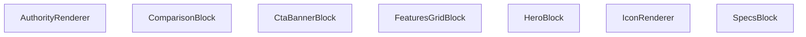

## Genel Bakış
`AuthorityRenderer` modülü, dinamik ve çoklu içerik bloklarını (hero bölümü, özellikler, karşılaştırma tabloları vb.) merkezi olarak yöneten bir React bileşenidir. Modül, bir içerik blokları koleksiyonunu alır ve her bir bloğun `type` alanına göre önceden tanımlı, uygun render bileşenine yönlendirerek modüler ve tutarlı bir arayüz üretir.

## Fonksiyon Grupları
### Ana Yönlendirici ve Yardımcılar
Modülün giriş noktası olan ana bileşen, içerik dizisini iterasyona alarak blok tipine göre doğru render bileşenini çağırır. Yardımcı bileşen, bloklar içinde ortak ihtiyaç duyulan ikon gösterimini soyutlayarak tekrar kullanılırlığı sağlar.
- `AuthorityRenderer`, `IconBlock` olarak da adlandırılabilecek `IconRenderer`.

### Blok Bazlı Render Bileşenleri
Her bir içerik bloğu tipi için özel olarak tasarlanmış bağımsız React bileşenleri. Her biri, kendisine iletilen `block` veri yapısını çözümleyerek o bloğun arayüzünü (örneğin başlık ve açıklama, özellik kartları, karşılaştırma satırları) oluşturur.
- `HeroBlock`, `SpecsBlock`, `FeaturesGridBlock`, `ComparisonBlock`, `CtaBannerBlock`.

## AXIOMS – Mimari Varsayımlar
Bu modül, içerik koleksiyonunu blok tiplerine göre ayırıp ilgili render bileşenlerine yönlendiren bir yapıya sahiptir.

[Aksiyom 1]: Eğer `IconRenderer` bileşenine geçerli bir `name` parametresi (boş string veya undefined) verilmezse, ikon gösterimi başarısız olur.

[Aksiyom 2]: Eğer bir blok bileşenine (HeroBlock, SpecsBlock, FeaturesGridBlock, ComparisonBlock, CtaBannerBlock) `block` parametresi verilmezse, bileşenin çalışması belirsiz veya hatalı olacaktır; tüm blok bileşenleri blok verisi alacak şekilde tasarlanmıştır.

---

## AXIOMS – Mimari Varsayımlar

Bu modül, içerik bloklarını türlerine göre yönlendiren bir render zincirinden oluşur. Aşağıdaki varsayımlar yalnızca fonksiyon imzalarından çıkarılmıştır.

**[Aksiyom 1]:** Eğer `AuthorityRenderer`'a `content` parametresi olarak `null` geçilirse, bileşen içeriği boş/bozuk olarak işleyebilmelidir — çünkü tipi `AuthorityContent | null` olarak tanımlıdır ve `null` geçerli bir girdidir.

**[Aksiyom 2]:** Eğer `AuthorityRenderer`, bir içeriği işlerken uygun alt blok bileşenine yönlendirme yapacaksa, her blok nesnesinin bir `type` alanı ile birlikte ilgili blok tipine (`HeroBlockType`, `SpecsBlockType`, `FeaturesGridBlockType`, `ComparisonBlockType`, `CtaBannerType`) karşık gelmesi gerekir;aksi takdirde hangi bileşene yönlendirileceği belirsiz olur.

**[Aksiyom 3]:** Eğer `IconRenderer`'a `name` parametresi geçirilmezse, bileşen çalışamaz — çünkü `name: string` olarak zorunlu (non-optional) tanımlıdır. `className` ise opsiyoneldir ve verilmezse bile bileşen çalışabilir.

**[Aksiyom 4]:** Eğer bir blok nesnesi, beklenen tip arayüzünden (`HeroBlockType`, `SpecsBlockType`, vb.) farklı bir yapıya sahipse (örneğin gerekli alanları eksikse), ilgili blok bileşeni (`HeroBlock`, `SpecsBlock`, vb.) beklenmedik davranış gösterebilir; çünkü her bileşen kesin tip garantisiyle çalışmak üzere tasarlanmıştır.

---

## FONKSİYON DETAYLARI

### IconRenderer
**Ne yapar**: Verilen `name` ve opsiyonel `className` parametrelerine göre bir simge (icon) öğesini render eder.  
**Nasıl yapar**: `name` değeriyle hangi simgenin gösterileceğini belirler, `className` varsa bu sınıfları öğeye uygulayarak stil ve görünümü ayarlar.  
**Parametreler**:  
- name: string — Gösterilecek simgenin adı veya kimliği  
- className: string — (opsiyonel) Simgeye ek CSS sınıfları  
**Dönüş**: void — Fonksiyon bir JSX öğesi döndürür; açık bir dönüş tipi belirtilmemiştir.

### HeroBlock
**Ne yapar**: `block` prop’u olarak gelen `HeroBlockType` verisini kullanarak hero bölümü bileşenini render eder.  
**Nasıl yapar**: `block` içindeki başlık, açıklama, görsel ve çağrı‑eylem gibi alanları okuyarak ilgili JSX yapısını oluşturur ve döndürür.  
**Parametreler**:  
- block: HeroBlockType — Hero bölümü içeriğini tanımlayan veri nesnesi  
**Dönüş**: React.FC<{ block: HeroBlockType }> — Hero bileşenini render eden fonksiyonel bileşen.

### SpecsBlock
**Ne yapar**: `block` prop’u olarak gelen `SpecsBlockType` verisini kullanarak özellik spesifikasyonları bloğunu render eder.  
**Nasıl yapar**: `block` içindeki özellik listelerini (başlık, değer, birim vb.) iterate ederek her bir özelliği uygun şekilde biçimlendirir ve JSX olarak döndürür.  
**Parametreler**:  
- block: SpecsBlockType — Spesifikasyon bloğu verisini taşıyan nesne  
**Dönüş**: React.FC<{ block: SpecsBlockType }> — Specs bileşenini render eden fonksiyonel bileşen.

### FeaturesGridBlock
**Ne yapar**: `block` prop’u olarak gelen `FeaturesGridBlockType` verisini kullanarak özellikleri ızgara düzeninde gösteren bileşeni render eder.  
**Nasıl yapar**: `block` içindeki özellik kartlarını (ikon, başlık, açıklama) alıp bir CSS ızgara veya flex düzeninde yerleştirerek kullanıcıya sunar.  
**Parametreler**:  
- block: FeaturesGridBlockType — Özellik ızgara verisini içeren nesne  
**Dönüş**: React.FC<{ block: FeaturesGridBlockType }> — FeaturesGrid bileşenini render eden fonksiyonel bileşen.

### ComparisonBlock
**Ne yapar**: `block` prop’u olarak gelen `ComparisonBlockType` verisini kullanarak ürün veya hizmet karşılaştırma tablosunu render eder.  
**Nasıl yapar**: `block` içindeki sütun başlıkları ve satır verilerini okuyarak bir HTML tablosu veya div‑tabanlı ızgara yapısı oluşturur ve stilini uygular.  
**Parametreler**:  
- block: ComparisonBlockType — Karşılaştırma bloğu verisini taşıyan nesne  
**Dönüş**: React.FC<{ block: ComparisonBlockType }> — Comparison bileşenini render eden fonksiyonel bileşen.

### CtaBannerBlock
**Ne yapar**: `block` prop’u olarak gelen `CtaBannerBlockType` verisini kullanarak çağrı‑eylem (CTA) bannerını render eder.  
**Nasıl yapar**: `block` içindeki başlık, açıklama, buton metni ve link gibi alanları alarak bir banner bölümü oluşturur, genellikle arka plan rengi veya görsel ile vurgulanır.  
**Parametreler**:  
- block: CtaBannerBlockType — Cta banner verisini içeren nesne  
**Dönüş**: React.FC<{ block: CtaBannerBlockType }> — CtaBanner bileşenini render eden fonksiyonel bileşen.

### AuthorityRenderer
**Ne yapar**: `content` prop’u olarak gelen `AuthorityContent | null` verisini kullanarak yetki veya güvenilirlik ile ilgili içerik bloklarını render eder; içerik yoksa null döndürür.  
**Nasıl yapar**: `content` null değilse, içindeki başlık, açıklama, logo veya belge verilerini okuyarak uygun JSX yapısını oluşturur; null ise hiçbir şey render etmez.  
**Parametreler**:  
- content: AuthorityContent | null — Yetki içeriğini tanımlayan veri nesnesi veya içerik yoksa null  
**Dönüş**: React.FC<{ content: AuthorityContent | null }> — Authority bileşenini render eden fonksiyonel bileşen.

---

## İTHALATLAR (IMPORTS)
- import: ../LazyInView::LazyInView
- import: ./TechnicalDrawingAuthority::TechnicalDrawingAuthority
- import: ./VideoAuthority::VideoAuthority
- import: @/i18n/I18nProvider::useI18n
- import: @/lib/utils::cn
- import: isomorphic-dompurify::DOMPurify
- import: lucide-react
- import: next/image::Image
- import: react::React

---

## AST POINTERS

### [N1_NASIL] AST Pointer: src/components/authority/AuthorityRenderer.tsx::IconRenderer
- **params**: `name: string`, `className?: string`
- **ic_degiskenler**:
  - `iconName` — `name` parametresinin ilk harfini büyük yaparak Lucide icon adı formatına dönüştürür, tipi `keyof typeof LucideIcons` olarak belirlenir
  - `Icon` — `iconName` ile `LucideIcons` objesinden ilgili React componentini alır, bulunamazsa `LucideIcons.Zap` fallback'ini kullanır
- **Dönüş**: `<Icon className={className} />` JSX elemanı (Lucide icon bileşeni)

### [N2_NASIL] AST Pointer: src/components/authority/AuthorityRenderer.tsx::HeroBlock
- **params**: `block: HeroBlockType`
- **ic_degiskenler**: (yok — doğrudan `block` propertysinden veri okunur)
- **Dönüş**: `<section>` JSX elemanı. İçeriğe göre `block.content.eyebrow`, `block.content.title`, `block.content.description`, `block.content.ctaLabel`, `block.content.ctaLink`, `block.content.imageUrl` değerlerini render eder. `block.config?.fullWidth` ve `block.config?.theme` yapılandırmalarına göre CSS sınıfı belirler.

### [N3_NASIL] AST Pointer: src/components/authority/AuthorityRenderer.tsx::SpecsBlock
- **params**: `block: SpecsBlockType`
- **ic_degiskenler**: (yok — `block.content.columns` ve `block.content.rows` doğrudan kullanılır)
- **Dönüş**: `
` containing specs grid JSX elemanı. `block.content.title`, `block.content.description`, `block.content.columns` değerlerini render eder. `block.content.rows` dizisini `.map()` ile dönerek her satır için `{row.label}`, `{row.value}`, `{row.unit}` değerlerini gösterir.

### [N4_NASIL] AST Pointer: src/components/authority/AuthorityRenderer.tsx::FeaturesGridBlock
- **params**: `block: FeaturesGridBlockType`
- **ic_degiskenler**: (yok — `block.content.items` dizisi `.map()` ile dönülür)
- **Dönüş**: `
` containing features grid JSX elemanı. `block.content.title` başlığını, `block.content.items` dizisini `.map()` ile dönerek her item için `item.icon`, `item.title`, `item.description` değerlerini ve `IconRenderer` bileşenini render eder.

### [N5_NASIL] AST Pointer: src/components/authority/AuthorityRenderer.tsx::ComparisonBlock
- **params**: `block: ComparisonBlockType`
- **ic_degiskenler**: (yok — `block.content` alanları doğrudan kullanılır)
- **Dönüş**: `
` containing comparison layout JSX elemanı. `block.content.title`, `block.content.leftLabel`, `block.content.leftImage`, `block.content.rightLabel`, `block.content.rightImage`, `block.content.differenceText` değerlerini render eder. Sol ve sağ taraflar için conditionall `Image` componentleri veya fallback iconlar gösterir.

### [N6_NASIL] AST Pointer: src/components/authority/AuthorityRenderer.tsx::CtaBannerBlock
- **params**: `block: CtaBannerBlockType`
- **ic_degiskenler**: (yok — `block.content` alanları doğrudan kullanılır)
- **Dönüş**: `
` containing CTA banner JSX elemanı. `block.content.title`, `block.content.description`, `block.content.buttonLabel`, `block.content.buttonLink` değerlerini render eder. Background accent div'leri de ekler.

### [N7_NASIL] AST Pointer: src/components/authority/AuthorityRenderer.tsx::AuthorityRenderer
- **params**: `content: AuthorityContent | null`
- **ic_degiskenler**:
  - `t` — `useI18n()` hook'undan gelen çeviri fonksiyonu
  - `block` — `content.map()` callback'indeki mevcut blok (her iterasyonda değişir)
  - `mediaBlock` — `block`'un `MediaBlockType` olarak cast edilmiş hali (sadece `'media'` case'inde)
  - `rtBlock` — `block`'un `RichTextBlockType` olarak cast edilmiş hali (sadece `'rich-text'` case'inde)
- **Dönüş**: `null` veya `
` JSX elemanı. `content` dizisini dönerek her `block` için `block.type`'a göre ilgili bileşeni (`HeroBlock`, `SpecsBlock`, `FeaturesGridBlock`, `ComparisonBlock`, `CtaBannerBlock`) render eder. `'media'` tipi için `VideoAuthority`, `LazyInView` (ThreeDAuthority için), `TechnicalDrawingAuthority`, `Image` bileşenlerini conditionally render eder. `'rich-text'` tipi için `DOMPurify.sanitize(rtBlock.content.html)` ile sanitize edilmiş HTML render eder. Bilinmeyen blok tipi için `t()` ile çevrilmiş hata mesajı gösterir. `block.config?.isHidden` true ise bloğu atlar.

---

## MERMAID CALL GRAPH

## NODE ID STANDARD

  file: src\components\authority\AuthorityRenderer.tsx
  function: src\components\authority\AuthorityRenderer.tsx::IconRenderer
  function: src\components\authority\AuthorityRenderer.tsx::HeroBlock
  function: src\components\authority\AuthorityRenderer.tsx::SpecsBlock
  function: src\components\authority\AuthorityRenderer.tsx::FeaturesGridBlock
  function: src\components\authority\AuthorityRenderer.tsx::ComparisonBlock
  function: src\components\authority\AuthorityRenderer.tsx::CtaBannerBlock
  function: src\components\authority\AuthorityRenderer.tsx::AuthorityRenderer

---

## DISA AKTARILANLAR (EXPORTS)
  export: AuthorityRenderer
  export: ComparisonBlock
  export: CtaBannerBlock
  export: FeaturesGridBlock
  export: HeroBlock
  export: IconRenderer
  export: SpecsBlock

---

## STİL TOKENLERİ

### Arbitrary Değerler (token'a geçirilmemiş)
Yok — tüm stiller token'a geçirilmiş. ✅

### Kullanılan Token'lar (zaten token'a geçirilmiş)
- `rounded-hvac-2xl`, `rounded-hvac-lg`

### Tailwind Sınıf Özeti
- **Renkler:** `bg-black/10`, `bg-indigo-600`, `bg-slate-100`, `bg-slate-50`, `bg-slate-900`, `bg-slate-900/10`, `bg-white`, `bg-white/20`, `bg-white/5`, `border-2`, `border-8`, `border-dashed`, `border-red-100`, `border-slate-100`, `border-slate-200`
- **Layout:** `absolute`, `bottom-0`, `bottom-6`, `flex`, `flex-col`, `gap-1`, `gap-12`, `gap-4`, `gap-8`, `grid`, `grid-cols-1`, `h-12`, `h-14`, `h-16`, `h-6`
- **Varyant/Responsive:** `active:`, `hover:`, `lg:`, `md:` önekleri
- **Yardımcı Sınıflar:** `-mb-32`, `-ml-32`, `-mr-48`, `-mt-48`, `-translate-x-1/2`, `active:scale-95`, `animate-pulse`, `aspect-video`, `authority-content-wrapper`, `blur-3xl`, `border`, `brightness-0`, `dark`, `duration-500`, `font-black`