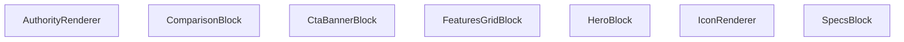

## Genel Bakış
`AuthorityRenderer` bileşeni, gelen içerik koleksiyonunu blok tiplerine göre ayırıp ilgili görsel bileşenlere yönlendiren bir render katmanıdır. Her blok tipi (hero, specs, özellikler grid, karşılaştırma, CTA banner) kendi özel render fonksiyonuyla işlenir ve ortak ikon gösterimi için `IconRenderer` yardımcı bileşeni kullanılır.

## Fonksiyon Grupları
### Blok Render Grupları
Bu grup, belirli veri tiplerini alıp karşılık gelen UI yapılarını oluşturur; her biri gelen blok verisini okuyarak uygun JSX döndürür.  
- `HeroBlock`, `SpecsBlock`, `FeaturesGridBlock`, `ComparisonBlock`, `CtaBannerBlock`

### Ana Render ve Yardımcı
`AuthorityRenderer` içerik listesini döngüye alarak blok tipine göre ilgili blok render fonksiyonunu çağırır. `IconRenderer` ise simge adı ve opsiyonel sınıf alarak tekrar kullanılabilir bir ikon öğesi üretir ve diğer blok render içinde ihtiyaç duyulduğunda kullanılır.  
- `AuthorityRenderer`, `IconRenderer`

---

## AXIOMS – Mimari Varsayımlar
Bu modülün doğru çalışması için aşağıdaki koşulların sağlanması gerekir; koşullar eksik olduğunda beklenen davranış bozulur.

- **Eğer** `AuthorityRenderer` component’ine `content` prop’u **tanımlı değilse** veya **dizi (Array) tipi değilse**, bloklar iterate edilemeyeceği için hiçbir içerik render edilmez ve çalışma‑zamanı hatası oluşabilir.  
- **Eğer** `content` dizisindeki herhangi bir blok nesnesi **`type` özelliğine sahip değilse** veya bu özellik **`undefined`/`null` ise**, `AuthorityRenderer` hangi blok render fonksiyonunu çağıracağını belirleyemez; ilgili blok atlanır ve UI’da görünmez.  
- **Eğer** bir blokun `type` değeri **`"hero"`, `"specs"`, `"featuresGrid"`, `"comparison"` veya `"ctaBanner"` dışında bir string ise**, `AuthorityRenderer` bu tip için eşleşen bir render fonksiyonu bulamayacağı için blok render edilmez.  
- **Eğer** `IconRenderer` component’ine `name` prop’u **string tipi dışında bir değer** (örneğin sayı, null, undefined) verilirse, ikon adı tanımsız olur ve ikon gösterilemeyebilir veya hata fırlatılabilir.  
- **Eğer** `IconRenderer` component’ine `className` prop’u **string tipi dışında bir değer** verilirse, sınıf adı DOM elemanına uygulanamayabilir; bu da stil beklentilerinin bozulmasına yol açar.  
- **Eğer** `HeroBlock`, `SpecsBlock`, `FeaturesGridBlock`, `ComparisonBlock` veya `CtaBannerBlock` component’lerine `block` prop’u **eksik verilirse** veya bu prop’un **bileşenin bekl ettiği zorunlu alanları içermediği** takdirde, ilgili blok beklenen veriyi alamayacağından render hatası veya boş bir çıktı üretebilir.  

Bu varsayımlar, modülün işlevselliğini korumak için giriş verilerinin ve prop tiplerinin belirtilen şartlara uygun olması gerektiğini ifade eder. Koşullar sağlanmadığında render eksikliği, hatalı UI veya çalışma‑zamanı istisnaları ortaya çıkabilir.

---

## FONKSİYON DETAYLARI

### IconRenderer
**Ne yapar**: Verilen `name` ve opsiyonel `className` parametrelerine göre bir simge (icon) öğesini render eder.  
**Nasıl yapar**: `name` değeriyle hangi simgenin gösterileceğini belirler, `className` varsa bu sınıfları öğeye uygulayarak stil ve görünümü ayarlar.  
**Parametreler**:  
- name: string — Gösterilecek simgenin adı veya kimliği  
- className: string — (opsiyonel) Simgeye ek CSS sınıfları  
**Dönüş**: void — Fonksiyon bir JSX öğesi döndürür; açık bir dönüş tipi belirtilmemiştir.

### HeroBlock
**Ne yapar**: `block` prop’u olarak gelen `HeroBlockType` verisini kullanarak hero bölümü bileşenini render eder.  
**Nasıl yapar**: `block` içindeki başlık, açıklama, görsel ve çağrı‑eylem gibi alanları okuyarak ilgili JSX yapısını oluşturur ve döndürür.  
**Parametreler**:  
- block: HeroBlockType — Hero bölümü içeriğini tanımlayan veri nesnesi  
**Dönüş**: React.FC<{ block: HeroBlockType }> — Hero bileşenini render eden fonksiyonel bileşen.

### SpecsBlock
**Ne yapar**: `block` prop’u olarak gelen `SpecsBlockType` verisini kullanarak özellik spesifikasyonları bloğunu render eder.  
**Nasıl yapar**: `block` içindeki özellik listelerini (başlık, değer, birim vb.) iterate ederek her bir özelliği uygun şekilde biçimlendirir ve JSX olarak döndürür.  
**Parametreler**:  
- block: SpecsBlockType — Spesifikasyon bloğu verisini taşıyan nesne  
**Dönüş**: React.FC<{ block: SpecsBlockType }> — Specs bileşenini render eden fonksiyonel bileşen.

### FeaturesGridBlock
**Ne yapar**: `block` prop’u olarak gelen `FeaturesGridBlockType` verisini kullanarak özellikleri ızgara düzeninde gösteren bileşeni render eder.  
**Nasıl yapar**: `block` içindeki özellik kartlarını (ikon, başlık, açıklama) alıp bir CSS ızgara veya flex düzeninde yerleştirerek kullanıcıya sunar.  
**Parametreler**:  
- block: FeaturesGridBlockType — Özellik ızgara verisini içeren nesne  
**Dönüş**: React.FC<{ block: FeaturesGridBlockType }> — FeaturesGrid bileşenini render eden fonksiyonel bileşen.

### ComparisonBlock
**Ne yapar**: `block` prop’u olarak gelen `ComparisonBlockType` verisini kullanarak ürün veya hizmet karşılaştırma tablosunu render eder.  
**Nasıl yapar**: `block` içindeki sütun başlıkları ve satır verilerini okuyarak bir HTML tablosu veya div‑tabanlı ızgara yapısı oluşturur ve stilini uygular.  
**Parametreler**:  
- block: ComparisonBlockType — Karşılaştırma bloğu verisini taşıyan nesne  
**Dönüş**: React.FC<{ block: ComparisonBlockType }> — Comparison bileşenini render eden fonksiyonel bileşen.

### CtaBannerBlock
**Ne yapar**: `block` prop’u olarak gelen `CtaBannerBlockType` verisini kullanarak çağrı‑eylem (CTA) bannerını render eder.  
**Nasıl yapar**: `block` içindeki başlık, açıklama, buton metni ve link gibi alanları alarak bir banner bölümü oluşturur, genellikle arka plan rengi veya görsel ile vurgulanır.  
**Parametreler**:  
- block: CtaBannerBlockType — Cta banner verisini içeren nesne  
**Dönüş**: React.FC<{ block: CtaBannerBlockType }> — CtaBanner bileşenini render eden fonksiyonel bileşen.

### AuthorityRenderer
**Ne yapar**: `content` prop’u olarak gelen `AuthorityContent | null` verisini kullanarak yetki veya güvenilirlik ile ilgili içerik bloklarını render eder; içerik yoksa null döndürür.  
**Nasıl yapar**: `content` null değilse, içindeki başlık, açıklama, logo veya belge verilerini okuyarak uygun JSX yapısını oluşturur; null ise hiçbir şey render etmez.  
**Parametreler**:  
- content: AuthorityContent | null — Yetki içeriğini tanımlayan veri nesnesi veya içerik yoksa null  
**Dönüş**: React.FC<{ content: AuthorityContent | null }> — Authority bileşenini render eden fonksiyonel bileşen.

---

## AST POINTERS

### [N1_NASIL] AST Pointer: src/components/authority/AuthorityRenderer.tsx::IconRenderer
- **params**: name, className
- **ic_degiskenler**: 
  - `iconName` — first character of `name` uppercased and concatenated with the rest of the string, used as a key to look up the corresponding LucideIcon
  - `Icon` — the resolved LucideIcon component from `LucideIcons[iconName]`, falling back to `LucideIcons.Zap` if the lookup fails
- **Dönüş**: JSX element (the rendered icon)

### [N2_NASIL] AST Pointer: src/components/authority/AuthorityRenderer.tsx::HeroBlock
- **params**: block
- **ic_degiskenler**: (none)
- **Dönüş**: JSX element (the hero section)

### [N3_NASIL] AST Pointer: src/components/authority/AuthorityRenderer.tsx::SpecsBlock
- **params**: block
- **ic_degiskenler**: (none)
- **Dönüş**: JSX element (the specs grid)

### [N4_NASIL] AST Pointer: src/components/authority/AuthorityRenderer.tsx::FeaturesGridBlock
- **params**: block
- **ic_degiskenler**: (none)
- **Dönüş**: JSX element (the features grid)

### [N5_NASIL] AST Pointer: src/components/authority/AuthorityRenderer.tsx::ComparisonBlock
- **params**: block
- **ic_degiskenler**: (none)
- **Dönüş**: JSX element (the comparison block)

### [N6_NASIL] AST Pointer: src/components/authority/AuthorityRenderer.tsx::CtaBannerBlock
- **params**: block
- **ic_degiskenler**: (none)
- **Dönüş**: JSX element (the CTA banner)

### [N7_NASIL] AST Pointer: src/components/authority/AuthorityRenderer.tsx::AuthorityRenderer
- **params**: content
- **ic_degiskenler**: (none)
- **Dönüş**: JSX element or `null` (returns null when content is empty/invalid, otherwise a wrapper with mapped blocks)

### [N8_NASIL] AST Pointer: src/components/authority/AuthorityRenderer.tsx::SpecsBlock map callback
- **params**: row, i
- **ic_degiskenler**: (none)
- **Dönüş**: JSX element (a single spec item)

### [N9_NASIL] AST Pointer: src/components/authority/AuthorityRenderer.tsx::FeaturesGridBlock map callback
- **params**: item, i
- **ic_degiskenler**: (none)
- **Dönüş**: JSX element (a single feature item)

### [N10_NASIL] AST Pointer: src/components/authority/AuthorityRenderer.tsx::AuthorityRenderer inner map callback (first)
- **params**: block
- **ic_degiskenler**: 
  - `mediaBlock` — `block` cast to `MediaBlockType`, used inside the `media` case to access media‑specific fields
  - `rtBlock` — `block` cast to `RichTextBlockType`, used inside the `rich-text` case to access the HTML content
- **Dönüş**: JSX element (the rendered block based on its type)

### [N11_NASIL] AST Pointer: src/components/authority/AuthorityRenderer.tsx::AuthorityRenderer inner map callback (second)
- **params**: block
- **ic_degiskenler**: 
  - `mediaBlock` — `block` cast to `MediaBlockType`, used inside the `media` case to access media‑specific fields
  - `rtBlock` — `block` cast to `RichTextBlockType`, used inside the `rich-text` case to access the HTML content
- **Dönüş**: JSX element (the rendered block based on its type)

---

## MERMAID CALL GRAPH

## NODE ID STANDARD

  file: src\components\authority\AuthorityRenderer.tsx
  function: src\components\authority\AuthorityRenderer.tsx::IconRenderer
  function: src\components\authority\AuthorityRenderer.tsx::HeroBlock
  function: src\components\authority\AuthorityRenderer.tsx::SpecsBlock
  function: src\components\authority\AuthorityRenderer.tsx::FeaturesGridBlock
  function: src\components\authority\AuthorityRenderer.tsx::ComparisonBlock
  function: src\components\authority\AuthorityRenderer.tsx::CtaBannerBlock
  function: src\components\authority\AuthorityRenderer.tsx::AuthorityRenderer

---

## DISA AKTARILANLAR (EXPORTS)
  export: AuthorityRenderer
  export: ComparisonBlock
  export: CtaBannerBlock
  export: FeaturesGridBlock
  export: HeroBlock
  export: IconRenderer
  export: SpecsBlock

---

## STİL TOKENLERİ

### Arbitrary Değerler (token'a geçirilmemiş)
Yok — tüm stiller token'a geçirilmiş. ✅

### Kullanılan Token'lar (zaten token'a geçirilmiş)
- `rounded-hvac-2xl`

### Tailwind Sınıf Özeti
- **Renkler:** `bg-black/10`, `bg-indigo-600`, `bg-slate-100`, `bg-slate-50`, `bg-slate-900`, `bg-white`, `bg-white/20`, `bg-white/5`, `border-2`, `border-8`, `border-dashed`, `border-red-100`, `border-slate-100`, `border-slate-200`, `hover:bg-indigo-50`
- **Layout:** `absolute`, `bottom-0`, `bottom-6`, `flex`, `flex-col`, `gap-1`, `gap-12`, `gap-4`, `gap-8`, `grid`, `grid-cols-1`, `h-12`, `h-14`, `h-16`, `h-6`
- **Varyant/Responsive:** `active:`, `hover:`, `lg:`, `md:` önekleri
- **Yardımcı Sınıflar:** `-mb-32`, `-ml-32`, `-mr-48`, `-mt-48`, `-translate-x-1/2`, `active:scale-95`, `aspect-video`, `authority-content-wrapper`, `blur-3xl`, `border`, `brightness-0`, `dark`, `duration-500`, `font-black`, `font-bold`