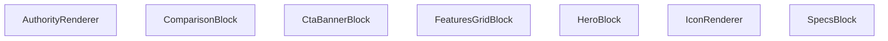

## Genel Bakış
`AuthorityRenderer` bileşeni, bir içerik blokları dizisini alır ve her bloğun `type` alanına göre uygun render bileşenine yönlendirir. Bu sayede, farklı içerik türleri (kahraman bölümü, özellikler, karşılaştırma vb.) için tutarlı ve modüler bir renderlama sağlar. Blok render bileşenleri, verileri işleyerek arayüz bloğunu oluştururken, `IconRenderer` gibi yardımcılar tekrar kullanılabilir ikon gösterimi sunar.

## Fonksiyon Grupları
### Blok Render Bileşenleri
Her bir blok tipi için özel olarak tasarlanmış bileşenler; ilgili veri yapısını alarak arayüz bloğunu oluşturur.
- `HeroBlock`, `SpecsBlock`, `FeaturesGridBlock`, `ComparisonBlock`, `CtaBannerBlock`

### Ana Bileşen ve Yardımcılar
Modülün giriş noktası olan `AuthorityRenderer`, içerik dizisini iterasyona alıp uygun blok bileşenini çağırır. `IconRenderer` ise blok bileşenleri içinde kullanılabilecek tekrar kullanılabilir bir ikon gösterim bileşenidir.
- `AuthorityRenderer`, `IconRenderer`

---

## AXIOMS – Mimari Varsayımlar

Bu modül, içerik koleksiyonunu blok tiplerine göre ayırıp ilgili render bileşenlerine yönlendiren bir yapıya sahiptir.

[Aksiyom 1]: Eğer IconRenderer bileşenine geçerli bir `name` parametresi (boş string veya undefined) verilmezse, ikon gösterimi başarısız olur.

[Aksiyom 2]: Eğer bir blok bileşenine (HeroBlock, SpecsBlock, FeaturesGridBlock, ComparisonBlock, CtaBannerBlock) `block` parametresi verilmezse, bileşenin render işlemi hata ile sonuçlanır.

[Aksiyom 3]: Eğer AuthorityRenderer'a `content` parametresi olarak null veya empty array geçilirse, hiçbir blok render edilmez ve boş çıktı üretilir.

[Aksiyom 4]: Eğer `content` içindeki bir bloğun `type` alanı tanımsız veya desteklenmeyen bir değer içeriyorsa, o blok için eşleşen render bileşeni bulunamaz ve blok atlanır.

[Aksiyom 5]: Eğer IconRenderer'a `className` parametresi verilmezse, ikon varsayılan stilleriyle render edilir (opsiyonel parametre).

---

## FONKSİYON DETAYLARI

### IconRenderer
**Ne yapar**: Verilen `name` ve opsiyonel `className` parametrelerine göre bir simge (icon) öğesini render eder.  
**Nasıl yapar**: `name` değeriyle hangi simgenin gösterileceğini belirler, `className` varsa bu sınıfları öğeye uygulayarak stil ve görünümü ayarlar.  
**Parametreler**:  
- name: string — Gösterilecek simgenin adı veya kimliği  
- className: string — (opsiyonel) Simgeye ek CSS sınıfları  
**Dönüş**: void — Fonksiyon bir JSX öğesi döndürür; açık bir dönüş tipi belirtilmemiştir.

### HeroBlock
**Ne yapar**: `block` prop’u olarak gelen `HeroBlockType` verisini kullanarak hero bölümü bileşenini render eder.  
**Nasıl yapar**: `block` içindeki başlık, açıklama, görsel ve çağrı‑eylem gibi alanları okuyarak ilgili JSX yapısını oluşturur ve döndürür.  
**Parametreler**:  
- block: HeroBlockType — Hero bölümü içeriğini tanımlayan veri nesnesi  
**Dönüş**: React.FC<{ block: HeroBlockType }> — Hero bileşenini render eden fonksiyonel bileşen.

### SpecsBlock
**Ne yapar**: `block` prop’u olarak gelen `SpecsBlockType` verisini kullanarak özellik spesifikasyonları bloğunu render eder.  
**Nasıl yapar**: `block` içindeki özellik listelerini (başlık, değer, birim vb.) iterate ederek her bir özelliği uygun şekilde biçimlendirir ve JSX olarak döndürür.  
**Parametreler**:  
- block: SpecsBlockType — Spesifikasyon bloğu verisini taşıyan nesne  
**Dönüş**: React.FC<{ block: SpecsBlockType }> — Specs bileşenini render eden fonksiyonel bileşen.

### FeaturesGridBlock
**Ne yapar**: `block` prop’u olarak gelen `FeaturesGridBlockType` verisini kullanarak özellikleri ızgara düzeninde gösteren bileşeni render eder.  
**Nasıl yapar**: `block` içindeki özellik kartlarını (ikon, başlık, açıklama) alıp bir CSS ızgara veya flex düzeninde yerleştirerek kullanıcıya sunar.  
**Parametreler**:  
- block: FeaturesGridBlockType — Özellik ızgara verisini içeren nesne  
**Dönüş**: React.FC<{ block: FeaturesGridBlockType }> — FeaturesGrid bileşenini render eden fonksiyonel bileşen.

### ComparisonBlock
**Ne yapar**: `block` prop’u olarak gelen `ComparisonBlockType` verisini kullanarak ürün veya hizmet karşılaştırma tablosunu render eder.  
**Nasıl yapar**: `block` içindeki sütun başlıkları ve satır verilerini okuyarak bir HTML tablosu veya div‑tabanlı ızgara yapısı oluşturur ve stilini uygular.  
**Parametreler**:  
- block: ComparisonBlockType — Karşılaştırma bloğu verisini taşıyan nesne  
**Dönüş**: React.FC<{ block: ComparisonBlockType }> — Comparison bileşenini render eden fonksiyonel bileşen.

### CtaBannerBlock
**Ne yapar**: `block` prop’u olarak gelen `CtaBannerBlockType` verisini kullanarak çağrı‑eylem (CTA) bannerını render eder.  
**Nasıl yapar**: `block` içindeki başlık, açıklama, buton metni ve link gibi alanları alarak bir banner bölümü oluşturur, genellikle arka plan rengi veya görsel ile vurgulanır.  
**Parametreler**:  
- block: CtaBannerBlockType — Cta banner verisini içeren nesne  
**Dönüş**: React.FC<{ block: CtaBannerBlockType }> — CtaBanner bileşenini render eden fonksiyonel bileşen.

### AuthorityRenderer
**Ne yapar**: `content` prop’u olarak gelen `AuthorityContent | null` verisini kullanarak yetki veya güvenilirlik ile ilgili içerik bloklarını render eder; içerik yoksa null döndürür.  
**Nasıl yapar**: `content` null değilse, içindeki başlık, açıklama, logo veya belge verilerini okuyarak uygun JSX yapısını oluşturur; null ise hiçbir şey render etmez.  
**Parametreler**:  
- content: AuthorityContent | null — Yetki içeriğini tanımlayan veri nesnesi veya içerik yoksa null  
**Dönüş**: React.FC<{ content: AuthorityContent | null }> — Authority bileşenini render eden fonksiyonel bileşen.

---

## AST POINTERS

### [N1_NASIL] AST Pointer: `src/components/authority/AuthorityRenderer.tsx`::IconRenderer
- **params**: `{ name: string, className?: string }`
- **ic_degiskenler**:
  - `iconName` — name parametresinin ilk harfini büyük yaparak LucideIcons kütüphanesindeki icon anahtarına dönüştürür; tipi `keyof typeof LucideIcons` olarak assert edilir
  - `iconName.charAt(0).toUpperCase() + name.slice(1)` — iconName hesaplamasının ara sonucu, ilk harfi büyük yapılmış icon adı dizesi
  - `Icon` — iconName ile LucideIcons nesnesinden çözülen bileşen; bulunamazsa fallback olarak `LucideIcons.Zap` kullanılır; tipi `React.ComponentType<{ className?: string }>`
- **Dönüş**: `<Icon className={className} />` JSX elemanı

---

### [N2_NASIL] AST Pointer: `src/components/authority/AuthorityRenderer.tsx`::HeroBlock
- **params**: `{ block: HeroBlockType }`
- **ic_degiskenler**:
  - (üst düzeyde yok — tüm erişimler `block` properties üzerinden inline JSX içinde yapılır)
- **Erişilen block propiedadları**:
  - `block.config?.fullWidth` — bölümün tam genişlikte mi yoksa max-w-7xl ile mi render edileceğini belirler
  - `block.config?.theme` — tema seçimi (`'dark'` ise slate-900 arkaplan, aksi halde beyaz arkaplan)
  - `block.content.eyebrow` — küçük üst başlık metni (ör: "Neden Biz?")
  - `block.content.title` — ana başlık, `<h2>` içinde render edilir
  - `block.content.description` — açıklama paragrafı, opsiyonel
  - `block.content.ctaLabel` — CTA butonu üzerindeki etiket metni
  - `block.content.ctaLink` — CTA butonunun yönlendirme URL'i, `'#'` fallback ile
  - `block.content.imageUrl` — arka plan görseli URL'i; varsa `next/image` ile absolute pozisyonda render edilir
- **Dönüş**: `<section>` JSX elemanı

---

### [N3_NASIL] AST Pointer: `src/components/authority/AuthorityRenderer.tsx`::SpecsBlock
- **params**: `{ block: SpecsBlockType }`
- **ic_degiskenler**:
  - (üst düzeyde değişken yok)
- **Erişilen block propiedadları**:
  - `block.content.title` — bölüm başlığı
  - `block.content.description` — opsiyonel açıklama metni
  - `block.content.columns` — grid sütun sayısı (2, 3 veya 4); CSS grid-cols class'ını belirler
  - `block.content.rows` — teknik özellik satırları dizisi; `?.map()` ile iterate edilir
- **Inner map callback parametreleri** (`row, i: number`):
  - `row.label` — satır etiketi (ör: "Güç")
  - `row.value` — satır değeri (ör: "2500")
  - `row.unit` — opsiyonel birim (ör: "BTU"); varsa `` içinde render edilir
  - `i` — dizi indeks, `key` prop'u olarak kullanılır
- **Dönüş**: `
` JSX elemanı, specs grid'i

---

### [N4_NASIL] AST Pointer: `src/components/authority/AuthorityRenderer.tsx`::FeaturesGridBlock
- **params**: `{ block: FeaturesGridBlockType }`
- **ic_degiskenler**:
  - (üst düzeyde değişken yok)
- **Erişilen block propiedadları**:
  - `block.content.title` — opsiyonel bölüm başlığı; varsa `<h3>` olarak render edilir
  - `block.content.items` — özellik kartları dizisi; `map()` ile iterate edilir
- **Inner map callback parametreleri** (`item, i`):
  - `item.icon` — Lucide icon adı; `IconRenderer` bileşenine `name` prop'u olarak geçilir
  - `item.title` — kart başlığı
  - `item.description` — kart açıklama metni
  - `i` — dizi indeks, `key` prop'u olarak kullanılır
- **Bileşen çağrıları**: `IconRenderer` — `name={item.icon}`, `className="w-7 h-7"` ile çağrılır
- **Dönüş**: `
` JSX elemanı, 3 sütunlu grid layout

---

### [N5_NASIL] AST Pointer: `src/components/authority/AuthorityRenderer.tsx`::ComparisonBlock
- **params**: `{ block: ComparisonBlockType }`
- **ic_degiskenler**:
  - (üst düzeyde değişken yok)
- **Erişilen block propiedadları**:
  - `block.content.title` — opsiyonel karşılaştırma başlığı
  - `block.content.leftLabel` — sol taraf etiketi (ör: "Rakip")
  - `block.content.leftImage` — sol taraf görsel URL'i; yoksa `LucideIcons.AlertCircle` fallback gösterilir
  - `block.content.rightLabel` — sağ taraf etiketi (ör: "VentHub")
  - `block.content.rightImage` — sağ taraf görsel URL'i; yoksa `LucideIcons.CheckCircle2` fallback gösterilir
  - `block.content.differenceText` — ortadaki fark vurgusu metni; opsiyonel, varsa alt kısımda badge olarak render edilir
- **Bileşen çağrıları**: `next/image` — sol ve sağ görseller için; `LucideIcons.AlertCircle`, `LucideIcons.CheckCircle2` — fallback ikonları
- **Dönüş**: `
` JSX elemanı, 2 sütunlu karşılaştırma layoutu

---

### [N6_NASIL] AST Pointer: `src/components/authority/AuthorityRenderer.tsx`::CtaBannerBlock
- **params**: `{ block: CtaBannerBlockType }`
- **ic_degiskenler**:
  - (üst düzeyde değişken yok)
- **Erişilen block propiedadları**:
  - `block.content.title` — CTA banner başlığı
  - `block.content.description` — CTA banner açıklama metni
  - `block.content.buttonLink` — buton yönlendirme URL'i
  - `block.content.buttonLabel` — buton üzerindeki etiket metni
- **Bileşen çağrıları**: `LucideIcons.ArrowRight` — buton içinde sağ ok ikonu
- **Dönüş**: `
` JSX elemanı, indigo arka planlı CTA banner

---

### [N7_NASIL] AST Pointer: `src/components/authority/AuthorityRenderer.tsx`::AuthorityRenderer
- **params**: `{ content: AuthorityContent | null }`
- **ic_degiskenler**:
  - `mediaBlock` — `block` değişkeninin `MediaBlockType`'ına cast edilmiş hali; `case 'media'` kolunda oluşturulur; `mediaType` alanına göre farklı medya bileşenlerini render eder
  - `rtBlock` — `block` değişkeninin `RichTextBlockType`'ına cast edilmiş hali; `case 'rich-text'` kolunda oluşturulur; HTML içeriğini sanitize edip render eder
- **Kontrol akışı**:
  - `content` null, dizi değil veya boşsa `null` döner (erken çıkış)
  - `block.config?.isHidden` true ise o blok atlanır (`null` döner)
  - `block.type` alanına göre `switch` ile blok tipi belirlenir
- **Switch durumları ve blok tipleri**:
  - `'hero'` → `HeroBlock` bileşeni çağrılır
  - `'specs'` → `SpecsBlock` bileşeni çağrılır
  - `'features-grid'` → `FeaturesGridBlock` bileşeni çağrılır
  - `'comparison'` → `ComparisonBlock` bileşeni çağrılır
  - `'cta-banner'` → `CtaBannerBlock` bileşeni çağrılır
  - `'media'` → mediaBlock oluşturulur; `mediaType` alanına göre:
    - `'video'` → `VideoAuthority` bileşeni çağrılır; `metadata.id` (mediaBlock.content.mediaId), `metadata.provider` ('youtube'), `metadata.title`, `metadata.aspectRatio` (vertical veya '16:9') prop'ları geçilir
    - `'3d'` → `LazyInView` bileşeni çağrılır; `loader` ile `./ThreeDAuthority` dinamik import edilir; `metadata.modelId` ve `metadata.modelUrl` (ikisi de mediaBlock.content.mediaId), `metadata.format` ('glb') geçilir
    - `'drawing'` → `TechnicalDrawingAuthority` bileşeni çağrılır; `drawings` dizisi tek elemanlı; `id` (mediaBlock.id), `title` (mediaBlock.content.title fallback 'Teknik Çizim'), `url` (mediaBlock.content.mediaId), `format` ('pdf'), `category` ('dimensions')
    - `'image'` → `next/image` ile `src={mediaBlock.content.mediaId}` render edilir
  - `'rich-text'` → rtBlock oluşturulur; `rtBlock.content.html` değeri `DOMPurify.sanitize()` ile temizlenip `dangerouslySetInnerHTML` ile render edilir
  - `default` → "Bilinmeyen Blok Tipi" uyarı div'i render edilir
- **Bileşen çağrıları**: `HeroBlock`, `SpecsBlock`, `FeaturesGridBlock`, `ComparisonBlock`, `CtaBannerBlock`, `VideoAuthority`, `LazyInView`, `TechnicalDrawingAuthority`, `next/image`, `DOMPurify.sanitize`, `cn`
- **Dönüş**: `
` JSX elemanı veya `null`

---

## MERMAID CALL GRAPH

## NODE ID STANDARD

  file: src\components\authority\AuthorityRenderer.tsx
  function: src\components\authority\AuthorityRenderer.tsx::IconRenderer
  function: src\components\authority\AuthorityRenderer.tsx::HeroBlock
  function: src\components\authority\AuthorityRenderer.tsx::SpecsBlock
  function: src\components\authority\AuthorityRenderer.tsx::FeaturesGridBlock
  function: src\components\authority\AuthorityRenderer.tsx::ComparisonBlock
  function: src\components\authority\AuthorityRenderer.tsx::CtaBannerBlock
  function: src\components\authority\AuthorityRenderer.tsx::AuthorityRenderer

---

## DISA AKTARILANLAR (EXPORTS)
  export: AuthorityRenderer
  export: ComparisonBlock
  export: CtaBannerBlock
  export: FeaturesGridBlock
  export: HeroBlock
  export: IconRenderer
  export: SpecsBlock

---

## STİL TOKENLERİ

### Arbitrary Değerler (token'a geçirilmemiş)
Yok — tüm stiller token'a geçirilmiş. ✅

### Kullanılan Token'lar (zaten token'a geçirilmiş)
- `rounded-hvac-2xl`, `rounded-hvac-lg`

### Tailwind Sınıf Özeti
- **Renkler:** `bg-black/10`, `bg-indigo-600`, `bg-slate-100`, `bg-slate-50`, `bg-slate-900`, `bg-slate-900/10`, `bg-white`, `bg-white/20`, `bg-white/5`, `border-2`, `border-8`, `border-dashed`, `border-red-100`, `border-slate-100`, `border-slate-200`
- **Layout:** `absolute`, `bottom-0`, `bottom-6`, `flex`, `flex-col`, `gap-1`, `gap-12`, `gap-4`, `gap-8`, `grid`, `grid-cols-1`, `h-12`, `h-14`, `h-16`, `h-6`
- **Varyant/Responsive:** `active:`, `hover:`, `lg:`, `md:` önekleri
- **Yardımcı Sınıflar:** `-mb-32`, `-ml-32`, `-mr-48`, `-mt-48`, `-translate-x-1/2`, `active:scale-95`, `animate-pulse`, `aspect-video`, `authority-content-wrapper`, `blur-3xl`, `border`, `brightness-0`, `dark`, `duration-500`, `font-black`