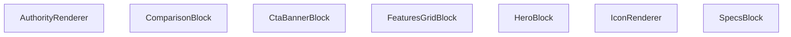

## Genel Bakış
`AuthorityRenderer` modülü, dinamik ve çoklu içerik bloklarını (hero bölümü, özellikler, karşılaştırma tabloları vb.) merkezi olarak yöneten bir React bileşenidir. Modül, bir içerik blokları koleksiyonunu alır ve her bir bloğun `type` alanına göre önceden tanımlı, uygun render bileşenine yönlendirerek modüler ve tutarlı bir arayüz üretir.

## Fonksiyon Grupları
### Ana Yönlendirici ve Yardımcılar
Modülün giriş noktası olan ana bileşen, içerik dizisini iterasyona alarak blok tipine göre doğru render bileşenini çağırır. Yardımcı bileşen, bloklar içinde ortak ihtiyaç duyulan ikon gösterimini soyutlayarak tekrar kullanılırlığı sağlar.
- `AuthorityRenderer`, `IconRenderer`

### Blok Bazlı Render Bileşenleri
Her bir içerik bloğu tipi için özel olarak tasarlanmış bağımsız React bileşenleri. Her biri, kendisine iletilen `block` veri yapısını çözümleyerek o bloğun arayüzünü (örneğin başlık ve açıklama, özellik kartları, karşılaştırma satırları) oluşturur.
- `HeroBlock`, `SpecsBlock`, `FeaturesGridBlock`, `ComparisonBlock`, `CtaBannerBlock`

## AXIOMS – Mimari Varsayımlar
Bu modül, içerik koleksiyonunu blok tiplerine göre ayırıp ilgili render bileşenlerine yönlendiren bir yapıya sahiptir.

[Aksiyom 1]: Eğer `IconRenderer` bileşenine geçerli bir `name` parametresi (boş string veya undefined) verilmezse, ikon gösterimi başarısız olur.

---

## AXIOMS – Mimari Varsayımlar
- Bu modül davranışsal mantık içermez (salt veri / konfigürasyon / tip tanımı).
- [Aksiyom 1]: Modülün dışa açtığı yapı (anahtar kümesi / şema) bir sözleşmedir; tüketiciler bu sabit yapıya bağlıdır — kırıcı değişiklik tüm tüketicileri etkiler.
- [Aksiyom 2]: Bir öğe ekleme/çıkarma yapısal-uyumlu olmalı; ilgili tipler ve seçiciler aynı commit'te güncel tutulmalıdır.

---

## FONKSİYON DETAYLARI

### IconRenderer
**Ne yapar**: Verilen `name` ve opsiyonel `className` parametrelerine göre bir simge (icon) öğesini render eder.  
**Nasıl yapar**: `name` değeriyle hangi simgenin gösterileceğini belirler, `className` varsa bu sınıfları öğeye uygulayarak stil ve görünümü ayarlar.  
**Parametreler**:  
- name: string — Gösterilecek simgenin adı veya kimliği  
- className: string — (opsiyonel) Simgeye ek CSS sınıfları  
**Dönüş**: void — Fonksiyon bir JSX öğesi döndürür; açık bir dönüş tipi belirtilmemiştir.

### HeroBlock
**Ne yapar**: `block` prop’u olarak gelen `HeroBlockType` verisini kullanarak hero bölümü bileşenini render eder.  
**Nasıl yapar**: `block` içindeki başlık, açıklama, görsel ve çağrı‑eylem gibi alanları okuyarak ilgili JSX yapısını oluşturur ve döndürür.  
**Parametreler**:  
- block: HeroBlockType — Hero bölümü içeriğini tanımlayan veri nesnesi  
**Dönüş**: React.FC<{ block: HeroBlockType }> — Hero bileşenini render eden fonksiyonel bileşen.

### SpecsBlock
**Ne yapar**: `block` prop’u olarak gelen `SpecsBlockType` verisini kullanarak özellik spesifikasyonları bloğunu render eder.  
**Nasıl yapar**: `block` içindeki özellik listelerini (başlık, değer, birim vb.) iterate ederek her bir özelliği uygun şekilde biçimlendirir ve JSX olarak döndürür.  
**Parametreler**:  
- block: SpecsBlockType — Spesifikasyon bloğu verisini taşıyan nesne  
**Dönüş**: React.FC<{ block: SpecsBlockType }> — Specs bileşenini render eden fonksiyonel bileşen.

### FeaturesGridBlock
**Ne yapar**: `block` prop’u olarak gelen `FeaturesGridBlockType` verisini kullanarak özellikleri ızgara düzeninde gösteren bileşeni render eder.  
**Nasıl yapar**: `block` içindeki özellik kartlarını (ikon, başlık, açıklama) alıp bir CSS ızgara veya flex düzeninde yerleştirerek kullanıcıya sunar.  
**Parametreler**:  
- block: FeaturesGridBlockType — Özellik ızgara verisini içeren nesne  
**Dönüş**: React.FC<{ block: FeaturesGridBlockType }> — FeaturesGrid bileşenini render eden fonksiyonel bileşen.

### ComparisonBlock
**Ne yapar**: `block` prop’u olarak gelen `ComparisonBlockType` verisini kullanarak ürün veya hizmet karşılaştırma tablosunu render eder.  
**Nasıl yapar**: `block` içindeki sütun başlıkları ve satır verilerini okuyarak bir HTML tablosu veya div‑tabanlı ızgara yapısı oluşturur ve stilini uygular.  
**Parametreler**:  
- block: ComparisonBlockType — Karşılaştırma bloğu verisini taşıyan nesne  
**Dönüş**: React.FC<{ block: ComparisonBlockType }> — Comparison bileşenini render eden fonksiyonel bileşen.

### CtaBannerBlock
**Ne yapar**: `block` prop’u olarak gelen `CtaBannerBlockType` verisini kullanarak çağrı‑eylem (CTA) bannerını render eder.  
**Nasıl yapar**: `block` içindeki başlık, açıklama, buton metni ve link gibi alanları alarak bir banner bölümü oluşturur, genellikle arka plan rengi veya görsel ile vurgulanır.  
**Parametreler**:  
- block: CtaBannerBlockType — Cta banner verisini içeren nesne  
**Dönüş**: React.FC<{ block: CtaBannerBlockType }> — CtaBanner bileşenini render eden fonksiyonel bileşen.

### AuthorityRenderer
**Ne yapar**: `content` prop’u olarak gelen `AuthorityContent | null` verisini kullanarak yetki veya güvenilirlik ile ilgili içerik bloklarını render eder; içerik yoksa null döndürür.  
**Nasıl yapar**: `content` null değilse, içindeki başlık, açıklama, logo veya belge verilerini okuyarak uygun JSX yapısını oluşturur; null ise hiçbir şey render etmez.  
**Parametreler**:  
- content: AuthorityContent | null — Yetki içeriğini tanımlayan veri nesnesi veya içerik yoksa null  
**Dönüş**: React.FC<{ content: AuthorityContent | null }> — Authority bileşenini render eden fonksiyonel bileşen.

---

## İTHALATLAR (IMPORTS)
- import: ../LazyInView::LazyInView
- import: ./TechnicalDrawingAuthority::TechnicalDrawingAuthority
- import: ./VideoAuthority::VideoAuthority
- import: @/i18n/I18nProvider::useI18n
- import: @/lib/utils::cn
- import: isomorphic-dompurify::DOMPurify
- import: lucide-react
- import: next/image::Image
- import: react::React

---

## AST POINTERS

### [N1_NASIL] AST Pointer: AuthorityRenderer.tsx::IconRenderer
- **params**: `name` (string), `className` (string, opsiyonel)
- **ic_degiskenler**:
  - `iconName` — `name` parametresinin ilk harfini büyük harfe çevirip geri kalanıyla birleştirerek LucideIcons içindeki anahtar adı oluşturur
  - `Icon` — `iconName` ile LucideIcons nesnesinden erişilen bileşen; bulunamazsa `LucideIcons.Zap` kullanılır
- **Dönüş**: JSX elementi (`Icon` bileşeni `className` prop'u ile render edilir)

### [N2_NASIL] AST Pointer: AuthorityRenderer.tsx::HeroBlock
- **params**: `block` (HeroBlockType)
- **ic_degiskenler**:
  - `block.config?.fullWidth` — tam genişlik yapılandırması; true ise `w-full`, değilse `max-w-7xl mx-auto rounded-3xl my-12` sınıfı uygulanır
  - `block.config?.theme` — tema yapılandırması; `'dark'` ise koyu arka plan, değilse açık arka plan sınıfları uygulanır
  - `block.content.eyebrow` — üst başlık metni; varsa `text-indigo-500` stilinde render edilir
  - `block.content.title` — ana başlık metni
  - `block.content.description` — açıklama metni; varsa render edilir
  - `block.content.ctaLabel` — buton etiketi; varsa buton render edilir
  - `block.content.ctaLink` — buton linki; yoksa `'#'` kullanılır
  - `block.content.imageUrl` — arka plan resmi URL'si; varsa `Image` bileşeni ile tam ekran arka plan olarak render edilir
- **Dönüş**: JSX elementi (section)

### [N3_NASIL] AST Pointer: AuthorityRenderer.tsx::SpecsBlock
- **params**: `block` (SpecsBlockType)
- **ic_degiskenler**:
  - `block.content.title` — bölüm başlığı
  - `block.content.description` — açıklama metni; varsa render edilir
  - `block.content.columns` — sütun sayısı; 4 ise `lg:grid-cols-4`, 3 ise `grid-cols-3`, diğer durumda `grid-cols-2` grid sınıfı uygulanır
  - `block.content.rows` — satır dizisi; her eleman `row.label`, `row.value`, `row.unit` alanlarına sahiptir
- **Dönüş**: JSX elementi (div)

### [N4_NASIL] AST Pointer: AuthorityRenderer.tsx::FeaturesGridBlock
- **params**: `block` (FeaturesGridBlockType)
- **ic_degiskenler**:
  - `block.content.title` — bölüm başlığı; varsa render edilir
  - `block.content.items` — özellik öğeleri dizisi; her eleman `item.icon`, `item.title`, `item.description` alanlarına sahiptir
  - `item.icon` — `IconRenderer` bileşenine `name` prop'u olarak geçirilen ikon adı
- **Dönüş**: JSX elementi (div)

### [N5_NASIL] AST Pointer: AuthorityRenderer.tsx::ComparisonBlock
- **params**: `block` (ComparisonBlockType)
- **ic_degiskenler**:
  - `block.content.title` — bölüm başlığı; varsa render edilir
  - `block.content.leftLabel` — sol taraf etiketi
  - `block.content.leftImage` — sol taraf resmi URL'si; varsa `Image` bileşeni ile render edilir, yoksa `LucideIcons.AlertCircle` gösterilir
  - `block.content.rightLabel` — sağ taraf etiketi
  - `block.content.rightImage` — sağ taraf resmi URL'si; varsa `Image` bileşeni ile render edilir, yoksa `LucideIcons.CheckCircle2` gösterilir
  - `block.content.differenceText` — fark metni; varsa alt orta kısımda beyaz kutu içinde render edilir
- **Dönüş**: JSX elementi (div)

### [N6_NASIL] AST Pointer: AuthorityRenderer.tsx::CtaBannerBlock
- **params**: `block` (CtaBannerBlockType)
- **ic_degiskenler**:
  - `block.content.title` — banner başlığı
  - `block.content.description` — açıklama metni
  - `block.content.buttonLabel` — buton etiketi
  - `block.content.buttonLink` — buton yönlendirme linki
- **Dönüş**: JSX elementi (div)

### [N7_NASIL] AST Pointer: AuthorityRenderer.tsx::AuthorityRenderer
- **params**: `content` (AuthorityContent | null)
- **ic_degiskenler**:
  - `t` — `useI18n()` hook'undan alınan çeviri fonksiyonu; `default` case'te ve `drawing` medya tipinde kullanılır
  - `content` — null kontrolü, dizi kontrolü ve boşluk kontrolü yapılır; geçersizse `null` döner
  - `block` — `content.map` içindeki her blok elemanı
  - `block.config?.isHidden` — true ise o blok render edilmez
  - `block.type` — blok tipi (`'hero'`, `'specs'`, `'features-grid'`, `'comparison'`, `'cta-banner'`, `'media'`, `'rich-text'`)
  - `block.id` — her blok için benzersiz key değeri
  - `mediaBlock` — `block`'un `MediaBlockType`'a cast edilmiş hali
  - `mediaBlock.content.mediaType` — medya türü (`'video'`, `'3d'`, `'drawing'`, `'image'`)
  - `mediaBlock.content.mediaId` — medya kimliği/URL'si
  - `mediaBlock.content.title` — medya başlığı
  - `mediaBlock.content.aspectRatio` — en-boy oranı; `'vertical'` ise dikey, değilse `'16:9'`
  - `mediaBlock.content.description` — medya açıklaması; varsa render edilir
  - `mediaBlock.config?.fullWidth` — fullWidth yapılandırması
  - `rtBlock` — `block`'un `RichTextBlockType`'a cast edilmiş hali
  - `rtBlock.content.html` — zengin metin HTML içeriği; `DOMPurify.sanitize()` ile temizlenip `dangerouslySetInnerHTML` ile render edilir
- **Dönüş**: JSX elementi (div) veya `null`

---

## MERMAID CALL GRAPH

## NODE ID STANDARD

  file: src\components\authority\AuthorityRenderer.tsx
  function: src\components\authority\AuthorityRenderer.tsx::IconRenderer
  function: src\components\authority\AuthorityRenderer.tsx::HeroBlock
  function: src\components\authority\AuthorityRenderer.tsx::SpecsBlock
  function: src\components\authority\AuthorityRenderer.tsx::FeaturesGridBlock
  function: src\components\authority\AuthorityRenderer.tsx::ComparisonBlock
  function: src\components\authority\AuthorityRenderer.tsx::CtaBannerBlock
  function: src\components\authority\AuthorityRenderer.tsx::AuthorityRenderer

---

## DISA AKTARILANLAR (EXPORTS)
  export: AuthorityRenderer
  export: ComparisonBlock
  export: CtaBannerBlock
  export: FeaturesGridBlock
  export: HeroBlock
  export: IconRenderer
  export: SpecsBlock

---

## STİL TOKENLERİ

### Arbitrary Değerler (token'a geçirilmemiş)
Yok — tüm stiller token'a geçirilmiş. ✅

### Kullanılan Token'lar (zaten token'a geçirilmiş)
- `rounded-hvac-2xl`, `rounded-hvac-lg`

### Tailwind Sınıf Özeti
- **Renkler:** `bg-black/10`, `bg-indigo-600`, `bg-slate-100`, `bg-slate-50`, `bg-slate-900`, `bg-slate-900/10`, `bg-white`, `bg-white/20`, `bg-white/5`, `border-2`, `border-8`, `border-dashed`, `border-red-100`, `border-slate-100`, `border-slate-200`
- **Layout:** `absolute`, `bottom-0`, `bottom-6`, `flex`, `flex-col`, `gap-1`, `gap-12`, `gap-4`, `gap-8`, `grid`, `grid-cols-1`, `h-12`, `h-14`, `h-16`, `h-6`
- **Varyant/Responsive:** `active:`, `hover:`, `lg:`, `md:` önekleri
- **Yardımcı Sınıflar:** `-mb-32`, `-ml-32`, `-mr-48`, `-mt-48`, `-translate-x-1/2`, `active:scale-95`, `animate-pulse`, `aspect-video`, `authority-content-wrapper`, `blur-3xl`, `border`, `brightness-0`, `dark`, `duration-500`, `font-black`