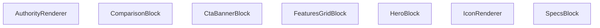

## Genel Bakış
`AuthorityRenderer` modülü, dinamik içerik bloklarını merkezi olarak yöneten bir React bileşenidir. Modül, bir içerik koleksiyonunu alır ve her bloğun türüne göre uygun render bileşenine yönlendirerek modüler bir arayüz üretir. Blok bileşenleri bağımsızdır ve her biri kendisine iletilen veri yapısını çözümleyerek ilgili arayüz bölümünü oluşturur.

## Fonksiyon Grupları

### Ana Yönlendirici ve Yardımcılar
Modülün giriş noktasıdır. İçerik dizisini iterasyona alarak blok tipine göre doğru render bileşenini çağırır. Yardımcı bileşen ise bloklar içinde ortak ihtiyaç duyulan ikon gösterimini soyutlar.
- `AuthorityRenderer`, `IconRenderer`

### Blok Bazlı Render Bileşenleri
Her içerik bloğu tipi için özel tasarlanmış bağımsız bileşenlerdir. Her biri kendisine iletilen blok verisini çözümleyerek o bloğun arayüzünü (başlık, açıklama, özellik kartları, karşılaştırma satırları vb.) oluşturur.
- `HeroBlock`, `SpecsBlock`, `FeaturesGridBlock`, `ComparisonBlock`, `CtaBannerBlock`

---

## AXIOMS – Mimari Varsayımlar

Bu modül için fonksiyon gövdeleri sağlanmadığından, yalnızca tip imzaları ve genel bakıştan çıkarılabilecek varsayımlar yazılabilir.

[Aksiyom 1]: Eğer `content` null ise, `AuthorityRenderer`'ın ne render edeceği fonksiyon gövdesine bağlıdır ve bilinmiyor.

[Aksiyom 2]: Eğer her bloğun `type` alanı tanımlı değilse, `AuthorityRenderer` o bloğu hangi alt bileşene yönlendireceğini bilemez — bu durumda ne olacağı fonksiyon gövdesine bağlıdır ve bilinmiyor.

[Aksiyom 3]: Eğer `IconRenderer` bileşenine `name` parametresi verilmezse, bileşen hangi ikonu çizeceğini bilemez — `name` zorunlu bir parametredir.

[Aksiyom 4]: Eğer `HeroBlock`, `SpecsBlock`, `FeaturesGridBlock`, `ComparisonBlock` veya `CtaBannerBlock` bileşenlerine `block` prop'u verilmezse, bileşen render edeceği veriye sahip olamaz — `block` bu bileşenler için zorunlu bir prop'tur.

[Aksiyom 5]: Eğer `AuthorityContent` yapısı beklenen blok koleksiyonunu içermiyorsa, `AuthorityRenderer`'ın yönlendireceği blok listesi oluşmaz — bu durumda ne olacağı fonksiyon gövdesine bağlıdır ve bilinmiyor.

---

## FONKSİYON DETAYLARI

### IconRenderer
**Ne yapar**: Verilen `name` ve opsiyonel `className` parametrelerine göre bir simge (icon) öğesini render eder.  
**Nasıl yapar**: `name` değeriyle hangi simgenin gösterileceğini belirler, `className` varsa bu sınıfları öğeye uygulayarak stil ve görünümü ayarlar.  
**Parametreler**:  
- name: string — Gösterilecek simgenin adı veya kimliği  
- className: string — (opsiyonel) Simgeye ek CSS sınıfları  
**Dönüş**: void — Fonksiyon bir JSX öğesi döndürür; açık bir dönüş tipi belirtilmemiştir.

### HeroBlock
**Ne yapar**: `block` prop’u olarak gelen `HeroBlockType` verisini kullanarak hero bölümü bileşenini render eder.  
**Nasıl yapar**: `block` içindeki başlık, açıklama, görsel ve çağrı‑eylem gibi alanları okuyarak ilgili JSX yapısını oluşturur ve döndürür.  
**Parametreler**:  
- block: HeroBlockType — Hero bölümü içeriğini tanımlayan veri nesnesi  
**Dönüş**: React.FC<{ block: HeroBlockType }> — Hero bileşenini render eden fonksiyonel bileşen.

### SpecsBlock
**Ne yapar**: `block` prop’u olarak gelen `SpecsBlockType` verisini kullanarak özellik spesifikasyonları bloğunu render eder.  
**Nasıl yapar**: `block` içindeki özellik listelerini (başlık, değer, birim vb.) iterate ederek her bir özelliği uygun şekilde biçimlendirir ve JSX olarak döndürür.  
**Parametreler**:  
- block: SpecsBlockType — Spesifikasyon bloğu verisini taşıyan nesne  
**Dönüş**: React.FC<{ block: SpecsBlockType }> — Specs bileşenini render eden fonksiyonel bileşen.

### FeaturesGridBlock
**Ne yapar**: `block` prop’u olarak gelen `FeaturesGridBlockType` verisini kullanarak özellikleri ızgara düzeninde gösteren bileşeni render eder.  
**Nasıl yapar**: `block` içindeki özellik kartlarını (ikon, başlık, açıklama) alıp bir CSS ızgara veya flex düzeninde yerleştirerek kullanıcıya sunar.  
**Parametreler**:  
- block: FeaturesGridBlockType — Özellik ızgara verisini içeren nesne  
**Dönüş**: React.FC<{ block: FeaturesGridBlockType }> — FeaturesGrid bileşenini render eden fonksiyonel bileşen.

### ComparisonBlock
**Ne yapar**: `block` prop’u olarak gelen `ComparisonBlockType` verisini kullanarak ürün veya hizmet karşılaştırma tablosunu render eder.  
**Nasıl yapar**: `block` içindeki sütun başlıkları ve satır verilerini okuyarak bir HTML tablosu veya div‑tabanlı ızgara yapısı oluşturur ve stilini uygular.  
**Parametreler**:  
- block: ComparisonBlockType — Karşılaştırma bloğu verisini taşıyan nesne  
**Dönüş**: React.FC<{ block: ComparisonBlockType }> — Comparison bileşenini render eden fonksiyonel bileşen.

### CtaBannerBlock
**Ne yapar**: `block` prop’u olarak gelen `CtaBannerBlockType` verisini kullanarak çağrı‑eylem (CTA) bannerını render eder.  
**Nasıl yapar**: `block` içindeki başlık, açıklama, buton metni ve link gibi alanları alarak bir banner bölümü oluşturur, genellikle arka plan rengi veya görsel ile vurgulanır.  
**Parametreler**:  
- block: CtaBannerBlockType — Cta banner verisini içeren nesne  
**Dönüş**: React.FC<{ block: CtaBannerBlockType }> — CtaBanner bileşenini render eden fonksiyonel bileşen.

### AuthorityRenderer
**Ne yapar**: `content` prop’u olarak gelen `AuthorityContent | null` verisini kullanarak yetki veya güvenilirlik ile ilgili içerik bloklarını render eder; içerik yoksa null döndürür.  
**Nasıl yapar**: `content` null değilse, içindeki başlık, açıklama, logo veya belge verilerini okuyarak uygun JSX yapısını oluşturur; null ise hiçbir şey render etmez.  
**Parametreler**:  
- content: AuthorityContent | null — Yetki içeriğini tanımlayan veri nesnesi veya içerik yoksa null  
**Dönüş**: React.FC<{ content: AuthorityContent | null }> — Authority bileşenini render eden fonksiyonel bileşen.

---

## İTHALATLAR (IMPORTS)
- import: ../LazyInView::LazyInView
- import: ./TechnicalDrawingAuthority::TechnicalDrawingAuthority
- import: ./VideoAuthority::VideoAuthority
- import: @/i18n/I18nProvider::useI18n
- import: @/lib/utils::cn
- import: isomorphic-dompurify::DOMPurify
- import: lucide-react
- import: next/image::Image
- import: react::React

---

## AST POINTERS

### [N1_NASIL] AST Pointer: AuthorityRenderer.tsx::IconRenderer
- **params**: `name` (string), `className` (string, opsiyonel)
- **ic_degiskenler**:
  - `iconName` — `name` parametresinin ilk harfi büyük harfe çevrilip geri kalanı eklenerek oluşturulan Lucide ikon adı; `keyof typeof LucideIcons` tipine dönüştürülür
  - `Icon` — `LucideIcons[iconName]` erişimiyle elde edilen bileşen; bulunamazsa `LucideIcons.Zap` kullanılır
- **Dönüş**: `<Icon className={className} />` JSX elementi

### [N2_NASIL] AST Pointer: AuthorityRenderer.tsx::HeroBlock
- **params**: `block` (HeroBlockType)
- **ic_degiskenler**:
  - `block.config?.fullWidth` — tam genişlik olup olmadığını belirten opsiyonel yapılandırma; true ise `"w-full"`, değilse `"max-w-7xl mx-auto rounded-3xl my-12"` sınıfı uygulanır
  - `block.config?.theme` — tema ayarı; `'dark'` ise koyu arka plan, değilse açık arka plan sınıfları uygulanır
  - `block.content.eyebrow` — üst başlık metni; varsa `` içinde gösterilir
  - `block.content.title` — ana başlık metni
  - `block.content.description` — açıklama metni; varsa `
` içinde gösterilir
  - `block.content.ctaLabel` — eylem butonu etiketi; varsa buton oluşturulur
  - `block.content.ctaLink` — eylem butonu bağlantısı; yoksa `"#"` kullanılır
  - `block.content.imageUrl` — arka plan görsel URL'si; varsa `<Image>` bileşeni ile gösterilir
- **Dönüş**: `<section>` içinde yapılandırılmış hero bloğu JSX elementi

### [N3_NASIL] AST Pointer: AuthorityRenderer.tsx::SpecsBlock
- **params**: `block` (SpecsBlockType)
- **ic_degiskenler**:
  - `block.content.title` — blok başlığı
  - `block.content.description` — blok açıklaması; varsa gösterilir
  - `block.content.columns` — sütun sayısı; 4 ise dört sütunlu, 3 ise üç sütunlu, diğer durumda iki sütunlu grid oluşturulur
  - `block.content.rows` — spec satırları dizisi; her eleman için `row.label`, `row.value`, `row.unit` kullanılır
  - `row` — döngüdeki her spec satırı nesnesi
  - `i` — döngü indeks numarası; `key` prop'u olarak kullanılır
  - `row.label` — spec etiketi
  - `row.value` — spec değeri
  - `row.unit` — spec birimi; varsa değerin yanında gösterilir
- **Dönüş**: specs grid yapısı JSX elementi

### [N4_NASIL] AST Pointer: AuthorityRenderer.tsx::FeaturesGridBlock
- **params**: `block` (FeaturesGridBlockType)
- **ic_degiskenler**:
  - `block.content.title` — blok başlığı; varsa gösterilir
  - `block.content.items` — özellik öğeleri dizisi; her eleman için `item.icon`, `item.title`, `item.description` kullanılır
  - `item` — döngüdeki her özellik öğesi nesnesi
  - `i` — döngü indeks numarası; `key` prop'u olarak kullanılır
  - `item.icon` — ikon adı; `IconRenderer` bileşenine `name` prop'u olarak geçilir
  - `item.title` — özellik başlığı
  - `item.description` — özellik açıklaması
- **Dönüş**: özellik grid yapısı JSX elementi

### [N5_NASIL] AST Pointer: AuthorityRenderer.tsx::ComparisonBlock
- **params**: `block` (ComparisonBlockType)
- **ic_degiskenler**:
  - `block.content.title` — blok başlığı; varsa gösterilir
  - `block.content.leftLabel` — sol taraf etiketi
  - `block.content.leftImage` — sol taraf görsel URL'si; varsa `<Image>` ile gösterilir, yoksa `LucideIcons.AlertCircle` gösterilir
  - `block.content.rightLabel` — sağ taraf etiketi
  - `block.content.rightImage` — sağ taraf görsel URL'si; varsa `<Image>` ile gösterilir, yoksa `LucideIcons.CheckCircle2` gösterilir
  - `block.content.differenceText` — fark metni; varsa alt kısımda gösterilir
- **Dönüş**: karşılaştırma bloğu JSX elementi

### [N6_NASIL] AST Pointer: AuthorityRenderer.tsx::CtaBannerBlock
- **params**: `block` (CtaBannerBlockType)
- **ic_degiskenler**:
  - `block.content.title` — CTA başlığı
  - `block.content.description` — CTA açıklaması
  - `block.content.buttonLabel` — buton etiketi
  - `block.content.buttonLink` — buton bağlantısı
- **Dönüş**: CTA banner bloğu JSX elementi

### [N7_NASIL] AST Pointer: AuthorityRenderer.tsx::AuthorityRenderer
- **params**: `content` (AuthorityContent | null)
- **ic_degiskenler**:
  - `t` — `useI18n()` hook'undan alınan çeviri fonksiyonu
  - `content` — gelen içerik dizisi; null, dizi olmayan veya boş ise `null` döner
  - `block` — `content.map()` döngüsündeki her blok nesnesi
  - `block.config?.isHidden` — blok gizli mi kontrolü; true ise o blok render edilmez
  - `block.type` — blok tipi; `'hero'`, `'specs'`, `'features-grid'`, `'comparison'`, `'cta-banner'`, `'media'`, `'rich-text'` değerlerine göre ilgili bileşen render edilir
  - `block.id` — blok benzersiz tanımlayıcısı; `key` prop'u olarak kullanılır
  - `mediaBlock` — `block as MediaBlockType` ile dönüştürülen medya bloğu
  - `mediaBlock.config?.fullWidth` — medya bloğu tam genişlik ayarı
  - `mediaBlock.content.title` — medya bloğu başlığı
  - `mediaBlock.content.mediaType` — medya tipi; `'video'`, `'3d'`, `'drawing'`, `'image'` değerlerinden biri
  - `mediaBlock.content.mediaId` — medya tanımlayıcısı
  - `mediaBlock.content.aspectRatio` — video en-boy oranı; `'vertical'` ise dikey, değilse `'16:9'` kullanılır
  - `mediaBlock.content.description` — medya açıklaması
  - `rtBlock` — `block as RichTextBlockType` ile dönüştürülen zengin metin bloğu
  - `rtBlock.content.html` — zengin metin HTML içeriği; `DOMPurify.sanitize()` ile temizlenerek `dangerouslySetInnerHTML` ile render edilir
- **Dönüş**: `content` dizisi null/boş ise `null`, değilse `
` içinde blokların render edildiği JSX elementi

---

## MERMAID CALL GRAPH

## NODE ID STANDARD

  file: src\components\authority\AuthorityRenderer.tsx
  function: src\components\authority\AuthorityRenderer.tsx::IconRenderer
  function: src\components\authority\AuthorityRenderer.tsx::HeroBlock
  function: src\components\authority\AuthorityRenderer.tsx::SpecsBlock
  function: src\components\authority\AuthorityRenderer.tsx::FeaturesGridBlock
  function: src\components\authority\AuthorityRenderer.tsx::ComparisonBlock
  function: src\components\authority\AuthorityRenderer.tsx::CtaBannerBlock
  function: src\components\authority\AuthorityRenderer.tsx::AuthorityRenderer

---

## DISA AKTARILANLAR (EXPORTS)
  export: AuthorityRenderer
  export: ComparisonBlock
  export: CtaBannerBlock
  export: FeaturesGridBlock
  export: HeroBlock
  export: IconRenderer
  export: SpecsBlock

---

## STİL TOKENLERİ

### Arbitrary Değerler (token'a geçirilmemiş)
Yok — tüm stiller token'a geçirilmiş. ✅

### Kullanılan Token'lar (zaten token'a geçirilmiş)
- `rounded-hvac-2xl`, `rounded-hvac-lg`

### Tailwind Sınıf Özeti
- **Renkler:** `bg-black/10`, `bg-indigo-600`, `bg-slate-100`, `bg-slate-50`, `bg-slate-900`, `bg-slate-900/10`, `bg-white`, `bg-white/20`, `bg-white/5`, `border-2`, `border-8`, `border-dashed`, `border-red-100`, `border-slate-100`, `border-slate-200`
- **Layout:** `absolute`, `bottom-0`, `bottom-6`, `flex`, `flex-col`, `gap-1`, `gap-12`, `gap-4`, `gap-8`, `grid`, `grid-cols-1`, `h-12`, `h-14`, `h-16`, `h-6`
- **Varyant/Responsive:** `active:`, `hover:`, `lg:`, `md:` önekleri
- **Yardımcı Sınıflar:** `-mb-32`, `-ml-32`, `-mr-48`, `-mt-48`, `-translate-x-1/2`, `active:scale-95`, `animate-pulse`, `aspect-video`, `authority-content-wrapper`, `blur-3xl`, `border`, `brightness-0`, `dark`, `duration-500`, `font-black`