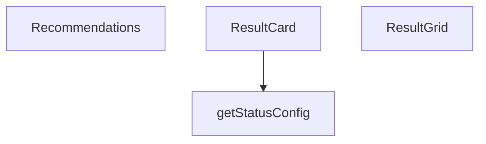

## Genel Bakış
`ResultCard.tsx` modülü, HVAC hesaplama sonuçlarının kullanıcıya sunulması için bir dizi React bileşeni ve yardımcı fonksiyon içerir. Tekil sonuç kartları, çoklu sonuçların düzenli ızgara yerleşimi ve önerilerin listelenmesi için gerekli arayüz bileşenlerini tanımlar. Modül, duruma göre dinamik görünüm konfigürasyonu sağlayarak bilgi sunumunu standartlaştırır.

## Fonksiyon Grupları
### Sonuç Bileşenleri
Tekil hesaplama sonuçlarını kart formatında gösteren ana bileşen ve sonuçların düzenli bir ızgarada yerleştirilmesini sağlayan düzenleyici bileşeni kapsar.
- ResultCard, ResultGrid

### Öneri Bileşeni
Hesaplama sonuçlarına bağlı önerilerin başlık ve liste formatında sunulmasını sağlar.
- Recommendations

### Yardımcı Fonksiyonlar
Bileşenlerin duruma (success, warning, error, info) göre görünüm stilini belirleyen konfigürasyon değerlerini döndüren yardımcı işlevdir.
- getStatusConfig

---

## AXIOMS – Mimari Varsayımlar

Bu modül, UI bileşenlerinden oluştuğu için mimari varsayımlar, bileşenlerin doğru çalışması için gerekli props ve veri yapılarına ilişkindir.

[Aksiyom 1]: Eğer `ResultCard` bileşenine `title` veya `value` props'ları verilmezse (undefined/null ise), bileşen eksik bilgi gösterir veya hata verebilir.

[Aksiyom 2]: Eğer `ResultCard` bileşenine `status` prop'u verilmezse, varsayılan olarak `'info'` değeri kullanılır; aksi takdirde `getStatusConfig()` fonksiyonu farklı bir görünüm yapılandırması döndürebilir.

[Aksiyom 3]: Eğer `getStatusConfig()` fonksiyonuna desteklenmeyen bir `status` değeri verilirse, fonksiyonun hangi konfigürasyonu döndüreceği belirsizdir (bu, fonksiyon gövdesindeki `switch/case` veya `if/else` yapısına bağlıdır).

[Aksiyom 4]: Eğer `ResultGrid` bileşenine `children` prop'u verilmezse, bileşen içeriği olmadan render edilir; `title` prop'u verilmezse, başlık bölümü gösterilmez.

[Aksiyom 5]: Eğer `Recommendations` bileşenine `items` prop'u verilmezse veya boş bir dizi ise, bileşen hiçbir öneri listesi göstermez; `title` prop'u verilmezse, başlık bölümü gösterilmez.

[Aksiyom 6]: Eğer `Recommendations` bileşenine `items` olarak dizi dışı bir değer verilirse (örneğin `null`, `undefined`, veya bir nesne), bileşen hatalı çalışır veya render sırasında hata verebilir.

[Aksiyom 7]: Eğer `ResultCard` bileşeni, `getStatusConfig()` fonksiyonunu kullanarak renk veya ikon gibi görsel konfigürasyonlar elde ediyorsa, `getStatusConfig()`fonksiyonu her geçerli `status` değeri için tutarlı ve eksiksiz bir konfigürasyon nesnesi döndürmelidir; aksi takdirde bileşenin görünümü eksik veya tutarsız olur.

---

## FONKSİYON DETAYLARI

### ResultCard
**Ne yapar**: Hesaplama sonucunu bir kart içinde gösterir; kartın duruma göre renk kodlaması ve animasyonu uygulanır.  
**Nasıl yapar**: Props olarak alınan `title`, `value`, `unit`, `status` ve `description` değerlerini kullanarak kartın içeriğini oluşturur; `status` prop'una göre stil ve animasyon seçimi yapılır.  
**Parametreler**:
- title: type not specified — Kartın başlık metni  
- value: type not specified — Gösterilecek hesaplanan sayısal veya metinsel değer  
- unit: type not specified — Değerin birimini ifade eden metin (örn. °C, kW)  
- status: type not specified (default: 'info') — Kartın durumunu belirler; bu durum renk ve animasyon etkisini yönetir  
- description: type not specified — Kartın altında gösterilecek ekstra açıklama metni  
**Dönüş**: React.FC<ResultCardProps> — ResultCard fonksiyonel bileşeni

### getStatusConfig
**Ne yapar**: Belirtilmemiş (docstring sağlanmadı)  
**Nasıl yapar**: Bilinmiyor  
**Parametreler**: (yok)  
**Dönüş**: void veya bilinmiyor (belirtilmedi)

### ResultGrid
**Ne yapar**: Belirtilmemiş (docstring sağlanmadı)  
**Nasıl yapar**: Bilinmiyor  
**Parametreler**:
- children: type not specified — Grid içinde görüntülenecek alt öğeler (React elemanları veya bileşenler)  
- title: type not specified — Grid'in üst kısmında gösterilecek başlık metni  
**Dönüş**: React.FC<ResultGridProps> — ResultGrid fonksiyonel bileşeni

### Recommendations

**Ne yapar**: Bu bileşen, verilen öneriler listesini ve başlığını kullanarak öneriler bölümünü render eden React fonksiyonel bileşenidir. tipik olarak ürün öneri kartları veya benzeri önerileri sunmak için kullanılır.

**Nasıl yapar**: Fonksiyon, bir React functional component olarak tanımlanmıştır ve parametreleri destructuring (yapılandırma) Deseni ile alır. Bu desen, props nesnesinin doğrudan özelliklerini fonksiyon parametreleri olarak almaya olanak tanır. Bileşen, `React.FC<RecommendationsProps>` tipinde döner, bu da TypeScript ile tanımlanmış standart bir React fonksiyonel component olduğunu ve `RecommendationsProps` arayüzü ile tanımlanmış props'lara sahip olduğunu gösterir.

**Parametreler**:
- `items` — TypeScript tipi belirtilmemiş, muhtemelen `RecommendationsProps` arayüzü içinde tanımlıdır — Öneri olarak gösterilecek veri koleksiyonu veya dizi
- `title` — TypeScript tipi belirtilmemiş, muhtemelen `RecommendationsProps` arayüzü içinde tanımlıdır — Öneriler bölümünün başlığı

**Dönüş**: `React.FC<RecommendationsProps>` — TypeScript ile tiplendirilmiş bir React fonksiyonel component dönüşü. Bu, bileşenin standart React FC yapısında olduğunu ve `RecommendationsProps` arayüzü ile tanımlanmış prop'lara sahip olduğunu belirtir.

---

## İTHALATLAR (IMPORTS)
- import: ../../i18n/I18nProvider::useI18n
- import: ../../i18n/format::formatNumber
- import: lucide-react::AlertTriangle
- import: lucide-react::CheckCircle
- import: lucide-react::Info
- import: lucide-react::TrendingUp
- import: react::React

---

## INTERFACES

### ResultCardProps
- `title: string`
- `value: string | number`
- `unit?: string`
- `status?: ResultStatus`
- `description?: string`
- `icon?: React.ReactNode`
- `large?: boolean`

### ResultGridProps
Sonuç kartları grubu
- `children: React.ReactNode`
- `title?: string`

### RecommendationsProps
Öneriler listesi
- `items: string[]`
- `title?: string`

---

## TYPE ALIASES

### ResultStatus
```typescript
type ResultStatus = 'optimal' | 'acceptable' | 'warning' | 'critical' | 'info'
```

---

## AST POINTERS

### [N1_NASIL] AST Pointer: ResultCard.tsx::ResultCard
- **params**: (`title`, `value`, `unit`, `status = 'info'`, `description`, `icon`, `large = false`)
- **ic_degiskenler**:
  - `lang` — useI18n() hook'undan alınan dil kodu, formatNumber fonksiyonuna parametre olarak gönderilir
  - `getStatusConfig` — duruma göre renk, ikon ve stil döndüren inner fonksiyon
  - `config` — getStatusConfig() çağrısı sonucu elde edilen stil konfigürasyon nesnesi (bgColor, borderColor, iconColor, icon özelliklerini içerir)
- **Dönüş**: JSX elementi — parametreler ve config nesnesi ile stillendirilmiş bir kart bileşeni döndürür

### [N2_NASIL] AST Pointer: ResultCard.tsx::getStatusConfig
- **params**: (yok)
- **ic_degiskenler**: (yok)
- **Dönüş**: Nesne — `status` parametresine göre bgColor, borderColor, iconColor ve icon özelliklerini içeren konfigürasyon nesnesi döndürür (optimal/acceptable/warning/critical/default durumları için)

### [N3_NASIL] AST Pointer: ResultCard.tsx::ResultGrid
- **params**: (`children`, `title`)
- **ic_degiskenler**: (yok)
- **Dönüş**: JSX elementi — başlık varsa TrendingUp ikonu ile birlikte render edilir, children ise grid layout içinde gösterilir

### [N4_NASIL] AST Pointer: ResultCard.tsx::Recommendations
- **params**: (`items`, `title`)
- **ic_degiskenler**:
  - `t` — useI18n() hook'undan alınan çeviri fonksiyonu
  - `heading` — title prop'u yoksa t('calculators.recommendations') çeviri sonucu ile oluşturulan başlık
- **Dönüş**: JSX elementi veya null — items boşsa null döndürür, değilse Info ikonu ile birlikte başlık ve list item'ları render eder

---


## MERMAID CALL GRAPH


## NODE ID STANDARD

  file: src\components\calculators\ResultCard.tsx
  function: src\components\calculators\ResultCard.tsx::ResultCard
  function: src\components\calculators\ResultCard.tsx::getStatusConfig
  function: src\components\calculators\ResultCard.tsx::ResultGrid
  function: src\components\calculators\ResultCard.tsx::Recommendations

---

## DISA AKTARILANLAR (EXPORTS)
  export: Recommendations
  export: ResultCard
  export: ResultGrid

---

## STİL TOKENLERİ

### Arbitrary Değerler (token'a geçirilmemiş)
Yok — tüm stiller token'a geçirilmiş. ✅

### Kullanılan Token'lar (zaten token'a geçirilmiş)
- (yok)

### Tailwind Sınıf Özeti
- **Renkler:** `bg-secondary-blue/5`, `border-secondary-blue/20`, `text-2xl`, `text-3xl`, `text-industrial-gray`, `text-primary-navy`, `text-secondary-blue`, `text-sm`, `text-steel-gray`, `text-xs`
- **Layout:** `col-span-full`, `flex`, `gap-2`, `gap-4`, `grid`, `grid-cols-1`, `hover:shadow-md`, `items-baseline`, `items-center`, `items-start`, `justify-between`, `lg:grid-cols-3`, `md:col-span-2`, `md:grid-cols-2`, `p-4`
- **Varyant/Responsive:** `:`, `hover:`, `lg:`, `md:` önekleri
- **Yardımcı Sınıflar:** `${config.bgColor`, `${config.borderColor`, `${large`, `:`, `border`, `duration-300`, `font-bold`, `font-medium`, `font-semibold`, `leading-relaxed`, `mb-2`, `mb-3`, `mb-4`, `mt-1`, `mt-2`