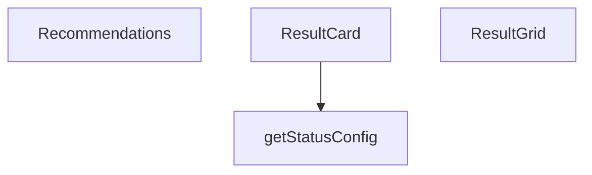

## Genel Bakış
`ResultCard.tsx` modülü, HVAC hesaplama sonuçlarını görsel olarak sunmak için bir dizi React bileşeni ve yardımcı fonksiyon içerir. Modül, tekil sonuç kartlarını, düzenli ızgara yerleşimini ve öneri listelerini sunarak kullanıcı arayüzündeki bilgi sunumunu standartlaştırır.

## Fonksiyon Grupları
### UI Bileşenleri
Bu grup, sonuçların ve önerilerin kullanıcıya gösterilmesini sağlayan temel arayüz bileşenlerini kapsar.
- ResultCard, ResultGrid, Recommendations

### Yardımcı Fonksiyonlar
Bileşenlerin duruma göre görünümünü (renk, ikon vb.) belirleyen konfigürasyon değerlerini döndüren yardımcı işlevdir.
- getStatusConfig

---

## AXIOMS – Mimari Varsayımlar
Bu modül için gerekli mimari varsayımlar, UI bileşenlerinin doğru render edilmesi ve durum yapılandırmasına ilişkin koşulları kapsar.

[Aksiyom 1]: Eğer `ResultCard` bileşenine `title` prop'u verilmezse, kart başlıksız render edilir veya hata oluşur.

[Aksiyom 2]: Eğer `ResultCard` bileşenine `value` prop'u verilmezse, kart değersiz render edilir veya hata oluşur.

[Aksiyom 3]: Eğer `getStatusConfig()` fonksiyonu bilinmeyen bir `status` değeriyle çağrılırsa, varsayılan 'info' stilini döndürür veya tanımsız davranış oluşur.

[Aksiyom 4]: Eğer `ResultGrid` bileşenine `children` prop'u verilmezse, boş bir ızgara render edilir veya hata oluşur.

[Aksiyom 5]: Eğer `Recommendations` bileşenine `items` prop'u verilmezse, boş bir öneri listesi render edilir veya hata oluşur.

[Aksiyom 6]: Eğer `Recommendations` bileşenine `items` boş bir dizi olarak verilse bile, bileşen hata vermeden render edilmelidir.

[Aksiyom 7]: Eğer `status` parametresi için beklenen değerler ('info', 'warning', 'error', 'success') dışında bir değer verilirse, bileşen varsayılan 'info' stilini kullanır.

---

## FONKSİYON DETAYLARI

### ResultCard
**Ne yapar**: Hesaplama sonucunu bir kart içinde gösterir; kartın duruma göre renk kodlaması ve animasyonu uygulanır.  
**Nasıl yapar**: Props olarak alınan `title`, `value`, `unit`, `status` ve `description` değerlerini kullanarak kartın içeriğini oluşturur; `status` prop'una göre stil ve animasyon seçimi yapılır.  
**Parametreler**:
- title: type not specified — Kartın başlık metni  
- value: type not specified — Gösterilecek hesaplanan sayısal veya metinsel değer  
- unit: type not specified — Değerin birimini ifade eden metin (örn. °C, kW)  
- status: type not specified (default: 'info') — Kartın durumunu belirler; bu durum renk ve animasyon etkisini yönetir  
- description: type not specified — Kartın altında gösterilecek ekstra açıklama metni  
**Dönüş**: React.FC<ResultCardProps> — ResultCard fonksiyonel bileşeni

### getStatusConfig
**Ne yapar**: Belirtilmemiş (docstring sağlanmadı)  
**Nasıl yapar**: Bilinmiyor  
**Parametreler**: (yok)  
**Dönüş**: void veya bilinmiyor (belirtilmedi)

### ResultGrid
**Ne yapar**: Belirtilmemiş (docstring sağlanmadı)  
**Nasıl yapar**: Bilinmiyor  
**Parametreler**:
- children: type not specified — Grid içinde görüntülenecek alt öğeler (React elemanları veya bileşenler)  
- title: type not specified — Grid'in üst kısmında gösterilecek başlık metni  
**Dönüş**: React.FC<ResultGridProps> — ResultGrid fonksiyonel bileşeni

### Recommendations
**Ne yapar**: Belirtilmemiş (docstring sağlanmadı)  
**Nasıl yapar**: Bilinmiyor  
**Parametreler**:
- items: type not specified — Gösterilecek öneri öğelerini içeren veri yapısı (dizi, liste vb.)  
- title: type not specified (default: 'Öneriler') — Öneri bölümünün başlığı; belirtilmezse varsayılan 'Öneriler' kullanılır  
**Dönüş**: React.FC<RecommendationsProps> — Recommendations fonksiyonel bileşeni

---

## INTERFACES

### ResultCardProps
- `title: string`
- `value: string | number`
- `unit?: string`
- `status?: ResultStatus`
- `description?: string`
- `icon?: React.ReactNode`
- `large?: boolean`

### ResultGridProps
Sonuç kartları grubu
- `children: React.ReactNode`
- `title?: string`

### RecommendationsProps
Öneriler listesi
- `items: string[]`
- `title?: string`

---

## TYPE ALIASES

### ResultStatus
```typescript
type ResultStatus = 'optimal' | 'acceptable' | 'warning' | 'critical' | 'info'
```

---

## AST POINTERS

### [N1_NASIL] AST Pointer: src/components/calculators/ResultCard.tsx::ResultCard
- **params**: ({title, value, unit, status = 'info', description, icon, large = false})
- **ic_degiskenler**:
  - `getStatusConfig` — Fonksiyon içinde tanımlanan yardımcı fonksiyon, mevcut status değerine göre renklendirme ve ikon konfigürasyonu döner
  - `config` — getStatusConfig() çağrısının döndüğü konfigürasyon objesi (bgColor, borderColor, iconColor, icon içerir)
  - `title` — Parametre olarak alınan başlık metni
  - `value` — Parametre olarak alınan değer (sayı veya metin)
  - `unit` — Parametre olarak alınan birim metni
  - `status` — Parametre olarak alınan durum göstergesi (default: 'info')
  - `description` — Parametre olarak alınan açıklama metni
  - `icon` — Parametre olarak alınan özel ikon (React elemanı)
  - `large` — Parametre olarak alınan boyut bayrağı (default: false)
- **Dönüş**: JSX elementi (React bileşeni)

### [N2_NASIL] AST Pointer: src/components/calculators/ResultCard.tsx::getStatusConfig
- **params**: (parametre yok)
- **ic_degiskenler**:
  - `status` — Üst kapsamdan erişilen durum değişkeni (switch statement'da kullanılır)
- **Dönüş**: Konfigürasyon objesi (bgColor, borderColor, iconColor, icon içerir)

### [N3_NASIL] AST Pointer: src/components/calculators/ResultCard.tsx::ResultGrid
- **params**: ({children, title})
- **ic_degiskenler**:
  - `children` — Grid içinde render edilecek React çocuk elemanları
  - `title` — Grid başlığı (opsiyonel)
- **Dönüş**: JSX elementi (grid layout'u)

### [N4_NASIL] AST Pointer: src/components/calculators/ResultCard.tsx::Recommendations
- **params**: ({items, title = 'Öneriler'})
- **ic_degiskenler**:
  - `items` — Öneri metinlerinden oluşan dizi
  - `title` — Bölüm başlığı (default: 'Öneriler')
- **Dönüş**: JSX elementi (öneri listesi veya null)

---


## MERMAID CALL GRAPH


## NODE ID STANDARD

  file: src\components\calculators\ResultCard.tsx
  function: src\components\calculators\ResultCard.tsx::ResultCard
  function: src\components\calculators\ResultCard.tsx::getStatusConfig
  function: src\components\calculators\ResultCard.tsx::ResultGrid
  function: src\components\calculators\ResultCard.tsx::Recommendations

---

## DISA AKTARILANLAR (EXPORTS)
  export: Recommendations
  export: ResultCard
  export: ResultGrid

---

## STİL TOKENLERİ

### Arbitrary Değerler (token'a geçirilmemiş)
Yok — tüm stiller token'a geçirilmiş. ✅

### Kullanılan Token'lar (zaten token'a geçirilmiş)
- (yok)

### Tailwind Sınıf Özeti
- **Renkler:** `bg-secondary-blue/5`, `border-secondary-blue/20`, `text-2xl`, `text-3xl`, `text-industrial-gray`, `text-primary-navy`, `text-secondary-blue`, `text-sm`, `text-steel-gray`, `text-xs`
- **Layout:** `col-span-full`, `flex`, `gap-2`, `gap-4`, `grid`, `grid-cols-1`, `hover:shadow-md`, `items-baseline`, `items-center`, `items-start`, `justify-between`, `lg:grid-cols-3`, `md:col-span-2`, `md:grid-cols-2`, `p-4`
- **Varyant/Responsive:** `:`, `hover:`, `lg:`, `md:` önekleri
- **Yardımcı Sınıflar:** `${config.bgColor`, `${config.borderColor`, `${large`, `:`, `border`, `duration-300`, `font-bold`, `font-medium`, `font-semibold`, `leading-relaxed`, `mb-2`, `mb-3`, `mb-4`, `mt-1`, `mt-2`