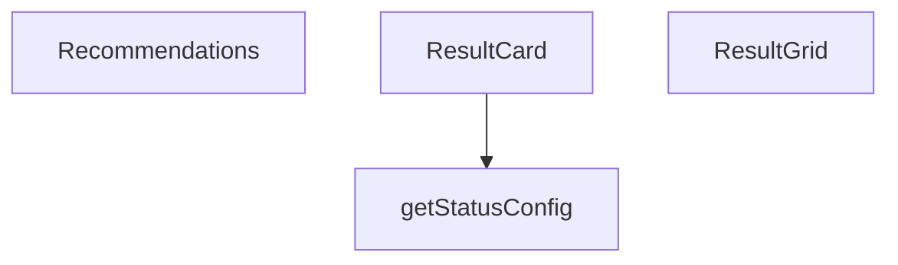

## Genel Bakış
`ResultCard.tsx` modülü, HVAC hesaplamalarının sonuçlarını kullanıcıya görsel olarak sunmak için tasarlanmış bir bileşen koleksiyonudur. Tekil sonuç kartları, sonuçları düzenli bir ızgara içinde gösteren bir konteyner ve öneri listeleri gibi ek UI parçaları içerir; ayrıca kartların görünümünü durum bilgisiyle eşleştirmek için renk, simge ve stil yapılandırmasını sağlayan bir yardımcı fonksiyon bulunur.

## Fonksiyon Grupları
### UI Bileşenleri
Bu grup, sonuçların görsel olarak düzenlenmesini ve sunulmasını sağlayan temel React bileşenlerini içerir.
- ResultCard, ResultGrid, Recommendations

### Yardımcı / Konfigürasyon
Durum türlerine göre renk, ikon ve stil gibi görsel ayarları döndürerek UI bileşenlerinin görünümünü belirleyen fonksiyondur.
- getStatusConfig

---

## AXIOMS – Mimari Varsayımlar
Bu modülün doğru çalışması için aşağıdaki koşulların sağlanması gerekir; koşullar sağlanmadığında ilgili bileşen veya fonksiyon beklenildiği gibi davranmayabilir.

- **ResultCard bileşeni**: Eğer `title` prop’u tanımlanmazsa, kart başlığı boş görünebilir.  
- **ResultCard bileşeni**: Eğer `value` prop’u tanımlanmazsa, kartın değeri bölümü boş görünebilir.  
- **ResultCard bileşeni**: Eğer `unit` prop’u tanımlanmazsa, birim bölümü gösterilmez.  
- **ResultCard bileşeni**: Eğer `status` prop’u tanımlanmazsa, varsayılan değer `'info'` kullanılır; bu durumda `getStatusConfig` fonksiyonu `'info'` için yapılandırma döndürmelidir.  
- **ResultCard bileşeni**: Eğer `description` prop’u tanımlanmazsa, açıklama bölümü gösterilmez.  
- **getStatusConfig fonksiyonu**: Eğer fonksiyona geçilen `status` değeri fonksiyon tarafından işlenemezse (örneğin tanımsız veya desteklenmeyen bir string), dönüş değeri bilinmez ve ResultCard stilini belirleyemez.  
- **ResultGrid bileşeni**: Eğer `children` prop’u tanımlanmazsa veya boş bir değerse, ızgara içeriği render edilmez.  
- **Recommendations bileşeni**: Eğer `items` prop’u tanımlanmazsa veya boş bir dizi ise, öneri listesi gösterilmez.  
- **Recommendations bileşeni**: Eğer `title` prop’u tanımlanmazsa, varsayılan değer `'Öneriler'` kullanılır.

---

## FONKSİYON DETAYLARI

### ResultCard
**Ne yapar**: Hesaplama sonucunu bir kart içinde gösterir; kartın duruma göre renk kodlaması ve animasyonu uygulanır.  
**Nasıl yapar**: Props olarak alınan `title`, `value`, `unit`, `status` ve `description` değerlerini kullanarak kartın içeriğini oluşturur; `status` prop'una göre stil ve animasyon seçimi yapılır.  
**Parametreler**:
- title: type not specified — Kartın başlık metni  
- value: type not specified — Gösterilecek hesaplanan sayısal veya metinsel değer  
- unit: type not specified — Değerin birimini ifade eden metin (örn. °C, kW)  
- status: type not specified (default: 'info') — Kartın durumunu belirler; bu durum renk ve animasyon etkisini yönetir  
- description: type not specified — Kartın altında gösterilecek ekstra açıklama metni  
**Dönüş**: React.FC<ResultCardProps> — ResultCard fonksiyonel bileşeni

### getStatusConfig
**Ne yapar**: Belirtilmemiş (docstring sağlanmadı)  
**Nasıl yapar**: Bilinmiyor  
**Parametreler**: (yok)  
**Dönüş**: void veya bilinmiyor (belirtilmedi)

### ResultGrid
**Ne yapar**: Belirtilmemiş (docstring sağlanmadı)  
**Nasıl yapar**: Bilinmiyor  
**Parametreler**:
- children: type not specified — Grid içinde görüntülenecek alt öğeler (React elemanları veya bileşenler)  
- title: type not specified — Grid'in üst kısmında gösterilecek başlık metni  
**Dönüş**: React.FC<ResultGridProps> — ResultGrid fonksiyonel bileşeni

### Recommendations
**Ne yapar**: Belirtilmemiş (docstring sağlanmadı)  
**Nasıl yapar**: Bilinmiyor  
**Parametreler**:
- items: type not specified — Gösterilecek öneri öğelerini içeren veri yapısı (dizi, liste vb.)  
- title: type not specified (default: 'Öneriler') — Öneri bölümünün başlığı; belirtilmezse varsayılan 'Öneriler' kullanılır  
**Dönüş**: React.FC<RecommendationsProps> — Recommendations fonksiyonel bileşeni

---

## INTERFACES

### ResultCardProps
- `title: string`
- `value: string | number`
- `unit?: string`
- `status?: ResultStatus`
- `description?: string`
- `icon?: React.ReactNode`
- `large?: boolean`

### ResultGridProps
Sonuç kartları grubu
- `children: React.ReactNode`
- `title?: string`

### RecommendationsProps
Öneriler listesi
- `items: string[]`
- `title?: string`

---

## TYPE ALIASES

### ResultStatus
```typescript
type ResultStatus = 'optimal' | 'acceptable' | 'warning' | 'critical' | 'info'
```

---

## AST POINTERS

### [N1_NASIL] AST Pointer: src/components/calculators/ResultCard.tsx::ResultCard
- **params**: title, value, unit, status = 'info', description, icon, large = false
- **ic_degiskenler**:
  - `getStatusConfig` — fonksiyon, status değerine göre renk, ikon ve border konfigürasyonunu döndürür.
  - `config` — getStatusConfig çağrısının sonucu, ResultCard'ın stil ve ikon ayarlarını tutan nesne.
- **Dönüş**: JSX.Element

### [N2_NASIL] AST Pointer: src/components/calculators/ResultCard.tsx::getStatusConfig
- **params**: (parametre yok)
- **ic_degiskenler**: (yok)
- **Dönüş**: { bgColor: string, borderColor: string, iconColor: string, icon: JSX.Element }

### [N3_NASIL] AST Pointer: src/components/calculators/ResultCard.tsx::ResultGrid
- **params**: children, title
- **ic_degiskenler**: (yok)
- **Dönüş**: JSX.Element

### [N4_NASIL] AST Pointer: src/components/calculators/ResultCard.tsx::Recommendations
- **params**: items, title = 'Öneriler'
- **ic_degiskenler**: (yok)
- **Dönüş**: JSX.Element | null

### [N5_NASIL] AST Pointer: src/components/calculators/ResultCard.tsx::(map callback)
- **params**: item, index
- **ic_degiskenler**: (yok)
- **Dönüş**: JSX.Element

---


## MERMAID CALL GRAPH


## NODE ID STANDARD

  file: src\components\calculators\ResultCard.tsx
  function: src\components\calculators\ResultCard.tsx::ResultCard
  function: src\components\calculators\ResultCard.tsx::getStatusConfig
  function: src\components\calculators\ResultCard.tsx::ResultGrid
  function: src\components\calculators\ResultCard.tsx::Recommendations

---

## DISA AKTARILANLAR (EXPORTS)
  export: Recommendations
  export: ResultCard
  export: ResultGrid

---

## STİL TOKENLERİ

### Arbitrary Değerler (token'a geçirilmemiş)
Yok — tüm stiller token'a geçirilmiş. ✅

### Kullanılan Token'lar (zaten token'a geçirilmiş)
- (yok)

### Tailwind Sınıf Özeti
- **Renkler:** `bg-secondary-blue/5`, `border-secondary-blue/20`, `text-2xl`, `text-3xl`, `text-industrial-gray`, `text-primary-navy`, `text-secondary-blue`, `text-sm`, `text-steel-gray`, `text-xs`
- **Layout:** `col-span-full`, `flex`, `gap-2`, `gap-4`, `grid`, `grid-cols-1`, `hover:shadow-md`, `items-baseline`, `items-center`, `items-start`, `justify-between`, `lg:grid-cols-3`, `md:col-span-2`, `md:grid-cols-2`, `p-4`
- **Varyant/Responsive:** `:`, `hover:`, `lg:`, `md:` önekleri
- **Yardımcı Sınıflar:** `${config.bgColor`, `${config.borderColor`, `${large`, `:`, `border`, `duration-300`, `font-bold`, `font-medium`, `font-semibold`, `leading-relaxed`, `mb-2`, `mb-3`, `mb-4`, `mt-1`, `mt-2`