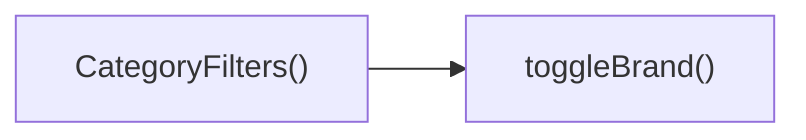

## Genel Bakış
Bu modül, ürün listesinin sol tarafında yer alan kategori filtreleme panelini oluşturur ve kullanıcıların marka seçimini dinamik olarak yönetir. Kategori hiyerarşisini gösteren bir arayüz sunarken, seçilen markaların durumunu takip ederek filtreleme işlevini sağlar.

## Fonksiyon Grupları
### Kategori Arayüzü Oluşturma
Kullanıcıya mevcut kategori, üst kategori ve alt kategori bilgilerini görsel olarak sunar ve filtre panelinin temel yapısını oluşturur.
- CategoryFilters

### Marka Seçimi Yönetimi
Kullanıcının bir marka üzerindeki tıklamasını yakalar, seçili markaların listesini günceller ve bu değişikliği filtre sistemine iletir.
- toggleBrand

---

## AXIOMS – Mimari Varsayımlar
Bu modül için özel aksiyom tanımlanmıştır.

- Eğer **category** prop'u tanımlı değilse veya null ise, component filtrelemeyi doğru yapamaz.  
- Eğer **parentCategory** prop'u tanımlı değilse, üst kategori seçimi UI'da gösterilemeyebilir.  
- Eğer **subCategories** prop'u bir dizi değilse veya undefined ise, alt kategori listesi render edilirken hata oluşur.  
- Eğer **availableBrands** prop'u bir dizi değilse veya undefined ise, marka toggle işlevi çalışmaz.  
- Eğer **filte** prop'u (muhtemelen filtre fonksiyonu) tanımlı değilse, filtreleme mantığı uygulanamaz.  
- Eğer **toggleBrand** fonksiyonuna string olmayan bir değer geçirilirse, marka durumu güncellenemeyebilir.

---

## FONKSIYON DETAYLARI

### CategoryFilters
**Ne yapar**: Category bileşeni, verilen kategori hiyerarşisi ve marka listesini kullanarak ürün filtreleme arayüzünü render eder.  
**Nasıl yapar**: Props olarak alınan `category`, `parentCategory`, `subCategories` ve `availableBrands` değerlerini okuyarak, kullanıcıya kategori seçimi, alt kategori gösterimi ve marka kutucukları sunar; `filte` prop’u (muhtemelen filtre durumu) üzerinden mevcut seçilen değerleri kontrol eder ve gerekirse UI’yi günceller.  
**Parametreler**:
- category: string — Şu anda aktif olan ana kategori adı  
- parentCategory: string | null — Üst kategori varsa adı, yoksa null  
- subCategories: string[] — Seçili kategoriye ait alt kategori listesi  
- availableBrands: string[] — Filtrelenebilecek tüm markaların listesi  
- filte: object — Mevcut filtre durumunu tutan nesne (tipi CategoryFiltersProps içinde tanımlanmıştır)  
**Dönüş**: React.FC<CategoryFiltersProps> — Bileşen, JSX döndürerek kullanıcı arayüzünü üretir.

### toggleBrand
**Ne yapar**: Belirtilen markanın filtre listesindeki seçimini tersine çevirir (seçiliyse kaldırır, seçili değilse ekler).  
**Nasıl yapar**: `brand` parametresi olarak alınan marka adını alır, mevcut filtre durumunda bu markanın varlığını kontrol eder; varsa kaldırır, yoksa ekleyerek filtre state’ini günceller. Bu işlem genellikle bir setState veya benzeri state güncelleme fonksiyonu ile yapılır.  
**Parametreler**:
- brand: string — Durumu değiştirilecek markanın adı  
**Dönüş**: void — Fonksiyon herhangi bir değer döndürmez; sadece state’i etkiler.

---

## INTERFACES

### CategoryFiltersProps
- `category: DomainCategory`
- `parentCategory?: DomainCategory | null`
- `subCategories: DomainCategory[]`
- `availableBrands: string[]`
- `filters: FilterState`
- `onUpdateFilters: (updates: Partial<FilterState>) => void`

---

## AST POINTERS

### [N1_NASIL] AST Pointer: C:\Users\alize\venthub-hvac\src\components\category\CategoryFilters.tsx::CategoryFilters
- **params**: (category, parentCategory, subCategories, availableBrands, filters, onUpdateFilters)
- **ic_degiskenler**: 
  - `t` — çeviri fonksiyonu, useI18n'den dönen nesnenin t özelliği, UI metinlerini çevirmek için kullanılır
  - `lang` — aktif dil kodu, useI18n'den döner, formatCurrency gibi i18n işlevlerinde kullanılır
- **Dönüş**: JSX.Element

### [N2_NASIL] AST Pointer: C:\Users\alize\venthub-hvac\src\components\category\CategoryFilters.tsx::toggleBrand
- **params**: (brand: string)
- **ic_degiskenler**: (yok)
- **Dönüş**: yok

### [N3_NASIL] AST Pointer: C:\Users\alize\venthub-hvac\src\components\category\CategoryFilters.tsx::subMapper
- **params**: (sub)
- **ic_degiskenler**: (yok)
- **Dönüş**: JSX.Element

### [N4_NASIL] AST Pointer: C:\Users\alize\venthub-hvac\src\components\category\CategoryFilters.tsx::brandMapper
- **params**: (brand)
- **ic_degiskenler**: (yok)
- **Dönüş**: JSX.Element

---

## ÇAĞRI HARİTASI

### Disariya Cagrilar (Outgoing)
- `CategoryFilters()` fonksiyonu, marka filtresinin durumunu değiştirmek için `toggleBrand()` fonksiyonunu çağırır.

### Disaridan Cagrilanlar (Incoming)
- Bu modülü çağıran dış fonksiyon veya dosya verilmemiştir; dışarıdan gelen çağrı yoktur.

### Ic Ice Fonksiyonlar (Nested)
- Yok

---

## DOSYA-İÇİ ÇAĞRI GRAFİĞİ
  CategoryFilters() → toggleBrand()

---

## NODE ID STANDARD

  file: src\components\category\CategoryFilters.tsx
  function: src\components\category\CategoryFilters.tsx::CategoryFilters
  function: src\components\category\CategoryFilters.tsx::toggleBrand

---

## DISA AKTARILANLAR (EXPORTS)
  export: CategoryFilters