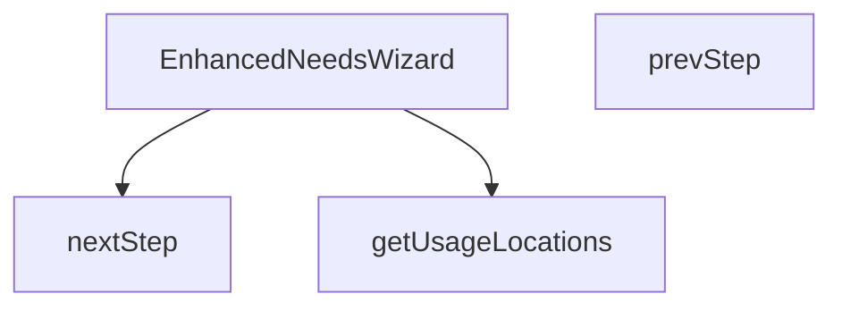

## Genel Bakış
Bu modül, kullanıcıların ihtiyaçlarını yapılandırılmış bir süreçte belirlemelerine yardımcı olmak için tasarlanmış adım bazlı bir sihirbaz (wizard) bileşenidir. Bileşen, açılıp kapatılmasını kontrol eden bir durum yönetimi, adımlar arasında gezinmeyi sağlayan mantık ve her adım için gerekli verileri (örneğin, kullanım konumları listesi) hazırlayan yardımcı fonksiyonlar içerir.

## Fonksiyon Grupları
### Ana Bileşen ve Durum Yönetimi
Bu grup, modülün temel React bileşenini ve trên dışarıdan alınan özelliklere (prop) bağlı çalışma mantığını tanımlar. Bileşenin görünür olup olmadığını, nasıl kapatılacağını ve hangi kategori verisiyle çalışacağını belirler.
- EnhancedNeedsWizard

### Adım Navigasyonu
Sihirbazın içinde bulunduğu adımı ileri veya geri götürerek kullanıcı deneyimini yönetir. Bu işlevler bileşenin iç durumunu güncelleyerek arayüzün farklı bölümlerini gösterir.
- nextStep, prevStep

### Yardımcı Veri Hazırlama
Sihirbazın belirli adımlarında kullanıcıya sunulacak seçenekleri (örneğin, kullanım alanları) doldurmak için gerekli verileri, çeviri fonksiyonunu kullanarak hazırlar.
- getUsageLocations

---

## AXIOMS – Mimari Varsayımlar
Bu modül, bir React sihirbaz bileşeninin temel akışını ve dış bağımlılıklarını tanımlayan aksiyomlara sahiptir.

[Aksiyom 1]: Eğer `isOpen` prop'u `false` veya tanımsız değilse, bileşen (wizard) kullanıcı arayüzünde görünür olmalıdır.
[Aksiyom 2]: Eğer `onClose` fonksiyonu sağlanmamışsa, kullanıcı sihirbazı kapatma eylemini (örn. 'X' butonu veya arka plan tıklaması) gerçekleştiremez ve bileşen kapanamaz.
[Aksiyom 3]: Eğer `parentSlug` parametresi sağlanmamışsa, sihirbazın içeriği veya hedeflediği alt kategoriler hakkında bilinmezlik oluşur ve adım verileri doğru hazırlanamayabilir.
[Aksiyom 4]: Eğer `getUsageLocations` fonksiyonu çağrılamıyorsa veya uygun veri döndürmüyorsa, "Kullanım Konumları" adımının içeriği boş veya hatalı olur.
[Aksiyom 5]: Eğer `nextStep` fonksiyonu, mevcut adımın son adım olduğu durumda çağrılırsa ve buna uygun bir kontrol (örn. adım sayısına ulaşılıp ulaşılmadığı) yoksa, geçersiz bir adım indeksine erişim denemesi yapılarak hata oluşur.
[Aksiyom 6]: Eğer `prevStep` fonksiyonu, ilk adımda (indeks 0) çağrılırsa ve buna uygun bir kontrol yoksa, negatif bir adım indeksine erişim denemesi yapılarak hata oluşur.

---

## FONKSİYON DETAYLARI

### getUsageLocations
**Ne yapar**: Verilen çeviri fonksiyonu `t` kullanılarak kullanım konumlarıyla ilgili metinleri hazırlar veya ilgili veri yapısını doldurur.  
**Nasıl yapar**: `t` parametresi üzerinden anahtar‑değer çevirileri yaparak, kullanım konumlarıyla ilgili dizeleri elde eder; bu işlem sonucunda bir side‑effect (örneğin state güncellemesi) gerçekleşebilir.  
**Parametreler**:
- t: (key: string) => string — Çeviri anahtarını соответствующий çeviriye dönüştüren fonksiyon  
**Dönüş**: Fonksiyonun dönüş tipi belirtilmemiştir; genellikle `void` olarak kabul edilir (bir değer döndürmez).

### EnhancedNeedsWizard
**Ne yapar**: `isOpen`, `onClose` ve `parentSlug` özelliklerini alarak ihtiyaç sihirbazını (wizard) render eden bir React bileşenidir.  
**Nasıl yapar**: Bileşen, `isOpen` durumuna göre sihirbazın görünürlüğünü kontrol eder; `onClose` çağrısıyla sihirbaz kapatılır ve `parentSlug` değeri sihirbaz içeriğinin filtrelenmesi veya bağlam belirlenmesinde kullanılır. İç durum yönetimi (adım geçişleri, form verileri vb.) bileşenin kendi state’i üzerinden yapılır.  
**Parametreler**:
- isOpen: boolean — Sihirbazın açık olup olmadığını belirler  
- onClose: () => void — Sihirbaz kapatıldığında çağrılan geri çağırım fonksiyonu  
- parentSlug: string — Sihirbazın hangi üst kategori veya bağlam içinde çalışacağını tanımlayan tanımlayıcı  
**Dönüş**: `React.FC<EnhancedWizardProps>` türünde bir fonksiyonel bileşen; JSX döndürerek kullanıcı arayüzü üretir.

### nextStep
**Ne yapar**: Sihirbazın mevcut adımını bir ilerletir.  
**Nasıl yapar**: Bileşenin içindeki adım sayacını (step index) bir artırarak sonraki adımı gösterir; gerekirse form doğrulama veya veri kaydetme işlemleri tetiklenebilir.  
**Parametreler**: (yok)  
**Dönüş**: Dönüş tipi belirtilmemiştir; genellikle `void` olarak kabul edilir (bir değer döndürmez).

### prevStep
**Ne yapar**: Sihirbazın mevcut adımını bir geriye alır.  
**Nasıl yapar**: Bileşenin içindeki adım sayacını (step index) bir azaltarak önceki adımı gösterir; gerekirse önceki adımın verilerini yeniden yükler veya form sıfırlama işlemi yapar.  
**Parametreler**: (yok)  
**Dönüş**: Dönüş tipi belirtilmemiştir; genellikle `void` olarak kabul edilir (bir değer döndürmez).

---

## INTERFACES

### WizardState
- `step: WizardStep`
- `usageLocation: 'entrance' | 'cold-storage' | 'industrial' | 'retail' | null`
- `sector: string | null`
- `doorWidth: number`
- `doorHeight: number`
- `windCondition: 'none' | 'light' | 'moderate' | 'strong'`
- `trafficIntensity: 'low' | 'medium' | 'high'`
- `heatingNeeded: 'yes' | 'no' | 'unsure' | null`
- `climateZone: 'cold' | 'moderate' | 'warm' | null`
- `doorFrequency: 'low' | 'medium' | 'high' | null`
- `hasHeating: boolean | null`

### EnhancedWizardProps
- `isOpen: boolean`
- `onClose: () => void`
- `parentSlug: string`

### MatchedProduct extends DomainProduct
- `matchScore: number`
- `matchReason: string`

---

## TYPE ALIASES

### WizardStep
```typescript
type WizardStep = 1 | 2 | 3 | 4 | 5 | 6
```

---

## AST POINTERS

### [N1_NASIL] AST Pointer: EnhancedNeedsWizard.tsx::getUsageLocations
- **params**: `t` — Çeviri fonksiyonu, Anahtar kelime ile çeviri stringi döndürür
- **ic_degiskenler**: yok
- **Dönüş**: Array of objects (her birinde `id`, `title`, `description`, `icon`, `tip` alanları)

### [N2_NASIL] AST Pointer: EnhancedNeedsWizard.tsx::EnhancedNeedsWizard
- **params**: `isOpen` — Sihirbazın açık olup olmadığı, `onClose` — Kapatma fonksiyonu, `parentSlug` — Üst kategori slug'ı
- **ic_degiskenler**: 
  - `t` — useI18n hook'undan alınan çeviri fonksiyonu
  - `state` — WizardState türünde sihirbaz durum nesnesi (step, usageLocation, sector, doorWidth, doorHeight, windCondition, trafficIntensity, heatingNeeded, climateZone, doorFrequency, hasHeating)
  - `matchedProducts` — MatchedProduct[] türünde eşleşen ürünler dizisi
  - `loading` — boolean, yükleme durumu
  - `matchProducts` — useCallback ile tanımlanan ürün eşleştirme fonksiyonu
  - `useEffect` — state.step === 6 olduğunda matchProducts'ı çağıran efekt
  - `nextStep` — Bir sonraki adıma geçiş yapan arrow fonksiyon
  - `prevStep` — Bir önceki adıma geçiş yapan arrow fonksiyon
- **Dönüş**: JSX element (React.FC) veya null (isOpen false ise)

### [N3_NASIL] AST Pointer: EnhancedNeedsWizard.tsx::nextStep
- **params**: yok
- **ic_degiskenler**: yok (sadece setState çağrısı yapıyor)
- **Dönüş**: yok

### [N4_NASIL] AST Pointer: EnhancedNeedsWizard.tsx::prevStep
- **params**: yok
- **ic_degiskenler**: yok (sadece setState çağrısı yapıyor)
- **Dönüş**: yok

---


## MERMAID CALL GRAPH


## NODE ID STANDARD

  file: src\components\category\EnhancedNeedsWizard.tsx
  function: src\components\category\EnhancedNeedsWizard.tsx::getUsageLocations
  function: src\components\category\EnhancedNeedsWizard.tsx::EnhancedNeedsWizard
  function: src\components\category\EnhancedNeedsWizard.tsx::nextStep
  function: src\components\category\EnhancedNeedsWizard.tsx::prevStep

---

## DISA AKTARILANLAR (EXPORTS)
  export: EnhancedNeedsWizard
  export: getUsageLocations

---

## BILEŞIM (CONTAINS)
  contains: DomainProduct

---

## STİL TOKENLERİ

### Arbitrary Değerler (token'a geçirilmemiş)
Yok — tüm stiller token'a geçirilmiş. ✅

### Kullanılan Token'lar (zaten token'a geçirilmiş)
- `rounded-hvac-2xl`

### Tailwind Sınıf Özeti
- **Renkler:** `accent-cyan-500`, `bg-cyan-500`, `bg-slate-100`, `bg-slate-200`, `bg-slate-50`, `bg-slate-50/50`, `bg-slate-900/60`, `bg-slate-950`, `bg-white`, `border-b`, `border-none`, `border-slate-100`, `border-slate-200`, `group-hover:bg-cyan-500`, `group-hover:text-white`
- **Layout:** `absolute`, `backdrop-blur-xl`, `block`, `custom-scrollbar`, `fixed`, `flex`, `flex-1`, `flex-col`, `gap-1`, `gap-12`, `gap-3`, `gap-4`, `gap-6`, `grid`, `grid-cols-1`
- **Varyant/Responsive:** `:`, `group-hover:`, `hover:`, `md:`, `sm:` önekleri
- **Yardımcı Sınıflar:** `${s`, `:`, `<=`, `animate-in`, `animate-pulse`, `appearance-none`, `aspect-square`, `border`, `cursor-default`, `cursor-pointer`, `duration-500`, `fade-in`, `focus-ring`, `font-black`, `font-bold`