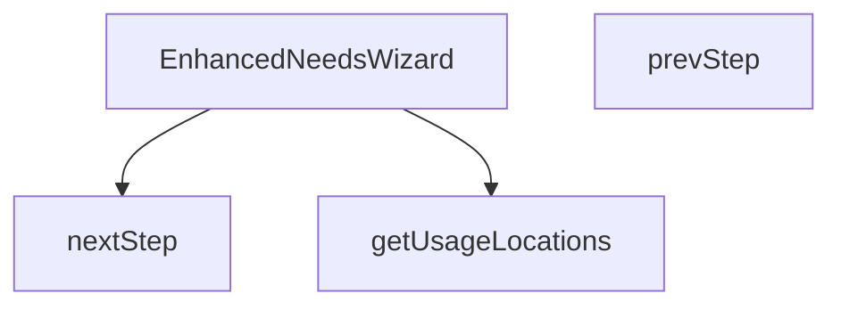

## Genel Bakış
EnhancedNeedsWizard modülü, kullanıcıların ihtiyaçlarını adım adım belirlemelerini sağlayan bir sihirbaz bileşenidir. Bu bileşen, kullanıcı arayüzünü render eder, adımlar arasında ileri ve geri geçişleri yönetir ve ihtiyaç analizinde kullanılacak konum bilgilerini hazırlayan bir yardımcı işlevi içerir.

## Fonksiyon Grupları
### Kullanıcı Arayüzü ve Bileşen Tanımı
Bu grup, modülün görsel yapısını oluşturan ve React bileşenini tanımlayan işlevi içerir.
- EnhancedNeedsWizard

### Adım Geçişi ve Navigasyon Kontrolü
Sihirbazın içindeki adımlar arasında kullanıcı tarafından ileri ve geri hareketleri sağlayan işlevleri barındırır.
- nextStep
- prevStep

### Yardımcı İşlevler
Sihirbazın iş mantığını destekleyen, çeviri fonksiyonu üzerinden kullanım konumlarını elde eden işlevi içerir.
- getUsageLocations

---

## AXIOMS – Mimari Varsayımlar
Bu modül için özel aksiyom tanımlanmamıştır.

[Aksiyom 1]: Eğer `getUsageLocations` fonksiyonuna geçirilen `t` parametresi `(key: string) => string` türünde bir fonksiyon değilse, çeviri işlemi başarısız olur veya fonksiyon beklenmeyen bir değer döndürür.  
[Aksiyom 2]: Eğer `EnhancedNeedsWizard` bileşenine `isOpen` prop'u boolean türünde verilmezse, bileşenin görünürlük durumu (açık/kapalı) beklenen şekilde çalışmayabilir.  
[Aksiyom 3]: Eğer `EnhancedNeedsWizard` bileşenine `onClose` prop'u bir fonksiyon verilmezse, `onClose` tetiklendiğinde çalışma zamanı hatası oluşur.  
[Aksiyom 4]: Eğer `EnhancedNeedsWizard` bileşenine `parentSlug` prop'u string türünde verilmezse, slug tabanlı işlemler (örneğin yönlendirme, filtreleme) beklenmeyen sonuç verebilir.  
[Aksiyom 5]: Eğer `nextStep` veya `prevStep` fonksiyonları bileşenin render edildiği bağlam dışında (örneğin component unmount sonrası) çağrılırsa, durum güncelleme işlemi (setState benzeri) başarısız olabilir ve uyarı/hataya yol açabilir.

---

## FONKSİYON DETAYLARI

### getUsageLocations
**Ne yapar**: Verilen çeviri fonksiyonu `t` kullanılarak kullanım konumlarıyla ilgili metinleri hazırlar veya ilgili veri yapısını doldurur.  
**Nasıl yapar**: `t` parametresi üzerinden anahtar‑değer çevirileri yaparak, kullanım konumlarıyla ilgili dizeleri elde eder; bu işlem sonucunda bir side‑effect (örneğin state güncellemesi) gerçekleşebilir.  
**Parametreler**:
- t: (key: string) => string — Çeviri anahtarını соответствующий çeviriye dönüştüren fonksiyon  
**Dönüş**: Fonksiyonun dönüş tipi belirtilmemiştir; genellikle `void` olarak kabul edilir (bir değer döndürmez).

### EnhancedNeedsWizard
**Ne yapar**: `isOpen`, `onClose` ve `parentSlug` özelliklerini alarak ihtiyaç sihirbazını (wizard) render eden bir React bileşenidir.  
**Nasıl yapar**: Bileşen, `isOpen` durumuna göre sihirbazın görünürlüğünü kontrol eder; `onClose` çağrısıyla sihirbaz kapatılır ve `parentSlug` değeri sihirbaz içeriğinin filtrelenmesi veya bağlam belirlenmesinde kullanılır. İç durum yönetimi (adım geçişleri, form verileri vb.) bileşenin kendi state’i üzerinden yapılır.  
**Parametreler**:
- isOpen: boolean — Sihirbazın açık olup olmadığını belirler  
- onClose: () => void — Sihirbaz kapatıldığında çağrılan geri çağırım fonksiyonu  
- parentSlug: string — Sihirbazın hangi üst kategori veya bağlam içinde çalışacağını tanımlayan tanımlayıcı  
**Dönüş**: `React.FC<EnhancedWizardProps>` türünde bir fonksiyonel bileşen; JSX döndürerek kullanıcı arayüzü üretir.

### nextStep
**Ne yapar**: Sihirbazın mevcut adımını bir ilerletir.  
**Nasıl yapar**: Bileşenin içindeki adım sayacını (step index) bir artırarak sonraki adımı gösterir; gerekirse form doğrulama veya veri kaydetme işlemleri tetiklenebilir.  
**Parametreler**: (yok)  
**Dönüş**: Dönüş tipi belirtilmemiştir; genellikle `void` olarak kabul edilir (bir değer döndürmez).

### prevStep
**Ne yapar**: Sihirbazın mevcut adımını bir geriye alır.  
**Nasıl yapar**: Bileşenin içindeki adım sayacını (step index) bir azaltarak önceki adımı gösterir; gerekirse önceki adımın verilerini yeniden yükler veya form sıfırlama işlemi yapar.  
**Parametreler**: (yok)  
**Dönüş**: Dönüş tipi belirtilmemiştir; genellikle `void` olarak kabul edilir (bir değer döndürmez).

---

## INTERFACES

### WizardState
- `step: WizardStep`
- `usageLocation: 'entrance' | 'cold-storage' | 'industrial' | 'retail' | null`
- `sector: string | null`
- `doorWidth: number`
- `doorHeight: number`
- `windCondition: 'none' | 'light' | 'moderate' | 'strong'`
- `trafficIntensity: 'low' | 'medium' | 'high'`
- `heatingNeeded: 'yes' | 'no' | 'unsure' | null`
- `climateZone: 'cold' | 'moderate' | 'warm' | null`
- `doorFrequency: 'low' | 'medium' | 'high' | null`
- `hasHeating: boolean | null`

### EnhancedWizardProps
- `isOpen: boolean`
- `onClose: () => void`
- `parentSlug: string`

### MatchedProduct extends DomainProduct
- `matchScore: number`
- `matchReason: string`

---

## TYPE ALIASES

### WizardStep
```typescript
type WizardStep = 1 | 2 | 3 | 4 | 5 | 6
```

---

## AST POINTERS

### [N1_NASIL] AST Pointer: C:\Users\alize\venthub-hvac\src\components\category\EnhancedNeedsWizard.tsx::getUsageLocations
- **params**: t: (key: string) => string (çeviri fonksiyonu)
- **ic_degiskenler**:
  - `id` — her lokasyonun benzersiz tanımlayıcısı (entrance, cold-storage, industrial, retail)
  - `title` — lokasyonun görünen başlığı, t() ile çevrilir
  - `description` — lokasyonun açıklaması, t() ile çevrilir veya sabit metin
  - `icon` — lokasyonu temsil eden React ikon bileşeni
  - `tip` — lokasyon için ek ipucu metni
- **Dönüş**: Kullanım lokasyonları listesi (dizi, her elemanı lokasyon nesnesi)

---


## MERMAID CALL GRAPH


## NODE ID STANDARD

  file: src\components\category\EnhancedNeedsWizard.tsx
  function: src\components\category\EnhancedNeedsWizard.tsx::getUsageLocations
  function: src\components\category\EnhancedNeedsWizard.tsx::EnhancedNeedsWizard
  function: src\components\category\EnhancedNeedsWizard.tsx::nextStep
  function: src\components\category\EnhancedNeedsWizard.tsx::prevStep

---

## DISA AKTARILANLAR (EXPORTS)
  export: EnhancedNeedsWizard
  export: getUsageLocations

---

## BILEŞIM (CONTAINS)
  contains: DomainProduct

---

## STİL TOKENLERİ

### Arbitrary Değerler (token'a geçirilmemiş)
Yok — tüm stiller token'a geçirilmiş. ✅

### Kullanılan Token'lar (zaten token'a geçirilmiş)
- `rounded-hvac-2xl`

### Tailwind Sınıf Özeti
- **Renkler:** `accent-cyan-500`, `bg-cyan-500`, `bg-slate-100`, `bg-slate-200`, `bg-slate-50`, `bg-slate-50/50`, `bg-slate-900/60`, `bg-slate-950`, `bg-white`, `border-b`, `border-none`, `border-slate-100`, `border-slate-200`, `group-hover:bg-cyan-500`, `group-hover:text-white`
- **Layout:** `absolute`, `backdrop-blur-xl`, `block`, `custom-scrollbar`, `fixed`, `flex`, `flex-1`, `flex-col`, `gap-1`, `gap-12`, `gap-3`, `gap-4`, `gap-6`, `grid`, `grid-cols-1`
- **Varyant/Responsive:** `:`, `group-hover:`, `hover:`, `md:`, `sm:` önekleri
- **Yardımcı Sınıflar:** `${s`, `:`, `<=`, `animate-in`, `animate-pulse`, `appearance-none`, `aspect-square`, `border`, `cursor-default`, `cursor-pointer`, `duration-500`, `fade-in`, `focus-ring`, `font-black`, `font-bold`