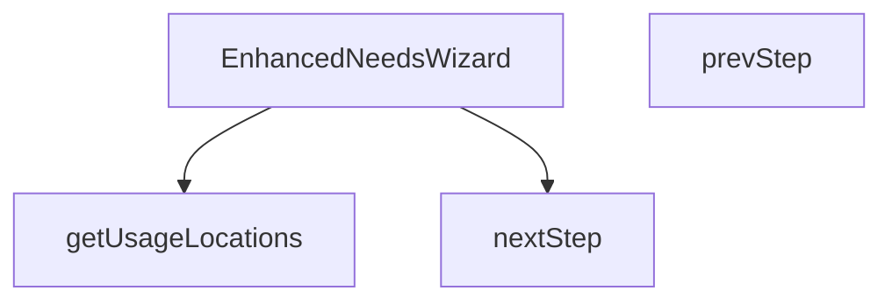

## Genel Bakış
EnhancedNeedsWizard, çok adımlı bir ihtiyaç belirleme sihirbazı bileşenidir. Kullanıcının adım adım ilerleyerek ihtiyaçlarını tanımlamasını sağlar. Bileşen, açık/kapalı durumu, kapatma işlevi ve üst kategori slug'ı gibi dışsal parametrelerle yapılandırılır.

## Fonksiyon Grupları

### Ana Bileşen
Sihirbazın yaşam döngüsünü, durum yönetimini ve alt bileşenlerin bir araya getirilmesini üstlenir. Dışarıdan `isOpen`, `onClose` ve `parentSlug` parametreleri alarak sihirbazın gösterilip gösterilmeyeceğini ve hangi kategoriye bağlı olduğunu belirler.
- EnhancedNeedsWizard

### Adım Yönetimi
Sihirbaz içindeki ileri-geri gezinmeyi sağlar. Kullanıcının mevcut adımı değiştirmesine olanak tanır.
- nextStep, prevStep

### Veri Sağlayıcı
Sihirbazın adımlarından birinde kullanılacak konum seçeneklerini üretir. Çeviri fonksiyonu alarak çok dilli etiketlerle birlikte konum listesini döndürür.
- getUsageLocations

---

## AXIOMS – Mimari Varsayımlar
- Bu modül davranışsal mantık içermez (salt veri / konfigürasyon / tip tanımı).
- [Aksiyom 1]: Modülün dışa açtığı yapı (anahtar kümesi / şema) bir sözleşmedir; tüketiciler bu sabit yapıya bağlıdır — kırıcı değişiklik tüm tüketicileri etkiler.
- [Aksiyom 2]: Bir öğe ekleme/çıkarma yapısal-uyumlu olmalı; ilgili tipler ve seçiciler aynı commit'te güncel tutulmalıdır.

---

## FONKSİYON DETAYLARI

### getUsageLocations
**Ne yapar**: Kullanım konumlarını (usage locations) elde etmek için kullanılan bir fonksiyondur. Uluslararasılaştırma (i18n) desteği sağlamak amacıyla çeviri fonksiyonu parametre olarak alır.

**Nasıl yapar**: Parametre olarak aldığı çeviri fonksiyonunu kullanarak kullanım konumlarını işler. Fonksiyonun iç mantığı verilen kaynak kodda mevcut değildir.

**Parametreler**:
- t: (key: string) => string — Uluslararasılaştırma anahtarlarını metin değerlerine çeviren fonksiyon

**Dönüş**: Belirtilmemiş

### EnhancedNeedsWizard
**Ne yapar**: Geliştirildi ancak detay üretilemedi.

### nextStep
**Ne yapar**: Geliştirildi ancak detay üretilemedi.

### prevStep
**Ne yapar**: Geliştirildi ancak detay üretilemedi.

---

## İTHALATLAR (IMPORTS)
- import: ../../hooks/useLocalizedRoutes::useLocalizedRoutes
- import: ../../lib/hvacCalculations::calculateAirCurtain
- import: ../../lib/services/product.columns::VARIANT_DETAIL_COLUMNS
- import: ../../lib/type-converters::toUIProductList
- import: ../../lib/type-converters::type DomainProduct
- import: ../../types/db-rows::DbJson
- import: ../../types/db-rows::DbProduct
- import: @/i18n/I18nProvider::useI18n
- import: @/lib/images/productImage::productImagePlaceholder
- import: @/lib/images/productImage::resolveProductImageUrl
- import: @/lib/supabase/client::supabaseBrowserClient
- import: @/utils/adminQueryFilters::eqValue
- import: @/utils/adminQueryFilters::orConditions
- import: next/image::Image
- import: next/link::Link
- import: react::React
- import: react::useCallback
- import: react::useEffect
- import: react::useState

---

## INTERFACES

### WizardState
- `step: WizardStep`
- `usageLocation: 'entrance' | 'cold-storage' | 'industrial' | 'retail' | null`
- `sector: string | null`
- `doorWidth: number`
- `doorHeight: number`
- `windCondition: 'none' | 'light' | 'moderate' | 'strong'`
- `trafficIntensity: 'low' | 'medium' | 'high'`
- `heatingNeeded: 'yes' | 'no' | 'unsure' | null`
- `climateZone: 'cold' | 'moderate' | 'warm' | null`
- `doorFrequency: 'low' | 'medium' | 'high' | null`
- `hasHeating: boolean | null`

### EnhancedWizardProps
- `isOpen: boolean`
- `onClose: () => void`
- `parentSlug: string`

### MatchedProduct extends DomainProduct
- `matchScore: number`
- `matchReason: string`

---

## TYPE ALIASES

### WizardStep
```typescript
type WizardStep = 1 | 2 | 3 | 4 | 5 | 6
```

---

## AST POINTERS

### [N1_NASIL] AST Pointer: src/components/category/EnhancedNeedsWizard.tsx::getUsageLocations
- **params**: `t` — çeviri fonksiyonu, `(key: string) => string` tipinde
- **ic_degiskenler**: yok (sadece dizi literal döndürür)
- **Dönüş**: Kullanım konumu nesnelerinden oluşan dizi. Her nesne `id`, `title`, `description`, `icon`, `tip` alanlarını içerir

### [N2_NASIL] AST Pointer: src/components/category/EnhancedNeedsWizard.tsx::EnhancedNeedsWizard
- **params**: `isOpen` — sihirbazın açık olup olmadığını belirten boolean, `onClose` — kapatma callback fonksiyonu, `parentSlug` — üst kategori slug'ı
- **ic_degiskenler**:
  - `t` — `useI18n()` hook'undan gelen çeviri fonksiyonu
  - `Routes` — `useLocalizedRoutes()` hook'undan gelen yönlendirme rotaları nesnesi
  - `state` — `useState<WizardState>` ile oluşturulan sihirbaz durumu; `step`, `usageLocation`, `sector`, `doorWidth`, `doorHeight`, `windCondition`, `trafficIntensity`, `heatingNeeded`, `climateZone`, `doorFrequency`, `hasHeating` alanlarını içerir
  - `setState` — `state` nesnesini güncelleyen setter fonksiyonu
  - `matchedProducts` — `useState<MatchedProduct[]>` ile oluşturulan eşleşen ürün listesi
  - `setMatchedProducts` — `matchedProducts` dizisini güncelleyen setter fonksiyonu
  - `loading` — `useState(false)` ile oluşturulan yükleme durumu boolean'ı
  - `setLoading` — `loading` durumunu güncelleyen setter fonksiyonu
  - `matchProducts` — `useCallback` ile sarılmış async ürün eşleştirme fonksiyonu; `parentSlug`, `state.doorHeight`, `state.doorWidth`, `state.heatingNeeded`, `state.trafficIntensity`, `state.usageLocation`, `state.windCondition` bağımlılıklarıyla memoize edilmiş
- **Dönüş**: `isOpen` false ise `null`, aksi halde JSX ağacı (dialog bileşeni)

### [N3_NASIL] AST Pointer: src/components/category/EnhancedNeedsWizard.tsx::matchProducts (useCallback)
- **params**: yok
- **ic_degiskenler**:
  - `kategori` — `supabase.from('categories').select('id').eq('slug', parentSlug).maybeSingle()` sorgusundan dönen kategori nesnesi; `.id` alanı kullanılır
  - `kategoriHatasi` — kategori sorgusundan dönen hata nesnesi; varsa throw edilir
  - `data` — `supabase.from('products').select(VARIANT_DETAIL_COLUMNS)` sorgusundan dönen ürün verileri
  - `error` — ürün sorgusundan dönen hata nesnesi; varsa throw edilir
  - `rawProducts` — `data` değişkeninin `DbProduct[]` tipine cast edilmiş hali
  - `domainProducts` — `toUIProductList(rawProducts)` dönüşümüyle elde edilen UI ürün listesi
  - `scored` — `domainProducts` üzerinde `.map()` ile puanlanmış, `.sort()` ile sıralanmış, `.slice(0, 3)` ile ilk 3'e kesilmiş ürün dizisi; her elemana `matchScore` ve `matchReason` eklenir
  - `p` — `.map()` callback'indeki her bir ürün nesnesi
  - `score` — her ürün için hesaplanan eşleşme puanı (sayı)
  - `reason` — eşleşme nedeni açıklaması (sabit değer `'Kapasite uyumu'`)
  - `specs` — `p.technical_specs` alanının `Record<string, DbJson> | null` tipindeki hali
  - `pWidth` — `specs?.width` değerinin `parseFloat` ile metre cinsine dönüştürülmüş hali (mm'den m'ye, /1000); yoksa 0
  - `pHeight` — `specs?.max_height` değerinin `parseFloat` ile sayıya dönüştürülmüş hali; yoksa 0
  - `err` — `catch` bloğunda yakalanan hata nesnesi; `console.error` ile loglanır
- **Dönüş**: yok (yan etki: `setMatchedProducts(scored)` çağrısı ile state güncellenir, `setLoading` ile yükleme durumu yönetilir)

### [N4_NASIL] AST Pointer: src/components/category/EnhancedNeedsWizard.tsx::useEffect callback
- **params**: yok
- **ic_degiskenler**: yok
- **Dönüş**: yok (yan etki: `state.step === 6` olduğunda `matchProducts()` çağrılır)

### [N5_NASIL] AST Pointer: src/components/category/EnhancedNeedsWizard.tsx::nextStep
- **params**: yok
- **ic_degiskenler**: yok
- **Dönüş**: yok (yan etki: `setState` ile `state.step` bir artırılır, `as WizardStep` ile cast edilir)

### [N6_NASIL] AST Pointer: src/components/category/EnhancedNeedsWizard.tsx::prevStep
- **params**: yok
- **ic_degiskenler**: yok
- **Dönüş**: yok (yan etki: `setState` ile `state.step` bir azaltılır, `as WizardStep` ile cast edilir)

### [N7_NASIL] AST Pointer: src/components/category/EnhancedNeedsWizard.tsx::scored.map callback (p)
- **params**: `p` — `domainProducts` dizisindeki her bir ürün nesnesi
- **ic_degiskenler**:
  - `score` — ürünün eşleşme puanı, başlangıçta 0; kapı genişliği/ yüksekliği ve ısıtma koşullarına göre artırılır
  - `reason` — eşleşme nedeni (sabit `'Kapasite uyumu'`)
  - `specs` — `p.technical_specs` alanının `Record<string, DbJson> | null` tipindeki hali
  - `pWidth` — ürün genişliği, `specs?.width` değerinden metre cinsine dönüştürülmüş; yoksa 0
  - `pHeight` — ürün maksimum yüksekliği, `specs?.max_height` değerinden sayıya dönüştürülmüş; yoksa 0
- **Dönüş**: `{ ...p, matchScore: score, matchReason: reason }` — orijinal ürün nesnesine `matchScore` ve `matchReason` eklenmiş yeni nesne

### [N8_NASIL] AST Pointer: src/components/category/EnhancedNeedsWizard.tsx::getUsageLocations.map callback (loc)
- **params**: `loc` — `getUsageLocations(t)` dizisindeki her bir kullanım konumu nesnesi; `id`, `title`, `description`, `icon`, `tip` alanlarını içerir
- **ic_degiskenler**: yok
- **Dönüş**: JSX buton elementi; `onClick` olayında `setState` ile `usageLocation` güncellenir ve `nextStep()` çağrılır

### [N9_NASIL] AST Pointer: src/components/category/EnhancedNeedsWizard.tsx::matchedProducts.map callback (p)
- **params**: `p` — `matchedProducts` dizisindeki her bir `MatchedProduct` nesnesi; `id`, `slug`, `name`, `brand`, `matchScore` alanlarını içerir
- **ic_degiskenler**: yok
- **Dönüş**: JSX Link elementi; ürün görseli, eşleşme puanı, ürün adı ve marka bilgisi gösterilir

### [N10_NASIL] AST Pointer: src/components/category/EnhancedNeedsWizard.tsx::step indicators map callback (s)
- **params**: `s` — `[1, 2, 3, 4, 5, 6]` dizisindeki her bir adım numarası
- **ic_degiskenler**: yok
- **Dönüş**: JSX div elementi; `s <= state.step` koşuluna göre aktif/pasif stil uygulanır

---


## MERMAID CALL GRAPH


## NODE ID STANDARD

  file: src\components\category\EnhancedNeedsWizard.tsx
  function: src\components\category\EnhancedNeedsWizard.tsx::getUsageLocations
  function: src\components\category\EnhancedNeedsWizard.tsx::EnhancedNeedsWizard
  function: src\components\category\EnhancedNeedsWizard.tsx::nextStep
  function: src\components\category\EnhancedNeedsWizard.tsx::prevStep

---

## DISA AKTARILANLAR (EXPORTS)
  export: EnhancedNeedsWizard
  export: getUsageLocations

---

## BILEŞIM (CONTAINS)
  contains: DomainProduct

---

## STİL TOKENLERİ

### Arbitrary Değerler (token'a geçirilmemiş)
Yok — tüm stiller token'a geçirilmiş. ✅

### Kullanılan Token'lar (zaten token'a geçirilmiş)
- `rounded-hvac-2xl`

### Tailwind Sınıf Özeti
- **Renkler:** `accent-cyan-500`, `bg-cyan-500`, `bg-slate-100`, `bg-slate-200`, `bg-slate-50`, `bg-slate-50/50`, `bg-slate-900/60`, `bg-slate-950`, `bg-white`, `border-b`, `border-none`, `border-slate-100`, `border-slate-200`, `group-hover:bg-cyan-500`, `group-hover:text-white`
- **Layout:** `absolute`, `backdrop-blur-xl`, `block`, `custom-scrollbar`, `fixed`, `flex`, `flex-1`, `flex-col`, `gap-1`, `gap-12`, `gap-3`, `gap-4`, `gap-6`, `grid`, `grid-cols-1`
- **Varyant/Responsive:** `:`, `group-hover:`, `hover:`, `md:`, `sm:` önekleri
- **Yardımcı Sınıflar:** `${s`, `:`, `<=`, `animate-in`, `animate-pulse`, `appearance-none`, `aspect-square`, `border`, `cursor-default`, `cursor-pointer`, `duration-500`, `fade-in`, `focus-ring`, `font-black`, `font-bold`