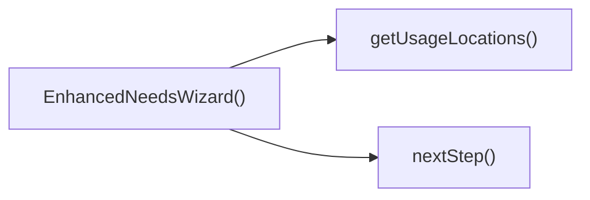

## Genel Bakış
EnhancedNeedsWizard modülü, kullanıcıların ihtiyaçlarını adım adım belirlemelerini sağlayan bir sihirbaz bileşenidir. Bu bileşen, kullanıcı arayüzünü render eder, adımlar arasında ileri ve geri geçişleri yönetir ve ihtiyaç analizinde kullanılacak konum bilgilerini hazırlayan bir yardımcı işlevi içerir.

## Fonksiyon Grupları
### Kullanıcı Arayüzü ve Bileşen Tanımı
Bu grup, modülün görsel yapısını oluşturan ve React bileşenini tanımlayan işlevi içerir.
- EnhancedNeedsWizard

### Adım Geçişi ve Navigasyon Kontrolü
Sihirbazın içindeki adımlar arasında kullanıcı tarafından ileri ve geri hareketleri sağlayan işlevleri barındırır.
- nextStep
- prevStep

### Yardımcı İşlevler
Sihirbazın iş mantığını destekleyen, çeviri fonksiyonu üzerinden kullanım konumlarını elde eden işlevi içerir.
- getUsageLocations

---

## AXIOMS – Mimari Varsayımlar
Bu modül için özel aksiyom tanımlanmamıştır.

[Aksiyom 1]: Eğer `getUsageLocations` fonksiyonuna geçirilen `t` parametresi `(key: string) => string` türünde bir fonksiyon değilse, çeviri işlemi başarısız olur veya fonksiyon beklenmeyen bir değer döndürür.  
[Aksiyom 2]: Eğer `EnhancedNeedsWizard` bileşenine `isOpen` prop'u boolean türünde verilmezse, bileşenin görünürlük durumu (açık/kapalı) beklenen şekilde çalışmayabilir.  
[Aksiyom 3]: Eğer `EnhancedNeedsWizard` bileşenine `onClose` prop'u bir fonksiyon verilmezse, `onClose` tetiklendiğinde çalışma zamanı hatası oluşur.  
[Aksiyom 4]: Eğer `EnhancedNeedsWizard` bileşenine `parentSlug` prop'u string türünde verilmezse, slug tabanlı işlemler (örneğin yönlendirme, filtreleme) beklenmeyen sonuç verebilir.  
[Aksiyom 5]: Eğer `nextStep` veya `prevStep` fonksiyonları bileşenin render edildiği bağlam dışında (örneğin component unmount sonrası) çağrılırsa, durum güncelleme işlemi (setState benzeri) başarısız olabilir ve uyarı/hataya yol açabilir.

---

## FONKSIYON DETAYLARI

### getUsageLocations
**Ne yapar**: Verilen çeviri fonksiyonu `t` kullanılarak kullanım konumlarıyla ilgili metinleri hazırlar veya ilgili veri yapısını doldurur.  
**Nasıl yapar**: `t` parametresi üzerinden anahtar‑değer çevirileri yaparak, kullanım konumlarıyla ilgili dizeleri elde eder; bu işlem sonucunda bir side‑effect (örneğin state güncellemesi) gerçekleşebilir.  
**Parametreler**:
- t: (key: string) => string — Çeviri anahtarını соответствующий çeviriye dönüştüren fonksiyon  
**Dönüş**: Fonksiyonun dönüş tipi belirtilmemiştir; genellikle `void` olarak kabul edilir (bir değer döndürmez).

### EnhancedNeedsWizard
**Ne yapar**: `isOpen`, `onClose` ve `parentSlug` özelliklerini alarak ihtiyaç sihirbazını (wizard) render eden bir React bileşenidir.  
**Nasıl yapar**: Bileşen, `isOpen` durumuna göre sihirbazın görünürlüğünü kontrol eder; `onClose` çağrısıyla sihirbaz kapatılır ve `parentSlug` değeri sihirbaz içeriğinin filtrelenmesi veya bağlam belirlenmesinde kullanılır. İç durum yönetimi (adım geçişleri, form verileri vb.) bileşenin kendi state’i üzerinden yapılır.  
**Parametreler**:
- isOpen: boolean — Sihirbazın açık olup olmadığını belirler  
- onClose: () => void — Sihirbaz kapatıldığında çağrılan geri çağırım fonksiyonu  
- parentSlug: string — Sihirbazın hangi üst kategori veya bağlam içinde çalışacağını tanımlayan tanımlayıcı  
**Dönüş**: `React.FC<EnhancedWizardProps>` türünde bir fonksiyonel bileşen; JSX döndürerek kullanıcı arayüzü üretir.

### nextStep
**Ne yapar**: Sihirbazın mevcut adımını bir ilerletir.  
**Nasıl yapar**: Bileşenin içindeki adım sayacını (step index) bir artırarak sonraki adımı gösterir; gerekirse form doğrulama veya veri kaydetme işlemleri tetiklenebilir.  
**Parametreler**: (yok)  
**Dönüş**: Dönüş tipi belirtilmemiştir; genellikle `void` olarak kabul edilir (bir değer döndürmez).

### prevStep
**Ne yapar**: Sihirbazın mevcut adımını bir geriye alır.  
**Nasıl yapar**: Bileşenin içindeki adım sayacını (step index) bir azaltarak önceki adımı gösterir; gerekirse önceki adımın verilerini yeniden yükler veya form sıfırlama işlemi yapar.  
**Parametreler**: (yok)  
**Dönüş**: Dönüş tipi belirtilmemiştir; genellikle `void` olarak kabul edilir (bir değer döndürmez).

---

## INTERFACES

### WizardState
- `step: WizardStep`
- `usageLocation: 'entrance' | 'cold-storage' | 'industrial' | 'retail' | null`
- `sector: string | null`
- `doorWidth: number`
- `doorHeight: number`
- `windCondition: 'none' | 'light' | 'moderate' | 'strong'`
- `trafficIntensity: 'low' | 'medium' | 'high'`
- `heatingNeeded: 'yes' | 'no' | 'unsure' | null`
- `climateZone: 'cold' | 'moderate' | 'warm' | null`
- `doorFrequency: 'low' | 'medium' | 'high' | null`
- `hasHeating: boolean | null`

### EnhancedWizardProps
- `isOpen: boolean`
- `onClose: () => void`
- `parentSlug: string`

### MatchedProduct extends DomainProduct
- `matchScore: number`
- `matchReason: string`

---

## TYPE ALIASES

### WizardStep
```typescript
type WizardStep = 1 | 2 | 3 | 4 | 5 | 6
```

---

## AST POINTERS

### [N1_NASIL] AST Pointer: C:\Users\alize\venthub-hvac\src\components\category\EnhancedNeedsWizard.tsx::getUsageLocations
- **params**: t: (key: string) => string (çeviri fonksiyonu)
- **ic_degiskenler**:
  - `id` — her lokasyonun benzersiz tanımlayıcısı (entrance, cold-storage, industrial, retail)
  - `title` — lokasyonun görünen başlığı, t() ile çevrilir
  - `description` — lokasyonun açıklaması, t() ile çevrilir veya sabit metin
  - `icon` — lokasyonu temsil eden React ikon bileşeni
  - `tip` — lokasyon için ek ipucu metni
- **Dönüş**: Kullanım lokasyonları listesi (dizi, her elemanı lokasyon nesnesi)

---

### [N2_NASIL] AST Pointer: C:\Users\alize\venthub-hvac\src\components\category\EnhancedNeedsWizard.tsx::EnhancedNeedsWizard
- **params**: isOpen: boolean, onClose: () => void, parentSlug: string
- **ic_degiskenler**:
  - `t` — useI18n hook'undan alınan çeviri fonksiyonu
  - `state` — sihirbazın tüm durumunu tutan nesne: adım numarası, seçilen lokasyon, kapı ölçüleri, rüzgar durumu, trafik yoğunluğu, ısıtma ihtiyacı vb.
  - `setState` — sihirbaz state'ini güncellemek için React useState hook fonksiyonu
  - `matchedProducts` — kullanıcı ihtiyaçlarıyla eşleşen ilk 3 ürünün listesi
  - `setMatchedProducts` — eşleşen ürünler listesini güncelleme fonksiyonu
  - `loading` — ürün eşleştirme işleminin yükleme durumunu tutan boolean
  - `setLoading` — yükleme durumunu güncelleme fonksiyonu
  - `matchProducts` — ürün eşleştirmesi yapan useCallback ile sarılmış async fonksiyon
  - `nextStep` — sihirbazda bir sonraki adıma geçme fonksiyonu
  - `prevStep` — sihirbazda bir önceki adıma dönme fonksiyonu
- **Dönüş**: Modal bileşeni JSX elementi, eğer isOpen false ise null döner

---

### [N3_NASIL] AST Pointer: C:\Users\alize\venthub-hvac\src\components\category\EnhancedNeedsWizard.tsx::nextStep
- **params**: (parametre yok)
- **ic_degiskenler**:
  - `prev` — state'i güncellerken kullanılan önceki sihirbaz durumu nesnesi
  - `prev.step` — önceki adım numarası, 1 artırılarak yeni adım oluşturulur
- **Dönüş**: yok

---

### [N4_NASIL] AST Pointer: C:\Users\alize\venthub-hvac\src\components\category\EnhancedNeedsWizard.tsx::prevStep
- **params**: (parametre yok)
- **ic_degiskenler**:
  - `prev` — state'i güncellerken kullanılan önceki sihirbaz durumu nesnesi
  - `prev.step` — önceki adım numarası, 1 azaltılarak yeni adım oluşturulur
- **Dönüş**: yok

---

### [N5_NASIL] AST Pointer: C:\Users\alize\venthub-hvac\src\components\category\EnhancedNeedsWizard.tsx::matchProducts
- **params**: (parametre yok)
- **ic_degiskenler**:
  - `setLoading` — yükleme durumunu true/false yapmak için kullanılan fonksiyon
  - `data` — Supabase'den dönen aktif ürünlerin ham verisi
  - `error` — Supabase sorgusu sırasında oluşan hata nesnesi
  - `supabase` — Supabase istemcisi, veritabanı sorguları için kullanılır
  - `calculateAirCurtain` — Hava perdesi hesaplamaları yapan harici fonksiyon
  - `state.doorWidth` — kullanıcının girdiği kapı genişliği
  - `state.doorHeight` — kullanıcının girdiği kapı yüksekliği
  - `state.windCondition` — kullanıcının seçtiği rüzgar durumu
  - `state.trafficIntensity` — kullanıcının seçtiği trafik yoğunluğu
  - `state.usageLocation` — kullanıcının seçtiği kullanım lokasyonu
  - `rawProducts` — DbProduct tipine cast edilen Supabase'den gelen ham ürün listesi
  - `domainProducts` — toUIProductList ile UI formatına dönüştürülmüş ürün listesi
  - `scored` — puanlanmış, sıralanmış ve ilk 3 ürüne kesilmiş liste
  - `err` — catch bloğunda yakalanan hata nesnesi
  - `setMatchedProducts` — eşleşen ürünleri state'e kaydetmek için kullanılan fonksiyon
- **Dönüş**: yok (async void)

---

### [N6_NASIL] AST Pointer: C:\Users\alize\venthub-hvac\src\components\category\EnhancedNeedsWizard.tsx::domainProductMapCallback
- **params**: p: DomainProduct (işlenen tekil ürün nesnesi)
- **ic_degiskenler**:
  - `score` — ürünün kullanıcı ihtiyaçlarıyla uyum puanı, başlangıçta 0
  - `reason` — uyum puanının açıklaması, "Kapasite uyumu" olarak sabit
  - `specs` — ürünün teknik özellikleri nesnesi, null olabilecek
  - `pWidth` — ürünün desteklediği maksimum kapı genişliği (metre cinsinden)
  - `pHeight` — ürünün desteklediği maksimum kapı yüksekliği (metre cinsinden)
  - `state.doorWidth` — kullanıcının girdiği kapı genişliği, pWidth ile karşılaştırılır
  - `state.doorHeight` — kullanıcının girdiği kapı yüksekliği, pHeight ile karşılaştırılır
  - `state.heatingNeeded` — kullanıcının ısıtma ihtiyacı durumu, ürün adındaki "ısıtıcı" ifadesiyle kontrol edilir
- **Dönüş**: Orijinal ürün nesnesine eklenmiş matchScore ve matchReason içeren yeni nesne

---

### [N7_NASIL] AST Pointer: C:\Users\alize\venthub-hvac\src\components\category\EnhancedNeedsWizard.tsx::stepChangeEffectCallback
- **params**: (parametre yok)
- **ic_degiskenler**:
  - `state.step` — mevcut sihirbaz adımı, 6 olup olmadığı kontrol edilir
  - `matchProducts` — adım 6 ise tetiklenen ürün eşleştirme fonksiyonu
- **Dönüş**: yok

---

### [N8_NASIL] AST Pointer: C:\Users\alize\venthub-hvac\src\components\category\EnhancedNeedsWizard.tsx::progressStepMapCallback
- **params**: s: number (işlenen adım numarası, 1-6 arası)
- **ic_degiskenler**:
  - `state.step` — mevcut sihirbaz adımı, s ile karşılaştırılarak ilerleme çubuğu stili belirlenir
- **Dönüş**: İlerleme çubuğu tekil hücresi için JSX div elementi

---

### [N9_NASIL] AST Pointer: C:\Users\alize\venthub-hvac\src\components\category\EnhancedNeedsWizard.tsx::usageLocationMapCallback
- **params**: loc: UsageLocation (işlenen tekil lokasyon nesnesi)
- **ic_degiskenler**:
  - `loc.id` — lokasyonun benzersiz tanımlayıcısı, key olarak ve state'e kaydedilir
  - `setState` — seçilen lokasyonu state'e kaydetmek için kullanılan fonksiyon
  - `prev` — state'i güncellerken kullanılan önceki sihirbaz durumu
  - `nextStep` — lokasyon seçimi sonrası bir sonraki adıma geçme fonksiyonu
  - `loc.icon` — lokasyonu temsil eden React ikonu
  - `loc.title` — lokasyonun görünen başlığı
  - `loc.description` — lokasyonun açıklaması
- **Dönüş**: Lokasyon seçim butonu için JSX button elementi

---

### [N10_NASIL] AST Pointer: C:\Users\alize\venthub-hvac\src\components\category\EnhancedNeedsWizard.tsx::matchedProductMapCallback
- **params**: p: MatchedProduct (işlenen tekil eşleşmiş ürün nesnesi)
- **ic_degiskenler**:
  - `p.id` — ürünün benzersiz kimliği, key olarak kullanılır
  - `Routes.product` — ürün detay sayfası rotasını oluşturan fonksiyon
  - `p.slug` — ürünün url slug'i, rota oluşturmak için kullanılır
  - `p.image_url` — ürün görselinin adresi, img etiketine source olarak verilir
  - `p.name` — ürünün adı, görsel alternatif metni ve başlık olarak kullanılır
  - `t` — çeviri fonksiyonu, uyum puanı metnini çevirmek için kullanılır
  - `p.matchScore` — ürünün uyum puanı, ekranda gösterilir
  - `p.brand` — ürünün markası, ekranda gösterilir
- **Dönüş**: Ürün kartı için Next.js Link JSX elementi

---

## ÇAĞRI HARİTASI

### Disariya Cagrilar (Outgoing)
EnhancedNeedsWizard() fonksiyonu, kullanım konumlarını toplamak ve sihirbazın sonraki adımına geçmek için getUsageLocations ve nextStep fonksiyonlarını çağırır.

### Disaridan Cagrilanlar (Incoming)
Veri sağlanmadığı için bu modülü çağıran dış dosya veya fonksiyon bilgisi bulunmamaktadır.

### Ic Ice Fonksiyonlar (Nested)
Yok

---

## DOSYA-İÇİ ÇAĞRI GRAFİĞİ
  EnhancedNeedsWizard() → getUsageLocations()
  EnhancedNeedsWizard() → nextStep()



---

## NODE ID STANDARD

  file: src\components\category\EnhancedNeedsWizard.tsx
  function: src\components\category\EnhancedNeedsWizard.tsx::getUsageLocations
  function: src\components\category\EnhancedNeedsWizard.tsx::EnhancedNeedsWizard
  function: src\components\category\EnhancedNeedsWizard.tsx::nextStep
  function: src\components\category\EnhancedNeedsWizard.tsx::prevStep

---

## DISA AKTARILANLAR (EXPORTS)
  export: EnhancedNeedsWizard
  export: getUsageLocations

---

## BILEŞIM (CONTAINS)
  contains: DomainProduct