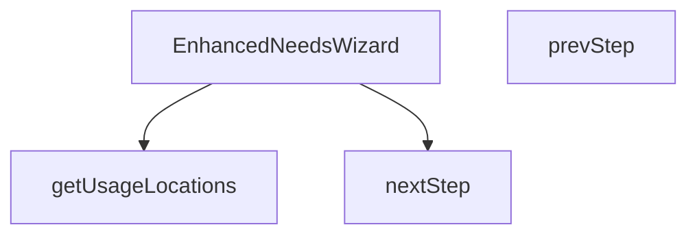

## Genel Bakış
Bu modül, kullanıcıların ihtiyaçlarını adım adım belirlemelerini sağlamak için tasarlanmış bir sihirbaz bileşenidir. Ana işlevi, kullanıcı arayüzünü sunmak, adımlar arasında gezinmeyi yönetmek ve ihtiyaç analizi için gerekli kullanım konumlarını bir yardımcı fonksiyon aracılığıyla temin etmektir.

## Fonksiyon Grupları
### Bileşen Tanımı ve Ana Mantık
Bu grup, modülün merkezi React bileşenini tanımlar; bileşenin dışarıdan aldığı özelliklerle (prop) nasıl çalışacağını ve genel yapısını belirler.
- EnhancedNeedsWizard

### Adım Tabanlı Navigasyon
Sihirbazın farklı aşamaları arasında kullanıcı etkileşimiyle ileri ve geri geçişler yapmayı sağlayan işlevleri kapsar. Bu işlevler bileşenin içindeki adım durumunu günceller.
- nextStep, prevStep

### Yardımcı Veri İşlevi
Sihirbazın adım içeriklerini veya seçeneklerini doldurmak için gereken verileri hazırlayan, çeviri fonksiyonuyla çalışan yardımcı bir işlevdir.
- getUsageLocations

---

## AXIOMS – Mimari Varsayımlar

Bu modül için verilen fonksiyon imzalarına dayanan temel mimari varsayımlar tanımlanmıştır.

**[Aksiyom 1]:** Eğer `onClose` prop'u sağlanmazsa, bileşen kapatılamaz ve kullanıcı sihirbazı kapatma girişiminde bulunamaz.

**[Aksiyom 2]:** Eğer `isOpen` prop'u `false` veya `truthy` bir değer değilse, bileşen UI olarak render edilmez.

**[Aksiyom 3]:** Eğer `parentSlug` prop'u string bir değer değilse, kategori hiyerarşisi ve kullanım konumları doğru şekilde belirlenemez.

**[Aksiyom 4]:** Eğer `nextStep` ve `prevStep` arasında modül içi bir `currentStep` state'i (veya eşdeğeri) mevcut değilse, adım ilerleme ve geri gelme navigasyonu çalışmaz.

**[Aksiyom 5]:** Eğer `getUsageLocations` çağrıldığında `t` parametresi (çeviri fonksiyonu) sağlanmazsa, kullanım konumu metinleri hata ile karşılaşır veya boş döner.

---

## FONKSİYON DETAYLARI

### getUsageLocations
**Ne yapar**: Verilen çeviri fonksiyonu `t` kullanılarak kullanım konumlarıyla ilgili metinleri hazırlar veya ilgili veri yapısını doldurur.  
**Nasıl yapar**: `t` parametresi üzerinden anahtar‑değer çevirileri yaparak, kullanım konumlarıyla ilgili dizeleri elde eder; bu işlem sonucunda bir side‑effect (örneğin state güncellemesi) gerçekleşebilir.  
**Parametreler**:
- t: (key: string) => string — Çeviri anahtarını соответствующий çeviriye dönüştüren fonksiyon  
**Dönüş**: Fonksiyonun dönüş tipi belirtilmemiştir; genellikle `void` olarak kabul edilir (bir değer döndürmez).

### EnhancedNeedsWizard
**Ne yapar**: `isOpen`, `onClose` ve `parentSlug` özelliklerini alarak ihtiyaç sihirbazını (wizard) render eden bir React bileşenidir.  
**Nasıl yapar**: Bileşen, `isOpen` durumuna göre sihirbazın görünürlüğünü kontrol eder; `onClose` çağrısıyla sihirbaz kapatılır ve `parentSlug` değeri sihirbaz içeriğinin filtrelenmesi veya bağlam belirlenmesinde kullanılır. İç durum yönetimi (adım geçişleri, form verileri vb.) bileşenin kendi state’i üzerinden yapılır.  
**Parametreler**:
- isOpen: boolean — Sihirbazın açık olup olmadığını belirler  
- onClose: () => void — Sihirbaz kapatıldığında çağrılan geri çağırım fonksiyonu  
- parentSlug: string — Sihirbazın hangi üst kategori veya bağlam içinde çalışacağını tanımlayan tanımlayıcı  
**Dönüş**: `React.FC<EnhancedWizardProps>` türünde bir fonksiyonel bileşen; JSX döndürerek kullanıcı arayüzü üretir.

### nextStep
**Ne yapar**: Sihirbazın mevcut adımını bir ilerletir.  
**Nasıl yapar**: Bileşenin içindeki adım sayacını (step index) bir artırarak sonraki adımı gösterir; gerekirse form doğrulama veya veri kaydetme işlemleri tetiklenebilir.  
**Parametreler**: (yok)  
**Dönüş**: Dönüş tipi belirtilmemiştir; genellikle `void` olarak kabul edilir (bir değer döndürmez).

### prevStep
**Ne yapar**: Sihirbazın mevcut adımını bir geriye alır.  
**Nasıl yapar**: Bileşenin içindeki adım sayacını (step index) bir azaltarak önceki adımı gösterir; gerekirse önceki adımın verilerini yeniden yükler veya form sıfırlama işlemi yapar.  
**Parametreler**: (yok)  
**Dönüş**: Dönüş tipi belirtilmemiştir; genellikle `void` olarak kabul edilir (bir değer döndürmez).

---

## INTERFACES

### WizardState
- `step: WizardStep`
- `usageLocation: 'entrance' | 'cold-storage' | 'industrial' | 'retail' | null`
- `sector: string | null`
- `doorWidth: number`
- `doorHeight: number`
- `windCondition: 'none' | 'light' | 'moderate' | 'strong'`
- `trafficIntensity: 'low' | 'medium' | 'high'`
- `heatingNeeded: 'yes' | 'no' | 'unsure' | null`
- `climateZone: 'cold' | 'moderate' | 'warm' | null`
- `doorFrequency: 'low' | 'medium' | 'high' | null`
- `hasHeating: boolean | null`

### EnhancedWizardProps
- `isOpen: boolean`
- `onClose: () => void`
- `parentSlug: string`

### MatchedProduct extends DomainProduct
- `matchScore: number`
- `matchReason: string`

---

## TYPE ALIASES

### WizardStep
```typescript
type WizardStep = 1 | 2 | 3 | 4 | 5 | 6
```

---

## AST POINTERS

### [N1_NASIL] AST Pointer: src/components/category/EnhancedNeedsWizard.tsx::getUsageLocations
- **params**: `t: (key: string) => string` — i18n çeviri fonksiyonu, anahtar karşılığında localized metin döndürür
- **ic_degiskenler**:
  _(fonksiyon gövdesinde değişken tanımlanmamıştır, doğrudan literal array döndürülür)_
- **Dönüş**: Array<{ id: string, title: string, description: string, icon: ComponentType, tip: string }> — 4 kullanım alanı nesnesi (entrance, cold-storage, industrial, retail)

---

### [N2_NASIL] AST Pointer: src/components/category/EnhancedNeedsWizard.tsx::EnhancedNeedsWizard
- **params**:
  - `isOpen: boolean` — dialogun açık olup olmadığını belirler, false ise null döner (render engellenir)
  - `onClose: () => void` — dialog kapatma callback'i, backdrop ve X butonuna bağlıdır
  - `parentSlug: string` — üst kategori slug'ı, supabase ürün sorgusunda `category_slugs` filtresi olarak kullanılır
- **ic_degiskenler**:
  - `t` — `useI18n()` hook'undan dönen çeviri fonksiyonu, tüm UI metinleri bu fonksiyonla çekilir
  - `state` — `useState<WizardState>` ile tanımlanan sihirbaz durumu nesnesi; `step` (mevcut adım, 1-6), `usageLocation` (seçilen kullanım alanı), `sector`, `doorWidth` (kapı genişliği, default 1.0), `doorHeight` (kapı yüksekliği, default 2.2), `windCondition` (rüzgar durumu), `trafficIntensity` (yoğunluk), `heatingNeeded` (ısıtma ihtiyacı: yes/no/unsure), `climateZone`, `doorFrequency`, `hasHeating` alanlarını içerir
  - `matchedProducts` — `useState<MatchedProduct[]>([])` ile tanımlanan eşleşen ürün listesi, step 6'da `matchProducts` tarafından doldurulur
  - `loading` — `useState<boolean>(false)` ile tanımlanan yükleme durumu flag'i, supabase isteği sırasında true olur
  - `matchProducts` — `useCallback` ile sarılmış asenkron ürün eşleştirme fonksiyonu; supabase'den aktif ürünleri çeker, `calculateAirCurtain` ile hesaplama yapar, ürünleri kapı boyutu ve ısıtma tercihine göre puanlayarak en iyi 3'ünü `matchedProducts` state'ine yazar
  - `nextStep` — inner fonksiyon: `state.step` değerini 1 artırarak state'i günceller
  - `prevStep` — inner fonksiyon: `state.step` değerini 1 azaltarak state'i günceller
- **Dönüş**: React JSX element (dialog UI) — isOpen false ise `null` döner; step 1'de kullanım alanı seçimi, step 2'de kapı boyutları, step 3'te ısıtma tercihi, step 6'da eşleşen ürün kartları render edilir

---

### [N3_NASIL] AST Pointer: src/components/category/EnhancedNeedsWizard.tsx::nextStep
- **params**: _(parametre yok)_
- **ic_degiskenler**:
  _(fonksiyon gövdesinde değişken tanımlanmamıştır)_
- **Dönüş**: yok — `setState` çağrısıyla `state.step` değerini mevcut değer + 1 olarak günceller (side effect: wizard bir sonraki adıma geçer)

---

### [N4_NASIL] AST Pointer: src/components/category/EnhancedNeedsWizard.tsx::prevStep
- **params**: _(parametre yok)_
- **ic_degiskenler**:
  _(fonksiyon gövdesinde değişken tanımlanmamıştır)_
- **Dönüş**: yok — `setState` çağrısıyla `state.step` değerini mevcut değer - 1 olarak günceller (side effect: wizard bir önceki adıma döner)

---


## MERMAID CALL GRAPH


## NODE ID STANDARD

  file: src\components\category\EnhancedNeedsWizard.tsx
  function: src\components\category\EnhancedNeedsWizard.tsx::getUsageLocations
  function: src\components\category\EnhancedNeedsWizard.tsx::EnhancedNeedsWizard
  function: src\components\category\EnhancedNeedsWizard.tsx::nextStep
  function: src\components\category\EnhancedNeedsWizard.tsx::prevStep

---

## DISA AKTARILANLAR (EXPORTS)
  export: EnhancedNeedsWizard
  export: getUsageLocations

---

## BILEŞIM (CONTAINS)
  contains: DomainProduct

---

## STİL TOKENLERİ

### Arbitrary Değerler (token'a geçirilmemiş)
Yok — tüm stiller token'a geçirilmiş. ✅

### Kullanılan Token'lar (zaten token'a geçirilmiş)
- `rounded-hvac-2xl`

### Tailwind Sınıf Özeti
- **Renkler:** `accent-cyan-500`, `bg-cyan-500`, `bg-slate-100`, `bg-slate-200`, `bg-slate-50`, `bg-slate-50/50`, `bg-slate-900/60`, `bg-slate-950`, `bg-white`, `border-b`, `border-none`, `border-slate-100`, `border-slate-200`, `group-hover:bg-cyan-500`, `group-hover:text-white`
- **Layout:** `absolute`, `backdrop-blur-xl`, `block`, `custom-scrollbar`, `fixed`, `flex`, `flex-1`, `flex-col`, `gap-1`, `gap-12`, `gap-3`, `gap-4`, `gap-6`, `grid`, `grid-cols-1`
- **Varyant/Responsive:** `:`, `group-hover:`, `hover:`, `md:`, `sm:` önekleri
- **Yardımcı Sınıflar:** `${s`, `:`, `<=`, `animate-in`, `animate-pulse`, `appearance-none`, `aspect-square`, `border`, `cursor-default`, `cursor-pointer`, `duration-500`, `fade-in`, `focus-ring`, `font-black`, `font-bold`