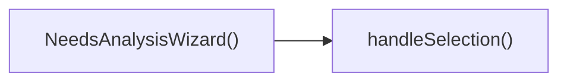

## Genel Bakış
NeedsAnalysisWizard, kullanıcıların ihtiyaç analizi adımlarında seçim yapmasını sağlayan bir React bileşenidir. Bileşen, dışarıdan gelen `onFilterChange` geri çağrısıyla seçilen değerleri üst bileşene iletir ve `handleSelection` fonksiyonu ile kullanıcı etkileşimlerini yönetir.

## Fonksiyon Grupları
### Bileşen Tanımı
Bu grup, bileşenin temel yapısını ve render mantığını içerir.
- NeedsAnalysisWizard

### Etkileşim İşleyici
Bu grup, kullanıcı seçimlerini yakalayıp ilgili geri çağrısını tetikleyen mantığı barındırır.
- handleSelection

---

## AXIOMS – Mimari Varsayımlar
Bu modül, `onFilterChange` propunun bir fonksiyon ve `handleSelection` metodunun doğru tipte parametrelerle çağrılmasını varsayar.

[Aksiyom 1]: Eğer `onFilterChange` propu bir fonksiyon değilse, bileşen bu fonksiyonu çağırırken çalışma zamanında `TypeError` alır.  
[Aksiyom 2]: Eğer `handleSelection` metodu `key` parametresi olarak string olmayan bir değer alırsa, TypeScript çalışma zamanı tip kontrolü (veya derleme hatası) ile işlem başarısız olur.  
[Aksiyom 3]: Eğer `handleSelection` metodu `value` parametresi olarak `string` veya `number` dışındaki bir tip alırsa, aynı şekilde tip uyumsuzluğu nedeniyle hata oluşur.  
[Aksiyom 4]: Eğer `onFilterChange` propu tanımlı değilse (`undefined`), propun kullanılması sırasında `undefined is not a function` hatası alınır.

---

## FONKSIYON DETAYLARI

### NeedsAnalysisWizard
**Ne yapar**: Kullanıcının ihtiyaç analizi sürecini adım adım yönlendiren bir sihirbaz bileşeni render eder.  
**Nasıl yapar**: `onFilterChange` geri çağrısını prop olarak alır ve iç durumunu yöneterek her adımda kullanıcı girdilerini toplar; filtreden veya seçeneklerden bir değişiklik olduğunda bu geri çağrüyü tetikler.  
**Parametreler**:  
- onFilterChange: function — Kullanıcı tarafından yapılan filtremeler veya seçenek değişiklikleri olduğunda dışarıya bildirmek için çağrılan geri çağırım fonksiyonu  
**Dönüş**: `React.FC<NeedsAnalysisWizardProps>` türünde bir React fonksiyon bileşeni; JSX döndürerek arayüzü oluşturur.

### handleSelection
**Ne yapar**: Kullanıcının bir öğe seçtiğinde ilgili anahtar‑değer çiftini işleyerek bileşenin durumunu günceller.  
**Nasıl yapar**: `key` parametresi ile hangi alanın güncelleneceğini belirler, `value` parametresi ise seçilen değeri alır; ardından bu bilgiyi yerel state veya context üzerinden günceller ve gerekirse diğer işlemleri tetikler.  
**Parametreler**:  
- key: string — Güncellenecek state veya context alanının adı  
- value: string | number — Seçilen öğenin değeri; metin veya sayı olabilir  
**Dönüş**: Fonksiyon bir değer döndürmez; dönüş tipi `void` (veya `undefined`) olarak kabul edilir.

---

## INTERFACES

### NeedsAnalysisWizardProps
- `onFilterChange: (filters: { maxHeight?: number; heating?: string; type?: string }) => void`

---

## AST POINTERS

### [N1_NASIL] AST Pointer: src/components/category/NeedsAnalysisWizard.tsx::NeedsAnalysisWizard
- **params**: (onFilterChange)
- **ic_degiskenler**:
  - `t` — translation function from useI18n, used to translate UI strings.
  - `step` — state variable tracking current wizard step (1‑3).
  - `setStep` — setter function to update the step state.
  - `selections` — state object storing user selections for maxHeight, heating, and type.
  - `setSelections` — setter to update the selections state.
  - `isOpen` — boolean state indicating whether the wizard dialog is open.
  - `setIsOpen` — setter to toggle the isOpen state.
  - `handleSelection` — function that updates selections and advances wizard steps based on user choice.
- **Dönüş**: JSX.Element (the rendered wizard UI)

### [N2_NASIL] AST Pointer: src/components/category/NeedsAnalysisWizard.tsx::handleSelection
- **params**: (key: string, value: string | number)
- **ic_degiskenler**:
  - `valStr` — string conversion of value for consistent storage in selections.
  - `newSelections` — shallow copy of selections state with the updated key‑value pair.
  - `selections` — current selections state (read to copy into newSelections).
  - `setSelections` — state setter to persist the updated selections.
  - `setStep` — state setter to advance the wizard step based on the key.
  - `onFilterChange` — callback prop to notify parent of the final filter when type is selected.
  - `setIsOpen` — state setter to close the wizard dialog after completion.
- **Dönüş**: yok (void)

### [N3_NASIL] AST Pointer: src/components/category/NeedsAnalysisWizard.tsx::mapCallback (h => …)
- **params**: (h)
- **ic_degiskenler**:
  - `handleSelection` — function to update maxHeight selection and advance the step.
  - `t` — translation function for UI strings.
- **Dönüş**: JSX.Element (button element representing a height option)

---

## Çağrı Haritası

### Disariya Çağrılar (Outgoing)
- **NeedsAnalysisWizard()** fonksiyonu, kullanıcı tarafından yapılan seçimi işlemek için **handleSelection** fonksiyonunu çağırır.

### Disarından Çağrılanlar (Incoming)
- Verilen veri setinde bu modülü çağıran dış bir fonksiyon veya modül belirtilmediği için dışarıdan çağrılan bilgi bulunmamaktadır.

### İç İçe Fonksiyonlar (Nested)
- Yok

---

## DOSYA-İÇİ ÇAĞRI GRAFİĞİ
  NeedsAnalysisWizard() → handleSelection()

---

## NODE ID STANDARD

  file: src\components\category\NeedsAnalysisWizard.tsx
  function: src\components\category\NeedsAnalysisWizard.tsx::NeedsAnalysisWizard
  function: src\components\category\NeedsAnalysisWizard.tsx::handleSelection

---

## DISA AKTARILANLAR (EXPORTS)
  export: NeedsAnalysisWizard