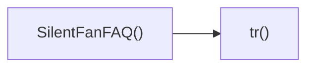

## Genel Bakış
Bu modül, sessiz fan kategorisiyle ilgili sık sorulan sorular (FAQ) içeriğini gösteren bir React bileşeni tanımlar. Ayrıca, içerik içinde kullanılan metinlerin çevirilerini sağlayan basit bir yardımcı fonksiyon içerir.

## Fonksiyon Grupları
### Bileşen Tanımı
Kullanıcı arayüzünde silent‑fan bölümünün FAQ kısmını render eden ana bileşeni oluşturur.
- SilentFanFAQ

### Yerelleştirme Yardımcı
Bileşen içindeki sabit metinlerin farklı dillere çevrilmesini kolaylaştıran bir çeviri işlevi sağlar.
- tr

---

## AXIOMS – Mimari Varsayımlar
Bu modül için özel aksiyom tanımlanmamıştır.

---

## FONKSIYON DETAYLARI

### SilentFanFAQ
**Ne yapar**: SilentFan ürünüyle ilgili sık sorulan soruların (FAQ) bölümünü render eden bir React fonksiyonel bileşenidir.  
**Nasıl yapar**: Bileşen içeriği, genellikle bir `
` veya `<section>` içinde soru‑cevap çiftlerini içeren JSX döndürür; stil ve düzenleme dışarıdan aktarılan CSS veya stil kütüphaneleriyle sağlanır.  
**Parametreler**:  
- (parametre yok)  
**Dönüş**: `React.FC` türünde bir fonksiyonel bileşen; JSX elementi döndürerek UI'ya entegrasyon sağlar.

### tr
**Ne yapar**: Verilen bir çeviri anahtarına karşılık gelen yerelleştirilmiş metni elde etmek için kullanılan bir yardımcı fonksiyondur.  
**Nasıl yapar**: Fonksiyon, `key` parametresini bir çeviri sözlüğü veya i18n sağlayıcıyla eşleştirerek ilgili dizeyi bulur; bulununun sonucu genellikle bileşen metni olarak ayarlanır veya doğrudan döndürülür.  
**Parametreler**:  
- `key`: string — çevrilecek metnin anahtar kimliği.  
**Dönüş**: Açıklama dokümantasyonda dönüş tipi belirtilmemiştir; genellikle `void` (yan etkili bir güncelleme) veya çevrilen `string` döndürülebilir. Gerçek dönüş tipi projeye özel i18n yapılandırmasına bağlıdır.

---

## AST POINTERS

### [N1_NASIL] AST Pointer: src/components/category/sections/silent-fan/SilentFanFAQ.tsx::SilentFanFAQ
- **params**: (parametre yok)
- **ic_degiskenler**:
  - `t` — çeviri fonksiyonu, useI18n hookundan elde edilen i18n çeviri işlevi.
  - `dict` — i18n sözlüğü nesnesi, categorySilentFan.faq.items gibi çeviri verilerini içerir.
  - `sectionRef` — bölüm öğesine bağlanacak ref, useScrollAnimation ile scroll tabanlı animasyon için kullanılır.
  - `isVisible` — bölümün görünürlüğünü gösteren boolean değer, useScrollAnimation tarafından sağlanır.
  - `openIndex` — şu anda açık olan FAQ öğesinin indeksi (kapalıysa null) tutan useState durumu.
  - `setOpenIndex` — openIndex durumunu güncelleyen setter fonksiyonu.
  - `tr` — kategori özelı FAQ çeviri anahtarını oluşturan yardımcı fonksiyon, `categorySilentFan.faq.` öneki ekler.
  - `items` — dict.categorySilentFan.faq.items çeviri verisi, tanımlı değilse boş dizi.
- **Dönüş**: JSX elementi (React.FC) — tüm FAQ bölümünü render eden section öğesi.

### [N2_NASIL] AST Pointer: src/components/category/sections/silent-fan/SilentFanFAQ.tsx::tr
- **params**: key: string
- **ic_degiskenler**:
  - (yok) — fonksiyon gövdesinde yeni bir değişken tanımlanmaz; t dışarıdaki kapsamdan kapatılır.
- **Dönüş**: string — `categorySilentFan.faq.{key}` anahtarına karşılık gelen çevrilen metin.

### [N3_NASIL] AST Pointer: src/components/category/sections/silent-fan/SilentFanFAQ.tsx::map callback
- **params**: item: { q: string; a: string }, index: number
- **ic_degiskenler**:
  - `isOpen` — boolean, verilen index'in openIndex durumuyla eşleşip eşleşmediğini kontrol eder; true ise ilgili FAQ açıktır.
- **Dönüş**: JSX elementi — tek bir FAQ öğesini (başlık butonu ve içerik paneli) render eden div.

---

## ÇAĞRI HARİTASI

### Disariya Cagrilar (Outgoing)
- `SilentFanFAQ()` fonksiyonu, `tr` fonksiyonunu çağırır (muhtemelen çeviri veya metin dönüşümü işlemi için).

### Disaridan Cagrilanlar (Incoming)
- Bu modülü çağıran dış fonksiyon veya dosya bulunmamaktadır.

### Ic Ice Fonksiyonlar (Nested)
- Yok

---

## DOSYA-İÇİ ÇAĞRI GRAFİĞİ
  SilentFanFAQ() → tr()

---

## NODE ID STANDARD

  file: src\components\category\sections\silent-fan\SilentFanFAQ.tsx
  function: src\components\category\sections\silent-fan\SilentFanFAQ.tsx::SilentFanFAQ
  function: src\components\category\sections\silent-fan\SilentFanFAQ.tsx::tr

---

## DISA AKTARILANLAR (EXPORTS)
  export: SilentFanFAQ