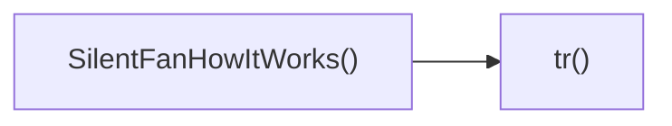

## Genel Bakış
Bu modül, sessiz fanların çalışma prensiplerini açıklayan bir bileşen sunar. `SilentFanHowItWorks` fonksiyonu, kullanıcı arayüzünü oluştururken `tr` fonksiyonu ile metinlerin çevirisi sağlanır, böylece içerik farklı dillerde dinamik olarak gösterilebilir.

## Fonksiyon Grupları
### Bileşen Renderlama
Kullanıcı arayüzünü oluşturan ve sessiz fanların nasıl çalıştığını görsel ve metinsel olarak gösteren ana işlev.
- SilentFanHowItWorks

### Çeviri Yardımı
Bileşen içindeki sabit metinlerin farklı dillere çevrilmesini sağlayan yardımcı işlev.
- tr

---

## AXIOMS – Mimari Varsayımlar
Bu modül için özel aksiyom tanımlanmamıştır.

---

## FONKSIYON DETAYLARI

### SilentFanHowItWorks
**Ne yapar**: Silent fan'ın çalışma prensibini açıklayan bir React bileşeni render eder.  
**Nasıl yapar**: Bileşen, JSX ile fanın sessiz çalışma mekanizmasını gösteren metin, görsel veya animasyon içeriği döndürür; dışarıdan prop almaz ve varsayılan olarak export edilir.  
**Parametreler**: (yok)  
**Dönüş**: React.FC türünde bir fonksiyon döndürür; bu fonksiyon render edildiğinde JSX elementi üretir.

### tr
**Ne yapar**: Verilen çeviri anahtarına karşılık gelen metni bulup uygulama içinde kullanmaya hazırlar (örneğin i18n fonksiyonu).  
**Nasıl yapar**: Anahtar string'i alır, çeviri dosyalarında veya context'te arar ve eşleşen değeri bulursa ilgili UI elemanına inject eder; dönüş tipi belirsiz olduğu için net bir değer döndürüp döndürmediği belirtilmez.  
**Parametreler**:  
- key: string — çevrilecek metnin anahtar kimliği  
**Dönüş**: Belirtilmemiş (void veya bilinmeyen tip); fonksiyonun bir değer döndürüp döndürmediği net değil.

---

## AST POINTERS

### [N1_NASIL] AST Pointer: src/components/category/sections/silent-fan/SilentFanHowItWorks.tsx::SilentFanHowItWorks
- **params**: (parametre yok)
- **ic_degiskenler**:
  - `t` — `useI18n` hookundan dönen çeviri fonksiyonu; `tr` içinde ve JSX'te `String(tr(...))` çağrısı için kullanılır.
  - `dict` — `useI18n` hookundan dönen çeviri nesnesi; `dict.categorySilentFan.howItWorks.steps` erişimi için kullanılır.
  - `sectionRef` — `useScrollAnimation` hookundan dönen ref; `<section>` elementiyle scroll animasyonu bağlamak için `ref` olarak kullanılır.
  - `isVisible` — `useScrollAnimation` hookundan dönen boolean; section'in görünürlüğüne göre `scrollAnimationClasses.slideRight` ve `slideLeft` sınıflarını uygulamak için kullanılır.
  - `tr` — yerel çeviri助手 fonksiyonu; `categorySilentFan.howItWorks` alt anahtarına göre `t` fonksiyonunu sarmalar ve JSX'te `String(tr('eyebrow'))`, `String(tr('title'))`, `String(tr('subtitle'))` gibi çağrılarda kullanılır.
  - `icons` — `[Microscope, Wind, ShieldCheck]` dizisi; `steps.map` içinde `index % icons.length` ile ikon seçimi için kullanılır.
  - `steps` — `dict.categorySilentFan.howItWorks.steps` veya boş dizi; her adımın başlığı ve açıklamasını renderlemek için `steps.map` ile iterate edilir.
- **Dönüş**: JSX.Element (bölümün tamamını render eden JSX)

### [N2_NASIL] AST Pointer: src/components/category/sections/silent-fan/SilentFanHowItWorks.tsx::tr
- **params**: `(key: string)`
- **ic_degiskenler**: (yok)
- **Dönüş**: string (i18n tarafından çevrilen metin)

### [N3_NASIL] AST Pointer: src/components/category/sections/silent-fan/SilentFanHowItWorks.tsx::steps.map callback
- **params**: `(step: {title: string; description: string}, index: number)`
- **ic_degiskenler**:
  - `Icon` — `icons[index % icons.length]` ile seçilen ikon bileşeni; JSX'te `<Icon className="text-blue-400" size={24} />` ile render edilir.
- **Dönüş**: JSX.Element (her adım için flex container div)

---

## Çağrı Haritası

### Dışarıya Çağrılar (Outgoing)
- `SilentFanHowItWorks()` fonksiyonu, çeviri veya metin dönüşüm işlevi olan `tr()` fonksiyonunu çağırır (muhtemelen bir dizi çeviri veya yerelleştirme amaçlı).

### Dışarından Çağrılanlar (Incoming)
- Bu modülü çağıran dış dosya veya fonksiyon bulunmamaktadır (veri sağlanmadı).

### İç İçe Fonksiyonlar (Nested)
- Yok

---

## DOSYA-İÇİ ÇAĞRI GRAFİĞİ
  SilentFanHowItWorks() → tr()

---

## NODE ID STANDARD

  file: src\components\category\sections\silent-fan\SilentFanHowItWorks.tsx
  function: src\components\category\sections\silent-fan\SilentFanHowItWorks.tsx::SilentFanHowItWorks
  function: src\components\category\sections\silent-fan\SilentFanHowItWorks.tsx::tr

---

## DISA AKTARILANLAR (EXPORTS)
  export: SilentFanHowItWorks