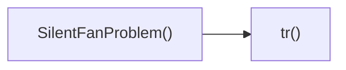

## Genel Bakış
Bu modül, sessiz fan kategorisiyle ilgili bir sorun bildirim bölümünü gösteren bir React bileşeni içerir. Ayrıca, kullanıcı arayüzündeki metinlerin çevirilerini sağlayan küçük bir yardımcı fonksiyon bulunur.

## Fonksiyon Grupları
### Kullanıcı Arayüzü Bileşeni
Kategori sayfasındaki sessiz fan sorunlarını listeleyen ve görüntüleyen ana bileşeni tanımlar.
- SilentFanProblem

### Çeviri Yardımcısı
Bileşen içinde kullanılan sabit metinlerin farklı dillere çevrilmesini yönetir.
- tr

---

## AXIOMS – Mimari Varsayımlar
Bu modül için özel aksiyom tanımlanmamıştır.

[Aksiyom 1]: Eğer `SilentFanProblem()` fonksiyonu çağrılmazsa, bileşen render edilmez ve ekrana hiçbir çıktı üretilmez.  
[Aksiyom 2]: Eğer `tr` fonksiyonuna string tipinde olmayan bir argüman geçilirse, TypeScript derleme hatası oluşur.

---

## FONKSIYON DETAYLARI

### SilentFanProblem
**Ne yapar**: SilentFanProblem, silent fan (sessiz fan) ile ilgili sorunları gösteren bir React bileşenidir.  
**Nasıl yapar**: Bileşen, JSX döndürerek kullanıcı arayüzüne ilgili bilgileri, uyarıları veya çözüm önerilerini yerleştirir.  
**Parametreler**:  
- (parametre yok)  
**Dönüş**: React.FC türünde bir fonksiyon döndürür; bu fonksiyon render edildiğinde bileşenin UI çıktısını üretir.

### tr
**Ne yapar**: tr fonksiyonu, verilen bir anahtar (key) ile çeviri veya yerelleştirme metnini elde etmek için kullanılır.  
**Nasıl yapar**: Fonksiyon, key parametresini alarak çeviri tablosundan veya i18n kaynağından ilgili dizeyi bulur ve genellikle bu değeri bir state güncellemesi, bir özellik değeri veya bir side‑effect ile kullanır.  
**Parametreler**:  
- key: string — çevrilecek metnin anahtar kimliği  
**Dönüş**: Fonksiyonun dönüş tipi belirsiz (void veya bilinmiyor); genellikle bir değer döndürmez, yerine yan etkiler üzerinden çeviri işlemini gerçekleştirir.

---

## INTERFACES

### PainPoint
- `title: string`
- `description: string`

---

## AST POINTERS

### [N1_NASIL] AST Pointer: src/components/category/sections/silent-fan/SilentFanProblem.tsx::SilentFanProblem
- **params**: (parametre yok)
- **ic_degiskenler**:
  - `t` — çeviri fonksiyonu, useI18n'den gelir; kategoriSilentFan.problem alanındaki çevirileri almak için kullanılır.
  - `dict` — i18n sözlüğü nesnesi; tüm çevirileri içerir, `dict.categorySilentFan.problem` ile problem bölümü verilerine erişim sağlar.
  - `sectionRef` — bölüm elementine bağlanan ref; useScrollAnimation ile scroll‑tabanlı animasyonları tetiklemek için kullanılır.
  - `isVisible` — bölümün şu anda viewport içinde görünür olup olmadığını gösteren boolean; `scrollAnimationClasses.fadeUp(isVisible)` ile animasyon sınıflarını kontrol eder.
  - `tr` — pomoclı fonksiyon; verilen anahtarın önüne `categorySilentFan.problem.` ekleyip `t` ile çeviri döndürür.
  - `pDict` — `dict.categorySilentFan.problem` kısaltması; painPoints, visual.withoutPoints, visual.withPoints gibi tüm problem bölümü verilerine hızlı erişim sağlar.
  - `icons` — `[VolumeX, Zap, Activity, Info]` Lucide ikonlarının dizisi; her pain point kartı için sırayla ikon seçmek için kullanılır.
  - `colors` — metin ve arka plan CSS sınıflarını tanımlayan nesneler dizisi; her pain point kartına farklı renk teması (mavi, turuncu, mor, pembe) uygulanmasını sağlar.
  - `painPoints` — `pDict.painPoints` veya boş dizin; her birinin `title` ve `description` alanlarını taşıyan pain point nesnelerinin listesi; kartları render etmek için `.map` ile iterate edilir.
- **Dönüş**: React.FC (JSX döndüren fonksiyonel bileşen)

### [N2_NASIL] AST Pointer: src/components/category/sections/silent-fan/SilentFanProblem.tsx::tr
- **params**: `key: string`
- **ic_degiskenler**: (yok)
- **Dönüş**: yok (fonksiyon sadece çeviri dizesini döndürür, ancak imzada `void` olarak belirtilmiştir)

### [N3_NASIL] AST Pointer: src/components/category/sections/silent-fan/SilentFanProblem.tsx::painPoints.map callback
- **params**: `point: PainPoint, index: number`
- **ic_degiskenler**:
  - `Icon` — `icons[index % icons.length]` ile seçilen Lucide ikon bileşeni; kartın üst kısmında gösterilir.
  - `color` — `colors[index % colors.length]` ile seçilen renk nesnesi; kartın arka plan ve ikon rengini belirler.
- **Dönüş**: JSX.Element (tek bir pain point kartı)

### [N4_NASIL] AST Pointer: src/components/category/sections/silent-fan/SilentFanProblem.tsx::visual.withoutPoints.map callback
- **params**: `p, i`
- **ic_degiskenler**: (yok)
- **Dönüş**: JSX.Element (tek bir "without" liste öğesi; kırmızı nokta ve metin)

### [N5_NASIL] AST Pointer: src/components/category/sections/silent-fan/SilentFanProblem.tsx::visual.withPoints.map callback
- **params**: `p, i`
- **ic_degiskenler**: (yok)
- **Dönüş**: JSX.Element (tek bir "with" liste öğesi; mavi nokta ve metin)

---

## ÇAĞRI HARİTASI

### Disariya Cagrilar (Outgoing)
- **SilentFanProblem()** → `tr` fonksiyonunu çağırır (muhtemelen çeviri veya metin dönüşümü için).

### Disaridan Cagrilanlar (Incoming)
- Bu modülü çağıran dış fonksiyon veya dosya bulunmamaktadır. (**Yok**)

### Ic Ice Fonksiyonlar (Nested)
- İç içe fonksiyon tanımlanmamıştır. (**Yok**)

---

## DOSYA-İÇİ ÇAĞRI GRAFİĞİ
  SilentFanProblem() → tr()

---

## NODE ID STANDARD

  file: src\components\category\sections\silent-fan\SilentFanProblem.tsx
  function: src\components\category\sections\silent-fan\SilentFanProblem.tsx::SilentFanProblem
  function: src\components\category\sections\silent-fan\SilentFanProblem.tsx::tr

---

## DISA AKTARILANLAR (EXPORTS)
  export: SilentFanProblem