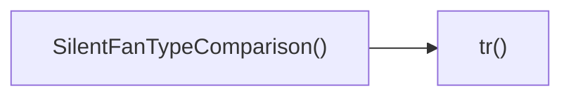

## Genel Bakış
Bu modül, sessiz fan türlerini karşılaştıran bir bileşeni tanımlar ve içerikte kullanılan metinlerin çevirisi için yardımcı bir işlev sağlar. Bileşen, kullanıcıya farklı fan tiplerinin özelliklerini gösterirken, çeviri fonksiyonu arayüzdeki metinlerin dinamik olarak değiştirilmesini mümkün kılar.

## Fonksiyon Grupları
### Görüntüleme ve Kullanıcı Arayüzü
Bileşenin ana işlevi, sessiz fan türlerinin karşılaştırılmasını sunan bir React bileşeni oluşturmaktır.
- SilentFanTypeComparison

### Çeviri ve Yerelleştirme
Arayüzdeki sabit metinlerin farklı dillere çevrilmesini sağlayan basit bir yardımcı işlevi içerir.
- tr

---

## AXIOMS – Mimari Varsayımlar
Bu modülün fonksiyon imzalara dayalı aksiyomları aşağıda verilmiştir.

**SilentFanTypeComparison()**: Eğer fonksiyona bir veya daha fazla argüman geçirilirse, TypeScript tip hatası oluşur (fonksiyon imzası parametre beklememektedir).

**tr(key: string)**: Eğer `key` parametresi string türünde değilse veya eksik verilirse, TypeScript tip hatası olur (fonksiyon zorunlu bir `string` tipinde `key` parametresi bekler).

---

## FONKSIYON DETAYLARI

### SilentFanTypeComparison
**Ne yapar**: React functional component olarak, silent fan türlerinin karşılaştırılmasını gösteren bir kullanıcı arayüzü oluşturur.  
**Nasıl yapar**: Bileşen içeriğinde JSX döndürerek, fan türlerinin özelliklerini (örneğin ses seviyesi, verimlilik, fiyat) listeleyen veya tablo halinde sunulan öğeleri renderlar.  
**Parametreler**:  
- (parametre yok)  
**Dönüş**: React.FC tipinde bir işlev döndürür; bu işlev render edildiğinde ekrana JSX çıktısı üretir.

### tr
**Ne yapar**: Verilen string anahtarıyla ilgili bir işlem gerçekleştirir; fonksiyonun amacı ve iç detayları belgelenmemiştir.  
**Nasıl yapar**: `key` parametresini alır ve bu anahtar üzerinden bir değer elde eder veya bir eylem gerçekleştirir; dönüş tipi belirtilmemiş olduğu için net bir sonuç açıklaması yapılamaz.  
**Parametreler**:  
- key: string — işleme konu olan anahtar metni  
**Dönüş**: Belirtilmemiş (void veya bilinmeyen tip); dönüş değeri dokümantasyonda net olarak tanımlanmamıştır.

---

## AST POINTERS

### [N1_NASIL] AST Pointer: src/components/category/sections/silent-fan/SilentFanTypeComparison.tsx::SilentFanTypeComparison
- **params**: (parametre yok)
- **ic_degiskenler**: 
  - `t` — çeviri fonksiyonu, i18n'den gelen t kullanılarak anahtarları çevirir.
  - `dict` — i18n sağladığı çeviri sözlüğü nesnesi; categorySilentFan.comparison.features gibi verilere erişim sağlar.
  - `sectionRef` — section elementi için React ref; useScrollAnimation ile görünürlük animasyonu bağlanır.
  - `isVisible` — useScrollAnimation tarafından döndürülen boolean; section görünür olduğunda true, aksi takdirde false.
  - `tr` — yerel çeviri助手 fonksiyonu; anahtar ön ekini categorySilentFan.comparison. olarak ekleyerek t'yi çağırır.
  - `features` — dict.categorySilentFan.comparison.features dizisi; karşılaştırılacak özelliklerin listesi, boş dizi varsayılanıyla.
- **Dönüş**: JSX.Element (section elementi)

### [N2_NASIL] AST Pointer: src/components/category/sections/silent-fan/SilentFanTypeComparison.tsx::tr
- **params**: `key` — çevrilecek i18n anahtarı (string)
- **ic_degiskenler**: (yok)
- **Dönüş**: yok (void) – t fonksiyonunun döndürdüğü çevrilmiş string'i döndürür, ancak bileşende doğrudan JSX içinde kullanılır.

### [N3_NASIL] AST Pointer: src/components/category/sections/silent-fan/SilentFanTypeComparison.tsx::(f, i: number) => ... (first map)
- **params**: `f` — özellik objesi (label, standard, quiet alanları içerir); `i` — map içindeki indis (number)
- **ic_degiskenler**: 
  - `f` — her bir özellik nesnesi; `f.label` özelliği gösterilen başlık için kullanılır.
  - `i` — her öğenin dizin indeksi; React anahtarı olarak `key={i}` ile kullanılır.
- **Dönüş**: JSX.Element (özellik başlığını gösteren 
)

### [N4_NASIL] AST Pointer: src/components/category/sections/silent-fan/SilentFanTypeComparison.tsx::(f, i: number) => ... (floating cards map)
- **params**: `f` — özellik objesi (standard ve quiet alanları); `i` — map indis
- **ic_degiskenler**: 
  - `f` — özellik nesnesi; `f.standard` ve `f.quiet` değerleri sırasıyla standart ve sessiz sütunlarda gösterilir.
  - `i` — her öğenin dizin indeksi; React anahtarı olarak `key={i}` kullanılır.
- **Dönüş**: JSX.Element (standart ve sessiz değerlerini yan yana gösteren 
)

### [N5_NASIL] AST Pointer: src/components/category/sections/silent-fan/SilentFanTypeComparison.tsx::(f, i: number) => ... (mobile view map)
- **params**: `f` — özellik objesi (label, standard, quiet); `i` — map indis
- **ic_degiskenler**: 
  - `f` — özellik nesnesi; `f.label` başlık, `f.standard` standart değer, `f.quiet` sessiz değer olarak kullanılır.
  - `i` — her öğenin dizin indeksi; React anahtarı olarak `key={i}` kullanılır.
- **Dönüş**: JSX.Element (mobil görünümde özellik detayını gösteren 
)

---

## ÇAĞRI HARİTASI

### Disariya Cagrilar (Outgoing)
- **SilentFanTypeComparison()** fonksiyonu, **tr** fonksiyonunu çağırır (örneğin bir çeviri veya dönüşüm işlemi için).

### Disaridan Cagrilanlar (Incoming)
- Bu modülü çağıran dış fonksiyon veya dosya bulunmamaktadır.

### Ic Ice Fonksiyonlar (Nested)
- Yok

---

## DOSYA-İÇİ ÇAĞRI GRAFİĞİ
  SilentFanTypeComparison() → tr()

---

## NODE ID STANDARD

  file: src\components\category\sections\silent-fan\SilentFanTypeComparison.tsx
  function: src\components\category\sections\silent-fan\SilentFanTypeComparison.tsx::SilentFanTypeComparison
  function: src\components\category\sections\silent-fan\SilentFanTypeComparison.tsx::tr

---

## DISA AKTARILANLAR (EXPORTS)
  export: SilentFanTypeComparison

---

## STİL TOKENLERİ

### Arbitrary Değerler (token'a geçirilmemiş)
- **shadow:** (yok)
- **height:** `h-[73px]`, `min-h-[300px]`
- **width:** (yok)
- **spacing:** (yok)
- **diğer:** `backdrop-blur-[2px]`, `tracking-[0.2em]`

### Kullanılan Token'lar (zaten token'a geçirilmiş)
- (yok)

### Tailwind Sınıf Özeti
- **Renkler:** `bg-blue-600`, `bg-blue-900/40`, `bg-center`, `bg-cover`, `bg-slate-100`, `bg-slate-50`, `bg-slate-900`, `bg-white`, `bg-white/80`, `border-b`, `border-slate-100`, `border-slate-200`, `border-white/5`, `md:text-5xl`, `text-2xl`
- **Layout:** `absolute`, `backdrop-blur`, `block`, `flex`, `flex-col`, `gap-0`, `gap-12`, `gap-4`, `grid`, `grid-cols-2`, `group-hover:scale-110`, `h-full`, `hidden`, `items-center`, `justify-center`
- **Responsive:** `lg:`, `md:`, `sm:` prefix kullanımları
