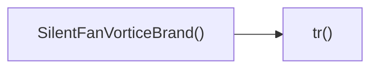

## Genel Bakış
Bu modül, sessiz fan ürünlerini Vortice markasıyla tanıtan bir React bileşenini ve bu bileşen içinde kullanılan basit bir çeviri yardımcı fonksiyonunu içerir. Bileşen, ürün bilgilerini görsel olarak sunarken, çeviri fonksiyonu metinlerin çok dilli desteklenmesini sağlar.

## Fonksiyon Grupları
### Kullanıcı Arayüzü Bileşeni
Bu grup, ekranda görüntülenen sessiz fan ürün listesini ve ilgili görsel öğeleri oluşturan ana bileşeni içerir.
- SilentFanVorticeBrand

### Çeviri Yardımcı Fonksiyonu
Bu grup, bileşen içindeki sabit metinlerin farklı dillere çevrilmesini sağlayan küçük bir yardımcı işlevi barındırır.
- tr

---

## AXIOMS – Mimari Varsayımlar
Bu modül için özel aksiyom tanımlanmamıştır.

---

## FONKSIYON DETAYLARI

### SilentFanVorticeBrand
**Ne yapar**: Silent Fan Vortice markasıyla ilgili bölümün kullanıcı arayüzünü renderlar.  
**Nasıl yapar**: React fonksiyon bileşeni olarak JSX döndürür; bu JSX, markanın ürünlerini, özelliklerini veya görsel öğelerini gösteren alt bileşenleri ve düzenleri içerir.  
**Parametreler**:  
- (parametre yok)  
**Dönüş**: Bir React elementi (JSX) döndürür; bu eleman `SilentFanVorticeBrand` bileşeninin ekrana çıktısını temsil eder.

### tr
**Ne yapar**: Verilen anahtar (`key`) ile ilişkili çeviriyi sağlar; genellikle kullanıcı arayüzündeki metinleri çok dilli hale getirmek için kullanılır.  
**Nasıl yapar**: Anahtarını bir çeviri haritası veya veri kaynağında arar, bulunursa ilgili çeviriyi döndürür; bulunamazsa anahtarını kendiyle döndürebilir veya varsayılan bir değer döndürebilir (gerçek dönüş türü belirsiz olduğu için bu davranım uygulama‑bağımlıdır).  
**Parametreler**:  
- key: string — Çevirilecek metnin anahtarını tanımlar.  
**Dönüş**: Belirtilmemiş; fonksiyonun dönüş tipi belirsiz olduğu için net bir açıklama yapılamaz. Gerçekte bir string, void veya başka bir tip döndürebilir.

---

## AST POINTERS

### [N1_NASIL] AST Pointer: src/components/category/sections/silent-fan/SilentFanVorticeBrand.tsx::SilentFanVorticeBrand
- **params**: (parametre yok)
- **ic_degiskenler**:
  - `t` — `useI18n` hookundan dönen çeviri fonksiyonu; anahtar bazlı metinleri almak için kullanılır.
  - `dict` — `useI18n` tarafından sağlanan tüm i18n veri nesnesi; çeviri verilerine erişim sağlar.
  - `sectionRef` — `<section>` öğesine bağlanan `ref`; `useScrollAnimation` ile öğenin görünürlüğünü takip etmek için kullanılır.
  - `isVisible` — `useScrollAnimation` tarafından döndürüzen boolean; öğe viewport içinde görünür olduğunda `true`, aksi takdirde `false`.
  - `tr` — yerel çeviri助手 fonksiyonu; parametre olarak gelen anahtarın önüne `categorySilentFan.brand.` ekleyerek `t` fonksiyonunu çağırır.
  - `bDict` — `dict.categorySilentFan.brand` nesnesi; marka bölümüne ait çeviri verilerini içerir (stats, badges vb.).
  - `icons` — `[Clock, Globe, Award, Star]` dizisi; istatistik kartlarındaki ikonları sırayla kullanmak için tutulur.
  - `stats` — `bDict.stats || []` ifadesiyle elde edilen liste; marka istatistiklerini tutar, veri yoksa boş dizi olur.
- **Dönüş**: JSX element (bileşen render ettiği `<section>` ve içeriği)

### [N2_NASIL] AST Pointer: src/components/category/sections/silent-fan/SilentFanVorticeBrand.tsx::tr
- **params**: `(key: string)`
- **ic_degiskenler**: (yok) — fonksiyon gövdesinde yeni değişken tanımlanmaz.
- **Dönüş**: `string` — `t` fonksiyonundan dönen çevirilmiş metin.

### [N3_NASIL] AST Pointer: src/components/category/sections/silent-fan/SilentFanVorticeBrand.tsx::(item, index: number) inside stats.map
- **params**: `(item: any, index: number)` — `item` bir stat nesnesi (`{ value, label }`), `index` dizindeki sırası.
- **ic_degiskenler**:
  - `Icon` — `icons[index % icons.length]` ile seçilen bileşen (`Clock`, `Globe`, `Award` veya `Star`); JSX elementi olarak render edilir.
- **Dönüş**: JSX element — her stat için bir `
` (ikon ve değer/etiket) döndürür.

### [N4_NASIL] AST Pointer: src/components/category/sections/silent-fan/SilentFanVorticeBrand.tsx::(badge: string, i: number) inside badges.map
- **params**: `(badge: string, i: number)` — `badge` rozet metni, `i` dizindeki sırası.
- **ic_degiskenler**: (yok) — fonksiyon gövdesinde yeni değişken tanımlanmaz.
- **Dönüş**: JSX element — her rozet için stil uygulanmış `
` döndürür.

---

## ÇAĞRI HARİTASI

### Disariya Cagrilar (Outgoing)
- **SilentFanVorticeBrand()** → `tr` fonksiyonunu çağırır (örnek çeviri veya dönüşüm işlemi için).

### Disaridan Cagrilanlar (Incoming)
- Bu modülü çağıran dış bir fonksiyon veya dosya bulunmamaktadır.

### Ic Ice Fonksiyonlar (Nested)
- İç içe fonksiyon yok.

---

## DOSYA-İÇİ ÇAĞRI GRAFİĞİ
  SilentFanVorticeBrand() → tr()

---

## NODE ID STANDARD

  file: src\components\category\sections\silent-fan\SilentFanVorticeBrand.tsx
  function: src\components\category\sections\silent-fan\SilentFanVorticeBrand.tsx::SilentFanVorticeBrand
  function: src\components\category\sections\silent-fan\SilentFanVorticeBrand.tsx::tr

---

## DISA AKTARILANLAR (EXPORTS)
  export: SilentFanVorticeBrand