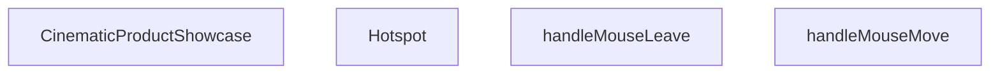

## Genel Bakış
CinematicProductShowcase, ürünleri sinematik ve etkileşimli bir şekilde sergileyen bir React bileşenidir. Hotspot noktaları aracılığıyla kullanıcıların ürün üzerindeki ilgi alanlarını keşfetmesini sağlar. Fare hareketlerine bağlı olarak hotspot'ların aktif durumunu dinamik olarak yönetir.

## Fonksiyon Grupları
### UI Bileşenleri
Ürün görselleri üzerindeki interaktif noktaları ve ana gösterim alanını oluşturan bileşenlerdir.
- CinematicProductShowcase, Hotspot

### Etkileşim Kontrolcüleri
Fare girişlerini dinleyerek hotspot'ların görünürlük ve aktiflik durumlarını yöneten olay işleyicilerdir.
- handleMouseMove, handleMouseLeave

---

## AXIOMS – Mimari Varsayımlar

Bu modül, ürün görselleri üzerinde etkileşimli hotspot noktaları sunarak kullanıcı deneyimi sağlayan bir bileşen kümesidir.

---

**[Aksiyom 1]:** Eğer `productImages` dizisi boş veya tanımsız ise, `CinematicProductShowcase` bileşeni görüntülenecek ürün içeriği sunamaz ve boş bir gösterim oluşur.

**[Aksiyom 2]:** Eğer `Hotspot` bileşenine `x` ve `y` koordinatları sağlanmazsa, hotspot noktası doğru konumda render edilemez ve görsel konumlandırma hatası oluşur.

**[Aksiyom 3]:** Eğer `Hotspot` bileşenine `onToggle` callback fonksiyonu sağlanmazsa, kullanıcı hotspot üzerine tıklandığında `isActive` durumu değiştirilemez ve etkileşim çalışmaz.

**[Aksiyom 4]:** Eğer `handleMouseMove` fonksiyonuna geçerli bir `React.MouseEvent` nesnesi ulaşmazsa, fare pozisyonu takip edilemez ve hotspot vurgulama mekanizması devre dışı kalır.

**[Aksiyom 5]:** Eğer `Hotspot` bileşenine `label` veya `detail` değerleri sağlanmazsa, hotspot noktasının kullanıcılara gösterilecek açıklayıcı içeriği bulunmaz.

**[Aksiyom 6]:** Eğer `handleMouseLeave` tetiklenmezse (fare bileşen alanı terk etmezse), aktif hotspot durumları sıfırlanmayabilir ve eski vurgulama ekranda kalabilir.

**[Aksiyom 7]:** Eğer `productImages` dizisindeki elemanlar geçerli görsel referansları içermiyorsa, bileşen kırık görsel gösterimi ile karşılaşır.

**[Aksiyom 8]:** Eğer `isActive` boolean tipinde sağlanmazsa, hotspot bileşeni aktif/pasif durumunu doğru şekilde yorumlayamaz.

---

### Domain-Specific Kurallar
- `Hotspot` bileşeni minimum olarak `x`, `y`, `isActive`, `onToggle` değerlerine ihtiyaç duyar (konum ve etkileşim için zorunlu)
- `label` ve `detail` opsiyonel görünse de, iyi bir UX için sağlanmalıdır
- Fare etkileşimi `React.MouseEvent` tipinde olmalıdır (standart browser event)

---

## FONKSİYON DETAYLARI

### Hotspot
**Ne yapar**: Hotspot bileşeni, belirli bir koordinatta (x, y) bir etiket ve detay bilgisi gösteren interaktif bir nokta oluşturur. Bu bileşen, aktif durumuna göre daha fazla bilgi sunabilir ve kullanıcı etkileşimi ile durumunu değiştirebilir.
**Nasıl yapar**: Hotspot, onToggle fonksiyonunu çağırarak aktif hot spot'un durumunu değiştirir. Eğer zaten aktif olan hot spot tıklanırsa deaktif eder, aksi halde aktif eder. Bu mantık, setActiveHotspot fonksiyonu ile yönetim merkezinde saklanan bir duruma bağlıdır.
**Parametreler**:
- x: number — Hot spot'un yatay konumunu belirtir.
- y: number — Hot spot'un dikey konumunu belirtir.
- label: string — Hot spot'un üzerinde görünecek kısa etiket metni.
- detail: string — Hot spot hakkında daha fazla bilgi sağlayan açıklama metni.
- isActive: boolean — Hot spot'un şu anda aktif olup olmadığını belirten bayrak.
- onToggle: () => void — Hot spot tıklandığında çağrılan, durumu değiştiren geri çağırma işlevi.
**Dönüş**: React.FC<HotspotProps> — Hotspot bileşenini döndürür.

### CinematicProductShowcase
**Ne yapar**: CinematicProductShowcase bileşeni, ürünleri sinematik bir şekilde sergileyen bir vitrin oluşturur. Bu bileşen, genellikle ana sayfada veya ürün sayfalarında kullanılarak ürünlerin görsel sunumunu zenginleştirir.
**Nasıl yapar**: Bileşen, ürün verilerini alarak sinematik efektlerle birlikte görsel bir gösteri sunar. Animasyonlar ve geçişler kullanarak ürünleri dikkat çekici bir şekilde sunabilir. Detaylı uygulama iç mantığı, sağlanan bilgilerde yer almamaktadır.
**Parametreler**: Parametre almaz.
**Dönüş**: React.FC — CinematicProductShowcase bileşenini döndürür.

### handleMouseMove
**Ne yapar**: handleMouseMove, fare hareketi olayını işleyerek bileşen içindeki fare konumunu günceller veya fare hareketine bağlı işlevsellik sağlar.
**Nasıl yapar**: Bu işlev, farenin harekettiği her noktada çağrılır ve olay nesnesinden fare koordinatlarını alarak bileşenin durumunu güncelleyebilir. Fare hareketine bağlı animasyonlar, etkileşimler veya konum hesaplamaları yapabilir. Sağlanan bilgilerde iç mantık detayı bulunmamaktadır.
**Parametreler**:
- e: React.MouseEvent — Fare hareketi olayı nesnesini temsil eder ve fare konumu gibi bilgileri içerir.
**Dönüş**: void — Fonksiyon bir değer döndürmez.

### handleMouseLeave
**Ne yapar**: handleMouseLeave, fare bileşenin alanından ayrıldığında çağrılan bir olay işleyicisidir ve fare bırakma durumunu yönetir.
**Nasıl yapar**: Bu işlev, fare bileşenin sınırlarından çıktığında tetiklenir ve genellikle fare ile ilişkilendirilmiş geçici durumları sıfırlamak veya etkileşimleri sonlandırmak için kullanılır. Fare離開后, bileşenin görünümünü veya durumunu orijinal haline döndürebilir. İç mantık detayı sağlanmamıştır.
**Parametreler**: Parametre almaz.
**Dönüş**: void — Fonksiyon bir değer döndürmez.

---

## INTERFACES

### HotspotProps
- `x: number`
- `y: number`
- `label: string`
- `detail: string`
- `isActive: boolean`
- `onToggle: () => void`

---

## SABİTLER
- **productImages** (array) — `[

  { 

    src: '/images/vortice_lineo_futuristic.png', 

    label: 'Futur...`

---

## AST POINTERS

### [N1_NASIL] AST Pointer: CinematicProductShowcase.tsx::Hotspot
- **params**: `x` — hotspot'in yatay yüzdesi (number), `y` — hotspot'in dikey yüzdesi (number), `label` — hotspot başlık metni (string), `detail` — hotspot açıklama metni (string), `isActive` — bu hotspot'in aktif olup olmadığı (boolean), `onToggle` — tıklanma durumunu toggogle eden callback fonksiyon
- **ic_degiskenler**:
  - `t` — useI18n() hook'undan dönen çeviri fonksiyonu
- **Dönüş**: JSX element (button ile popup tooltip içeren absolute pozisyonlu div)

---

### [N2_NASIL] AST Pointer: CinematicProductShowcase.tsx::CinematicProductShowcase
- **params**: (parametre yok)
- **ic_degiskenler**:
  - `t` — useI18n() hook'undan dönen çeviri fonksiyonu, sayfa içi metin çevirileri için kullanılır
  - `activeHotspot` — şu an aktif olan hotspot'in key değeri veya null (useState<string | null>)
  - `setActiveHotspot` — activeHotspot state'ini güncellemek için setter fonksiyonu
  - `activeImageIdx` — şu an gösterilen ürün görselinin indeksi (useState<number>, başlangıç: 0)
  - `setActiveImageIdx` — activeImageIdx state'ini güncellemek için setter fonksiyonu
  - `containerRef` — 3D mouse hareketi için referans olan HTMLDivElement ref'i
  - `mouseX` — mouse'un yatay konumunu Framer Motion ile takip eden motion value (useMotionValue, başlangıç: 0)
  - `mouseY` — mouse'un dikey konumunu takip eden motion value (useMotionValue, başlangıç: 0)
  - `springConfig` — spring animasyonu için yapılandırma nesnesi ({ damping: 25, stiffness: 150 })
  - `rotateX` — mouseY motion value'sinden türetilen X- ekseni rotasyon değeri, spring ile yumuşatılmış ([-10, 10] aralığı)
  - `rotateY` — mouseX motion value'sinden türetilen Y- ekseni rotasyon değeri, spring ile yumuşatılmış ([-15, 15] aralığı)
  - `handleMouseMove` — mouse hareketlerini yakalayıp mouseX/mouseY'yi güncelleyen olay dinleyici fonksiyonu
  - `handleMouseLeave` — mouse離開tığında mouseX, mouseY'yi sıfırlayıp activeHotspot'u temizleyen fonksiyon
  - `currentHotspots` — productImages[activeImageIdx].hotspots ile o anki görselin hotspot dizisi
- **Dönüş**: JSX element (section içinde 3D perspektif ürün görseli, hotspot'ler, görsel navigasyon thumbnail'leri ve metin içerik)

---

### [N3_NASIL] AST Pointer: CinematicProductShowcase.tsx::handleMouseMove
- **params**: `e` — React.MouseEvent (fare hareket olayı)
- **ic_degiskenler**:
  - `rect` — containerRef.current.getBoundingClientRect() ile elde edilen DOM rect nesnesi, container'ın viewport içindeki pozisyon ve boyut bilgisi
  - `x` — mouse'un container genişliğine göre normalize edilmiş yatay pozisyonu, -0.5 ile 0.5 arasında (formül: (e.clientX - rect.left) / rect.width - 0.5)
  - `y` — mouse'un container yüksekliğine göre normalize edilmiş dikey pozisyonu, -0.5 ile 0.5 arasında (formül: (e.clientY - rect.top) / rect.height - 0.5)
- **Dönüş**: yok (yan etki: mouseX.set(x) ve mouseY.set(y) ile 3D rotasyon değerlerini günceller)

---

### [N4_NASIL] AST Pointer: CinematicProductShowcase.tsx::handleMouseLeave
- **params**: (parametre yok)
- **ic_degiskenler**: (yok — sadece üst kapsam değişkenlerine erişir)
- **Dönüş**: yok (yan etki: mouseX ve mouseY'yi 0'a, activeHotspot'u null'a sıfırlar)

---

### [N5_NASIL] AST Pointer: CinematicProductShowcase.tsx::Hotspot.map callback
- **params**: `spot` — productImages[activeImageIdx].hotspots dizisindeki tek bir hotspot nesnesi (içerir: key, x, y)
- **ic_degiskenler**:
  - `t` — üst kapsamdan (CinematicProductShowcase) gelen çeviri fonksiyonu
  - `activeHotspot` — üst kapsamdan gelen aktif hotspot state'i
  - `setActiveHotspot` — üst kapsamdan gelen state setter
- **Dönüş**: Hotspot bileşeni JSX'i (key: `${activeImageIdx}-${spot.key}`, x, y, label, detail, isActive, onToggle)

---

### [N6_NASIL] AST Pointer: CinematicProductShowcase.tsx::productImages.map callback
- **params**: `img` — productImages dizisindeki tek bir görsel nesnesi (içerir: src, label), `idx` — görselin dizideki indeksi
- **ic_degiskenler**:
  - `activeImageIdx` — üst kapsamdan gelen aktif görsel indeksi state'i
  - `setActiveImageIdx` — üst kapsamdan gelen state setter
  - `setActiveHotspot` — üst kapsamdan gelen hotspot state setter'ı
- **Dönüş**: Thumbnail buton JSX'i (onClick ile görsel değiştirme, Image bileşeni, aktif duruma göre koşullu stil)

---

## MERMAID CALL GRAPH

## NODE ID STANDARD

  file: src\components\home\CinematicProductShowcase.tsx
  function: src\components\home\CinematicProductShowcase.tsx::Hotspot
  function: src\components\home\CinematicProductShowcase.tsx::CinematicProductShowcase
  function: src\components\home\CinematicProductShowcase.tsx::handleMouseMove
  function: src\components\home\CinematicProductShowcase.tsx::handleMouseLeave

---

## DISA AKTARILANLAR (EXPORTS)
  export: CinematicProductShowcase
  export: Hotspot

---

## STİL TOKENLERİ

### Arbitrary Değerler (token'a geçirilmemiş)
Yok — tüm stiller token'a geçirilmiş. ✅

### Kullanılan Token'lar (zaten token'a geçirilmiş)
- `h-hvac-hero`, `hover:shadow-glow-lg`, `rounded-hvac-3xl`, `shadow-glow-md`, `tracking-hvac-normal`, `tracking-hvac-relaxed`

### Tailwind Sınıf Özeti
- **Renkler:** `bg-cyan-400`, `bg-cyan-500`, `bg-cyan-500/10`, `bg-cyan-500/20`, `bg-cyan-500/50`, `bg-cyan-grid`, `bg-gradient-to-r`, `bg-grid-100`, `bg-indigo-500/10`, `bg-slate-900`, `bg-slate-900/95`, `bg-slate-950`, `bg-white`, `bg-white/1`, `bg-white/10`
- **Layout:** `absolute`, `backdrop-blur-3xl`, `backdrop-blur-xl`, `bg-cyan-grid`, `bg-grid-100`, `bottom-0`, `bottom-10`, `bottom-full`, `drop-shadow-cinematic-drop`, `flex`, `flex-col`, `flex-wrap`, `from-transparent`, `gap-20`, `gap-3`
- **Varyant/Responsive:** `:`, `group-hover:`, `hover:`, `lg:`, `sm:` önekleri
- **Yardımcı Sınıflar:** `${activeImageIdx`, `${isActive`, `-inset-1`, `-translate-x-1/2`, `-translate-y-1.5`, `:`, `===`, `animate-ping`, `animate-pulse`, `aspect-square`, `blur-120`, `blur-150`, `blur-3xl`, `border`, `duration-500`