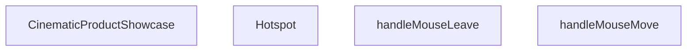

## Genel Bakış
CinematicProductShowcase modülü, ürünleri görsel olarak etkileşimli bir şekilde sunan bir bileşen kümesidir. Kullanıcı fare hareketlerini takip ederek ürün üzerindeki hotspot noktalarını vurgular ve detay bilgilerin gösterilmesini sağlar.

## Fonksiyon Grupları
### UI Bileşenleri
Kullanıcı arayüzünü oluşturan ve ürün görsellerini, açıklamaları ile etkileşimli noktaları bir araya getiren fonksiyonlar bu grupta yer alır.
- Hotspot
- CinematicProductShowcase

### Etkileşim İşleyicileri
Fare hareketlerini izleyerek hotspotların aktif/pasif durumlarını güncelleyen ve kullanıcı deneyimini canlandıran fonksiyonlar bu grupta bulunur.
- handleMouseMove
- handleMouseLeave

---

## AXIOMS – Mimari Varsayımlar
Bu modülün doğru çalışması için aşağıdaki koşulların sağlanması gerekir.

[Aksiyom 1]: Eğer `productImages` tanımsız veya boş bir dizi değilse, `CinematicProductShowcase` en az bir görüntü render edebilir; aksi takdirde görüntü gösterilemez ve bileşen boş görünebilir.  
[Aksiyom 2]: Eğer `Hotspot` bileşenine `x` ve `y` sayısal değerler (piksel veya yüzde) verilmezse, hotspot konumu hesaplanamadığı için görselde doğru konumda görünmez veya taşabilir.  
[Aksiyom 3]: Eğer `Hotspot`’e `label` prop’u string olarak verilmezse, tooltip veya açıklama metni boş veya tanımsız görünebilir.  
[Aksiyom 4]: Eğer `Hotspot`’e `detail` prop’u string olarak verilmezse, detay içeriği boş görünebilir.  
[Aksiyom 5]: Eğer `Hotspot`’e `isActive` prop’u boolean değeri verilmezse, aktif/pasif durum mantığı çalışmayacak ve görsel durum (örneğin renk, animasyon) beklenen şekilde güncellenmeyebilir.  
[Aksiyom 6]: Eğer `Hotspot`’e `onToggle` prop’u bir fonksiyon verilmezse, hotspot üzerine tıklandığında durum değişikliği tetiklenmeyeceği için etkileşim işlevi kaybolur.  
[Aksiyom 7]: Eğer `handleMouseMove` fonksiyonuna `React.MouseEvent` türünde bir nesne (clientX, clientY gibi özellikler içeren) geçilmezse, fare hareketi koordinatları okunamadığı için imleç takibi veya hover etkileri çalışmayabilir.  
[Aksiyom 8]: Eğer `handleMouseLeave` fonksiyonu çağrılmadığı veya tanımsız bırakılırsa, fare bileşenin üzerinden çıktığında durum sıfırlanmayabilir (örneğin aktif hotspot kalmaya devam edebilir).  

Bu varsayımlar, modülün mevcut fonksiyon imzaları ve `productImages` sabiti doğrultusunda türetilmiştir; dışarıdan eklenebilecek ek prop’lar, state yönetimi veya stil dosyaları hakkında varsayım yapılmamıştır.

---

## FONKSIYON DETAYLARI

### Hotspot
**Ne yapar**: Verilen koordinatlarda bir etiket ve detay gösteren etkileşimli bir nokta (hotspot) bileşeni render eder.  
**Nasıl yapar**: Props olarak alınan `x` ve `y` değerlerini stil ile konumlandırma için kullanır, `label` ve `detail` içeriğini gösterir, `isActive` durumuna göre görsel étatsını değiştirir ve `onToggle` fonksiyonunu çağırarak durum değişikliğini dışarıya bildirir.  
**Parametreler**:  
- x: number — Hotspotun X eksenindeki konumu (piksel veya yüzde)  
- y: number — Hotspotun Y eksenindeki konumu (piksel veya yüzde)  
- label: string — Hotspotun üstünde gösterilecek kısa başlık metni  
- detail: string — Hotspotun üzerine gelindiğinde veya tıklandığında gösterilecek daha uzun açıklama metni  
- isActive: boolean — Hotspotun aktif olup olmadığını belirleyen durum bayrağı  
- onToggle: () => void — Hotspotun aktif/pasif durumu değiştiğinde çağrılacak geri çağırım fonksiyonu  
**Dönüş**: React.FC<HotspotProps> — Hotspot bileşeni, verilen props ile render edilerek döndürülür.

### CinematicProductShowcase
**Ne yapar**: Sinematik bir ürün vitrini gösteren ana bileşeni render eder.  
**Nasıl yapar**: Props almayıp, içindeki JSX yapısını doğrudan döndürerek ürün görselleri, açıklamalar ve etkileşimli öğeleri sunar.  
**Parametreler**: (yok)  
**Dönüş**: React.FC — Bileşen örneği, UI ağacına entegrasyon için hazır olarak döndürülür.

### handleMouseMove
**Ne yapar**: Fare hareketi olayını yakalar ve ilgili işlemi gerçekleştirir.  
**Nasıl yapar**: `React.MouseEvent` türünde gelen olay nesnesini alır, genellikle fare koordinatlarını okur ve bu bilgiyi state veya başka bir işlemle kullanır.  
**Parametreler**:  
- e: React.MouseEvent — Fare olay nesnesi, konum, tuş durumu ve diğer meta verileri içerir  
**Dönüş**: void (veya bilinmiyor) — Fonksiyon bir değer döndürmez; yan etkisiyle durum güncellenir veya başka bir tetikleme yapılır.

### handleMouseLeave
**Ne yapar**: Fare öğenin sınırlarından çıktığında tetiklenen olay işleyicisini tanımlar.  
**Nasıl yapar**: Parametre almaz; fare öğeden çıktığında çağrılır ve genellikle geçici efektleri sıfırlar veya state'i varsayılan hale getirir.  
**Parametreler**: (yok)  
**Dönüş**: void (veya bilinmiyor) — Fonksiyon bir değer döndürmez; yan etkisiyle öğenin görünümü veya durumu geri alınır.

---

## INTERFACES

### HotspotProps
- `x: number`
- `y: number`
- `label: string`
- `detail: string`
- `isActive: boolean`
- `onToggle: () => void`

---

## SABİTLER
- **productImages** (array) — `[

  { 

    src: '/images/vortice_lineo_futuristic.png', 

    label: 'Futur...`

---

## AST POINTERS

### [N1_NASIL] AST Pointer: src/components/home/CinematicProductShowcase.tsx::Hotspot
- **params**: x, y, label, detail, isActive, onToggle
- **ic_degiskenler**:
  - `t` — translation function from useI18n used for labels and details
- **Dönüş**: JSX element

### [N2_NASIL] AST Pointer: src/components/home/CinematicProductShowcase.tsx::CinematicProductShowcase
- **params**: 
- **ic_degiskenler**:
  - `t` — translation function from useI18n
  - `activeHotspot` — currently selected hotspot key (string | null)
  - `setActiveHotspot` — setter for the activeHotspot state
  - `activeImageIdx` — index of the currently displayed product image
  - `setActiveImageIdx` — setter for the activeImageIdx state
  - `containerRef` — ref to the container div used for mouse‑tracking
  - `mouseX` — motion value representing normalized horizontal mouse offset (‑0.5 → 0.5)
  - `mouseY` — motion value representing normalized vertical mouse offset (‑0.5 → 0.5)
  - `springConfig` — configuration object for the spring animation (damping = 25, stiffness = 150)
  - `rotateX` — spring‑based motion value for X‑rotation derived from mouseY
  - `rotateY` — spring‑based motion value for Y‑rotation derived from mouseX
  - `handleMouseMove` — event handler that updates mouseX/Y based on cursor position
  - `handleMouseLeave` — event handler that resets mouse values and clears the active hotspot
  - `currentHotspots` — array of hotspot objects for the active image (`productImages[activeImageIdx].hotspots`)
- **Dönüş**: JSX element

### [N3_NASIL] AST Pointer: src/components/home/CinematicProductShowcase.tsx::handleMouseMove
- **params**: e
- **ic_degiskenler**:
  - `rect` — bounding rectangle of `containerRef.current`
  - `x` — normalized horizontal offset (`(clientX‑left)/width‑0.5`)
  - `y` — normalized vertical offset (`(clientY‑top)/height‑0.5`)
- **Dönüş**: yok

### [N4_NASIL] AST Pointer: src/components/home/CinematicProductShowcase.tsx::handleMouseLeave
- **params**: 
- **ic_degiskenler**: 
- **Dönüş**: yok

### [N5_NASIL] AST Pointer: src/components/home/CinematicProductShowcase.tsx::Hotspot map callback (spot)
- **params**: spot
- **ic_degiskenler**: 
- **Dönüş**: JSX element (returns `<Hotspot />`)

### [N6_NASIL] AST Pointer: src/components/home/CinematicProductShowcase.tsx::Product image map callback (img, idx)
- **params**: img, idx
- **ic_degiskenler**: 
- **Dönüş**: JSX element (returns `<button />`)

---

## MERMAID CALL GRAPH

## NODE ID STANDARD

  file: src\components\home\CinematicProductShowcase.tsx
  function: src\components\home\CinematicProductShowcase.tsx::Hotspot
  function: src\components\home\CinematicProductShowcase.tsx::CinematicProductShowcase
  function: src\components\home\CinematicProductShowcase.tsx::handleMouseMove
  function: src\components\home\CinematicProductShowcase.tsx::handleMouseLeave

---

## DISA AKTARILANLAR (EXPORTS)
  export: CinematicProductShowcase
  export: Hotspot

---

## STİL TOKENLERİ

### Arbitrary Değerler (token'a geçirilmemiş)
- **shadow:** `shadow-[0_0_15px_#22D3EE]`, `shadow-[0_0_20px_rgba(34,211,238,0.4)]`, `shadow-[0_20px_50px_rgba(0,0,0,0.5)]`
- **height:** `h-[500px]`, `h-[600px]`, `h-[70%]`
- **width:** `w-[500px]`, `w-[600px]`, `w-[70%]`
- **spacing:** (yok)
- **diğer:** `bg-[linear-gradient(rgba(56,189,248,0.03)_1px,transparent_1px),linear-gradient(90deg,rgba(56,189,248,0.03)_1px,transparent_1px)]`, `bg-[size:100px_100px]`, `blur-[120px]`, `blur-[150px]`, `drop-shadow-[0_50px_100px_rgba(0,0,0,0.8)]`, `hover:shadow-[0_0_40px_rgba(255,255,255,0.2)]`, `inset-[-4px]`, `leading-[1.1]`, `tracking-[0.2em]`, `tracking-[0.3em]`

### Kullanılan Token'lar (zaten token'a geçirilmiş)
- `rounded-hvac-3xl`

### Tailwind Sınıf Özeti
- **Renkler:** `bg-cyan-400`, `bg-cyan-500`, `bg-cyan-500/10`, `bg-cyan-500/20`, `bg-cyan-500/50`, `bg-gradient-to-r`, `bg-indigo-500/10`, `bg-slate-900`, `bg-slate-900/95`, `bg-slate-950`, `bg-white`, `bg-white/10`, `bg-white/[0.01]`, `border-2`, `border-b`
- **Layout:** `absolute`, `backdrop-blur-3xl`, `backdrop-blur-xl`, `bottom-0`, `bottom-10`, `bottom-full`, `flex`, `flex-col`, `flex-wrap`, `from-transparent`, `gap-20`, `gap-3`, `gap-4`, `gap-6`, `grid`
- **Responsive:** `lg:`, `sm:` prefix kullanımları
